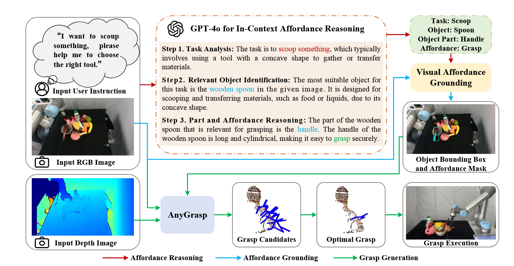
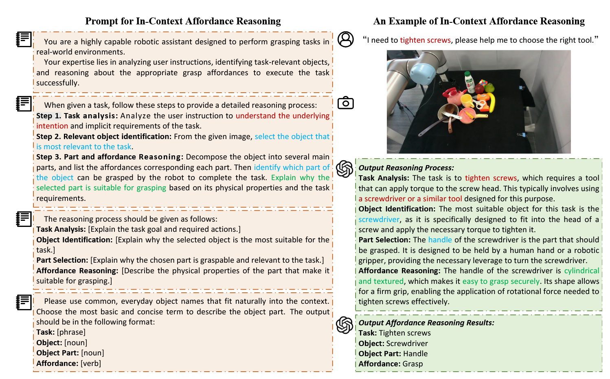

> 标题：AffordGrasp：开放词汇任务导向抓取中的情景可适性推理，应用于杂乱环境
>
> 作者团队：中科院自动化研究所，哈尔滨工业大学，北京智源人工智能研究院
>
> 期刊会议：IROS
>
> 年份: 2025
>
> 链接：https://eqcy.github.io/affordgrasp/

---

## METHOD

### In-Context Affordance Reasoning

使用 GPT-4o 同时分析用户指令和场景图像，进行三步推理：

- 任务分析：从指令中提取任务目标（如“倒水”）

- 物体识别：找出最相关的物体（如“杯子”）

- 部位与功能推理：分解物体部位，选择最适合抓取的部分（如“把手”）

**Prompt Design :**

### Visual Affordance Grounding

使用 VLPart 模型对图像进行两部分处理：

- 先定位目标物体（如杯子）

- 再在物体上分割出功能部位（如把手）

输出为像素级的掩码图，用于后续抓取生成。

### Grasp Pose Generation

利用 AnyGrasp 生成6D抓取姿态，并优先选择：

- 在功能部位上的抓点

- 靠近部位中心、置信度高的抓取姿态

## Experiment

### 仿真（PyBullet+ UR5）

| 场景 | AffordGrasp | ThinkGrasp | GraspNet |
| :--- | :--- | :--- | :--- |
| 单物体抓取 | 0.85 | 0.78 | 0.70 |
| 杂乱环境抓取 | 0.77 | 0.54 | - |

### 真实环境（UR5 + Realsense）

| 方法 | 平均抓取成功率 |
| :--- | :--- |
| AffordGrasp | 0.83 |
| ThinkGrasp | 0.68 |
| RAM | 0.62 |
| AnyGrasp | 0.71 |

>在复杂物体（如剪刀、螺丝刀、酒杯）上，AffordGrasp 表现出了更强的适应能力。

### 实验结果

## 对比分析

| 特性	| 传统方法	| AffordGrasp |
| :--- | :--- | :--- |
| 是否需要训练？ | ✅ 需要大量数据 | ❌ 完全零样本 |
| 是否支持隐式指令？ | ❌ 只能显式指令 | ✅ 支持“我渴了”等隐式指令 |
| 是否支持杂乱场景？ | ❌ 多是单物体 | ✅ 支持多物体 clutter |
| 是否开放词汇？ | ❌ 有限物体集 | ✅ 任意物体和任务 |
