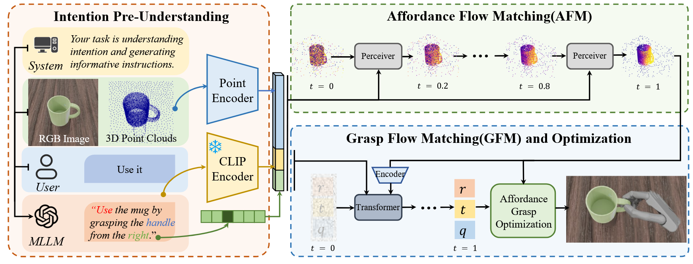

> 标题：AffordDexGrasp：基于通用指示性可供性的开放集语言引导灵巧抓取
>
> 作者团队：中山大学
>
> 期刊会议：ICCV  (CCF A)
>
> 年份: 2025
>
> 链接：https://isee-laboratory.github.io/AffordDexGrasp/

---

## METHOD

### Intention Pre-Understanding

### Affordance Flow Matching

### Grasp Flow Matching

### 

