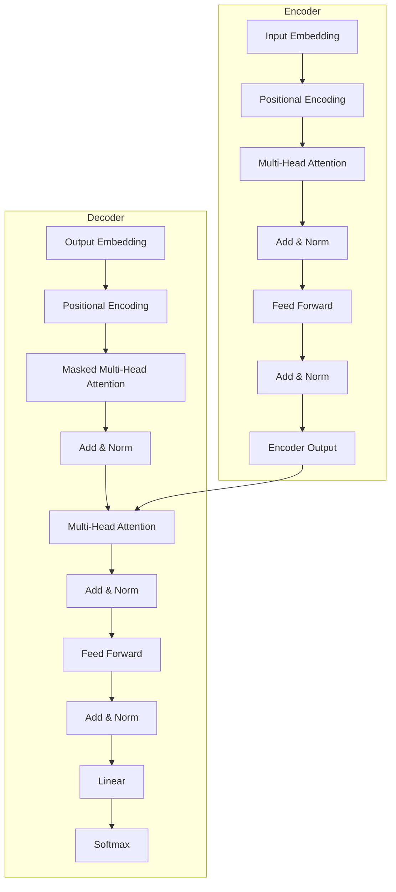
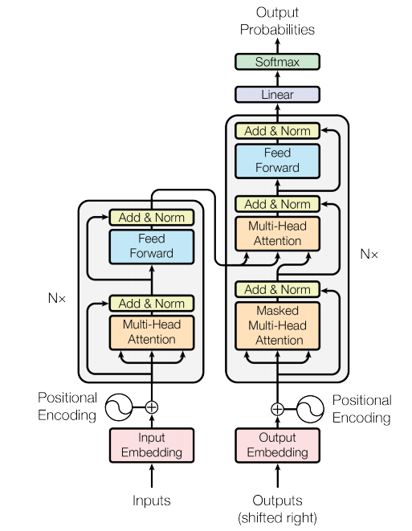
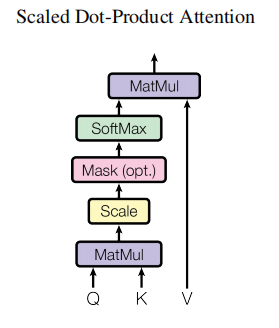
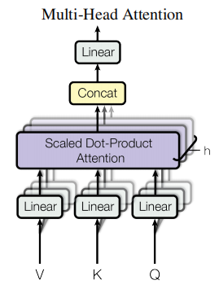

> "Attention Is All You Need" —— 这篇由 Google Brain 团队在 2017 年发表的论文，彻底改变了自然语言处理（NLP）领域的格局，并奠定了如今大语言模型（LLM）爆发的基础。

最近重新回顾了一下transform的论文，写了这篇博客。通过这篇博客，我们将详细介绍 Transformer 模型的起源、架构、工作原理。

## 1. 背景与引言

在 Transformer 横空出世之前，NLP 领域的主流霸主是 **RNN（循环神经网络）** 及其变体 **LSTM（长短期记忆网络）**。

虽然 RNN 在处理序列数据上表现出色，但它存在两个致命的缺陷：
1.  **无法并行计算**：RNN 必须按顺序时刻 $t$ 处理数据，计算依赖于 $t-1$ 时刻的状态。这意味着它无法利用 GPU 的强大并行能力，训练非常缓慢。
2.  **长距离依赖问题**：尽管 LSTM 缓解了梯度消失问题，但在面对很长的序列时，早期的信息仍然容易丢失。


Transformer 的出现，大喊一声：“**Attention Is All You Need!**”，它抛弃了循环和卷积，完全基于**注意力机制（Attention Mechanism）**，不仅解决了长距离依赖问题，还实现了高效的并行计算。

> 注意力的核心思想：当模型处理信息时，它会学着为不同的信息分配“注意力权重”，知道哪些信息是重要的、需要多关注，哪些信息是不重要的，可以忽略。


## 2. Transformer 整体架构

Transformer 依然沿用了经典的 **Encoder-Decoder（编码器-解码器）** 架构。

*   **Encoder（编码器）**：负责将输入序列（如一句话）映射成隐藏层表示。
*   **Decoder（解码器）**：利用 Encoder 的输出，生成目标序列（如翻译后的句子）。

下图展示了 Transformer 的整体结构：






## 3. 核心组件详解

### 3.1 Input Embeddings & Positional Encoding

#### Input Embeddings

在Attention is All You Need原文中，采用了512维的词嵌入（Word Embedding），每个词都被映射到一个512维的向量($\mathbf{w}_i \in \mathbb{R}^{512}$)。每个词都有512个不同维度的特征，每个维度代表了词的不同方面，比如语法、语义、上下文等。而这些特征是模型通过学习大量语料后自动提取的。


#### Positional Encoding

由于 Transformer 没有像RNN那样的循环结构，它本身“不知道”单词的顺序（"Tom hit Jerry" 和 "Jerry hit Tom" 对它来说是一样的词集合）。为了解决这个问题，论文引入了 **位置编码（Positional Encoding）**，它的维度和词嵌入是一样的。最终输入给Transformer的是两个嵌入向量的和。

论文使用了正弦和余弦函数的组合来生成每个单词的位置编码：

$$ PE_{(pos, 2i)} = \sin(pos / 10000^{2i/d_{model}}) $$
$$ PE_{(pos, 2i+1)} = \cos(pos / 10000^{2i/d_{model}}) $$

位置编码需要做到：每个位置对应的编码唯一；不论句子有多长，每两个相邻位置之间的距离都一样；所有的编码都要在一个有限的区间内，编码用到的数字不能爆炸上升。

### Scaled Dot-Product Attention



想象你在查字典：
*   **Query (Q)**：你查询的词。
*   **Key (K)**：字典里索引的词。
*   **Value (V)**：字典里词对应的解释。

注意力机制就是计算 Q 和 K 的相似度，然后用这个相似度对 V 进行加权求和。

公式如下：

$$ Attention(Q, K, V) = \text{softmax}(\frac{QK^T}{\sqrt{d_k}})V $$

1.  **$QK^T$**：计算查询和键的相似度（点积）。
2.  **$/ \sqrt{d_k}$**：缩放因子。

    为什么要除以 $ \sqrt{d_k}$ 呢，原因有以下几点：

    - **防止梯度梯度消失/爆炸的数值稳定性**：如果不缩放，随着 $d_k$ 增大，向量点积的方差也会增大。假设 $q$ 和 $k_i$ 的分布大致独立且方差为 $\sigma^2 $，那么点积的方差大约是 $d_k \sigma^2$，这会导致分数在大规模的维度下分布到较大的数值范围，softmax 的梯度会变得很小，学习变慢且不稳定。
    - **保持 softmax 的概率分布有较好的梯度信号**：缩放到一个合适的数值区间后，softmax 的输出通常会得到更平滑且更可学习的分布，避免某些位置的权重过于尖锐，从而导致梯度爆炸或梯度消失问题。

    - **理论直觉来自于随机矩阵的点积分布**：若 $q$ 和 $k$ 的元素独立同分布，点积的分布方差与维度 $d_k$ 成正比。通过除以 $\sqrt{d_k}$，点积的分布近似于单位方差的分布，使得 softmax 的输入在一个稳定的尺度上波动。

    简单来说，除以 $\sqrt{d_k}$ 相当于把注意力分数的尺度“归一化”到一个与维度无关的范围，从而提升训练稳定性并改善梯度传播。

3.  **Softmax**：将分数归一化为概率分布（权重和为1）。
4.  **$\times V$**：根据权重对 Value 进行加权求和。

### 3.2 Multi-Head Attention
如果只用一组 Q、K、V，可能只能捕捉到一种特征（比如语法关系）。**Multi-Head Attention** 将 Q、K、V 投影到 $h$ 个不同的空间（论文中 $h=8$），分别计算 Attention，最后拼接起来。

这就好比让 8 个人分别从不同的角度（语法、语义、指代关系等）去理解这句话，最后汇总意见。




### Encoder
Encoder 由 $N=6$ 个相同的层堆叠而成。每一层包含两个子层：
1.  **Multi-Head Self-Attention（多头自注意力机制）**
2.  **Position-wise Feed-Forward Networks（前馈神经网络）**

每个子层通过残差连接（Residual Connection）和层归一化（Layer Normalization）包裹：
$$ LayerNorm(x + Sublayer(x)) $$

### 3.3 Decoder

Decoder 同样由 $N=6$ 个层堆叠而成。除了 Encoder 中的两个子层外，它插入了第三个子层：
*   **Masked Multi-Head Attention**：对输出进行 Mask，确保预测第 $t$ 个词时，只能看到 $t$ 之前的词（防止作弊）。
*   **Encoder-Decoder Attention**：这里的 Query 来自 Decoder，而 Key 和 Value 来自 Encoder 的输出。这让 Decoder 在生成每一个词时，都能“关注”到输入序列中最相关的部分。


## 5. 前馈神经网络 (Feed-Forward Networks)

在 Attention 层之后，接了一个全连接前馈网络，应用于每个位置：

$$ FFN(x) = \max(0, xW_1 + b_1)W_2 + b_2 $$

这实际上就是两个线性变换中间夹一个 ReLU 激活函数。

## 6. 为什么选择 Self-Attention?

论文最后对比了 Self-Attention 与 RNN 和 CNN：

| 层面 | Self-Attention | RNN | CNN |
| :--- | :--- | :--- | :--- |
| **计算复杂度** | $O(n^2 \cdot d)$ | $O(n \cdot d^2)$ | $O(k \cdot n \cdot d^2)$ |
| **并行化** | $O(1)$ (所有词并行计算) | $O(n)$ (必须顺序计算) | $O(1)$ |
| **长距离依赖路径** | $O(1)$ (任意两词距离为1) | $O(n)$ | $O(\log_k n)$ |

*   **n**: 序列长度
*   **d**: 向量维度

可以看出，当序列长度 $n$ 小于维度 $d$ 时（通常如此），Self-Attention 甚至比 RNN 更快。最重要的是，它捕捉长距离依赖的能力（Path Length = 1）是 RNN 望尘莫及的。

## 7. 总结

Transformer 是现代 NLP 的基石。
1.  **并行计算能力强**：大大加速了训练过程。
2.  **捕捉长距离依赖**：Attention 机制让模型“看”得更全。
3.  **通用性强**：不仅在机器翻译，在文本分类、生成，甚至计算机视觉（ViT）领域都大放异彩。

BERT、GPT 系列、Llama 等如今叱咤风云的大模型，其心脏依然是这个 2017 年提出的 Transformer 架构。

---
*Ref: [Attention Is All You Need (Vaswani et al., 2017)](https://arxiv.org/abs/1706.03762)
*Ref: [Transformer模型详解](https://zhuanlan.zhihu.com/p/338817680)


## 8. 一些疑问的回答


- **Q1: 为什么 Transformer 模型中需要 Positional Encoding？**
  - **A: 因为 Self-Attention 机制只考虑了词与词之间的关系，而没有考虑词的位置信息。Positional Encoding 为每个位置添加了一个固定的向量，使得模型能够学习到词的相对位置。**

- **Q2: 多头注意力机制中，$h$ 头的作用是什么？**
  - **A: 每个头都学习到了不同的特征表示。通过拼接这些表示，模型能够捕捉到更丰富的上下文信息。**

- **Q3: Transformer 是如何解决并行计算的问题的？**
  - **A: Transformer 利用 Self-Attention 机制，将序列中的每个位置与其他位置进行注意力计算。由于 Attention 计算是并行的，所以 Transformer 能够在短时间内处理长序列。**

- **Q4: 为什么Decoder中的 Masked Multi-Head Attention 要对输出进行 Mask？**
  - **A: 因为在生成第 $t$ 个词时，我们只能使用 $t$ 之前的词。如果不 Mask，模型可能会“偷看”未来的信息，导致生成错误的序列。**
- **Q5: Decoder中的 Mask 是在哪一步进行的？**
  - **A: Mask操作主要是在Softmax的时候实现的。自注意力层只允许关注已输出位置的信息，所以对于已输出位置和未输出的位置的点积，在softmax时会给他加上一个巨大的负值（GPT中为负一亿），好让他们在softmax后得到的结果为0。这样，在输出当前时间步的时候，解码器就不会去关注后面的单词的信息了。**


## 9. 手撕Transformer

### MHA
```python
import torch
import torch.nn as nn
import torch.nn.functional as F
import math

class MultiHeadAttention(nn.Module):
    def __init__(self, d_model, num_heads):
        """
        Args:
            d_model: 词嵌入维度 (Embedding Dimension)
            num_heads: 注意力头的数量
        """
        super(MultiHeadAttention, self).__init__()
        
        # 确保 d_model 可以被 num_heads 整除
        assert d_model % num_heads == 0, "d_model must be divisible by num_heads"
        
        self.d_model = d_model
        self.num_heads = num_heads
        self.d_k = d_model // num_heads  # 每个头的维度
        
        # 定义 W_q, W_k, W_v 的线性层
        # 这里我们将所有头的投影合并成一个大的线性层，计算效率更高
        self.w_q = nn.Linear(d_model, d_model)
        self.w_k = nn.Linear(d_model, d_model)
        self.w_v = nn.Linear(d_model, d_model)
        
        # 最后的输出线性层 W_o
        self.fc_out = nn.Linear(d_model, d_model)

    def forward(self, q, k, v, mask=None):
        """
        Args:
            q, k, v: 输入张量，形状均为 [batch_size, seq_len, d_model]
            mask: 掩码张量 (可选)
        """
        batch_size = q.shape[0]

        # 1. 线性投影 (Linear Projections)
        # 形状变化: [batch_size, seq_len, d_model] -> [batch_size, seq_len, d_model]
        Q = self.w_q(q)
        K = self.w_k(k)
        V = self.w_v(v)

        # 2. 切分多头 (Split Heads)
        # 我们需要将 d_model 拆分为 num_heads * d_k
        # view 形状: [batch_size, seq_len, num_heads, d_k]
        # permute 形状: [batch_size, num_heads, seq_len, d_k] (为了后续矩阵乘法方便)
        Q = Q.view(batch_size, -1, self.num_heads, self.d_k).permute(0, 2, 1, 3)
        K = K.view(batch_size, -1, self.num_heads, self.d_k).permute(0, 2, 1, 3)
        V = V.view(batch_size, -1, self.num_heads, self.d_k).permute(0, 2, 1, 3)

        # 3. 缩放点积注意力 (Scaled Dot-Product Attention)
        
        # 计算 scores = Q * K^T / sqrt(d_k)
        # K.transpose(-2, -1) 将最后两个维度转置，形状变为 [batch, heads, d_k, seq_len]
        # scores 形状: [batch_size, num_heads, seq_len, seq_len]
        scores = torch.matmul(Q, K.transpose(-2, -1)) / math.sqrt(self.d_k)

        # 如果有 mask，将 mask 为 0 的位置填充为负无穷，使其在 softmax 后接近 0
        if mask is not None:
            # mask 通常形状为 [batch_size, 1, 1, seq_len] 或 [batch_size, 1, seq_len, seq_len]
            scores = scores.masked_fill(mask == 0, -1e9)

        # Softmax 归一化
        attention_weights = F.softmax(scores, dim=-1)

        # 计算加权和: weights * V
        # 形状: [batch_size, num_heads, seq_len, d_k]
        output = torch.matmul(attention_weights, V)

        # 4. 拼接多头 (Concat Heads)
        # permute 变回: [batch_size, seq_len, num_heads, d_k]
        # contiguous() 是因为 permute 后内存不连续，view 需要连续内存
        # view 变回: [batch_size, seq_len, d_model]
        output = output.permute(0, 2, 1, 3).contiguous().view(batch_size, -1, self.d_model)

        # 5. 最终线性投影 (Final Linear Layer)
        return self.fc_out(output)

```

### Encoder 
```python
import torch
import torch.nn as nn
import math

# 假设你已经定义了上面的 MultiHeadAttention 类
# from your_file import MultiHeadAttention 

class PositionwiseFeedForward(nn.Module):
    """
    两层全连接网络: Linear -> ReLU -> Linear
    公式: FFN(x) = max(0, xW1 + b1)W2 + b2
    """
    def __init__(self, d_model, d_ff, dropout=0.1):
        super(PositionwiseFeedForward, self).__init__()
        self.w_1 = nn.Linear(d_model, d_ff)
        self.w_2 = nn.Linear(d_ff, d_model)
        self.dropout = nn.Dropout(dropout)
        self.relu = nn.ReLU()

    def forward(self, x):
        # x: [batch_size, seq_len, d_model]
        return self.w_2(self.dropout(self.relu(self.w_1(x))))

class PositionalEncoding(nn.Module):
    """
    注入位置信息。这里实现的是论文中的正弦/余弦位置编码。
    """
    def __init__(self, d_model, max_len=5000, dropout=0.1):
        super(PositionalEncoding, self).__init__()
        self.dropout = nn.Dropout(p=dropout)

        # 创建一个足够长的矩阵 [max_len, d_model]
        pe = torch.zeros(max_len, d_model)
        position = torch.arange(0, max_len, dtype=torch.float).unsqueeze(1)
        # div_term 用于控制不同频率
        div_term = torch.exp(torch.arange(0, d_model, 2).float() * (-math.log(10000.0) / d_model))
        
        # 偶数维度用 sin，奇数维度用 cos
        pe[:, 0::2] = torch.sin(position * div_term)
        pe[:, 1::2] = torch.cos(position * div_term)
        
        # 增加一个 batch 维度: [1, max_len, d_model]
        pe = pe.unsqueeze(0)
        
        # 注册为 buffer，这样它不是模型参数（不参与梯度更新），但会随模型保存
        self.register_buffer('pe', pe)

    def forward(self, x):
        # x: [batch_size, seq_len, d_model]
        # 将位置编码加到输入的 Embedding 上
        x = x + self.pe[:, :x.size(1), :]
        return self.dropout(x)

class EncoderLayer(nn.Module):
    """
    一个 Encoder Layer 包含两个子层：
    1. Multi-Head Self-Attention
    2. Position-wise Feed-Forward
    每个子层后都有 Residual Connection (残差连接) 和 Layer Norm
    """
    def __init__(self, d_model, num_heads, d_ff, dropout=0.1):
        super(EncoderLayer, self).__init__()
        
        self.self_attn = MultiHeadAttention(d_model, num_heads)
        self.feed_forward = PositionwiseFeedForward(d_model, d_ff, dropout)
        
        # 定义两个 LayerNorm 层
        self.norm1 = nn.LayerNorm(d_model)
        self.norm2 = nn.LayerNorm(d_model)
        
        self.dropout = nn.Dropout(dropout)

    def forward(self, x, mask=None):
        # --- 子层 1: Self-Attention ---
        # 保留输入用于残差连接
        residual = x
        
        # 计算 Attention output
        # 在 Encoder 中，Q, K, V 都是 x (Self-Attention)
        attn_output = self.self_attn(x, x, x, mask)
        
        # Add & Norm: LayerNorm(x + Dropout(Sublayer(x)))
        x = self.norm1(residual + self.dropout(attn_output))
        
        # --- 子层 2: Feed Forward ---
        residual = x
        ff_output = self.feed_forward(x)
        
        # Add & Norm
        x = self.norm2(residual + self.dropout(ff_output))
        
        return x

class TransformerEncoder(nn.Module):
    """
    完整的 Encoder:
    Embedding -> Positional Encoding -> N x EncoderLayer
    """
    def __init__(self, vocab_size, d_model, num_heads, d_ff, num_layers, max_len=5000, dropout=0.1):
        super(TransformerEncoder, self).__init__()
        
        self.d_model = d_model
        
        # 词嵌入层
        self.embedding = nn.Embedding(vocab_size, d_model)
        
        # 位置编码层
        self.pos_encoder = PositionalEncoding(d_model, max_len, dropout)
        
        # 堆叠 N 个 Encoder Layer
        self.layers = nn.ModuleList([
            EncoderLayer(d_model, num_heads, d_ff, dropout) 
            for _ in range(num_layers)
        ])
        
        self.dropout = nn.Dropout(dropout)

    def forward(self, src, mask=None):
        """
        src: [batch_size, seq_len] (输入的 token 索引)
        mask: [batch_size, 1, 1, seq_len] (可选的 padding mask)
        """
        # 1. 词嵌入 (Embedding) 并缩放
        # 论文中提到 Embedding 需要乘以 sqrt(d_model)
        x = self.embedding(src) * math.sqrt(self.d_model)
        
        # 2. 加上位置编码
        x = self.pos_encoder(x)
        
        # 3. 通过 N 层 Encoder Layers
        for layer in self.layers:
            x = layer(x, mask)
            
        return x

# --- 测试代码 ---
if __name__ == "__main__":
    # 定义超参数
    VOCAB_SIZE = 10000
    D_MODEL = 512
    NUM_HEADS = 8
    D_FF = 2048        # 论文中 FeedForward 隐层通常是 d_model 的 4 倍
    NUM_LAYERS = 6     # 论文中堆叠了 6 层
    BATCH_SIZE = 2
    SEQ_LEN = 10

    # 实例化 Encoder
    encoder = TransformerEncoder(VOCAB_SIZE, D_MODEL, NUM_HEADS, D_FF, NUM_LAYERS)
    
    # 创建模拟输入 (Batch size=2, 句子长度=10, 值为 token 索引)
    src_tokens = torch.randint(0, VOCAB_SIZE, (BATCH_SIZE, SEQ_LEN))
    
    # 前向传播
    out = encoder(src_tokens)
    
    print(f"输入 Token 形状: {src_tokens.shape}") # [2, 10]
    print(f"Encoder 输出形状: {out.shape}")       # [2, 10, 512]
    
    # 验证
    # 输出应该保留 [Batch, Seq_Len]，并将每个 token 转换为 d_model 维度的向量
    assert out.shape == (BATCH_SIZE, SEQ_LEN, D_MODEL)
    print("测试通过！Encoder 运行正常。")
```    


### Decoder

```python
import torch
import torch.nn as nn
import numpy as np

# 假设前面的 MultiHeadAttention, PositionwiseFeedForward, PositionalEncoding 已经定义
# 实际上，在完整脚本中你需要把之前写的类都放进来

class DecoderLayer(nn.Module):
    """
    Decoder Layer 包含三个子层：
    1. Masked Self-Attention (确保只能看前面的词)
    2. Encoder-Decoder Attention (Cross Attention: Q来自Decoder, K,V来自Encoder)
    3. Feed Forward
    """
    def __init__(self, d_model, num_heads, d_ff, dropout=0.1):
        super(DecoderLayer, self).__init__()
        
        # 1. Masked Self-Attention
        self.self_attn = MultiHeadAttention(d_model, num_heads)
        # 2. Cross-Attention
        self.cross_attn = MultiHeadAttention(d_model, num_heads)
        # 3. Feed Forward
        self.feed_forward = PositionwiseFeedForward(d_model, d_ff, dropout)
        
        # Layer Norms
        self.norm1 = nn.LayerNorm(d_model)
        self.norm2 = nn.LayerNorm(d_model)
        self.norm3 = nn.LayerNorm(d_model)
        
        self.dropout = nn.Dropout(dropout)

    def forward(self, x, enc_output, src_mask, tgt_mask):
        """
        x: Decoder 输入 [batch, seq_len, d_model]
        enc_output: Encoder 的输出 [batch, src_len, d_model]
        src_mask: 用于 Cross-Attention，遮挡 source 中的 padding
        tgt_mask: 用于 Self-Attention，遮挡 future tokens (下三角矩阵)
        """
        
        # --- 子层 1: Masked Self-Attention ---
        residual = x
        # 注意这里传入了 tgt_mask，防止看到未来
        attn_output = self.self_attn(x, x, x, mask=tgt_mask)
        x = self.norm1(residual + self.dropout(attn_output))
        
        # --- 子层 2: Encoder-Decoder Cross-Attention ---
        residual = x
        # 关键点：Q 来自 Decoder (x), K 和 V 来自 Encoder (enc_output)
        attn_output = self.cross_attn(q=x, k=enc_output, v=enc_output, mask=src_mask)
        x = self.norm2(residual + self.dropout(attn_output))
        
        # --- 子层 3: Feed Forward ---
        residual = x
        ff_output = self.feed_forward(x)
        x = self.norm3(residual + self.dropout(ff_output))
        
        return x

class TransformerDecoder(nn.Module):
    def __init__(self, vocab_size, d_model, num_heads, d_ff, num_layers, max_len=5000, dropout=0.1):
        super(TransformerDecoder, self).__init__()
        
        self.d_model = d_model
        
        self.embedding = nn.Embedding(vocab_size, d_model)
        self.pos_encoder = PositionalEncoding(d_model, max_len, dropout)
        
        self.layers = nn.ModuleList([
            DecoderLayer(d_model, num_heads, d_ff, dropout)
            for _ in range(num_layers)
        ])
        
        # 最后的线性层，将输出映射回词表大小，用于计算概率
        self.fc_out = nn.Linear(d_model, vocab_size)
        self.dropout = nn.Dropout(dropout)

    def forward(self, tgt, enc_output, src_mask, tgt_mask):
        # 1. Embedding + Positional Encoding
        x = self.embedding(tgt) * math.sqrt(self.d_model)
        x = self.pos_encoder(x)
        
        # 2. 通过 N 层 Decoder Layer
        for layer in self.layers:
            x = layer(x, enc_output, src_mask, tgt_mask)
            
        # 3. 最终输出层
        return self.fc_out(x)

# --- 辅助函数：生成 Mask ---
def make_pad_mask(q, k, pad_idx=0):
    """
    创建 Padding Mask: 遮挡 pad_idx 的位置
    形状: [batch, 1, 1, k_len]
    """
    # k: [batch, k_len]
    mask = (k != pad_idx).unsqueeze(1).unsqueeze(2)
    return mask

def make_subsequent_mask(seq_len):
    """
    创建 Causal Mask (因果掩码/下三角掩码)
    防止 Decoder 看到未来的 token
    形状: [1, seq_len, seq_len]
    """
    mask = torch.tril(torch.ones((seq_len, seq_len), dtype=torch.uint8))
    return mask.unsqueeze(0)


# --- 测试代码 ---
if __name__ == "__main__":
    # 模拟参数
    SRC_VOCAB = 100
    TGT_VOCAB = 100
    D_MODEL = 512
    BATCH_SIZE = 2
    SRC_LEN = 10
    TGT_LEN = 12
    
    model = Transformer(SRC_VOCAB, TGT_VOCAB, d_model=D_MODEL)
    
    # 模拟输入数据 (随机生成 token 索引)
    src = torch.randint(1, SRC_VOCAB, (BATCH_SIZE, SRC_LEN))
    tgt = torch.randint(1, TGT_VOCAB, (BATCH_SIZE, TGT_LEN))
    
    # 前向传播
    out = model(src, tgt)
    
    print(f"Source shape: {src.shape}") # [2, 10]
    print(f"Target shape: {tgt.shape}") # [2, 12]
    print(f"Output shape: {out.shape}") # [2, 12, 100] (Logits over target vocabulary)
    
    assert out.shape == (BATCH_SIZE, TGT_LEN, TGT_VOCAB)
    print("测试通过！完整 Transformer 运行正常。")
```    

### Transformer 完整架构
```python
# --- 最终整合：完整的 Transformer ---
class Transformer(nn.Module):
    def __init__(self, src_vocab_size, tgt_vocab_size, d_model=512, num_heads=8, 
                 d_ff=2048, num_layers=6, max_len=5000, dropout=0.1, pad_idx=0):
        super(Transformer, self).__init__()
        
        self.pad_idx = pad_idx
        
        self.encoder = TransformerEncoder(src_vocab_size, d_model, num_heads, d_ff, num_layers, max_len, dropout)
        self.decoder = TransformerDecoder(tgt_vocab_size, d_model, num_heads, d_ff, num_layers, max_len, dropout)

    def forward(self, src, tgt):
        """
        src: [batch, src_len]
        tgt: [batch, tgt_len]
        """
        # 生成 Masks
        # src_mask: 遮挡 Encoder 输入中的 padding
        src_mask = make_pad_mask(src, src, self.pad_idx)
        
        # tgt_mask: 既要遮挡 Decoder 输入中的 padding，又要遮挡未来信息
        # 1. Padding Mask
        tgt_pad_mask = make_pad_mask(tgt, tgt, self.pad_idx)
        # 2. Sequence Mask (下三角)
        tgt_len = tgt.shape[1]
        tgt_sub_mask = make_subsequent_mask(tgt_len).to(tgt.device)
        # 3. 结合两者 (逻辑与)
        tgt_mask = tgt_pad_mask & tgt_sub_mask
        
        # 前向传播
        enc_output = self.encoder(src, src_mask)
        output = self.decoder(tgt, enc_output, src_mask, tgt_mask)
        
        return output
```