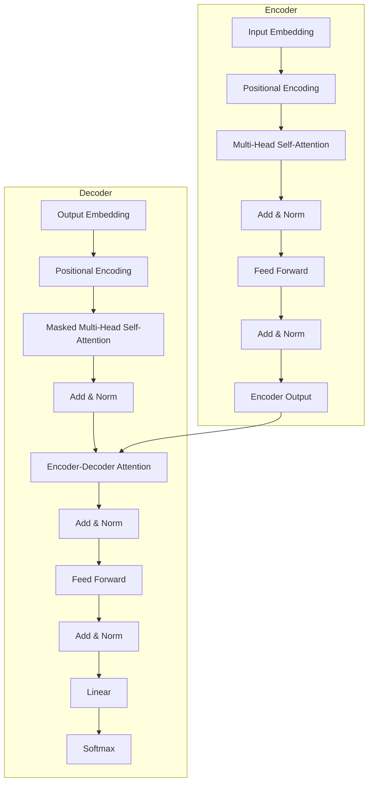

> **Transformer** 来自 Vaswani et al. 2017 年论文 *Attention Is All You Need*。它抛弃了 RNN/CNN 中对序列的递归或局部卷积建模，完全依靠 **Self-Attention** 在序列内部建立依赖关系，从而同时获得更强的并行计算能力和更短的长距离信息传递路径。

这篇文章按“为什么需要 Transformer → 整体架构 → 注意力机制 → Encoder/Decoder → Mask → 复杂度 → 常见问题 → PyTorch 手写实现”的顺序整理，目标是帮你从直觉、公式和工程实现三个层面理解 Transformer。

---

## 1. 背景：RNN 和 CNN 的痛点

在 Transformer 之前，序列建模的主力是 **RNN / LSTM / GRU**，以及后来用于文本的 **CNN** 变体。它们都能处理序列，但各自有明显限制。

### 1.1 RNN 的问题

RNN 按时间步递归处理序列：

$$
h_t = f(h_{t-1}, x_t)
$$

这带来两个问题：

1. **难以并行**：第 $t$ 个 token 的计算依赖 $t-1$ 的 hidden state，训练时很难像矩阵乘法那样一次性处理整段序列。
2. **长距离依赖困难**：早期信息需要经过很多递归步骤才能影响后面的 token，即使 LSTM/GRU 缓解了梯度问题，长文本中的远距离关系仍然不够直接。

### 1.2 CNN 的问题

CNN 可以并行计算，并通过堆叠卷积层扩大感受野。但它天然更擅长局部模式，两个距离很远的 token 需要经过多层卷积才能互相影响。

如果序列长度为 $n$，卷积核大小为 $k$，远距离依赖的路径长度大约是 $O(\log_k n)$ 或更多；而 Self-Attention 中任意两个 token 可以在一层内直接交互。

### 1.3 Transformer 的核心想法

Transformer 的核心判断是：

> 序列中每个 token 都应该能直接“看见”其他 token，并根据相关性动态分配注意力权重。

它不是按顺序读完整句话，而是把整句话同时放进模型，让每个位置通过注意力机制聚合上下文信息。

---

## 2. Transformer 整体架构

原始 Transformer 用于机器翻译，因此采用经典的 **Encoder-Decoder** 架构：

- **Encoder**：读取源语言句子，得到上下文表示。
- **Decoder**：在已生成目标 token 的条件下，结合 Encoder 输出，逐步生成目标语言句子。

整体结构如下：


```mermaid
graph TD
    subgraph Encoder
    I[Input Embedding] --> P[Positional Encoding]
    P --> L1[Multi-Head Self-Attention]
    L1 --> A1[Add & Norm]
    A1 --> F1[Feed Forward]
    F1 --> A2[Add & Norm]
    A2 --> O1[Encoder Output]
    end

    subgraph Decoder
    OD[Output Embedding] --> PD[Positional Encoding]
    PD --> MHA1[Masked Multi-Head Self-Attention]
    MHA1 --> AD1[Add & Norm]
    AD1 --> MHA2[Encoder-Decoder Attention]
    O1 --> MHA2
    MHA2 --> AD2[Add & Norm]
    AD2 --> F2[Feed Forward]
    F2 --> AD3[Add & Norm]
    AD3 --> Linear[Linear]
    Linear --> Softmax[Softmax]
    end
```


原论文的 base 配置中，Encoder 和 Decoder 都堆叠 $N=6$ 层，隐藏维度 $d_{\text{model}}=512$，多头注意力头数 $h=8$，前馈网络中间维度 $d_{\text{ff}}=2048$。

---

## 3. 输入表示：Embedding 与位置编码

### 3.1 Token Embedding

模型不能直接处理文字，需要先把 token id 映射成向量。设第 $i$ 个 token 的 embedding 为：

$$
\mathbf{w}_i \in \mathbb{R}^{d_{\text{model}}}
$$

在原始 Transformer base 中，$d_{\text{model}}=512$。每个 token 都会被表示成一个 512 维向量，向量中的维度通过训练自动承载语法、语义、上下文等信息。

### 3.2 为什么需要位置编码

Self-Attention 本身对顺序不敏感。如果只输入 token embedding，模型看到的是一组向量，而不是有顺序的句子。

例如：

- `Tom hit Jerry`
- `Jerry hit Tom`

如果没有位置信息，两句话的 token 集合很接近，但语义完全不同。

因此 Transformer 在 token embedding 上加上 **Positional Encoding**：

$$
x_i = \mathbf{w}_i + \mathbf{p}_i
$$

其中 $\mathbf{p}_i$ 是第 $i$ 个位置的位置向量。

### 3.3 正弦/余弦位置编码

原论文使用固定的正弦/余弦位置编码：

$$
PE_{(pos, 2i)} = \sin\left(\frac{pos}{10000^{2i/d_{\text{model}}}}\right)
$$

$$
PE_{(pos, 2i+1)} = \cos\left(\frac{pos}{10000^{2i/d_{\text{model}}}}\right)
$$

这样设计有几个直觉：

- 每个位置都有唯一编码；
- 不同维度对应不同频率，能表达多尺度位置信息；
- 数值落在 $[-1,1]$，不会随位置增大而爆炸；
- 模型可以通过线性组合学习相对位移关系。

现在的大模型常用 RoPE、ALiBi 等改进位置编码，但理解原始 Transformer 的正弦/余弦编码仍然很重要。

---

## 4. Scaled Dot-Product Attention

Attention 可以用查字典类比：

- **Query (Q)**：当前想查询什么；
- **Key (K)**：每个候选信息的索引；
- **Value (V)**：每个候选信息真正携带的内容。

模型先计算 Query 和各个 Key 的相似度，再用相似度作为权重，对 Value 加权求和。


公式是：

$$
\text{Attention}(Q,K,V)
=
\text{softmax}\left(\frac{QK^T}{\sqrt{d_k}}\right)V
$$

其中：

- $Q \in \mathbb{R}^{n_q \times d_k}$；
- $K \in \mathbb{R}^{n_k \times d_k}$；
- $V \in \mathbb{R}^{n_k \times d_v}$；
- $QK^T$ 得到每个 query 对每个 key 的注意力分数；
- softmax 把分数变成概率分布；
- 最后乘以 $V$ 得到上下文向量。

### 4.1 为什么要除以 $\sqrt{d_k}$

如果 $q$ 和 $k$ 的每个元素独立、均值为 0、方差为 1，那么点积：

$$
q \cdot k = \sum_{i=1}^{d_k} q_i k_i
$$

方差会随 $d_k$ 增大而增大。维度越高，点积分数越容易变得很大，softmax 输出会过于尖锐，梯度也会变小。

除以 $\sqrt{d_k}$ 相当于把注意力分数缩放到更稳定的尺度，让 softmax 保持较好的梯度信号。

### 4.2 Self-Attention 和 Cross-Attention

根据 Q/K/V 来自哪里，Attention 可以分成两类：

| 类型 | Q 来自 | K/V 来自 | 用途 |
| :--- | :--- | :--- | :--- |
| Self-Attention | 当前序列 | 当前序列 | 序列内部 token 互相建模 |
| Cross-Attention | Decoder 当前状态 | Encoder 输出 | 生成目标 token 时读取源句信息 |

Encoder 中使用 self-attention；Decoder 中既有 masked self-attention，也有 encoder-decoder cross-attention。

---

## 5. Multi-Head Attention

单个 attention head 只能在一个投影空间里计算相关性。为了让模型从多个角度理解序列，Transformer 使用 **Multi-Head Attention**。

它会把输入分别投影成 $h$ 组 Q/K/V：

$$
\text{head}_i
=
\text{Attention}(QW_i^Q, KW_i^K, VW_i^V)
$$

然后把多个 head 的输出拼接起来，再经过一次线性投影：

$$
\text{MultiHead}(Q,K,V)
=
\text{Concat}(\text{head}_1,\ldots,\text{head}_h)W^O
$$


在原论文 base 配置中：

- $d_{\text{model}} = 512$；
- $h = 8$；
- 每个 head 的维度 $d_k = d_v = 64$。

直觉上，多头注意力像是让多个观察者从不同角度理解同一句话：

- 有的 head 可能关注主谓关系；
- 有的 head 可能关注指代关系；
- 有的 head 可能关注局部短语结构；
- 有的 head 可能关注长距离依赖。

这些模式不是人工指定的，而是在训练中自动学出来的。

---

## 6. Encoder：把输入序列编码成上下文表示

Encoder 由 $N$ 个相同的 Encoder Layer 堆叠而成。每个 Encoder Layer 包含两个子层：

1. **Multi-Head Self-Attention**；
2. **Position-wise Feed-Forward Network**。

每个子层外面都有残差连接和 LayerNorm：

$$
\text{LayerNorm}(x + \text{Sublayer}(x))
$$

一个 Encoder Layer 的信息流可以写成：

$$
z = \text{LayerNorm}(x + \text{SelfAttention}(x))
$$

$$
y = \text{LayerNorm}(z + \text{FFN}(z))
$$

Encoder 的输出保留序列长度不变，只是每个 token 的表示都融合了全句上下文：

$$
\text{EncoderOutput} \in \mathbb{R}^{B \times L_{\text{src}} \times d_{\text{model}}}
$$

其中 $B$ 是 batch size，$L_{\text{src}}$ 是源序列长度。

---

## 7. Decoder：自回归生成目标序列

Decoder 同样由 $N$ 个 Decoder Layer 堆叠而成，但每层有三个子层：

1. **Masked Multi-Head Self-Attention**；
2. **Encoder-Decoder Attention**；
3. **Position-wise Feed-Forward Network**。

### 7.1 Masked Self-Attention

训练时，目标句子通常一次性送入 Decoder。如果不加 mask，预测第 $t$ 个 token 时模型就能看到第 $t+1$ 个 token，相当于“偷看答案”。

因此 Decoder self-attention 需要 causal mask，只允许当前位置关注自己和之前的位置：

$$
\text{mask}_{i,j} =
\begin{cases}
1, & j \le i \\
0, & j > i
\end{cases}
$$

实现时通常把被 mask 的位置加上一个极大的负数，例如 $-10^9$，让它经过 softmax 后接近 0。

### 7.2 Encoder-Decoder Attention

第二个 attention 子层是 cross-attention：

- Query 来自 Decoder 当前隐藏状态；
- Key 和 Value 来自 Encoder 输出。

这让 Decoder 在生成每个目标 token 时，都能动态关注源句中最相关的位置。

### 7.3 输出层

Decoder 最后一层输出会通过线性层映射到词表维度，再通过 softmax 得到下一个 token 的概率分布：

$$
P(y_t \mid y_{<t}, x)
=
\text{softmax}(W_o h_t + b_o)
$$

---

## 8. Position-wise Feed-Forward Network

每个 Encoder/Decoder Layer 中都有一个前馈网络：

$$
\text{FFN}(x) = \max(0, xW_1 + b_1)W_2 + b_2
$$

它对序列中每个位置独立应用同一个两层 MLP：

- 第一层把维度从 $d_{\text{model}}$ 升到 $d_{\text{ff}}$；
- 中间使用 ReLU；
- 第二层再投影回 $d_{\text{model}}$。

原论文 base 配置中：

- $d_{\text{model}} = 512$；
- $d_{\text{ff}} = 2048$。

Attention 负责不同位置之间的信息交互，FFN 则负责对每个位置的表示做非线性变换和特征加工。

---

## 9. Mask 机制：Padding Mask 与 Causal Mask

Transformer 中常见两类 mask。

### 9.1 Padding Mask

一个 batch 中，不同句子长度不同，通常会补 `<pad>` 到同一长度。Padding token 不应该参与注意力计算，因此需要 padding mask。

对于输入：

```text
[I, love, NLP, <pad>, <pad>]
```

attention 应该忽略后两个 `<pad>`。

### 9.2 Causal Mask

Causal mask 用在 Decoder self-attention 中，保证自回归生成不能看未来 token。

一个长度为 4 的 causal mask 形如：

$$
\begin{bmatrix}
1 & 0 & 0 & 0 \\
1 & 1 & 0 & 0 \\
1 & 1 & 1 & 0 \\
1 & 1 & 1 & 1
\end{bmatrix}
$$

### 9.3 两种 Mask 的组合

Decoder self-attention 通常需要同时使用：

- padding mask：遮掉 `<pad>`；
- causal mask：遮掉未来位置。

最终 mask 可以通过逻辑与组合：

$$
\text{target mask} = \text{padding mask} \land \text{causal mask}
$$

---

## 10. 为什么 Self-Attention 有优势

原论文对比了 Self-Attention、RNN 和 CNN。可以从三个角度理解。

| 维度 | Self-Attention | RNN | CNN |
| :--- | :--- | :--- | :--- |
| 每层复杂度 | $O(n^2 d)$ | $O(n d^2)$ | $O(k n d^2)$ |
| 顺序操作数 | $O(1)$ | $O(n)$ | $O(1)$ |
| 长距离依赖路径 | $O(1)$ | $O(n)$ | $O(\log_k n)$ |

其中：

- $n$：序列长度；
- $d$：隐藏维度；
- $k$：卷积核大小。

Self-Attention 的优势在于：

1. **并行性强**：整个序列可以一起计算；
2. **长距离路径短**：任意两个 token 一层内就能交互；
3. **动态建模依赖**：注意力权重由输入内容决定，而不是固定卷积核。

它的代价是 $O(n^2)$ 的序列长度复杂度。因此超长上下文模型需要稀疏注意力、线性注意力、FlashAttention、KV cache 等工程和算法优化。

---

## 11. 常见问题

### 11.1 为什么 Transformer 需要位置编码？

因为 Self-Attention 本身不包含顺序归纳偏置。如果不加入位置信息，模型无法区分同一组 token 的不同排列。位置编码提供 token 的绝对或相对顺序信息。

### 11.2 多头注意力的头数有什么作用？

多个 head 让模型在不同投影空间中学习不同关系。单头注意力像一个观察角度，多头注意力则能同时观察语法、语义、指代、局部短语和长距离依赖。

### 11.3 Decoder 为什么需要 Mask？

因为 Decoder 是自回归生成。预测第 $t$ 个 token 时，只能使用 $t$ 之前的 token。如果训练时能看到未来 token，推理时就会出现训练/推理不一致。

### 11.4 Mask 是在哪一步生效的？

Mask 通常在 softmax 之前作用于 attention scores：

$$
\text{scores} = \frac{QK^T}{\sqrt{d_k}}
$$

被遮挡的位置会被填成一个很大的负数：

$$
\text{scores}_{masked} = -10^9
$$

这样 softmax 后这些位置的权重近似为 0。

### 11.5 Transformer 和 GPT/BERT/LLaMA 是什么关系？

Transformer 是基础架构。后续模型在此基础上做了不同取舍：

- **BERT**：主要使用 Encoder，适合理解类任务；
- **GPT / LLaMA**：主要使用 Decoder-only 架构，适合自回归生成；
- **T5 / BART**：使用 Encoder-Decoder，适合文本到文本任务。

---

## 12. 总结

Transformer 的关键贡献可以概括为：

1. **用 Self-Attention 替代递归结构**，让序列内部任意位置直接交互；
2. **通过 Multi-Head Attention 扩展表示能力**，让模型从多个子空间建模关系；
3. **用位置编码补充顺序信息**，解决注意力本身无序的问题；
4. **用 Mask 支持自回归生成和 padding 处理**；
5. **用残差连接、LayerNorm 和 FFN 组成稳定可堆叠的网络块**。

从今天的大模型视角看，Transformer 已经不只是一个机器翻译模型，而是 BERT、GPT、LLaMA、ViT 等大量现代模型的共同骨架。

---

## 13. 附录：PyTorch 手写 Transformer

下面是一份教学向实现，重点是帮助理解张量形状和模块连接。它没有覆盖现代训练中的全部工程细节，例如 label smoothing、KV cache、FlashAttention、混合精度和分布式训练。

### 13.1 Multi-Head Attention

输入输出形状约定：

- `q/k/v`: `[batch_size, seq_len, d_model]`
- attention scores: `[batch_size, num_heads, q_len, k_len]`
- output: `[batch_size, q_len, d_model]`

```python
import math
import torch
import torch.nn as nn
import torch.nn.functional as F


class MultiHeadAttention(nn.Module):
    def __init__(self, d_model, num_heads):
        super().__init__()

        assert d_model % num_heads == 0, "d_model must be divisible by num_heads"

        self.d_model = d_model
        self.num_heads = num_heads
        self.d_k = d_model // num_heads

        self.w_q = nn.Linear(d_model, d_model)
        self.w_k = nn.Linear(d_model, d_model)
        self.w_v = nn.Linear(d_model, d_model)
        self.fc_out = nn.Linear(d_model, d_model)

    def forward(self, q, k, v, mask=None):
        batch_size = q.size(0)

        Q = self.w_q(q)
        K = self.w_k(k)
        V = self.w_v(v)

        Q = Q.view(batch_size, -1, self.num_heads, self.d_k).transpose(1, 2)
        K = K.view(batch_size, -1, self.num_heads, self.d_k).transpose(1, 2)
        V = V.view(batch_size, -1, self.num_heads, self.d_k).transpose(1, 2)

        scores = torch.matmul(Q, K.transpose(-2, -1)) / math.sqrt(self.d_k)

        if mask is not None:
            scores = scores.masked_fill(mask == 0, -1e9)

        attention_weights = F.softmax(scores, dim=-1)
        output = torch.matmul(attention_weights, V)

        output = output.transpose(1, 2).contiguous()
        output = output.view(batch_size, -1, self.d_model)

        return self.fc_out(output)
```

### 13.2 FFN 与位置编码

```python
class PositionwiseFeedForward(nn.Module):
    def __init__(self, d_model, d_ff, dropout=0.1):
        super().__init__()
        self.net = nn.Sequential(
            nn.Linear(d_model, d_ff),
            nn.ReLU(),
            nn.Dropout(dropout),
            nn.Linear(d_ff, d_model),
        )

    def forward(self, x):
        return self.net(x)


class PositionalEncoding(nn.Module):
    def __init__(self, d_model, max_len=5000, dropout=0.1):
        super().__init__()
        self.dropout = nn.Dropout(dropout)

        pe = torch.zeros(max_len, d_model)
        position = torch.arange(0, max_len, dtype=torch.float).unsqueeze(1)
        div_term = torch.exp(
            torch.arange(0, d_model, 2).float()
            * (-math.log(10000.0) / d_model)
        )

        pe[:, 0::2] = torch.sin(position * div_term)
        pe[:, 1::2] = torch.cos(position * div_term)

        self.register_buffer("pe", pe.unsqueeze(0))

    def forward(self, x):
        x = x + self.pe[:, : x.size(1), :]
        return self.dropout(x)
```

### 13.3 Encoder

```python
class EncoderLayer(nn.Module):
    def __init__(self, d_model, num_heads, d_ff, dropout=0.1):
        super().__init__()
        self.self_attn = MultiHeadAttention(d_model, num_heads)
        self.feed_forward = PositionwiseFeedForward(d_model, d_ff, dropout)
        self.norm1 = nn.LayerNorm(d_model)
        self.norm2 = nn.LayerNorm(d_model)
        self.dropout = nn.Dropout(dropout)

    def forward(self, x, src_mask=None):
        attn_output = self.self_attn(x, x, x, src_mask)
        x = self.norm1(x + self.dropout(attn_output))

        ff_output = self.feed_forward(x)
        x = self.norm2(x + self.dropout(ff_output))

        return x


class TransformerEncoder(nn.Module):
    def __init__(
        self,
        vocab_size,
        d_model,
        num_heads,
        d_ff,
        num_layers,
        max_len=5000,
        dropout=0.1,
    ):
        super().__init__()
        self.d_model = d_model
        self.embedding = nn.Embedding(vocab_size, d_model)
        self.pos_encoding = PositionalEncoding(d_model, max_len, dropout)
        self.layers = nn.ModuleList(
            [
                EncoderLayer(d_model, num_heads, d_ff, dropout)
                for _ in range(num_layers)
            ]
        )

    def forward(self, src, src_mask=None):
        x = self.embedding(src) * math.sqrt(self.d_model)
        x = self.pos_encoding(x)

        for layer in self.layers:
            x = layer(x, src_mask)

        return x
```

### 13.4 Decoder

```python
class DecoderLayer(nn.Module):
    def __init__(self, d_model, num_heads, d_ff, dropout=0.1):
        super().__init__()
        self.self_attn = MultiHeadAttention(d_model, num_heads)
        self.cross_attn = MultiHeadAttention(d_model, num_heads)
        self.feed_forward = PositionwiseFeedForward(d_model, d_ff, dropout)
        self.norm1 = nn.LayerNorm(d_model)
        self.norm2 = nn.LayerNorm(d_model)
        self.norm3 = nn.LayerNorm(d_model)
        self.dropout = nn.Dropout(dropout)

    def forward(self, x, enc_output, src_mask=None, tgt_mask=None):
        self_attn_output = self.self_attn(x, x, x, tgt_mask)
        x = self.norm1(x + self.dropout(self_attn_output))

        cross_attn_output = self.cross_attn(x, enc_output, enc_output, src_mask)
        x = self.norm2(x + self.dropout(cross_attn_output))

        ff_output = self.feed_forward(x)
        x = self.norm3(x + self.dropout(ff_output))

        return x


class TransformerDecoder(nn.Module):
    def __init__(
        self,
        vocab_size,
        d_model,
        num_heads,
        d_ff,
        num_layers,
        max_len=5000,
        dropout=0.1,
    ):
        super().__init__()
        self.d_model = d_model
        self.embedding = nn.Embedding(vocab_size, d_model)
        self.pos_encoding = PositionalEncoding(d_model, max_len, dropout)
        self.layers = nn.ModuleList(
            [
                DecoderLayer(d_model, num_heads, d_ff, dropout)
                for _ in range(num_layers)
            ]
        )
        self.fc_out = nn.Linear(d_model, vocab_size)

    def forward(self, tgt, enc_output, src_mask=None, tgt_mask=None):
        x = self.embedding(tgt) * math.sqrt(self.d_model)
        x = self.pos_encoding(x)

        for layer in self.layers:
            x = layer(x, enc_output, src_mask, tgt_mask)

        return self.fc_out(x)
```

### 13.5 Mask 与完整 Transformer

```python
def make_pad_mask(tokens, pad_idx=0):
    """
    tokens: [batch, seq_len]
    return: [batch, 1, 1, seq_len]
    """
    return (tokens != pad_idx).unsqueeze(1).unsqueeze(2)


def make_subsequent_mask(seq_len, device):
    """
    return: [1, 1, seq_len, seq_len]
    """
    mask = torch.tril(torch.ones((seq_len, seq_len), device=device)).bool()
    return mask.unsqueeze(0).unsqueeze(1)


class Transformer(nn.Module):
    def __init__(
        self,
        src_vocab_size,
        tgt_vocab_size,
        d_model=512,
        num_heads=8,
        d_ff=2048,
        num_layers=6,
        max_len=5000,
        dropout=0.1,
        pad_idx=0,
    ):
        super().__init__()
        self.pad_idx = pad_idx
        self.encoder = TransformerEncoder(
            src_vocab_size,
            d_model,
            num_heads,
            d_ff,
            num_layers,
            max_len,
            dropout,
        )
        self.decoder = TransformerDecoder(
            tgt_vocab_size,
            d_model,
            num_heads,
            d_ff,
            num_layers,
            max_len,
            dropout,
        )

    def forward(self, src, tgt):
        src_mask = make_pad_mask(src, self.pad_idx)

        tgt_pad_mask = make_pad_mask(tgt, self.pad_idx)
        tgt_causal_mask = make_subsequent_mask(tgt.size(1), tgt.device)
        tgt_mask = tgt_pad_mask & tgt_causal_mask

        enc_output = self.encoder(src, src_mask)
        output = self.decoder(tgt, enc_output, src_mask, tgt_mask)

        return output
```

### 13.6 简单运行测试

```python
if __name__ == "__main__":
    src_vocab_size = 10000
    tgt_vocab_size = 10000
    batch_size = 2
    src_len = 10
    tgt_len = 12

    model = Transformer(src_vocab_size, tgt_vocab_size)

    src = torch.randint(1, src_vocab_size, (batch_size, src_len))
    tgt = torch.randint(1, tgt_vocab_size, (batch_size, tgt_len))

    out = model(src, tgt)

    print("src shape:", src.shape)
    print("tgt shape:", tgt.shape)
    print("out shape:", out.shape)

    assert out.shape == (batch_size, tgt_len, tgt_vocab_size)
    print("Transformer forward pass works.")
```

---

**参考**

- Vaswani et al., *Attention Is All You Need*. [arXiv:1706.03762](https://arxiv.org/abs/1706.03762)
- Jay Alammar, *The Illustrated Transformer*. [jalammar.github.io/illustrated-transformer](https://jalammar.github.io/illustrated-transformer/)
- 中文参考：[Transformer 模型详解](https://zhuanlan.zhihu.com/p/338817680)
