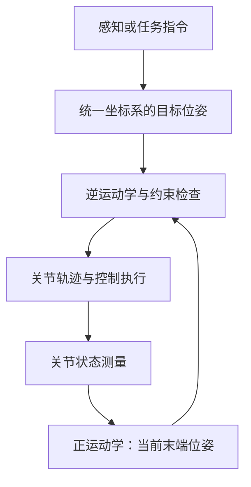

机器人看见一个杯子之后，为什么不能直接把视觉模型输出的三维坐标发给机械臂？因为“杯子在哪里”至少还隐含着两个问题：这个位置是相对于哪一个坐标系描述的，以及机械臂应该以什么姿态接近它。即使这些信息已经明确，控制器仍需要把末端目标转换成各关节能够执行的运动。

**机器人运动学研究的，就是关节运动与刚体位姿之间的几何关系。** 它既是机械臂控制的基础，也连接相机标定、抓取位姿估计、轨迹规划，以及 VLA、模仿学习等方法所输出的动作。学习策略可以预测末端位姿或位姿增量，但这些输出依然需要明确的坐标约定和可实现的运动学接口。

本文先建立坐标变换与旋转的几何直觉，再推导正运动学、雅可比和逆运动学，最后讨论七自由度机械臂如何利用冗余运动。文中保留三个交互演示，并给出可以连贯运行的 Python 示例。阅读只需要基本的矩阵乘法、三角函数和向量叉积；涉及奇异值分解时，会同时解释其物理含义。

> 本文属于 [机器人学习 ROADMAP]({{ '/roadmap/' | relative_url }}) 的“运动与控制”基础部分。已经熟悉坐标变换的读者，可以直接从 [雅可比与奇异性](#velocity-kinematics) 或 [七自由度代码实验](#python-kinematics) 开始。

## 1. 先明确任务：位置、姿态与关节构型

### 1.1 正运动学、逆运动学和控制分别解决什么问题？

设机械臂有 $n$ 个独立关节，关节变量记为

$$
\boldsymbol\theta=[\theta_1,\theta_2,\ldots,\theta_n]^T.
$$

对于转动关节，变量是角度；对于移动关节，变量是位移。下文的七自由度示例由七个转动关节构成，因此统一使用 $\theta_i$。

**正运动学（FK）** 接收关节构型，计算末端的位置与姿态：

$$
{}^B T_E=f(\boldsymbol\theta).
$$

**逆运动学（IK）** 接收目标位姿，寻找满足几何关系的关节构型：

$$
\text{寻找 }\boldsymbol\theta^{\ast}\text{，使得 }
 f(\boldsymbol\theta^{\ast})={}^B T_{E,{\ast}}.
$$

其中 $B$ 表示基座，$E$ 表示末端，星号表示目标。FK 在模型和关节值确定后给出确定结果；IK 则可能没有解、有多个离散解，或在冗余机构中形成连续的解集。

IK 求出的是一个几何上合适的构型。要从当前构型运动到该构型，还需要轨迹规划安排路径与时间，并由控制器跟踪。质量、惯性、重力和力矩属于动力学问题，不能仅由运动学方程确定。



### 1.2 六维任务不等于六个位置坐标

空间刚体的位置需要三个数描述；姿态还有三个独立自由度。因此，完整的末端位姿任务通常具有六个局部独立约束。但姿态的三个自由度不意味着任意三个数都能在所有姿态下构成唯一、连续且无奇异的表示。

任务维数还取决于实际要求。让吸盘中心到达一个点，可能只约束三维位置；要求吸盘法向对准表面，通常再增加两个独立姿态约束；如果绕法向的旋转不影响任务，就不必再固定这个角度。任务约束越少，机械臂通常拥有越多可用于调整构型的空间。

### 1.3 全文使用的约定

运动学推导中，相当多的错误来自约定不一致。本文固定以下记法：

| 对象 | 本文约定 |
| --- | --- |
| 坐标系 | 右手坐标系；三维向量写成列向量 |
| 点的坐标 | ${}^A\mathbf p$ 表示同一个点在 $A$ 系中的坐标 |
| 坐标变换 | ${}^A T_B$ 将 $B$ 系坐标转换为 $A$ 系坐标 |
| 角度与长度 | 公式和代码默认使用弧度、米；界面显示角度时另行标注 |
| 欧拉角 | Roll 为 $\phi$，Pitch 为 $\beta$，Yaw 为 $\psi$；采用 $R=R_z(\psi)R_y(\beta)R_x(\phi)$ |
| 四元数 | 数学公式使用 Hamilton 乘法，分量顺序为 $[w,x,y,z]$ |
| 末端速度 | 使用基座系表达的几何速度 $[\dot{\mathbf p}^T,\boldsymbol\omega^T]^T$，先线速度、后角速度 |

最后一项尤其重要。其他教材或软件可能使用先角速度、后线速度的 twist 表示，而且其线速度分量可能与末端原点的速度不同。使用外部雅可比时，需要同时确认**分量顺序、表达坐标系和参考点**。

## 2. 坐标变换：同一个点，为什么会有不同的坐标？
{: #coordinate-transforms }

### 2.1 坐标系不仅有原点，还有三根轴

在抓取系统中，常见的坐标系包括世界系 $W$、机械臂基座系 $B$、关节系 $J_i$、末端法兰系 $E$、工具中心系 $G$ 和相机系 $C$。法兰与工具中心需要区分：控制器给出的位姿可能对应法兰，而任务要求的是夹爪中心或吸盘接触点。

设 $B$ 系相对于 $A$ 系的旋转为 ${}^A R_B$，$B$ 系原点在 $A$ 系中的位置为 ${}^A\mathbf t_B$。对一个固定的空间点，有

$$
{}^A\mathbf p={}^A R_B\,{}^B\mathbf p+{}^A\mathbf t_B.
$$

这个式子可以分成两步理解：先用旋转矩阵把向量分量转换到 $A$ 系的轴方向，再加上两个原点之间的位移。物理空间中的点没有移动，变化的是它的坐标描述。

### 2.2 旋转矩阵的每一列都有几何意义

旋转矩阵可以写为

$$
{}^A R_B=
\begin{bmatrix}
{}^A\mathbf x_B & {}^A\mathbf y_B & {}^A\mathbf z_B
\end{bmatrix}.
$$

三列分别是 $B$ 系的三根单位轴在 $A$ 系中的坐标。因为三根轴相互垂直、长度为一，并保持右手性，所以

$$
R^TR=I,\qquad \det R=1.
$$

所有满足这些条件的 $3\times3$ 矩阵组成特殊正交群 $SO(3)$。九个矩阵元素受到约束，只有三个独立自由度。仅有 $R^TR=I$ 还不够，因为行列式为 $-1$ 的正交矩阵包含镜像反射，不是三维刚体旋转。

### 2.3 为什么要把三维问题写成四维矩阵？

旋转是矩阵乘法，平移是向量加法。引入齐次坐标之后，两者可以合并：

$$
\begin{bmatrix}{}^A\mathbf p\\1\end{bmatrix}
=
\underbrace{\begin{bmatrix}
{}^A R_B & {}^A\mathbf t_B\\
\mathbf0^T&1
\end{bmatrix}}_{ {}^A T_B }
\begin{bmatrix}{}^B\mathbf p\\1\end{bmatrix}.
$$

这里的“第四维”是代数工具，不是额外的物理空间维度。所有合法刚体齐次变换组成 $SE(3)$，一个具体变换满足 $T\in SE(3)$。

点的最后一维为 $1$；方向向量的最后一维为 $0$。因此，方向向量只受旋转影响：

$$
\begin{bmatrix}{}^A\mathbf v\\0\end{bmatrix}
={}^A T_B
\begin{bmatrix}{}^B\mathbf v\\0\end{bmatrix}
=
\begin{bmatrix}{}^A R_B\,{}^B\mathbf v\\0\end{bmatrix}.
$$

这解释了为什么相机测得的三维点需要旋转和平移，而一条视线方向或一根关节轴不能直接加上平移。齐次变换的坐标转换与复合规则，可对照 [Modern Robotics 的对应章节][mr-transform] 阅读。

### 2.4 用一个数值例子检查变换方向

令 $B$ 系相对 $A$ 系绕 $z$ 轴旋转 $90^\circ$，原点位于 $(1,2,0)$ 米处：

$$
{}^A T_B=
\begin{bmatrix}
0&-1&0&1\\
1&0&0&2\\
0&0&1&0\\
0&0&0&1
\end{bmatrix}.
$$

若点在 $B$ 系中的坐标为 $(1,0,0)$，那么它沿 $B$ 系的 $x$ 轴前进一米；由于这根轴在 $A$ 系中指向 $+y$，结果应为

$$
{}^A\mathbf p=(1,3,0)^T.
$$

这个例子比单纯检查矩阵维数更有用：维数正确的逆矩阵或错误乘法顺序，也可能给出一个看起来合理的三维坐标。

### 2.5 复合、求逆与左乘右乘

由 $C$ 系经过 $B$ 系转换到 $A$ 系时，链式关系是

$$
{}^A T_C={}^A T_B\,{}^B T_C.
$$

展开其平移部分：

$$
{}^A R_C={}^A R_B\,{}^B R_C,\qquad
{}^A\mathbf t_C={}^A R_B\,{}^B\mathbf t_C+{}^A\mathbf t_B.
$$

后一式说明，**两个不同坐标系下的平移向量不能直接相加**。必须先把它们表达在同一个坐标系中。

将 ${}^A\mathbf p=R\,{}^B\mathbf p+\mathbf t$ 移项，再利用 $R^{-1}=R^T$，即可得到

$$
T^{-1}=\begin{bmatrix}R^T&-R^T\mathbf t\\\mathbf0^T&1\end{bmatrix}.
$$

逆变换的平移不是简单的 $-\mathbf t$，因为反向描述时参考坐标系也改变了。

对姿态施加增量时，左乘与右乘也有不同含义。若当前姿态为 ${}^B R_E$，则

$$
R_{\mathrm{new}}=\Delta R_B\,{}^B R_E
\quad\text{或}\quad
R_{\mathrm{new}}={}^B R_E\,\Delta R_E.
$$

前者把增量旋转的轴表达在基座系，后者表达在当前末端系。相同数值的 $\Delta R$ 通常得到不同结果。对完整齐次变换也应这样辨别；尤其是绕基座原点施加的旋转，还会改变末端原点的位置。

### 2.6 从相机观测到抓取目标

假设视觉系统估计出物体系 $O$ 在相机中的位姿 ${}^C T_O$，抓取规则给出工具相对于物体的期望位姿 ${}^O T_{G,{\ast}}$，则

$$
{}^B T_{G,{\ast}}={}^B T_C\,{}^C T_O\,{}^O T_{G,{\ast}}.
$$

如果控制器接收法兰目标，且工具安装变换 ${}^E T_G$ 已知，还需要

$$
{}^B T_{E,{\ast}}={}^B T_{G,{\ast}}({}^E T_G)^{-1}.
$$

对于眼在手上的相机，相机到基座的变换随关节构型变化：

$$
{}^B T_C={}^B T_E(\boldsymbol\theta_{\mathrm{meas}})\,{}^E T_C.
$$

这里应使用与图像采集时刻对应的关节状态。即使每一项标定都正确，用不同时刻的图像与机械臂状态拼接，也会产生抓取位置误差。

## 3. 欧拉角与万向锁：问题出在什么地方？
{: #euler-and-gimbal-lock }

### 3.1 三个基本旋转矩阵

按右手定则，绕正轴的基本旋转为

$$
R_x(\phi)=\begin{bmatrix}1&0&0\\0&\cos\phi&-\sin\phi\\0&\sin\phi&\cos\phi\end{bmatrix},
$$

$$
R_y(\beta)=\begin{bmatrix}\cos\beta&0&\sin\beta\\0&1&0\\-\sin\beta&0&\cos\beta\end{bmatrix},
$$

$$
R_z(\psi)=\begin{bmatrix}\cos\psi&-\sin\psi&0\\\sin\psi&\cos\psi&0\\0&0&1\end{bmatrix}.
$$

这些矩阵既可以用于主动旋转一个向量，也可以在明确坐标系含义后用于坐标转换。主动旋转改变物体，坐标转换改变描述；不能在推导中不加说明地切换两种含义。

空间旋转一般不可交换。例如，令 $\mathbf e_z=(0,0,1)^T$，有

$$
R_x(90^\circ)R_y(90^\circ)\mathbf e_z=\mathbf e_x,
\qquad
R_y(90^\circ)R_x(90^\circ)\mathbf e_z=-\mathbf e_y.
$$

因此，给出三个角度之后，还必须给出顺序。

### 3.2 内禀旋转、外禀旋转与 ZYX 的准确含义

本文采用

$$
R=R_z(\psi)R_y(\beta)R_x(\phi).
$$

它可以用两种等价方式描述：

- **外禀 XYZ**：依次绕固定坐标系的 $x,y,z$ 轴旋转 $\phi,\beta,\psi$；矩阵对列向量的作用从右向左进行。
- **内禀 ZYX**：先绕当前 $z$ 轴旋转 $\psi$，再绕已经移动的 $y$ 轴旋转 $\beta$，最后绕再次移动后的 $x$ 轴旋转 $\phi$。

这也是为什么“先绕 $z$，再绕 $y$，最后绕 $x$”单独出现时不够明确：必须说明轴是否跟随物体旋转。严格分类中，ZYX 属于三个不同轴的 Tait–Bryan 角；ZYZ 这类首尾轴相同的序列属于经典欧拉角。机器人文献中常把二者统称为欧拉角。

在 SciPy 中，**大写序列表示内禀旋转，小写序列表示外禀旋转**。因此 `from_euler('ZYX', [yaw, pitch, roll])` 与 `from_euler('xyz', [roll, pitch, yaw])` 对应本文同一个矩阵。大小写及参数顺序都不能省略。[SciPy 官方说明][scipy-euler]

### 3.3 万向锁的矩阵推导

令 $c_\phi=\cos\phi$、$s_\phi=\sin\phi$，其他角度同理。将三个基本矩阵相乘：

$$
R=\begin{bmatrix}
c_\psi c_\beta & c_\psi s_\beta s_\phi-s_\psi c_\phi & c_\psi s_\beta c_\phi+s_\psi s_\phi\\
s_\psi c_\beta & s_\psi s_\beta s_\phi+c_\psi c_\phi & s_\psi s_\beta c_\phi-c_\psi s_\phi\\
-s_\beta & c_\beta s_\phi & c_\beta c_\phi
\end{bmatrix}.
$$

当 $\beta=\pi/2$ 时，令 $\delta=\phi-\psi$，矩阵化为

$$
R=\begin{bmatrix}
0&\sin\delta&\cos\delta\\
0&\cos\delta&-\sin\delta\\
-1&0&0
\end{bmatrix}.
$$

此时结果只与 $\phi-\psi$ 有关，无法从姿态唯一恢复 Roll 和 Yaw。比如 $(\phi,\beta,\psi)=(10^\circ,90^\circ,30^\circ)$ 与 $(40^\circ,90^\circ,60^\circ)$ 得到相同姿态。对于本文约定，$+90^\circ$ 处是角度之差；不能不区分约定和正负角度就写成角度之和。

**万向锁意味着这组参数在该处退化，不意味着该姿态无法表示。** 上面的旋转矩阵仍然完全有效，四元数也可以正常表示它。困难在于参数不再局部唯一，以及角速度到欧拉角变化率的转换变得病态。

### 3.4 从角速度看参数为什么退化

将三次旋转的瞬时轴都写到基座系，可以得到

$$
\boldsymbol\omega=
\underbrace{\begin{bmatrix}
c_\psi c_\beta&-s_\psi&0\\
s_\psi c_\beta&c_\psi&0\\
-s_\beta&0&1
\end{bmatrix}}_{E(\phi,\beta,\psi)}
\begin{bmatrix}\dot\phi\\\dot\beta\\\dot\psi\end{bmatrix}.
$$

$E$ 的三列分别对应 Roll、Pitch、Yaw 的瞬时旋转轴，并且

$$
\det E=\cos\beta.
$$

当 $\beta=\pi/2$ 时，第一列与第三列反向共线；当 $\beta=-\pi/2$ 时，它们同向共线。接近这些位置时，为了描述一个正常大小的角速度，欧拉角变化率可能变得很大。因此，**欧拉角导数通常不等于角速度的三个分量**。

还要区分两种情况：如果欧拉角只是软件中的姿态表示，改用四元数可以绕开这种参数退化；如果真实机构就是三个嵌套转轴，轴线重合会让机构的瞬时运动能力下降，换一种数学表示并不能恢复硬件能力。后文讨论的机械臂雅可比奇异性属于机构与任务之间的关系。

## 4. 轴角、旋转向量与四元数
{: #quaternions }

### 4.1 从“一根轴、一个角”描述旋转

绕单位轴 $\mathbf u$ 旋转 $\vartheta$，可以通过 Rodrigues 公式写成旋转矩阵：

$$
R=I+\sin\vartheta[\mathbf u]_\times+
(1-\cos\vartheta)[\mathbf u]_\times^2,
$$

其中叉乘矩阵定义为

$$
[\mathbf u]_\times=
\begin{bmatrix}0&-u_z&u_y\\u_z&0&-u_x\\-u_y&u_x&0\end{bmatrix},
\qquad [\mathbf u]_\times\mathbf v=\mathbf u\times\mathbf v.
$$

把轴和角合并为 $\mathbf r=\vartheta\mathbf u$，得到旋转向量。它很适合描述小旋转：当 $\|\mathbf r\|$ 很小时，$R\approx I+[\mathbf r]_\times$。数值 IK 中的姿态误差就可以使用这种局部三维表示。

旋转向量也有边界：零旋转的轴没有唯一意义，$180^\circ$ 附近存在轴符号和分支选择问题。选用哪一种表示，应由计算需求决定，不能把“参数更少”理解成“任何地方都更稳定”。

### 4.2 单位四元数的几何意义

四元数写为

$$
q=w+xi+yj+zk=\begin{bmatrix}w\\\mathbf v\end{bmatrix},
\qquad\mathbf v=(x,y,z)^T.
$$

用于表示旋转时，要求 $\|q\|=1$。轴角到四元数的关系是

$$
q=\begin{bmatrix}
\cos(\vartheta/2)\\
\mathbf u\sin(\vartheta/2)
\end{bmatrix}.
$$

例如，绕 $z$ 轴旋转 $90^\circ$，对应

$$
q=[\sqrt2/2,\,0,\,0,\,\sqrt2/2]^T.
$$

四个数通过单位长度约束描述三个自由度。与三参数欧拉角不同，单位四元数不在某个 Pitch 角度上失去姿态参数化的局部能力；代价是冗余约束和双重覆盖。

### 4.3 复合、求逆与双重覆盖

采用 Hamilton 乘法时，令 $q_1=(w_1,\mathbf v_1)$、$q_2=(w_2,\mathbf v_2)$，则

$$
q_1\otimes q_2=
\begin{bmatrix}
w_1w_2-\mathbf v_1^T\mathbf v_2\\
w_1\mathbf v_2+w_2\mathbf v_1+\mathbf v_1\times\mathbf v_2
\end{bmatrix}.
$$

它与旋转矩阵的复合顺序一致：

$$
R(q_1\otimes q_2)=R(q_1)R(q_2).
$$

对单位四元数，逆就是共轭：$q^{-1}=q^{\ast}=[w,-x,-y,-z]^T$。将三维向量写成纯虚四元数后，旋转可以表示为

$$
[0,\mathbf p'] = q\otimes[0,\mathbf p]\otimes q^{\ast}.
$$

在这个式子中把 $q$ 换成 $-q$，两个负号抵消，因此 **$q$ 和 $-q$ 表示同一个旋转**。这不等于说 $-q$ 是逆旋转：整体变号与取共轭是不同操作。

双重覆盖在数据处理中很常见。一个姿态序列的四元数可能从 $q$ 突然变成 $-q$，但物体没有发生任何运动。因此，直接计算四维分量差或逐分量平均，可能得到错误的运动幅度或接近零的向量。连续记录时，常把相邻四元数调整到点积非负的同一半球；比较姿态则可用

$$
d_R(q_1,q_2)=2\arccos\!\left(\operatorname{clip}(|q_1^Tq_2|,0,1)\right).
$$

这个距离表示最短相对旋转角，前提是输入已经归一化。

### 4.4 四元数与旋转矩阵的转换

对于本文的单位四元数顺序 $[w,x,y,z]$，有

$$
R(q)=\begin{bmatrix}
1-2(y^2+z^2)&2(xy-wz)&2(xz+wy)\\
2(xy+wz)&1-2(x^2+z^2)&2(yz-wx)\\
2(xz-wy)&2(yz+wx)&1-2(x^2+y^2)
\end{bmatrix}.
$$

从矩阵转换回四元数时，直接只使用矩阵迹的公式，在接近 $180^\circ$ 的旋转处可能出现小分母。因此，实践中更适合调用经过分支处理的库函数，并检查输入矩阵是否为合法旋转矩阵。把含有缩放、反射或严重噪声的矩阵传入转换函数，并不能自动解决上游建模错误。

接口中的分量顺序需要单独核对：

| 接口或记法 | 顺序与注意事项 |
| --- | --- |
| 本文数学公式 | $[w,x,y,z]$ |
| SciPy `Rotation.from_quat` / `as_quat` 默认接口 | $[x,y,z,w]$ |
| Eigen `Quaterniond(w,x,y,z)` 构造函数 | 参数为 $w,x,y,z$，但 `coeffs()` 的存储顺序是 $x,y,z,w$ |
| Three.js `Quaternion(x,y,z,w)` | 参数为 $x,y,z,w$；演示界面可以另行按 $w,x,y,z$ 排版显示 |

SciPy 和 Eigen 的上述区别分别见 [SciPy 四元数接口][scipy-quat] 与 [Eigen 官方文档][eigen-quat]。跨语言传输时，应显式重排字段，而不是把四个数的数组直接复制到另一个库。

### 4.5 SLERP：沿最短旋转路径插值

欧拉角逐分量线性插值可能走远路。例如，从 Yaw $179^\circ$ 插到 $-179^\circ$，简单平均会经过 $0^\circ$，而实际最短旋转只有 $2^\circ$。其他角度同时变化时，问题还包含旋转顺序的耦合。

设归一化后的四元数为 $q_0,q_1$。若 $q_0^Tq_1<0$，先把 $q_1$ 变号，使两端位于相近的半球。令

$$
\Omega=\arccos(q_0^Tq_1),
$$

则球面线性插值为

$$
q(s)=\frac{\sin((1-s)\Omega)}{\sin\Omega}q_0+
\frac{\sin(s\Omega)}{\sin\Omega}q_1,\qquad s\in[0,1].
$$

注意，$\Omega$ 是四维单位球面上的夹角，对应的三维相对旋转角为 $2\Omega$。当 $s$ 随时间线性变化时，单段 SLERP 沿固定轴以恒定角速度完成最短旋转；连续拼接多段后，关键帧处的角速度不一定连续。[SciPy SLERP 说明][scipy-slerp]

当 $\Omega$ 很小时，分母也很小，可以用归一化线性插值近似。下面的实现同时处理输入归一化、双重覆盖和浮点截断：

```python
import numpy as np


def quaternion_slerp(q0, q1, s):
    """标量 s ∈ [0, 1]；输入与输出顺序均为 [w, x, y, z]。"""
    if not np.isfinite(s) or not 0.0 <= s <= 1.0:
        raise ValueError("s must be a finite number in [0, 1]")

    def unit(q):
        q = np.asarray(q, dtype=float)
        if q.shape != (4,) or not np.all(np.isfinite(q)):
            raise ValueError("quaternion must contain four finite numbers")
        norm = np.linalg.norm(q)
        if norm < 1e-12:
            raise ValueError("a zero quaternion cannot represent rotation")
        return q / norm

    q0, q1 = unit(q0), unit(q1)
    dot = float(np.dot(q0, q1))
    if dot < 0.0:
        q1, dot = -q1, -dot
    dot = np.clip(dot, 0.0, 1.0)

    if dot > 0.9995:
        return unit((1.0 - s) * q0 + s * q1)

    omega = np.arccos(dot)
    q = (np.sin((1.0 - s) * omega) * q0
         + np.sin(s * omega) * q1) / np.sin(omega)
    return unit(q)
```

例如，将单位姿态与绕 $z$ 轴旋转 $90^\circ$ 的姿态在 $s=0.5$ 处插值，应该得到绕 $z$ 轴旋转 $45^\circ$，而不是某个四维向量的任意中点。

## 5. 正运动学：把局部关节运动连接起来
{: #forward-kinematics }

### 5.1 先理解二连杆，再推广到七自由度

考虑平面内两根长度分别为 $l_1,l_2$ 的连杆。$\theta_1$ 是第一根连杆相对基座的角度，$\theta_2$ 是第二根连杆相对第一根的角度。末端位置为

$$
\begin{aligned}
x&=l_1\cos\theta_1+l_2\cos(\theta_1+\theta_2),\\
y&=l_1\sin\theta_1+l_2\sin(\theta_1+\theta_2).
\end{aligned}
$$

第二根连杆在基座系中的方向是 $\theta_1+\theta_2$，而不是 $\theta_2$。这正是串联机构的特点：上游关节转动，会同时改变所有下游连杆的位置与姿态。

令 $l_1=1$ 米、$l_2=0.7$ 米，$\theta_1=30^\circ$、$\theta_2=-60^\circ$，得到

$$
(x,y)\approx(1.47224,0.15000)\ \mathrm m,
\qquad \psi_E=-30^\circ.
$$

这个算例同时提醒我们：控制了两个平面位置分量之后，末端朝向已经由关节角决定，不能再任意指定一个独立朝向。任务约束数与机构自由度之间的关系，在最简单的二连杆上就已经出现。

### 5.2 标准 DH 参数描述什么？

直接为每一对连杆写矩阵很容易出现重复工作。Denavit–Hartenberg（DH）方法通过规定相邻坐标系的建系方式，把变换整理成四个参数。

本文使用**标准 DH**，令第 $i$ 个关节轴为 $z_{i-1}$，相邻变换为

$$
A_i={}^{i-1}T_i=
\operatorname{Rot}_z(\theta_i)
\operatorname{Trans}_z(d_i)
\operatorname{Trans}_x(a_i)
\operatorname{Rot}_x(\alpha_i).
$$

| 参数 | 几何含义 | 在转动关节中的角色 |
| --- | --- | --- |
| $\theta_i$ | 绕 $z_{i-1}$ 从前一根 $x$ 轴转到后一根 $x$ 轴的角度 | 关节变量，可能还包含固定零位偏置 |
| $d_i$ | 沿 $z_{i-1}$ 的偏移 | 固定结构参数 |
| $a_i$ | 沿公法线 $x_i$ 的连杆长度 | 固定结构参数 |
| $\alpha_i$ | 绕 $x_i$ 从 $z_{i-1}$ 转向 $z_i$ 的扭角 | 固定结构参数 |

通常先选定各关节的 $z$ 轴，再按相邻轴之间的公法线确定 $x$ 轴，最后用右手规则确定 $y$ 轴。遇到相交、平行或重合的关节轴时，某些建系选择并不唯一；不同 DH 表只要各自约定一致，仍可能描述相同机构。

将上式乘开，得到

$$
A_i=\begin{bmatrix}
c_i&-s_i c_{\alpha_i}&s_i s_{\alpha_i}&a_i c_i\\
s_i&c_i c_{\alpha_i}&-c_i s_{\alpha_i}&a_i s_i\\
0&s_{\alpha_i}&c_{\alpha_i}&d_i\\
0&0&0&1
\end{bmatrix},
$$

其中 $c_i=\cos\theta_i$、$s_i=\sin\theta_i$。如果是移动关节，通常由 $d_i$ 承担关节变量，$\theta_i$ 则固定。

**标准 DH 与改进 DH 不能混用。** 它们的坐标系附着方式、参数下标和变换次序可能不同。从机器人手册复制一张参数表之后，首先应确认对应定义，而不是直接套用自己熟悉的矩阵。

### 5.3 七自由度 FK 还需要基座和工具变换

对七关节串联机械臂，完整的工具位姿可以写成

$$
{}^B T_G={}^B T_0\,A_1A_2\cdots A_7\,{}^7T_G.
$$

${}^B T_0$ 表示建模坐标系与实际基座之间的固定关系，${}^7T_G$ 表示最后一个关节坐标系到工具中心的固定关系。省略这两项，相当于假设对应坐标系恰好重合；对于真实夹爪，这个假设往往不成立。

沿着链逐次相乘时，不应只保存最终矩阵。中间的 ${}^B T_i$ 还能给出各关节原点和轴方向，后面计算雅可比正需要这些信息。

DH 只是组织几何关系的一种方法。URDF 通过关节的固定安装变换、运动轴和父子关系描述机构；指数积方法则用关节螺旋轴组织运动。它们的共同要求都是：建系、零位、轴方向和工具偏置应对应同一个物理模型。

## 6. 雅可比与奇异性：关节转一点，末端怎样动？
{: #velocity-kinematics }

### 6.1 雅可比是 FK 在当前位置的局部线性关系

FK 描述有限关节角度下的位姿。若只考察当前构型附近的一小段运动，就可以用雅可比描述：

$$
\begin{bmatrix}
\dot{\mathbf p}\\\boldsymbol\omega
\end{bmatrix}
=
\underbrace{\begin{bmatrix}J_v\\J_\omega\end{bmatrix}}_{J(\boldsymbol\theta)}
\dot{\boldsymbol\theta}.
$$

对七自由度机械臂，完整几何雅可比为 $6\times7$。第 $i$ 列描述只让第 $i$ 个关节以单位速度运动、其他关节静止时，末端产生的瞬时速度。

这个关系是速度层面的等式，但使用 $\Delta\mathbf x\approx J\Delta\boldsymbol\theta$ 预测有限位移时，只是局部近似。步长越大，姿态变化和构型变化导致的非线性越不能忽略。

### 6.2 为什么转动关节的一列是叉积？

设第 $i$ 个转动关节的轴方向为 $\mathbf z_{i-1}$，轴上一点为 $\mathbf o_{i-1}$，工具原点为 $\mathbf p$，三者都表达在基座系。角速度 $\dot\theta_i\mathbf z_{i-1}$ 会使末端产生线速度

$$
\dot{\mathbf p}_i=
\dot\theta_i\mathbf z_{i-1}\times(\mathbf p-\mathbf o_{i-1}).
$$

因此，转动关节对应

$$
J_i=\begin{bmatrix}
\mathbf z_{i-1}\times(\mathbf p-\mathbf o_{i-1})\\
\mathbf z_{i-1}
\end{bmatrix}.
$$

叉积的方向是末端绕关节轴运动的切向，大小与到轴的垂直距离成正比。工具原点位于关节轴上时，该关节可以改变工具姿态，却不产生工具原点的线速度。

移动关节沿轴产生平移，不改变姿态，所以

$$
J_i=\begin{bmatrix}\mathbf z_{i-1}\\\mathbf0\end{bmatrix}.
$$

如果从法兰原点改为偏置后的工具中心，位置雅可比必须随参考点更新。仅把旧雅可比的行顺序调整一下，不能修正这个几何变化。

### 6.3 用二连杆看清楚奇异性

对第 5 节的位置方程求偏导，得到

$$
J_{xy}=\begin{bmatrix}
-l_1\sin\theta_1-l_2\sin(\theta_1+\theta_2)&-l_2\sin(\theta_1+\theta_2)\\
l_1\cos\theta_1+l_2\cos(\theta_1+\theta_2)&l_2\cos(\theta_1+\theta_2)
\end{bmatrix}.
$$

其行列式为

$$
\det J_{xy}=l_1l_2\sin\theta_2.
$$

当两根连杆完全伸直或折叠成共线状态时，$\theta_2=0$ 或 $\pi$，雅可比降秩。以完全伸直为例，两列产生的瞬时末端速度都沿连杆的切向，无法通过一阶关节运动产生沿连杆方向的速度。

这并不意味着机械臂被永久固定在那里。它仍可以先弯曲，再获得新的运动方向；但“在当前构型下，立即实现任意指定速度”的能力已经下降。奇异性描述的是这种**瞬时、局部的能力变化**。

对于一般机器人，更准确的定义是：在某个构型下，雅可比的秩低于该机构对当前任务通常能达到的最大秩。对通常可达到秩 6 的七自由度完整位姿任务，奇异构型满足 $\operatorname{rank}J<6$。[Modern Robotics：奇异性][mr-singular]

### 6.4 奇异值比直接计算行列式更有解释力

设雅可比的奇异值分解为

$$
J=U\Sigma V^T,\qquad
\sigma_1\ge\sigma_2\ge\cdots\ge\sigma_6\ge0.
$$

可以把单位关节速度球经 $J$ 映射后的结果想象成末端速度椭球：某些方向容易运动，某些方向需要更多关节速度。奇异值就是这些主方向上的放大或缩小比例。

当最小奇异值接近零时，对应方向上的运动能力很弱。若仍要求保持该方向上的非零末端速度，伪逆解中的关节速度会被 $1/\sigma_i$ 放大。到达严格奇异点后，某些目标速度不在 $J$ 的像空间中；伪逆会给出最小二乘解，但留下无法消除的任务残差。不能把这个过程一概描述成“所有关节速度都趋于无穷大”。

满行秩时，可以用条件数

$$
\kappa(J)=\frac{\sigma_{\max}}{\sigma_{\min}}
$$

刻画不同方向的能力差异，也可以用 $\sqrt{\det(JJ^T)}$ 描述速度椭球体积相关的可操作度。但这些数值必须带着任务定义解读。

### 6.5 位置与姿态的单位不能直接混在一起比较

$J_v$ 的转动关节列包含长度量纲，而 $J_\omega$ 不含长度量纲。把机械臂尺寸从米换成毫米，会改变未经尺度处理的完整雅可比条件数，即使机器人本身完全没有变化。

一种明确的处理方式是选取特征长度 $\ell$，定义

$$
S=\operatorname{diag}(1/\ell,1/\ell,1/\ell,1,1,1),
\qquad \bar J=SJ.
$$

这样把位置速度除以一个长度尺度，再与角速度一起分析。$\ell$ 应与机构尺寸或任务优先级相关，并在比较实验时保持一致。若机械臂还包含移动关节，也需要说明关节侧的速度或变量尺度。

如果任务只要求位置，则可以直接分析 $J_v$ 的三个奇异值。**位置雅可比满秩，不代表完整位姿雅可比满秩。** 后面的七自由度网页演示使用的就是位置雅可比指标，不能据此判断六维位姿任务的全部奇异性。

## 7. 逆运动学：从目标误差到关节更新
{: #inverse-kinematics }

### 7.1 解析 IK 说明了为什么会有多解

继续使用平面二连杆。给定位置 $(x,y)$，由余弦定理得到

$$
c_2=\frac{x^2+y^2-l_1^2-l_2^2}{2l_1l_2}.
$$

忽略限位与障碍物时，目标可达的条件为

$$
|l_1-l_2|\le\sqrt{x^2+y^2}\le l_1+l_2.
$$

内部目标通常对应两组肘部构型：

$$
\theta_2=\operatorname{atan2}\!\left(\pm\sqrt{1-c_2^2},c_2\right),
$$

$$
\theta_1=\operatorname{atan2}(y,x)
-\operatorname{atan2}(l_2\sin\theta_2,l_1+l_2\cos\theta_2).
$$

这里的正负号给出两个分支。目标位于工作空间边界时，分支可能合并；加入关节限位或碰撞约束后，某个分支甚至全部分支都可能不可用。

七自由度机械臂也需要面对这些分支与约束，只是多出了冗余参数。解析法能否得到简洁表达，取决于具体机构，不能仅根据“有七个关节”判断。

### 7.2 数值 IK 的第一步是正确地定义误差

设当前末端为 $(R,\mathbf p)$，目标为 $(R_{\ast},\mathbf p_{\ast})$。位置误差很直接：

$$
\mathbf e_p=\mathbf p_{\ast}-\mathbf p.
$$

姿态误差不宜直接用 Roll、Pitch、Yaw 相减。与基座系角速度雅可比配套的一种定义是

$$
R_{\mathrm{err}}=R_{\ast}R^T,\qquad
\mathbf e_R=\operatorname{Log}(R_{\mathrm{err}})^\vee.
$$

这里 $\operatorname{Log}$ 将相对旋转映射成反对称矩阵，$\vee$ 将它还原为三维向量。也可以直接理解成：找出把当前姿态转到目标姿态所需的最短旋转，其轴和角合并后就是 $\mathbf e_R$。

之所以使用 $R_{\ast}R^T$，是因为 $R_{\mathrm{err}}R=R_{\ast}$，对应基座系中的左乘修正。如果使用 $R^TR_{\ast}$，得到的是当前末端系中的右乘修正，应与末端系表达的角速度部分配套。两种定义都可以使用，但不能交叉混用。

对于相对角度 $0<\vartheta<\pi$，可以写出

$$
\vartheta=\arccos\left(\frac{\operatorname{tr}(R_{\mathrm{err}})-1}{2}\right),
\qquad
\mathbf e_R=\frac{\vartheta}{2\sin\vartheta}
(R_{\mathrm{err}}-R_{\mathrm{err}}^T)^\vee.
$$

实际计算需要截断反余弦的输入，并分别处理零角度和接近 $\pi$ 的情况。示例代码使用 SciPy 的旋转向量转换接口，避免直接在这些边界上使用上述简式。

### 7.3 伪逆更新是一种局部修正

把误差堆叠起来：

$$
\mathbf e=\begin{bmatrix}\mathbf e_p\\\mathbf e_R\end{bmatrix}.
$$

在误差和关节步长较小时，用几何雅可比近似一次修正：

$$
J\Delta\boldsymbol\theta\approx\mathbf e,\qquad
\Delta\boldsymbol\theta=J^+\mathbf e.
$$

$J^+$ 是 Moore–Penrose 伪逆。对冗余且方程可解的情况，它给出欧氏范数最小的关节增量；方程不可精确满足时，它给出相应的最小二乘解。这个局部性质不等于“从任意初值出发都能找到全局最优 IK”。

这里使用旋转向量误差与几何雅可比，属于局部姿态修正形式。大姿态误差下，旋转对数误差的精确导数还涉及相应的雅可比修正；不能把上式当成任意误差范围内的精确 Newton 步。实际求解可采用较小步长、逐段目标、线搜索，或使用包含完整误差导数的优化器。[Modern Robotics 的数值 IK 讲解][mr-ik]

### 7.4 阻尼最小二乘为什么更稳定？

为了抑制病态方向上的过大增量，先进行尺度处理：$\bar{\mathbf e}=S\mathbf e$、$\bar J=SJ$，再求解

$$
\min_{\Delta\boldsymbol\theta}
\frac12\|\bar J\Delta\boldsymbol\theta-\bar{\mathbf e}\|^2
+\frac{\lambda^2}{2}\|\Delta\boldsymbol\theta\|^2.
$$

第一项要求消除任务误差，第二项限制关节步长，$\lambda>0$ 为阻尼系数。对关节增量求导并令其为零，可以得到

$$
(\bar J^T\bar J+\lambda^2I)\Delta\boldsymbol\theta
=\bar J^T\bar{\mathbf e}.
$$

等价地，七自由度情况下可只求解一个 $6\times6$ 线性系统：

$$
\Delta\boldsymbol\theta=
\bar J^T(\bar J\bar J^T+\lambda^2I)^{-1}\bar{\mathbf e}.
$$

代码中应使用线性方程求解器，而不是显式构造逆矩阵。沿奇异值为 $\sigma_i$ 的方向，增益从伪逆的 $1/\sigma_i$ 变为

$$
\frac{\sigma_i}{\sigma_i^2+\lambda^2}.
$$

它不会随着 $\sigma_i\to0$ 而无限放大。代价是修正会更加保守，某些方向可能留下更大误差或收敛更慢。阻尼的作用是平衡误差与步长，不是让不可达目标变得可达。

### 7.5 一个完整迭代过程需要哪些判断？

一次实用的数值 IK 迭代可以按以下顺序组织：

1. 用当前关节值计算 FK 和雅可比，构造位置误差与姿态误差。
2. 分别检查位置与角度容差，二者都满足后才报告成功。
3. 求出阻尼增量，并限制单步关节变化量。
4. 尝试更新；如果实际 FK 误差没有下降，就减小步长。
5. 检查关节范围、碰撞与其他任务约束，决定是否接受候选构型。
6. 到达迭代上限或误差不再下降时，返回未收敛状态与剩余误差。

“步长很小”不等于“目标已经到达”。不可达目标、限位和局部停滞，都可能使更新量变小。连续跟踪轨迹时，上一时刻的解通常是一个有用的初值，但仍需检查新目标和新约束。

## 8. 七自由度的价值：保持任务，同时调整构型
{: #redundancy }

### 8.1 第七个自由度提供的是局部冗余

七自由度串联机械臂常被直观地类比为肩部三个转轴、肘部一个转轴和腕部三个转轴。这个分组是机构设计上的近似描述，不应当作人体关节的严格解剖模型。

在完整六维位姿任务下，若 $J\in\mathbb R^{6\times7}$ 满行秩，则由秩与零空间维数的关系可得

$$
\dim\ker J=7-6=1.
$$

这意味着，在该构型附近存在一维关节运动方向，不产生一阶末端位姿变化。直观上，手保持不动时，肘部仍可能调整位置。

但“七自由度具有冗余”不能改写为“任意目标都存在无穷多组可执行关节角”。目标首先需要可达；连续解集的局部描述需要满足正则条件；关节限位、自碰撞和环境障碍还可能截断或分裂这些解集。若只控制三维位置且 $J_v$ 满行秩，则局部零空间通常为四维，可见冗余始终相对于任务而言。

### 8.2 零空间投影怎样分配次要任务？

对于可实现的期望末端速度 $\mathbf v_{\ast}$，一般关节速度解可以写为

$$
\dot{\boldsymbol\theta}
=J^+\mathbf v_{\ast}+
\underbrace{(I-J^+J)}_N\mathbf z.
$$

第一项完成主要任务，第二项从任意偏好速度 $\mathbf z$ 中提取零空间分量。由于 $JN=0$，理论上它不会改变当前时刻的一阶末端速度。

例如，希望关节远离限位中心的两侧，可以定义

$$
h(\boldsymbol\theta)=\frac12\sum_i
\left(\frac{\theta_i-\theta_{i,\mathrm{mid}}}{r_i}\right)^2,
\qquad
r_i=\frac{\theta_{i,\max}-\theta_{i,\min}}{2},
$$

并选择 $\mathbf z=-k\nabla h$。投影后，机械臂会在不妨碍主要任务的一阶运动方向上，尽量向关节范围中部调整。也可以将参考构型、肘部位置或可操作度写成次要目标。

这个软目标并不保证关节一定不会触碰限位，也不等于碰撞规避器。真正的避障还需要距离计算、碰撞几何与相应约束。

### 8.3 两个容易忽略的限制

**第一，零空间关系是瞬时关系。** 沿着当前 $N\mathbf z$ 走一个有限步长后，雅可比已经变化，末端可能出现二阶漂移。实际执行需要不断重新计算雅可比，并用末端误差反馈修正，而不是一次求出零空间方向后一直走下去。

**第二，阻尼逆不是严格伪逆。** 如果定义

$$
J_\lambda^{\mathrm D}=J^T(JJ^T+\lambda^2I)^{-1},
$$

一般有 $J(I-J_\lambda^{\mathrm D}J)\ne0$。因此，把 DLS 逆直接代入零空间投影公式，次要任务可能影响主要任务。需要严格任务优先级时，应明确采用精确零空间基、分层优化或具有任务约束的求解方式。

### 8.4 从软偏好走向约束优化

如果还要考虑速度范围、关节限位和多种任务，可以把每一步写成带约束的优化。例如，给定采样间隔 $\Delta t$，求解

$$
\min_{\dot{\boldsymbol\theta}}
\frac12\|SJ\dot{\boldsymbol\theta}-S\mathbf v_{\ast}\|^2
+\frac\mu2\|\dot{\boldsymbol\theta}-\dot{\boldsymbol\theta}_{\mathrm{pref}}\|^2,
$$

并要求

$$
\dot{\boldsymbol\theta}_{\min}\le\dot{\boldsymbol\theta}\le\dot{\boldsymbol\theta}_{\max},
\qquad
\boldsymbol\theta_{\min}\le
\boldsymbol\theta+\Delta t\dot{\boldsymbol\theta}
\le\boldsymbol\theta_{\max}.
$$

这里 $\dot{\boldsymbol\theta}_{\mathrm{pref}}$ 是偏好的关节运动。若任务误差放在代价函数中，它允许在约束冲突时退让；若要求严格满足任务，则需要相应的等式约束或分层求解，并处理不可行情况。直接在无约束解上裁剪关节速度，通常会改变末端任务结果。

## 9. Python 实验：串起 FK、雅可比与数值 IK
{: #python-kinematics }

### 9.1 明确模型，才能解释运行结果

这一节使用一个**人为构造的七转动关节教学模型**。它不是任何商品机械臂的标定参数，也不是后面网页演示的同一套连杆几何。选择这样的模型，是为了把算法与具体厂商接口分开，读者可以明确看到每一个变换来自哪里。

标准 DH 参数如下，长度单位为米，角度单位为弧度；全部 $a_i=0$，没有额外关节零位偏置：

| 关节 $i$ | $d_i$ | $a_i$ | $\alpha_i$ |
| --- | --- | --- | --- |
| 1 | 0.33 | 0 | $-\pi/2$ |
| 2 | 0 | 0 | $\pi/2$ |
| 3 | 0.32 | 0 | $-\pi/2$ |
| 4 | 0 | 0 | $\pi/2$ |
| 5 | 0.28 | 0 | $-\pi/2$ |
| 6 | 0 | 0 | $\pi/2$ |
| 7 | 0.12 | 0 | $0$ |

同时令 ${}^B T_0=I$、${}^7T_G=I$，即输出第七个 DH 坐标系的位姿。下面三段 Python 代码按顺序放入同一个文件即可运行，依赖 NumPy 和 SciPy。它们实现离线几何求解，不包含碰撞检测、实体机器人的关节限位、速度控制或动力学。

### 9.2 计算 FK 与基座系几何雅可比

```python
import numpy as np
from scipy.spatial.transform import Rotation

# 每行依次为 d, a, alpha；theta 作为运行时输入。
DH = np.array([
    [0.33, 0.0, -np.pi / 2],
    [0.00, 0.0,  np.pi / 2],
    [0.32, 0.0, -np.pi / 2],
    [0.00, 0.0,  np.pi / 2],
    [0.28, 0.0, -np.pi / 2],
    [0.00, 0.0,  np.pi / 2],
    [0.12, 0.0,  0.0],
])


def dh_transform(theta, d, a, alpha):
    ct, st = np.cos(theta), np.sin(theta)
    ca, sa = np.cos(alpha), np.sin(alpha)
    return np.array([
        [ct, -st * ca,  st * sa, a * ct],
        [st,  ct * ca, -ct * sa, a * st],
        [0.,       sa,       ca,      d],
        [0.,       0.,       0.,     1.],
    ])


def fk_jacobian(theta):
    theta = np.asarray(theta, dtype=float)
    if theta.shape != (len(DH),) or not np.all(np.isfinite(theta)):
        raise ValueError("theta must contain seven finite joint angles")

    T = np.eye(4)
    origins, axes = [], []
    for angle, (d, a, alpha) in zip(theta, DH):
        # 标准 DH 的第 i 个转轴是 z_(i-1)：应在乘 A_i 之前保存。
        origins.append(T[:3, 3].copy())
        axes.append(T[:3, 2].copy())
        T = T @ dh_transform(angle, d, a, alpha)

    p = T[:3, 3]
    J = np.column_stack([
        np.r_[np.cross(axis, p - origin), axis]
        for origin, axis in zip(origins, axes)
    ])
    return T, J


def pose_error(T, target):
    ep = target[:3, 3] - T[:3, 3]
    # R_target R_current^T 对应基座系中的左乘修正。
    er = Rotation.from_matrix(target[:3, :3] @ T[:3, :3].T).as_rotvec()
    return np.r_[ep, er]
```

这里最容易出错的是保存关节轴的时机。标准 DH 的第 $i$ 个关节绕 $z_{i-1}$ 转动，因此代码在乘入 $A_i$ 之前保存当前坐标系。若在乘完之后直接取新坐标系的 $z_i$，遇到非零连杆扭角时就可能使用错误的关节轴。

### 9.3 带尺度、步长限制和回溯的 DLS 求解

```python
def inverse_kinematics(target, initial, max_iterations=200):
    theta = np.asarray(initial, dtype=float).copy()
    ell = 0.30                   # 特征长度，米
    scale = np.array([1 / ell] * 3 + [1.0] * 3)
    damping = 1e-3               # 作用于尺度处理后的系统
    max_step = 0.20              # 整个关节增量向量的范数上限，弧度

    for iteration in range(max_iterations + 1):
        T, J = fk_jacobian(theta)
        error = pose_error(T, target)
        if (np.linalg.norm(error[:3]) < 1e-5
                and np.linalg.norm(error[3:]) < 1e-4):
            return theta, True, iteration, error
        if iteration == max_iterations:
            break

        Js = scale[:, None] * J
        es = scale * error
        system = Js @ Js.T + damping**2 * np.eye(6)
        step = Js.T @ np.linalg.solve(system, es)
        step *= min(1.0, max_step / max(np.linalg.norm(step), 1e-12))

        # 局部线性模型可能预测不准：用实际 FK 误差决定是否接受。
        accepted = False
        for factor in (1.0, 0.5, 0.25, 0.125, 0.0625, 0.03125):
            candidate = theta + factor * step
            Tc, _ = fk_jacobian(candidate)
            candidate_error = pose_error(Tc, target)
            if np.linalg.norm(scale * candidate_error) < np.linalg.norm(es):
                theta = candidate
                accepted = True
                break
        if not accepted:
            break

    # 停滞和迭代上限都返回失败；仍提供当前解与残差供诊断。
    return theta, False, iteration, error
```

这段代码将位置容差与姿态容差分开设置。`max_step` 是一次离线迭代的增量范数限制，不是机器人硬件的关节速度上限。若把它用于实时控制，还需要结合实际采样间隔、每个关节的速度范围和控制接口重新设计。

### 9.4 用可达目标和有限差分验证算法

测试 IK 时，先从一个已知构型通过 FK 生成目标，可以排除“测试目标原本不可达”这一因素。再从附近的另一组关节角出发，检查是否收敛到相同末端位姿。

雅可比则用中央有限差分独立检查：位置部分比较两个 FK 位置的变化；角速度部分用两个相邻姿态之间的旋转向量除以 $2\varepsilon$。后者仍在基座系表达，与解析雅可比对应。

```python
theta_reference = np.deg2rad([20, -35, 25, -70, 20, 45, -10])
target, J = fk_jacobian(theta_reference)
initial = theta_reference + np.array([0.12, -0.10, 0.08, 0.08,
                                      -0.07, 0.10, -0.06])
solution, success, iterations, error = inverse_kinematics(target, initial)

print("IK success:", success, "iterations:", iterations)
print("position error (m):", np.linalg.norm(error[:3]))
print("rotation error (rad):", np.linalg.norm(error[3:]))
assert success

# 只比较末端位姿，不要求恢复同一组关节角：该机构具有冗余。
T_solution, _ = fk_jacobian(solution)
np.testing.assert_allclose(T_solution, target, atol=1e-4)

# FK 的旋转块必须是合法旋转矩阵。
R = target[:3, :3]
np.testing.assert_allclose(R.T @ R, np.eye(3), atol=1e-12)
np.testing.assert_allclose(np.linalg.det(R), 1.0, atol=1e-12)

# 雅可比的中央有限差分检查。
eps = 1e-6
J_fd = np.zeros_like(J)
for i in range(7):
    delta = np.zeros(7)
    delta[i] = eps
    T_plus, _ = fk_jacobian(theta_reference + delta)
    T_minus, _ = fk_jacobian(theta_reference - delta)
    J_fd[:3, i] = (T_plus[:3, 3] - T_minus[:3, 3]) / (2 * eps)
    J_fd[3:, i] = Rotation.from_matrix(
        T_plus[:3, :3] @ T_minus[:3, :3].T
    ).as_rotvec() / (2 * eps)

np.testing.assert_allclose(J, J_fd, atol=2e-7, rtol=2e-6)
print("Jacobian maximum absolute error:", np.max(np.abs(J - J_fd)))
```

本文示例在 NumPy 1.26.4、SciPy 1.15.3 下的一次验证结果如下，末位浮点数可能随环境略有不同：

```text
IK success: True iterations: 3
position error (m): 1.78860561478546e-07
rotation error (rad): 3.0185368791444327e-07
Jacobian maximum absolute error: 7.746464580904444e-11
```

完成这个实验后，可以逐步增加初值与目标的距离，观察迭代次数、误差和停滞情况；也可以改变阻尼，比较步长与收敛速度。某一次局部求解失败，只说明这组初值和算法设置没有找到解，不能单独证明目标在几何上不可达。

### 9.5 C++ 中使用 Eigen 转换旋转矩阵

原理推导可以保留在笔记中，工程代码则宜使用清楚的类型和成熟的转换接口。下面的函数检查矩阵后构造单位四元数：

```cpp
#include <Eigen/Geometry>
#include <cmath>
#include <stdexcept>

Eigen::Quaterniond rotationMatrixToQuaternion(const Eigen::Matrix3d& R) {
    const double orthogonality_error =
        (R.transpose() * R - Eigen::Matrix3d::Identity()).norm();
    if (!R.allFinite() || orthogonality_error > 1e-8 ||
        std::abs(R.determinant() - 1.0) > 1e-8) {
        throw std::invalid_argument("R must be a proper rotation matrix");
    }
    Eigen::Quaterniond q(R);
    return q.normalized();
}
```

这里选择拒绝非法旋转矩阵，而不是默默把它修正。如果数据来自带噪声的估计器，也可以在明确误差模型的前提下，将矩阵投影回 $SO(3)$；但这种处理应显式记录，不能掩盖坐标系或缩放混入的问题。函数返回四元数后，序列化仍应使用 `.w()`、`.x()`、`.y()`、`.z()` 显式取值，避免把 `coeffs()` 的顺序误当成本文公式顺序。

## 10. 三维交互演示：带着问题观察
{: #interactive-demos }

公式与可视化各有作用：公式帮助检查约定和推导，演示帮助观察一个变量变化会怎样影响整体。下面三个页面都可以拖动视角；如果内嵌区域较小，可以点击“独立打开”。

### 10.1 坐标变换：先单轴，再复合



建议先把旋转全部设为零，只改变平移，观察变换矩阵最后一列与子坐标系原点的关系。然后只保留绕 $z$ 轴的 $90^\circ$ 旋转，观察子坐标系的 $x$ 轴如何指向父坐标系的 $+y$ 方向。最后同时改变两个旋转角，比较此时的三个矩阵列向量与画面中的三根轴。

**本演示的多轴复合使用 Three.js 的内禀 `XYZ` 顺序，即 $R_xR_yR_z$；正文主推导使用内禀 `ZYX`，即 $R_zR_yR_x$。** 单轴实验可直接比较，多轴实验应按各自顺序重算矩阵，不能仅比较同名角度的数值。Three.js 的欧拉角接口见 [官方文档][three-euler]。

### 10.2 万向锁：让两组不同角度得到同一姿态



这个演示与正文的 $R_z(\psi)R_y(\beta)R_x(\phi)$ 一致。先关闭自动演示，把 Pitch 固定为 $90^\circ$，将 Roll、Yaw 分别设为 $10^\circ$、$30^\circ$；再改成 $40^\circ$、$60^\circ$。两组角度之差相同，最终姿态也应相同。

接着将 Pitch 改为 $60^\circ$，重复同样的角度调整。此时两个转轴不再共线，相同的角度差不足以保证相同姿态。

页面中的四元数模式展示同一姿态的另一种表示，可用于理解“旋转存在，但欧拉角参数退化”。它不是两个关键帧之间的 SLERP 轨迹比较器；插值行为应使用第 4 节代码单独验证。由欧拉角生成一个四元数，也不会让原来那组输入角度摆脱其参数奇异性。

### 10.3 七自由度：区分末端位置、姿态与奇异性指标



可以先固定其他关节，只调整一个关节，观察工具位置和姿态是否同时变化；再比较折叠与接近伸展的构型，观察位置条件数如何变化。这对应“每一列雅可比代表一个关节的瞬时贡献”的解释。

读取面板时需要注意三个具体约定：

- 页面中的条件数和可操作度由 $J_vJ_v^T$ 计算，仅描述**三维位置任务**；显示值还进行了数值保护与截断。
- 姿态的 `rpy` 文本使用 Three.js 内禀 `XYZ` 分解；若要与正文 `ZYX` 角度比较，应从同一个旋转矩阵或四元数重新转换。
- 模型是教学用的串联机械臂。目标标记用于观察距离关系，调整滑块展示的是 FK，没有自动求解目标位姿的 IK 闭环。

不能仅靠“把某个肘部关节滑块拖动一下”演示严格的零空间运动，因为保持末端位姿往往需要多个关节协同变化。真正检验冗余控制，应按第 8 节计算零空间方向，并在每个小步重新校正末端误差。

## 11. 将运动学接入实际项目时，怎样定位问题？

### 11.1 先验证几何链，再调求解器

如果 FK 在已知构型下就与机器人或仿真不一致，应先检查轴方向、参数约定和工具偏置。错误模型上的 IK 也可能数值收敛，但它只能到达错误模型中的目标。

一个可操作的验证顺序是：先检查零位与单关节小运动，再检查多个随机构型的 FK，随后用有限差分检查雅可比，最后测试 FK 生成目标的 IK 闭环。这样能把模型错误、导数错误和数值求解问题分别定位。

| 现象 | 优先检查的原因 | 可执行的检查 |
| --- | --- | --- |
| 末端位置整体偏移 | 基座或工具固定变换遗漏 | 对比法兰与工具中心的定义，单独验证安装偏置 |
| 转动方向相反 | 关节轴符号、角度符号或变换方向错误 | 只增加一个关节的小角度，观察对应轴与切向 |
| 单轴正确，多轴错误 | 欧拉角顺序、内外禀或矩阵乘法顺序不一致 | 选两个不共轴旋转，比较实际复合矩阵 |
| 四元数看起来突变 | 分量顺序错误，或 $q$ 与 $-q$ 切换 | 显式重排字段，再计算相对旋转角 |
| 接近伸展时关节增量很大 | 雅可比病态，或任务尺度不合适 | 记录缩放后奇异值、阻尼与每步关节增量 |
| 位置到达但姿态不对 | 工具坐标系或姿态误差坐标系不匹配 | 分别记录位置残差和旋转向量残差 |
| IK 报告失败但肉眼看似可达 | 初值、分支、约束或局部停滞 | 更换初值并核对残差，保留失败原因 |
| 图像静止时正常、移动时偏差大 | 相机与关节状态不同步 | 用采集时间对齐外参链中的机器人状态 |

### 11.2 位姿增量也必须带坐标约定

学习策略或遥操作接口经常输出 $\Delta\mathbf p$ 和 $\Delta R$。如果位置增量表达在基座系，可以写成

$$
\mathbf p_{\mathrm{new}}=\mathbf p+\Delta\mathbf p_B.
$$

如果位置增量表达在当前工具系，则应写成

$$
\mathbf p_{\mathrm{new}}=\mathbf p+R\Delta\mathbf p_G.
$$

姿态增量也需要按照第 2 节区分左右乘。完整的局部位姿增量 $T\Delta T$ 与基座系增量 $\Delta T T$ 具有明确的刚体复合语义；它们不一定等价于某个控制接口所说的“位置分量相加，再更新姿态”。训练数据、模型输出和底层控制器应使用同一套定义。

这也解释了为什么换机器人或换相机之后，即使模型输出的维度没有变，动作仍可能失去原来的物理含义。动作维度相同，只是接口对齐的起点。

### 11.3 旋转表示按任务选择

| 使用场景 | 合适的起点 | 仍需处理的问题 |
| --- | --- | --- |
| 人机界面与调试显示 | 明确顺序的欧拉角 | 分支跳变、角度范围与万向锁 |
| 坐标链与 FK 推导 | 旋转矩阵、齐次变换 | 正交约束、乘法方向与工具参考点 |
| 存储、传输和姿态插值 | 单位四元数 | 分量顺序、归一化与符号连续性 |
| IK 的局部姿态误差 | 旋转向量或李代数误差 | 表达坐标系、接近 $180^\circ$ 的分支 |
| 连续运动轨迹 | 位姿路径加时间参数化 | 关节速度、加速度、限位与碰撞约束 |

四元数可以给出平滑的姿态路径，但路径上的每一个姿态是否可达、对应关节是否连续、是否会穿过奇异区域，还需要结合 IK 和轨迹规划判断。

## 12. 后续阅读与练习

如果能够从一组关节角算出末端位姿，再通过雅可比预测小运动，并从目标残差求得可验证的关节修正，就已经把运动学的主要环节连接起来了。接下来可以做三组有明确判据的练习：

1. **坐标与旋转练习**：用第 2 节的数值例子验证 $T^{-1}T=I$；再验证两组万向锁角度对应相同矩阵，以及 $q$ 与 $-q$ 对应零姿态距离。
2. **导数与冗余练习**：在多个随机构型上比较解析雅可比和有限差分；选取零空间方向，观察步长减半后，末端有限步漂移如何变化。
3. **求解器练习**：记录不同初值、阻尼和尺度设置下的 IK 成功率、位置误差、姿态误差与迭代次数，再逐项加入关节限位和碰撞约束。

进一步学习可以连接 [PID 与 MPC 控制]({{ '/posts/pid-mpc-control/' | relative_url }})，理解怎样跟踪计算出的目标；也可以返回 [机器人操作七条研究路线综述]({{ '/posts/robot-manipulation-survey/' | relative_url }})，重新审视不同学习方法的动作表示与执行接口。运动学提供了共同的几何语言，使感知、策略和控制能够描述同一个机器人任务。

## 参考资料与演示源码

- Lynch, K. M., & Park, F. C. *Modern Robotics: Mechanics, Planning, and Control*：作者提供的 [齐次变换讲解][mr-transform]、[奇异性讲解][mr-singular]、[数值 IK 第一部分][mr-ik-basic] 与 [第二部分][mr-ik]。
- SciPy 官方文档：[欧拉角顺序与内外禀约定][scipy-euler]、[四元数输入约定][scipy-quat]、[球面线性插值][scipy-slerp]。
- Eigen 官方文档：[Quaternion 类、矩阵转换及分量存储顺序][eigen-quat]。
- Three.js 官方文档：[Euler][three-euler] 与 [Quaternion][three-quat]。
- 本站演示源文件：[坐标变换]({{ '/assets/demos/robot-kinematics-transform.html' | relative_url }})、[欧拉角与万向锁]({{ '/assets/demos/robot-kinematics-gimbal.html' | relative_url }})、[七自由度机械臂]({{ '/assets/demos/robot-kinematics-7dof.html' | relative_url }})。演示代码直接保存在这些 HTML 文件中，可通过浏览器查看源代码。

[mr-transform]: https://modernrobotics.northwestern.edu/nu-gm-book-resource/3-3-1-homogeneous-transformation-matrices/
[mr-singular]: https://modernrobotics.northwestern.edu/nu-gm-book-resource/5-3-singularities/
[mr-ik-basic]: https://modernrobotics.northwestern.edu/nu-gm-book-resource/6-2-numerical-inverse-kinematics-part-1-of-2/
[mr-ik]: https://modernrobotics.northwestern.edu/nu-gm-book-resource/6-2-numerical-inverse-kinematics-part-2-of-2/
[scipy-euler]: https://docs.scipy.org/doc/scipy/reference/generated/scipy.spatial.transform.Rotation.from_euler.html
[scipy-quat]: https://docs.scipy.org/doc/scipy/reference/generated/scipy.spatial.transform.Rotation.from_quat.html
[scipy-slerp]: https://docs.scipy.org/doc/scipy/reference/generated/scipy.spatial.transform.Slerp.html
[eigen-quat]: https://libeigen.gitlab.io/eigen/docs-nightly/classEigen_1_1Quaternion.html
[three-euler]: https://threejs.org/docs/pages/Euler.html
[three-quat]: https://threejs.org/docs/pages/Quaternion.html
