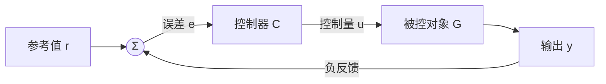
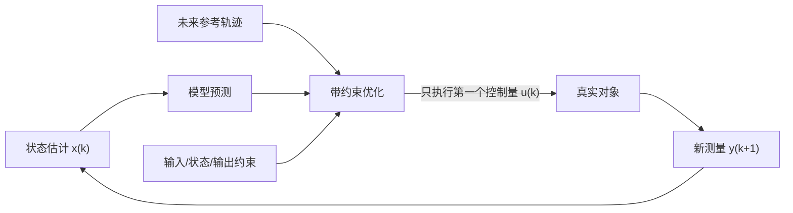

> **P、PI、PID** 根据当前误差、历史累计误差和误差变化趋势产生控制量；**MPC（Model Predictive Control）** 则利用系统模型预测未来，在满足约束的前提下在线求解一段最优控制序列。它们并不是简单的“低级控制器”和“高级控制器”，而是对模型依赖、计算量、约束处理能力和可解释性作出的不同取舍。

本文从同一个负反馈框架出发，依次推导 P、PI、PID 与线性 MPC。为了不让公式停留在符号层面，文中会持续回答四个问题：

1. 控制律为什么写成这种形式？
2. 参数改变后，闭环极点、稳态误差和动态响应如何变化？
3. 连续时间公式怎样变成可以运行在控制器上的离散算法？
4. PID 与 MPC 到底有什么联系，又应该怎样选择？

---

## 1. 控制问题的统一描述

### 1.1 被控对象、误差与负反馈

设参考输入为 $r(t)$，系统输出为 $y(t)$，控制输入为 $u(t)$，跟踪误差定义为

$$
e(t)=r(t)-y(t).
$$

控制器根据误差产生控制量，驱动被控对象改变输出：



对于线性时不变系统，令被控对象和控制器的传递函数分别为 $G(s)$ 与 $C(s)$。在零初始条件下，

$$
Y(s)=G(s)U(s),\qquad U(s)=C(s)E(s),
$$

又因为

$$
E(s)=R(s)-Y(s),
$$

所以

$$
Y(s)=G(s)C(s)\left[R(s)-Y(s)\right].
$$

整理得到最重要的闭环关系：

$$
\boxed{
\frac{Y(s)}{R(s)}
=
\frac{G(s)C(s)}{1+G(s)C(s)}
}
$$

同时，

$$
\boxed{
\frac{E(s)}{R(s)}
=
\frac{1}{1+G(s)C(s)}
}
$$

定义环路传递函数 $L(s)=G(s)C(s)$，则

$$
T(s)=\frac{L(s)}{1+L(s)}
$$

称为**互补灵敏度函数**，描述参考输入到输出的闭环响应；而

$$
S(s)=\frac{1}{1+L(s)}
$$

称为**灵敏度函数**，描述误差以及系统对某些扰动和模型不确定性的敏感程度。二者满足

$$
S(s)+T(s)=1.
$$

这说明反馈设计本质上是在不同频率上分配 $S$ 与 $T$：希望低频时 $|L|$ 大，从而减小跟踪误差和慢扰动；又不能让高频增益过大，否则会放大测量噪声、激发未建模动态，甚至破坏稳定性。

### 1.2 评价控制器的四个维度

一个控制器通常需要同时考虑：

- **稳定性**：受到小扰动后，状态是否会回到平衡点；
- **瞬态性能**：上升时间、超调量、调节时间是否满足要求；
- **稳态性能**：长期跟踪误差是否足够小；
- **工程约束与鲁棒性**：执行器饱和、速率限制、噪声、延迟和模型误差是否可接受。

只追求“响应更快”往往会提高控制增益；但增益越高，噪声放大、执行器饱和和稳定裕度下降的问题通常越明显。控制器设计始终是折中，而不是把某一个参数无限调大。

### 1.3 两个贯穿全文的对象模型

为了观察公式的物理意义，先引入两个常见模型。

一阶惯性对象：

$$
\tau \dot y(t)+y(t)=K u(t),
$$

其传递函数为

$$
G(s)=\frac{K}{\tau s+1},
$$

其中 $K$ 是静态增益，$\tau$ 是时间常数。

质量—阻尼—弹簧系统：

$$
m\ddot y(t)+b\dot y(t)+k y(t)=u(t),
$$

其传递函数为

$$
G(s)=\frac{1}{m s^2+b s+k}.
$$

前者适合解释 P 与 PI 的稳态误差，后者适合说明 PID 如何改变等效刚度、阻尼和闭环极点。

---

## 2. P 控制器：用当前误差立即纠偏

### 2.1 控制律

比例控制器（Proportional Controller）的时域形式为

$$
\boxed{u(t)=K_p e(t)}
$$

对应的传递函数为

$$
C_P(s)=K_p.
$$

当误差加倍时，控制作用也加倍。$K_p$ 越大，控制器对偏差越敏感。

### 2.2 一阶对象的完整闭环推导

将

$$
G(s)=\frac{K}{\tau s+1},\qquad C(s)=K_p
$$

代入闭环传递函数：

$$
\frac{Y(s)}{R(s)}
=
\frac{\frac{K K_p}{\tau s+1}}
{1+\frac{K K_p}{\tau s+1}}
=
\frac{K K_p}{\tau s+1+K K_p}.
$$

把分母标准化：

$$
\frac{Y(s)}{R(s)}
=
\frac{\frac{K K_p}{1+K K_p}}
{\frac{\tau}{1+K K_p}s+1}.
$$

因此闭环时间常数和闭环静态增益分别为

$$
\boxed{\tau_{\mathrm{cl}}=\frac{\tau}{1+K K_p}},
\qquad
\boxed{K_{\mathrm{cl}}=\frac{K K_p}{1+K K_p}}.
$$

当 $K>0$、$K_p>0$ 时，增大 $K_p$ 会减小时间常数，响应更快；但是闭环静态增益始终小于 $1$，因此单位阶跃跟踪存在稳态误差。

若 $r(t)=r_0$，则 $R(s)=r_0/s$。由终值定理，

$$
\begin{aligned}
e_{\mathrm{ss}}
&=\lim_{t\to\infty}e(t)\\
&=\lim_{s\to 0}sE(s)\\
&=\lim_{s\to 0}s
\frac{1}{1+K_pG(s)}
\frac{r_0}{s}\\
&=\frac{r_0}{1+K K_p}.
\end{aligned}
$$

于是

$$
\boxed{e_{\mathrm{ss}}=\frac{r_0}{1+K K_p}}.
$$

比例增益只能把误差压小，通常不能把它严格变为零。直观上，P 控制要维持一个非零控制量，就必须保留一个非零误差，因为 $u=K_p e$。

### 2.3 P 控制对机械系统的影响

对质量—阻尼—弹簧系统使用 P 控制：

$$
u=K_p(r-y).
$$

代回动力学方程：

$$
m\ddot y+b\dot y+k y=K_p(r-y),
$$

整理为

$$
m\ddot y+b\dot y+(k+K_p)y=K_p r.
$$

闭环特征多项式为

$$
m s^2+b s+(k+K_p)=0.
$$

与标准二阶系统

$$
s^2+2\zeta\omega_n s+\omega_n^2=0
$$

比较可得

$$
\omega_n=\sqrt{\frac{k+K_p}{m}},
\qquad
\zeta=\frac{b}{2\sqrt{m(k+K_p)}}.
$$

增大 $K_p$ 相当于增加“虚拟刚度”，使自然频率升高；但在 $b$ 不变时，阻尼比反而可能下降，因此响应更快的同时也可能产生更大超调和振荡。

### 2.4 P 控制器的适用边界

P 控制结构最简单，计算量极低，适合允许一定静差、对象本身含积分环节，或作为多环控制中的最内层快速控制器。它的主要局限是：

- 对普通零型对象不能消除阶跃稳态误差；
- 高增益会放大测量噪声；
- 面对饱和、延迟和高阶未建模动态时，过大的 $K_p$ 会降低稳定裕度。

---

## 3. PI 控制器：用误差积累消除静差

### 3.1 为什么积分能消除稳态误差

PI 控制律为

$$
\boxed{
u(t)=K_p e(t)+K_i\int_0^t e(\xi)\,d\xi
}
$$

其传递函数为

$$
\begin{aligned}
C_{PI}(s)
&=K_p+\frac{K_i}{s}\\
&=K_p\left(1+\frac{1}{T_i s}\right),
\end{aligned}
$$

其中

$$
K_i=\frac{K_p}{T_i}.
$$

积分项记录了误差的历史总和。只要误差长期不为零，积分量就会持续增长并继续改变控制输入；因此，在闭环稳定且执行器未长期饱和的前提下，系统会被推动到 $e_{\mathrm{ss}}=0$。

从频域看，PI 在开环中增加了一个位于原点的极点：

$$
L(s)=G(s)\frac{K_p s+K_i}{s}.
$$

对单位阶跃 $R(s)=1/s$，若闭环稳定且 $G(0)$ 有限非零，则

$$
\begin{aligned}
e_{\mathrm{ss}}
&=\lim_{s\to0}s
\frac{1}{1+G(s)\frac{K_p s+K_i}{s}}
\frac{1}{s}\\
&=\lim_{s\to0}
\frac{s}{s+G(s)(K_p s+K_i)}\\
&=0.
\end{aligned}
$$

积分环节提高了系统的“型别”，这正是 PI 能消除阶跃静差的根本原因。

### 3.2 一阶对象下的 PI 闭环与极点配置

把 PI 控制器和一阶对象连接：

$$
G(s)C(s)
=
\frac{K(K_p s+K_i)}
{s(\tau s+1)}.
$$

闭环传递函数为

$$
\frac{Y(s)}{R(s)}
=
\frac{K(K_p s+K_i)}
{\tau s^2+(1+K K_p)s+K K_i}.
$$

特征多项式是

$$
\tau s^2+(1+K K_p)s+K K_i.
$$

将其除以 $\tau$，再与期望二阶多项式

$$
s^2+2\zeta\omega_n s+\omega_n^2
$$

逐项比较：

$$
\frac{1+K K_p}{\tau}=2\zeta\omega_n,
\qquad
\frac{K K_i}{\tau}=\omega_n^2.
$$

于是得到一组直接的极点配置公式：

$$
\boxed{
K_p=\frac{2\zeta\omega_n\tau-1}{K}
}
$$

$$
\boxed{
K_i=\frac{\tau\omega_n^2}{K}
}
$$

这组公式揭示了参数作用：

- $K_p$ 主要影响闭环阻尼项和响应速度；
- $K_i$ 决定低频误差消除能力，同时提高闭环自然频率；
- $K_i$ 过大时，积分积累太快，容易带来超调和振荡。

PI 还引入了一个零点：

$$
s_z=-\frac{K_i}{K_p}=-\frac{1}{T_i}.
$$

这个零点同样会影响瞬态响应，所以仅配置分母极点并不能完全决定波形。

### 3.3 积分饱和：为什么“误差越积越多”

实际执行器总有上下限：

$$
u_{\min}\le u\le u_{\max}.
$$

如果控制器计算出的未饱和控制量 $v$ 超出范围，真实输入变为

$$
u=\operatorname{sat}(v).
$$

此时对象已经无法执行更大的控制作用，但积分器仍在累积误差。当系统终于接近目标时，积分项可能已经非常大，需要很长时间才能“退回”，从而造成严重超调和恢复迟缓。这就是 **integral windup（积分饱和或积分卷绕）**。

一种常用的反饱和方法是**回算（back-calculation）**。令 $z$ 表示积分项对控制量的贡献：

$$
v=K_p e+z,
$$

$$
\dot z=K_i e+\frac{u-v}{T_t},
$$

$$
u=\operatorname{sat}(v).
$$

未饱和时 $u=v$，回算项为零；饱和时 $u-v$ 会把积分状态拉回可实现的范围。$T_t$ 越小，回算越快，但过小也可能引入突变或噪声敏感性。

另一种方法是**条件积分**：只有在未饱和，或者当前误差有助于退出饱和时才更新积分器。

---

## 4. PID 控制器：兼顾现在、过去与变化趋势

### 4.1 三个环节各自做什么

理想并联式 PID 为

$$
\boxed{
u(t)
=K_p e(t)
+K_i\int_0^t e(\xi)\,d\xi
+K_d\frac{de(t)}{dt}
}
$$

其传递函数为

$$
\boxed{
C_{PID}(s)
=K_p+\frac{K_i}{s}+K_d s
}
$$

也常写成

$$
C_{PID}(s)
=K_p\left(
1+\frac{1}{T_i s}+T_d s
\right),
$$

其中

$$
K_i=\frac{K_p}{T_i},
\qquad
K_d=K_pT_d.
$$

三个环节可以直观理解为：

| 环节 | 使用的信息 | 主要作用 | 常见副作用 |
| :--- | :--- | :--- | :--- |
| P | 当前误差 | 快速纠偏，提高响应速度 | 静差、超调、噪声敏感 |
| I | 历史误差总和 | 消除静差，抑制恒值扰动 | 积分饱和、相位滞后 |
| D | 误差变化率 | 提前制动，增加阻尼 | 放大高频噪声、微分冲击 |

### 4.2 从机械系统推导 PID 如何配置闭环极点

对质量—阻尼—弹簧对象

$$
G(s)=\frac{1}{m s^2+b s+k}
$$

使用理想 PID：

$$
C(s)=\frac{K_d s^2+K_p s+K_i}{s}.
$$

闭环特征方程 $1+G(s)C(s)=0$ 可写为

$$
s(ms^2+bs+k)+(K_d s^2+K_p s+K_i)=0.
$$

整理得到

$$
\boxed{
m s^3+(b+K_d)s^2+(k+K_p)s+K_i=0
}
$$

这清楚展示了：

- $K_d$ 增加等效阻尼；
- $K_p$ 增加等效刚度；
- $K_i$ 增加一个用于消除静差的低频状态，同时使闭环阶数增加一阶。

若希望闭环包含一对主导二阶极点，以及一个更快的实极点 $-p_f$，可令期望特征多项式为

$$
m(s+p_f)(s^2+2\zeta\omega_n s+\omega_n^2).
$$

展开：

$$
\begin{aligned}
&m(s+p_f)(s^2+2\zeta\omega_n s+\omega_n^2)\\
={}&m s^3
+m(2\zeta\omega_n+p_f)s^2\\
&+m(\omega_n^2+2\zeta\omega_n p_f)s
+m p_f\omega_n^2.
\end{aligned}
$$

与实际闭环特征多项式逐项比较：

$$
\boxed{
K_d=m(2\zeta\omega_n+p_f)-b
}
$$

$$
\boxed{
K_p=m(\omega_n^2+2\zeta\omega_n p_f)-k
}
$$

$$
\boxed{
K_i=m p_f\omega_n^2
}
$$

这是一种基于模型和极点配置的 PID 整定方式。它比“凭感觉调参数”更有解释性，但前提是模型足够准确，并且算出的增益在执行器能力、采样频率和噪声条件下可实现。

### 4.3 为什么理想微分不能直接实现

理想微分项的频率响应为

$$
K_d(j\omega),
$$

其幅值

$$
|K_dj\omega|=K_d\omega
$$

随频率无限增大。真实传感器中的高频噪声会因此被大幅放大，而且理想微分器不是严格真有理系统，不能直接物理实现。

工程中通常采用一阶滤波微分：

$$
\boxed{
C_D(s)=\frac{K_d s}{1+T_f s}
}
$$

常令

$$
T_f=\frac{T_d}{N},
\qquad N\in[5,20].
$$

低频时 $T_f\omega\ll1$，它近似 $K_d s$；高频时增益趋近有限值 $K_d/T_f$，从而抑制噪声放大。

### 4.4 微分冲击与“对测量值微分”

若微分作用在误差上，

$$
\frac{de}{dt}=\frac{dr}{dt}-\frac{dy}{dt}.
$$

当设定值 $r$ 发生阶跃时，$dr/dt$ 理论上包含冲激，导致控制输出瞬间出现很大的尖峰，这称为 **derivative kick（微分冲击）**。

常见解决方法是只对测量值微分：

$$
u
=K_p(r-y)
+K_i\int(r-y)\,dt
-K_d\frac{dy}{dt}.
$$

还可以使用二自由度 PID，把设定值权重与扰动抑制分开：

$$
u
=K_p(\beta r-y)
+K_i\int(r-y)\,dt
-K_d\frac{dy}{dt},
$$

其中 $0\le\beta\le1$。减小 $\beta$ 往往能降低设定值阶跃造成的超调，但积分项仍以完整误差工作，因此稳态跟踪不受影响。

---

## 5. 从连续 PID 到离散控制程序

数字控制器每隔 $T_s$ 秒运行一次。设

$$
e[k]=r[k]-y[k].
$$

### 5.1 位置式 PID

采用矩形积分与后向差分：

$$
I[k]=I[k-1]+T_s e[k],
$$

$$
\dot e[k]\approx\frac{e[k]-e[k-1]}{T_s}.
$$

可得未滤波的位置式 PID：

$$
\boxed{
u[k]
=K_p e[k]
+K_i I[k]
+K_d\frac{e[k]-e[k-1]}{T_s}
}
$$

位置式直接计算控制量的绝对值，结构清晰，但切换模式或参数时需要处理积分状态，避免控制输出跳变。

### 5.2 增量式 PID

分别写出相邻两个时刻的位置式 PID，再计算

$$
\Delta u[k]=u[k]-u[k-1].
$$

消去积分和后得到

$$
\boxed{
\begin{aligned}
\Delta u[k]
={}&K_p(e[k]-e[k-1])\\
&+K_iT_s e[k]\\
&+\frac{K_d}{T_s}
\left(e[k]-2e[k-1]+e[k-2]\right).
\end{aligned}
}
$$

所以

$$
u[k]=u[k-1]+\Delta u[k].
$$

增量式适合控制器输出本身以增量形式下发的场景，也便于限制控制变化率；但它并不会自动解决饱和、噪声或积分饱和问题。

### 5.3 滤波微分的离散化

从

$$
\frac{D(s)}{E(s)}
=\frac{K_d s}{1+T_f s}
$$

出发，使用双线性变换

$$
s\approx\frac{2}{T_s}\frac{1-z^{-1}}{1+z^{-1}},
$$

可以得到

$$
\boxed{
d[k]
=
\frac{2T_f-T_s}{2T_f+T_s}d[k-1]
+
\frac{2K_d}{2T_f+T_s}
\left(e[k]-e[k-1]\right)
}
$$

若采用“对测量值微分”，只需把最后的误差差分替换为 $-(y[k]-y[k-1])$。

### 5.4 一个更接近工程实际的 PID 伪代码

```text
每个采样周期：
    e = reference - measurement

    p = kp * (beta * reference - measurement)

    # 微分作用在测量值上，并进行一阶低通滤波
    d = a * d_prev - b * (measurement - measurement_prev)

    v = p + integral + d              # 未饱和输出
    u = clamp(v, u_min, u_max)        # 执行器限幅

    # 回算式 anti-windup
    integral += ts * (ki * e + (u - v) / tracking_time)

    send_to_actuator(u)
```

真实系统还应处理传感器异常、控制周期抖动、手自动切换和输出速率限制。

### 5.5 采样周期怎样选择

常用经验是让采样频率至少达到目标闭环带宽的 $10$ 到 $20$ 倍。若目标闭环主导时间常数为 $\tau_{\mathrm{cl}}$，可先取

$$
T_s\le\frac{\tau_{\mathrm{cl}}}{10}
$$

作为起点，再根据计算延迟、噪声和执行器动态验证。采样越快并非总是越好：过快会让相邻样本的有效变化小于噪声，使差分微分更不稳定，也会增加计算和通信负担。

---

## 6. PID 参数如何整定

### 6.1 手工整定的安全顺序

一个实用的顺序是：

1. 暂时令 $K_i=0$、$K_d=0$，逐渐增大 $K_p$，获得足够快但不过度振荡的响应；
2. 逐渐增加 $K_i$，直到稳态误差在可接受时间内消失；
3. 若超调或振荡明显，再增加带滤波的 $K_d$ 提高阻尼；
4. 加入输出限幅、变化率限制和 anti-windup 后重新测试；
5. 分别进行设定值阶跃、负载扰动、噪声和模型变化测试。

### 6.2 模型法、频域法与继电自整定

- **模型与极点配置**：先辨识 $G(s)$，再根据目标 $\zeta$、$\omega_n$ 求增益，适合模型较可信的机电系统；
- **频域整形**：通过截止频率、相位裕度和增益裕度设计 $C(s)$，对鲁棒性解释更直接；
- **Ziegler–Nichols 等经验法**：利用临界增益或阶跃响应给出初值，简单但往往较激进；
- **继电反馈自整定**：用继电激励估计临界频率，再换算 PID 参数，常见于工业控制器。

经验公式更适合给出初始值，不应替代饱和、延迟、噪声和全工况验证。

---

## 7. MPC：把控制问题写成滚动优化

### 7.1 PID 做不到什么

PID 只通过误差及其局部历史构造控制量，它并不显式回答：

- 未来多个时刻的输出会怎样变化？
- 多个输入和多个输出之间如何协调？
- 如何保证输入、输入变化率和状态不越界？
- 已知未来参考轨迹时，怎样提前动作？

MPC 的基本思想是：

1. 用模型预测未来；
2. 在预测时域内优化一串控制动作；
3. 只执行其中第一个动作；
4. 下一时刻获取新测量，再重新预测和优化。



这称为**滚动时域（receding horizon）**策略。虽然每次优化得到整段序列，真正执行的只有第一项，因此下一次求解能利用最新反馈纠正模型误差和扰动。

### 7.2 离散状态空间模型

考虑离散线性系统：

$$
x_{k+1}=Ax_k+Bu_k,
$$

$$
y_k=Cx_k+Du_k.
$$

其中：

- $x_k\in\mathbb{R}^n$ 是状态；
- $u_k\in\mathbb{R}^m$ 是控制输入；
- $y_k\in\mathbb{R}^p$ 是输出。

为简化推导，以下令 $D=0$。若原模型为连续系统

$$
\dot x=A_cx+B_cu,
$$

并假设一个采样周期内输入保持不变，则精确零阶保持离散化为

$$
\boxed{A=e^{A_cT_s}}
$$

$$
\boxed{
B=\int_0^{T_s}e^{A_c\tau}B_c\,d\tau
}
$$

对于足够小的 $T_s$，也可用

$$
A\approx I+A_cT_s,\qquad B\approx B_cT_s
$$

作一阶近似，但正式设计通常应使用精确离散化。

---

## 8. MPC 预测方程的矩阵推导

### 8.1 从一步预测递推到多步预测

当前状态为 $x_k$。一步预测：

$$
x_{k+1|k}=Ax_k+Bu_{k|k}.
$$

两步预测：

$$
\begin{aligned}
x_{k+2|k}
&=Ax_{k+1|k}+Bu_{k+1|k}\\
&=A^2x_k+ABu_{k|k}+Bu_{k+1|k}.
\end{aligned}
$$

三步预测：

$$
\begin{aligned}
x_{k+3|k}
={}&A^3x_k+A^2Bu_{k|k}\\
&+ABu_{k+1|k}+Bu_{k+2|k}.
\end{aligned}
$$

归纳可得：

$$
\boxed{
x_{k+i|k}
=A^i x_k
+\sum_{j=0}^{i-1}A^{i-1-j}Bu_{k+j|k}
}
$$

### 8.2 堆叠成一个线性方程

取预测时域 $N$，定义

$$
X=
\begin{bmatrix}
x_{k+1|k}\\
x_{k+2|k}\\
\vdots\\
x_{k+N|k}
\end{bmatrix},
\qquad
U=
\begin{bmatrix}
u_{k|k}\\
u_{k+1|k}\\
\vdots\\
u_{k+N-1|k}
\end{bmatrix}.
$$

则

$$
\boxed{X=\Phi x_k+\Gamma U}
$$

其中

$$
\Phi=
\begin{bmatrix}
A\\
A^2\\
\vdots\\
A^N
\end{bmatrix},
$$

$$
\Gamma=
\begin{bmatrix}
B & 0 & \cdots & 0\\
AB & B & \cdots & 0\\
\vdots & \vdots & \ddots & \vdots\\
A^{N-1}B & A^{N-2}B & \cdots & B
\end{bmatrix}.
$$

再定义块对角矩阵

$$
\mathcal{C}
=\operatorname{diag}(C,C,\ldots,C),
$$

则预测输出

$$
Y=
\begin{bmatrix}
y_{k+1|k}\\
y_{k+2|k}\\
\vdots\\
y_{k+N|k}
\end{bmatrix}
=\mathcal{C}X.
$$

所以

$$
\boxed{
Y=Fx_k+GU
}
$$

其中

$$
F=\mathcal{C}\Phi,\qquad G=\mathcal{C}\Gamma.
$$

这一步非常关键：未来所有输出都被写成了当前状态 $x_k$ 与未来控制序列 $U$ 的线性函数。MPC 接下来只需选择最合适的 $U$。

---

## 9. MPC 代价函数与二次规划

### 9.1 跟踪误差与控制代价

令未来参考轨迹堆叠为

$$
R=
\begin{bmatrix}
r_{k+1}\\
r_{k+2}\\
\vdots\\
r_{k+N}
\end{bmatrix}.
$$

定义二次型代价函数：

$$
\boxed{
J
=(Y-R)^T\bar Q(Y-R)
+U^T\bar R U
}
$$

其中

$$
\bar Q=\operatorname{diag}(Q,\ldots,Q),
\qquad
\bar R=\operatorname{diag}(R_u,\ldots,R_u).
$$

注意这里的 $R$ 是参考轨迹向量，而 $R_u$ 是控制输入权重。

- $Q\succeq0$ 越大，越重视跟踪精度；
- $R_u\succ0$ 越大，越抑制过大的控制动作；
- 二者的相对大小决定“跟得紧”还是“动作柔和”。

将

$$
Y=Fx_k+GU
$$

代入：

$$
\begin{aligned}
J
={}&(Fx_k+GU-R)^T\bar Q(Fx_k+GU-R)\\
&+U^T\bar R U.
\end{aligned}
$$

展开与 $U$ 有关的项：

$$
\begin{aligned}
J
={}&U^T(G^T\bar QG+\bar R)U\\
&+2(Fx_k-R)^T\bar QG\,U\\
&+\text{与 }U\text{ 无关的常数项}.
\end{aligned}
$$

写成标准二次规划形式：

$$
\boxed{
\min_U\ \frac12 U^T H U+f^T U
}
$$

其中

$$
\boxed{
H=2(G^T\bar QG+\bar R)
}
$$

$$
\boxed{
f=2G^T\bar Q(Fx_k-R)
}
$$

由于 $\bar R\succ0$，通常有 $H\succ0$，因此该问题为凸二次规划，存在唯一全局最优解。

### 9.2 无约束时的解析解

若暂时没有约束，对 $J$ 求导：

$$
\frac{\partial J}{\partial U}=HU+f.
$$

令其为零：

$$
HU^*+f=0.
$$

因此

$$
\boxed{
U^*=-H^{-1}f
}
$$

或等价地

$$
\boxed{
U^*
=(G^T\bar QG+\bar R)^{-1}
G^T\bar Q(R-Fx_k)
}
$$

实际实现不应显式计算矩阵逆，而应求解线性方程。滚动时域控制只执行

$$
u_k=
\begin{bmatrix}
I&0&\cdots&0
\end{bmatrix}U^*.
$$

### 9.3 一个一步标量 MPC 的直观例子

考虑标量系统

$$
x_{k+1}=a x_k+b u_k,
$$

一步代价为

$$
J=q(x_{k+1}-r)^2+r_u u_k^2.
$$

代入模型：

$$
J=q(a x_k+b u_k-r)^2+r_u u_k^2.
$$

对 $u_k$ 求导：

$$
\frac{dJ}{du_k}
=2qb(a x_k+b u_k-r)+2r_u u_k.
$$

令导数为零：

$$
(qb^2+r_u)u_k=qb(r-a x_k).
$$

于是

$$
\boxed{
u_k^*
=\frac{qb}{qb^2+r_u}(r-a x_k)
}
$$

它看起来像比例反馈，但比例系数并不是凭经验指定，而是由模型参数 $a,b$ 和性能权重 $q,r_u$ 共同决定。预测时域变长后，MPC 还会把更远未来的影响纳入当前决策。

---

## 10. MPC 如何显式处理约束

### 10.1 输入约束

例如执行器幅值限制：

$$
u_{\min}\le u_{k+i|k}\le u_{\max}.
$$

堆叠后可写成

$$
\begin{bmatrix}
I\\
-I
\end{bmatrix}U
\le
\begin{bmatrix}
U_{\max}\\
-U_{\min}
\end{bmatrix}.
$$

### 10.2 状态与输出约束

由

$$
X=\Phi x_k+\Gamma U
$$

可将

$$
X_{\min}\le X\le X_{\max}
$$

改写为关于 $U$ 的线性不等式：

$$
\Gamma U\le X_{\max}-\Phi x_k,
$$

$$
-\Gamma U\le -X_{\min}+\Phi x_k.
$$

输出约束同理：

$$
Y_{\min}\le Fx_k+GU\le Y_{\max}.
$$

最终得到标准形式：

$$
\boxed{
\begin{aligned}
\min_U\quad
&\frac12U^THU+f^TU\\
\text{s.t.}\quad
&A_{\mathrm{ineq}}U\le b_{\mathrm{ineq}}.
\end{aligned}
}
$$

这正是线性 MPC 常在线求解的凸二次规划（QP）。

### 10.3 为什么不能把无约束解直接截断

对单输入一步问题，无约束最优解在只有幅值限制时可以写成

$$
u_k^*
=\operatorname{clip}
\left(
\frac{qb}{qb^2+r_u}(r-a x_k),
u_{\min},
u_{\max}
\right).
$$

但在多步、多变量以及含状态约束时，各时刻和各通道相互耦合。逐元素截断通常不再是最优解，甚至可能导致未来状态越界，因此需要真正的约束优化器。

### 10.4 软约束与不可行问题

如果硬约束彼此冲突，QP 可能无可行解。例如当前状态已经越界，而模型和输入能力无法在下一步立即恢复。常见做法是引入松弛变量 $\epsilon\ge0$：

$$
y_{\min}-\epsilon
\le y
\le y_{\max}+\epsilon,
$$

并在代价中加入高权重惩罚：

$$
J_{\mathrm{soft}}
=J+\rho\|\epsilon\|_1
\quad\text{或}\quad
J+\rho\|\epsilon\|_2^2.
$$

安全相关的物理限制通常保留为硬约束；舒适性、经济性或一般跟踪指标可以设计成软约束。

---

## 11. 以控制增量为优化变量

工程上通常还要限制动作变化率：

$$
\Delta u_k=u_k-u_{k-1}.
$$

可把控制增量作为新的优化变量。定义增广状态

$$
z_k=
\begin{bmatrix}
x_k\\
u_{k-1}
\end{bmatrix}.
$$

因为

$$
u_k=u_{k-1}+\Delta u_k,
$$

所以

$$
\begin{aligned}
x_{k+1}
&=Ax_k+B(u_{k-1}+\Delta u_k),\\
u_k
&=u_{k-1}+\Delta u_k.
\end{aligned}
$$

增广模型为

$$
\boxed{
z_{k+1}
=
\underbrace{
\begin{bmatrix}
A&B\\
0&I
\end{bmatrix}
}_{A_a}
z_k
+
\underbrace{
\begin{bmatrix}
B\\
I
\end{bmatrix}
}_{B_a}
\Delta u_k
}
$$

输出方程为

$$
\boxed{
y_k=
\begin{bmatrix}
C&0
\end{bmatrix}z_k
}
$$

随后只需对 $(A_a,B_a,C_a)$ 重复前面的预测矩阵推导。这样便能直接在代价中惩罚 $\Delta u$，并施加

$$
\Delta u_{\min}\le\Delta u\le\Delta u_{\max}
$$

的变化率约束。

---

## 12. MPC 的状态估计、无静差与稳定性

### 12.1 状态不可测时需要观测器

MPC 预测依赖 $x_k$，但真实系统往往只能测到部分输出 $y_k$。可使用 Luenberger 观测器或 Kalman 滤波器：

预测：

$$
\hat x_{k|k-1}
=A\hat x_{k-1|k-1}+Bu_{k-1},
$$

校正：

$$
\hat x_{k|k}
=\hat x_{k|k-1}
+L\left(y_k-C\hat x_{k|k-1}\right).
$$

然后用 $\hat x_{k|k}$ 代替未知的 $x_k$ 进行优化。估计器设计不当时，即使优化器本身工作正常，闭环也可能表现很差。

### 12.2 为什么基本 MPC 也可能有静差

模型与真实对象之间总会存在偏差。即使代价函数一直惩罚跟踪误差，若预测模型不知道恒值扰动的存在，系统仍可能出现稳态偏差。

一种常见的 offset-free MPC 方法是增广常值扰动：

$$
x_{k+1}=Ax_k+Bu_k+B_d d_k,
$$

$$
d_{k+1}=d_k,
$$

$$
y_k=Cx_k+C_d d_k.
$$

通过观测器同时估计 $x_k$ 与 $d_k$，再在目标计算和预测中补偿 $\hat d_k$，可以实现对恒值扰动和模型偏差的无静差跟踪。这在思想上与 PID 的积分作用相近：二者都引入了对持续偏差的“记忆”，只是数学实现不同。

### 12.3 终端代价与终端集合

有限预测时域可能让控制器只顾眼前。标准稳定性设计常加入终端代价

$$
V_f(x_{k+N})=x_{k+N}^TPx_{k+N}
$$

以及终端约束

$$
x_{k+N}\in\mathcal X_f.
$$

若 $P$ 与终端控制律根据 LQR 等方法选取，$\mathcal X_f$ 又是一个受约束不变集，则可在适当条件下证明递归可行性与闭环稳定性。

“用了 MPC 就天然稳定”并不成立。稳定性取决于模型、时域、权重、约束、终端设计、状态估计和求解器行为。

---

## 13. PID 与 MPC 的联系

### 13.1 它们都是反馈控制

两者都读取当前系统信息并反复修正控制输入。MPC 虽然依赖模型和前馈预测，但每个采样周期都会重新求解，因此仍然是闭环反馈控制。

### 13.2 无约束线性 MPC 与状态反馈

在线性模型、二次代价且没有约束时，MPC 的最优控制律可写成

$$
u_k=K_xx_k+K_rr_{\mathrm{future}}.
$$

它本质上是状态反馈加参考前馈。当预测时域趋于无穷、代价选择适当且参考为零时，其形式与离散 LQR 密切相关。

### 13.3 PID 可以看成低阶动态补偿器

PID 不显式滚动预测，但三个环节分别编码了：

- P：当前偏差；
- I：低频与历史偏差；
- D：局部变化趋势。

MPC 则使用模型把这种“趋势判断”扩展到多个未来时刻，并在所有通道和约束之间进行统一权衡。

### 13.4 二者可以组合

工业系统中常见分层结构：

- 内环用 PI/PID 控制电流、速度、压力等快速动态；
- 外环 MPC 根据慢时标模型协调多变量、轨迹与约束；
- MPC 输出内环设定值，而不是直接驱动最底层执行器。

这能兼顾 PID 的高速、可靠与 MPC 的预测、协调和约束处理能力。

---

## 14. P、PI、PID 与 MPC 对比

| 维度 | P | PI | PID | 线性 MPC |
| :--- | :--- | :--- | :--- | :--- |
| 核心信息 | 当前误差 | 当前 + 累积误差 | 当前 + 累积 + 变化率 | 状态、模型、未来参考与约束 |
| 模型依赖 | 低 | 低 | 低到中 | 高 |
| 消除阶跃静差 | 通常不能 | 能 | 能 | 需目标/扰动增广等设计 |
| 预测能力 | 无 | 无 | 仅局部趋势 | 显式多步预测 |
| 约束处理 | 限幅后补偿 | 需 anti-windup | 需 anti-windup | 优化问题内显式处理 |
| 多变量耦合 | 不擅长 | 不擅长 | 需要解耦或多回路 | 原生支持 MIMO |
| 在线计算量 | 极低 | 极低 | 低 | 中到高 |
| 调试与维护 | 最简单 | 简单 | 中等 | 较复杂 |
| 典型场景 | 简单内环 | 温度、流量、速度 | 伺服、运动与过程控制 | 多变量过程、轨迹、能源与约束控制 |

简单地说：

- 只需要快速纠偏且允许静差：先考虑 P；
- 需要消除静差、对象不宜微分：PI 往往是工业过程的首选；
- 需要更好的瞬态阻尼，测量质量也足够：考虑带滤波微分的 PID；
- 强约束、多输入多输出、未来参考已知或变量耦合明显：考虑 MPC。

---

## 15. 常见误区

### 15.1 “增益越大，控制效果越好”

增益提高会加快响应并减小某些误差，但也会降低鲁棒裕度、放大噪声和增加饱和风险。响应速度受对象带宽、执行器能力、采样和延迟共同限制。

### 15.2 “有 D 就一定比 PI 好”

微分需要较高质量的测量，并且必须滤波。温度、流量等慢过程经常使用 PI，因为 D 项带来的噪声和维护成本可能超过收益。

### 15.3 “限幅之后就不会有积分问题”

限幅只保护执行器，不会阻止积分器继续累积。必须配合条件积分、回算或其他 anti-windup 设计。

### 15.4 “MPC 能自动解决所有控制问题”

MPC 的优化结果只在模型、估计、约束和代价函数所表达的世界里最优。模型严重错误、状态估计漂移、时延漏建模或求解超时，都会破坏实际效果。

### 15.5 “预测时域越长越好”

更长时域能看得更远，但也会增加计算量；当远期预测受模型误差主导时，继续增加时域收益很小。预测时域通常只需覆盖主要动态和关键约束发生的时间范围。

---

## 16. 一套实际的控制器设计流程

无论选择 PID 还是 MPC，都可以遵循以下流程：

1. **明确目标**：跟踪、调节、扰动抑制、能耗还是约束优先；
2. **确定输入输出与边界**：列出幅值、速率、安全和舒适性约束；
3. **建立或辨识模型**：至少理解增益、时间常数、延迟、耦合和工作点变化；
4. **选择结构**：从满足需求的最简单控制器开始；
5. **离线分析**：检查极点、频率响应、稳态误差、可控性和可观性；
6. **仿真压力测试**：加入噪声、延迟、饱和、参数摄动和外部扰动；
7. **安全上线**：先小增益、窄工况、输出限幅，并保留降级控制器；
8. **记录与迭代**：根据真实数据重新辨识模型和调整参数。

对于 MPC，还要额外验证：

- QP 在最坏情况下能否在一个采样周期内完成；
- 无可行解或求解器超时时如何降级；
- 状态估计是否可观且收敛；
- 约束是硬约束还是软约束；
- 是否需要终端代价、终端集合与 offset-free 设计。

---

## 17. 总结

P、PI、PID 和 MPC 可以放在同一条演进路径上理解：

1. **P** 用当前误差产生恢复作用，简单快速，但通常保留静差；
2. **PI** 增加误差记忆，在闭环稳定时消除阶跃静差，但必须处理积分饱和；
3. **PID** 再加入趋势阻尼，能够塑造更丰富的动态，但微分必须滤波，且常对测量值而非设定值微分；
4. **MPC** 用模型把当前决策传播到未来，把跟踪、控制代价和约束统一写成在线优化问题，并通过滚动求解形成反馈。

真正决定控制效果的不是名称，而是：对象模型是否被正确理解，闭环稳定性是否经过分析，离散实现是否考虑噪声与饱和，以及控制器是否在真实约束下经过验证。

---

## 参考资料

- Karl J. Åström, Richard M. Murray, *Feedback Systems: An Introduction for Scientists and Engineers*.
- Karl J. Åström, Tore Hägglund, *Advanced PID Control*.
- James B. Rawlings, David Q. Mayne, Moritz M. Diehl, *Model Predictive Control: Theory, Computation, and Design*.
- Eduardo F. Camacho, Carlos Bordons, *Model Predictive Control*.
- Jan M. Maciejowski, *Predictive Control with Constraints*.
