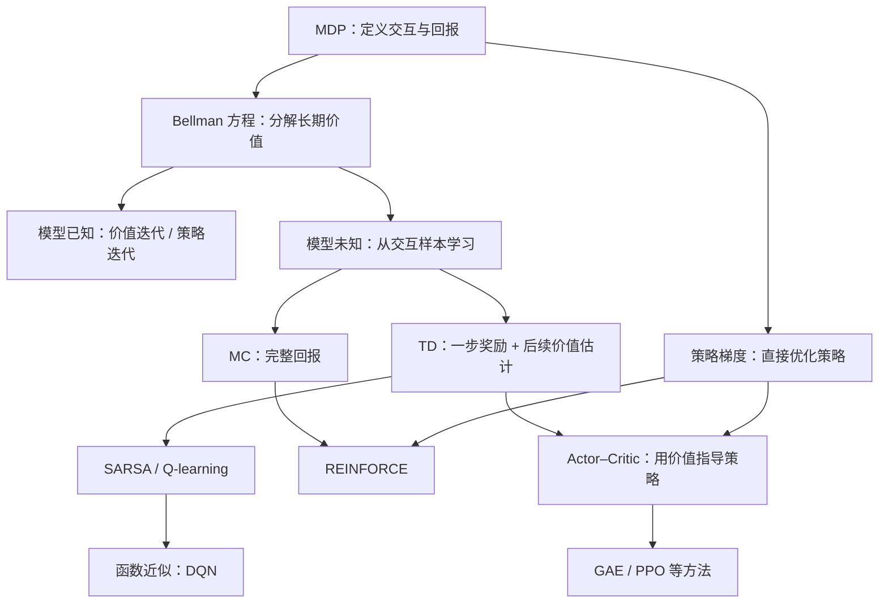
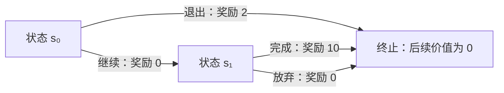

> 强化学习研究的是：**智能体怎样通过与环境交互，学会使长期期望回报尽可能大的决策规则？** Bellman 方程描述价值的递归关系，MC 与 TD 从经验中估计价值，策略梯度直接改进决策规则，Actor–Critic 则把价值学习与策略优化结合起来。

眼前奖励高的动作，未必带来更好的最终结果。例如，机器人立即松开物体可以减少用力，但只有继续搬运并准确放置，才能完成任务。强化学习的难点在于：动作会改变后续状态，奖励可能延迟出现，环境规律也往往未知。

本文以一个可以手算的两步决策任务为例，保留主要公式的推导，并围绕三个问题展开：**优化什么、如何评价、怎样改进？** 阅读需要概率期望、矩阵运算与梯度的基础，不要求提前了解深度强化学习算法。

## 阅读路线与符号约定

第 1—3 节建立概念与 Bellman 递归，第 4—7 节讨论价值怎样被计算和学习，第 8—9 节转向策略优化。初读时可以先跳过矩阵求解、压缩映射证明、重要性采样与资格迹；读懂两步任务后，再回来看这些细节。第 10 节提供算法对照，便于复习。

| 符号 | 本文约定 |
| --- | --- |
| $$S_t,A_t,R_{t+1}$$ | 时刻 $$t$$ 的状态、动作，以及执行动作后收到的奖励；小写 $$s,a$$ 表示具体取值 |
| $$G_t$$ | 从时刻 $$t$$ 开始的累计折扣奖励，即回报 |
| $$\pi,b$$ | 目标策略、生成数据的行为策略 |
| $$V^\pi,Q^\pi,A^\pi$$ | 策略 $$\pi$$ 对应的真实状态价值、动作价值、优势函数 |
| $$V,Q,V_w,Q_w$$ | 正在学习的价值估计；$$w$$ 为价值函数参数 |
| $$\theta,\alpha,\gamma,\lambda$$ | 策略参数、学习率、折扣因子、多步目标的混合参数 |

---

## 1. 基本概念：从交互到长期回报

### 1.1 智能体与环境的交互

在时刻 $$t$$，智能体观察状态 $$S_t$$，根据策略选择动作 $$A_t$$。环境随后返回奖励 $$R_{t+1}$$，并转移到状态 $$S_{t+1}$$：

$$
S_t
\xrightarrow[\text{策略 }\pi]{A_t}
(R_{t+1},S_{t+1}).
$$

连续交互形成一条轨迹：

$$
S_0,A_0,R_1,S_1,A_1,R_2,\ldots
$$

与通常的监督学习不同，环境一般不会告诉智能体“这个状态下正确动作是什么”，而只提供执行动作后的结果和奖励。因此，智能体需要自己解决**探索**与**信用分配**问题：尝试哪些行为，以及最终收益应该归功于哪些早期决策。 [Spinning Up：强化学习概念][1]

### 1.2 马尔可夫决策过程：MDP

先从有限、完全可观测、折扣型马尔可夫决策过程（Markov Decision Process，MDP）出发：

$$
\mathcal M=(\mathcal S,\mathcal A,P,r,\gamma,\rho_0).
$$

| 符号                | 含义                                               |
| ----------------- | ------------------------------------------------ |
| $$\mathcal S$$    | 状态集合                                             |
| $$\mathcal A$$    | 动作集合；可行动作也可以随状态变化                                |
| $$P(s'\mid s,a)$$ | 在状态 $$s$$ 执行动作 $$a$$，下一状态为 $$s'$$ 的概率            |
| $$r(s,a)$$        | 即时奖励的条件期望：$$\mathbb E[R_{t+1}\mid S_t=s,A_t=a]$$ |
| $$\gamma$$        | 折扣因子，默认 $$0\leq\gamma<1$$                        |
| $$\rho_0(s)$$     | 初始状态分布                                           |

**马尔可夫性**意味着，给定当前状态和动作，预测下一状态与奖励时不再需要更早的历史：

$$
\Pr(S_{t+1},R_{t+1}\mid S_0,A_0,\ldots,S_t,A_t)
=
\Pr(S_{t+1},R_{t+1}\mid S_t,A_t).
$$

它不是说“历史不重要”，而是说：

> **当前状态已经包含了预测未来所需的历史信息。**

例如，预测一个运动物体的下一位置时，只有当前位置通常不够，还需要速度。如果输入只是单张图像，它可能只是一个不完整的观测，而不是满足马尔可夫性的状态。 [David Silver：MDP][2]

除特别说明外，假设奖励有界、$$0\leq\gamma<1$$，策略只依赖当前状态且不随时间变化。后文的表格型收敛结论基于有限 MDP；扩展到连续状态或动作时，对应的求和需要改为积分，相关结论也需要重新检查条件。

回合任务可以取 $$\gamma=1$$，但需要另外保证回报可积等条件。若任务有内在的固定截止时间，剩余时间也应纳入状态，否则同一物理状态在不同剩余时间下可能具有不同价值。

### 1.3 策略、奖励与回报

**策略**描述智能体如何选择动作。

随机策略为：

$$
\pi(a\mid s)=\Pr(A_t=a\mid S_t=s),
\qquad
\sum_a\pi(a\mid s)=1.
$$

确定性策略则可以写成：

$$
A_t=\mu(S_t).
$$

需要特别区分**奖励 reward**与**回报 return**。

奖励 $$R_{t+1}$$ 是执行一步动作后得到的反馈；回报 $$G_t$$ 是从当前时刻开始的累计折扣奖励：

$$
G_t
=
\sum_{k=0}^{\infty}\gamma^kR_{t+k+1}.
$$

因此：

$$
\boxed{G_t=R_{t+1}+\gamma G_{t+1}}.
$$

这个简单的递归关系，就是 Bellman 方程的起点。

当 $$\gamma=0$$ 时，只关心下一次奖励；当 $$\gamma$$ 接近 $$1$$ 时，较远的奖励也有较大影响。若奖励绝对值不超过 $$R_{\max}$$，则：

$$
|G_t|
\leq
\frac{R_{\max}}{1-\gamma}.
$$

强化学习通常优化：

$$
\boxed{
J(\pi)
=
\mathbb E_\pi[G_0]
=
\mathbb E_{S_0\sim\rho_0}[V^\pi(S_0)]
}.
$$

注意目标是**期望回报**，不是让每一次交互都获得最大收益。

对于终止状态 $$s_{\mathrm{term}}$$，我们约定：

$$
V^\pi(s_{\mathrm{term}})=0.
$$

到达终止状态时获得的最后一次奖励，仍然计入回报；置零的是“终止之后的未来价值”。

### 1.4 状态价值、动作价值与优势函数

**状态价值函数**：

$$
\boxed{
V^\pi(s)
=
\mathbb E_\pi[G_t\mid S_t=s]
}.
$$

它回答：

> 从状态 $$s$$ 出发，此后遵循策略 $$\pi$$，累计折扣回报的期望是多少？

**动作价值函数**：

$$
\boxed{
Q^\pi(s,a)
=
\mathbb E_\pi[G_t\mid S_t=s,A_t=a]
}.
$$

它回答：

> 从状态 $$s$$ 出发，第一步指定执行动作 $$a$$，之后遵循策略 $$\pi$$，累计折扣回报的期望是多少？

两者满足：

$$
\boxed{
V^\pi(s)=\sum_a\pi(a\mid s)Q^\pi(s,a)
}.
$$

也就是说，状态价值是该状态下各动作价值按照策略概率的加权平均。

**优势函数**定义为：

$$
\boxed{
A^\pi(s,a)=Q^\pi(s,a)-V^\pi(s)
}.
$$

优势为正，表示这个动作比当前策略的平均选择更好；优势为负，表示更差。因此：

$$
\sum_a\pi(a\mid s)A^\pi(s,a)=0.
$$

价值衡量绝对收益，优势衡量相对收益；后者会成为策略梯度和 Actor–Critic 的关键。

### 1.5 几组容易混淆的分类

**预测与控制。** 预测是给定策略 $$\pi$$，估计 $$V^\pi$$ 或 $$Q^\pi$$；控制则是寻找更好的策略，最终逼近最优策略。

**基于模型与无模型。** 这里的“模型”特指环境的转移和奖励模型。利用 $$P,r$$ 进行计算属于基于模型的方法；直接利用交互样本学习价值或策略，而不显式学习环境模型，属于无模型方法。一个方法使用了神经网络，并不意味着它是基于模型的方法。

**同策略与异策略。** 产生数据的策略叫行为策略 $$b$$，正在被评估或优化的策略叫目标策略 $$\pi$$。两者相同是同策略（on-policy），允许两者不同是异策略（off-policy）。因此，异策略的关键是**数据来源策略与学习目标策略的关系**，而不是数据是否存放在一个离线文件中。 [David Silver：无模型控制][3]

### 1.6 一个贯穿全文的小例子

构造一个只有两个非终止状态的任务，取 $$\gamma=0.9$$。

所有转移都是确定性的。后续评估固定策略时，默认在每个非终止状态以相同概率选择两个动作；讨论最优策略时，再比较哪种选择更好。

只看即时奖励，在 $$s_0$$ 会倾向于退出。但从长期收益看，继续之后再完成，可以获得：

$$
0+0.9\times10=9>2.
$$

下面用这个例子说明各方法到底在计算什么。

---

## 2. Bellman 期望方程：评价一个给定策略

**Bellman 期望方程**回答：

> **策略已经确定时，各状态和动作的价值应当满足怎样的递归关系？**

### 2.1 从回报递归推导状态价值方程

根据定义：

$$
V^\pi(s)
=
\mathbb E_\pi[G_t\mid S_t=s].
$$

代入 $$G_t=R_{t+1}+\gamma G_{t+1}$$：

$$
V^\pi(s)
=
\mathbb E_\pi[
R_{t+1}+\gamma G_{t+1}
\mid S_t=s
].
$$

给定下一状态 $$S_{t+1}$$，后续回报的期望就是 $$V^\pi(S_{t+1})$$，所以：

$$
\boxed{
V^\pi(s)
=
\mathbb E_\pi[
R_{t+1}+\gamma V^\pi(S_{t+1})
\mid S_t=s
]
}.
$$

将对动作和下一状态的期望展开：

$$
\boxed{
V^\pi(s)
=
\sum_a\pi(a\mid s)
\left[
r(s,a)
+
\gamma\sum_{s'}P(s'\mid s,a)V^\pi(s')
\right]
}.
$$

这就是状态价值函数的 Bellman 期望方程。外层对策略可能选择的动作求平均，内层对环境可能转移到的状态求平均。 [David Silver：MDP][2]

### 2.2 动作价值的 Bellman 方程

对于 $$Q^\pi(s,a)$$，第一步动作已经指定，因此不需要再对当前动作求平均：

$$
Q^\pi(s,a)
=
r(s,a)
+
\gamma\sum_{s'}P(s'\mid s,a)V^\pi(s').
$$

代入 $$V^\pi(s')=\sum_{a'}\pi(a'\mid s')Q^\pi(s',a')$$，得到：

$$
\boxed{
Q^\pi(s,a)
=
r(s,a)
+
\gamma
\sum_{s'}P(s'\mid s,a)
\sum_{a'}\pi(a'\mid s')Q^\pi(s',a')
}.
$$

这里的逻辑是：

**当前动作固定，下一状态由环境决定，下一动作及之后的行为由策略 $$\pi$$ 决定。**

### 2.3 在例子中计算

假设策略在每个状态都以 $$1/2$$ 的概率选择两个动作。

在 $$s_1$$：

$$
V^\pi(s_1)
=
\frac12\times10+\frac12\times0
=
5.
$$

在 $$s_0$$：

$$
V^\pi(s_0)
=
\frac12\times2
+
\frac12(0+0.9\times5)
=
3.25.
$$

两个动作的价值分别为：

$$
Q^\pi(s_0,\text{退出})=2,
$$

$$
Q^\pi(s_0,\text{继续})=0+0.9\times5=4.5.
$$

注意，继续的价值不是 $$9$$，因为 $$Q^\pi$$ 假设之后仍然执行当前随机策略，而不是自动改成最优策略。

### 2.4 矩阵形式：固定策略的评估是线性问题

定义：

$$
r^\pi(s)=\sum_a\pi(a\mid s)r(s,a),
$$

$$
P^\pi(s,s')
=
\sum_a\pi(a\mid s)P(s'\mid s,a).
$$

把所有状态价值组成向量，可得：

$$
V^\pi=r^\pi+\gamma P^\pi V^\pi.
$$

因此：

$$
\boxed{
V^\pi=(I-\gamma P^\pi)^{-1}r^\pi
}.
$$

在有限折扣型 MDP 中，这个逆矩阵存在。它说明：如果环境模型已知，固定策略的价值可以通过解线性方程组获得，也可以通过迭代获得。

**Bellman 方程本身是一条自洽关系，不是一个完整学习算法。** 后面的算法会进一步回答：模型未知时怎么办，状态太多时怎么办，如何通过有限样本求近似解？

---

## 3. Bellman 最优方程：寻找最佳策略

### 3.1 最优价值函数

定义：

$$
V^*(s)=\max_\pi V^\pi(s),
\qquad
Q^*(s,a)=\max_\pi Q^\pi(s,a).
$$

在有限、完全可观测的折扣型 MDP 中，存在一个同时对所有状态最优的确定性平稳策略。最优价值函数是唯一的，但最优策略未必唯一，因为多个动作可能具有相同的最优价值。 [David Silver：MDP][2]

### 3.2 Bellman 最优方程

固定策略时，要按 $$\pi$$ 对动作求平均；寻找最优策略时，要选择价值最大的动作：

$$
\boxed{
V^*(s)
=
\max_a
\left[
r(s,a)
+
\gamma\sum_{s'}P(s'\mid s,a)V^*(s')
\right]
}.
$$

相应地：

$$
\boxed{
Q^*(s,a)
=
r(s,a)
+
\gamma\sum_{s'}P(s'\mid s,a)
\max_{a'}Q^*(s',a')
}.
$$

得到 $$Q^*$$ 后，最优策略可以直接提取：

$$
\boxed{
\pi^*(s)\in\arg\max_aQ^*(s,a)
}.
$$

这不是对即时奖励贪心，而是对**包含未来收益的动作价值**贪心。 [Spinning Up：强化学习概念][1]

还有一个重要的顺序问题：当前动作是在知道下一状态之前选择的，所以 $$V^*$$ 方程中，当前动作的 $$\max$$ 位于对下一状态的期望外面。不能把它随意移动到期望里面，否则等于允许智能体预先知道环境的随机结果。

### 3.3 在例子中计算

在 $$s_1$$：

$$
V^*(s_1)=\max(10,0)=10.
$$

在 $$s_0$$：

$$
V^*(s_0)=\max(2,0+0.9\times10)=9.
$$

因此，最优策略是在 $$s_0$$ 继续，在 $$s_1$$ 完成。

对比：

$$
V^\pi(s_0)=3.25,
\qquad
V^*(s_0)=9.
$$

前者评价某个具体策略，后者描述所有策略中能达到的最佳表现。

### 3.4 为什么反复应用 Bellman 更新会收敛？

定义 Bellman 最优算子：

$$
(\mathcal T^*V)(s)
=
\max_a
\left[
r(s,a)+\gamma\sum_{s'}P(s'\mid s,a)V(s')
\right].
$$

它满足：

$$
\boxed{
\|\mathcal T^*U-\mathcal T^*V\|_\infty
\leq
\gamma\|U-V\|_\infty
}.
$$

其中：

$$
\|U-V\|_\infty=\max_s|U(s)-V(s)|.
$$

这个不等式可以从两个事实理解：概率加权平均不会放大最大误差，而两个“最大值”之差不超过各候选值的最大差异；再乘上 $$\gamma<1$$，误差就被压缩了。

因此，$$\mathcal T^*$$ 是压缩映射，具有唯一不动点 $$V^*$$，反复应用它会收敛到 $$V^*$$。固定策略的 Bellman 算子 $$\mathcal T^\pi$$ 也具有类似性质。 [David Silver：动态规划][4]

---

## 4. 动态规划：价值迭代与策略迭代

这两种方法属于动态规划。先假设环境模型 $$P,r$$ 已知，从而可以直接计算 Bellman 方程中的期望。

### 4.1 价值迭代：反复应用最优 Bellman 更新

价值迭代直接反复应用 Bellman 最优算子：

$$
\boxed{
V_{k+1}(s)
=
\max_a
\left[
r(s,a)+
\gamma\sum_{s'}P(s'\mid s,a)V_k(s')
\right]
}.
$$

基本过程是：初始化 $$V_0$$，更新所有状态的价值，反复执行，直到变化足够小，最后依据价值函数提取贪心策略。

在例子中，令所有初始价值为零，并采用同步更新：

| 迭代次数    | $$V_k(s_0)$$ | $$V_k(s_1)$$ |
| ------- | -----------: | -----------: |
| $$k=0$$ |            0 |            0 |
| $$k=1$$ |            2 |           10 |
| $$k=2$$ |            9 |           10 |

第一轮时，$$s_0$$ 尚未利用 $$s_1$$ 的新价值，只看到了退出所得的 $$2$$。第二轮时，$$s_1$$ 的价值向前传播，$$s_0$$ 才变成 $$9$$。

因此，价值迭代可以理解为：

> **把未来的高价值通过状态转移关系逐步向前传播。**

由压缩性：

$$
\|V_k-V^*\|_\infty
\leq
\gamma^k\|V_0-V^*\|_\infty.
$$

如果某个当前估计 $$V$$ 的 Bellman 残差满足：

$$
\|\mathcal T^*V-V\|_\infty\leq\varepsilon,
$$

那么：

$$
\|V-V^*\|_\infty
\leq
\frac{\varepsilon}{1-\gamma}.
$$

这也说明，$$\gamma$$ 越接近 $$1$$，同样大小的更新残差对应的价值误差上界可能越大。 [David Silver：动态规划][4]

### 4.2 策略迭代：交替评估与改进

策略迭代明确区分两个阶段。

**策略评估：** 固定当前策略 $$\pi_k$$，求出 $$V^{\pi_k}$$。可以解线性方程组，也可以反复执行：

$$
V_{j+1}(s)
=
\sum_a\pi_k(a\mid s)
\left[
r(s,a)+\gamma\sum_{s'}P(s'\mid s,a)V_j(s')
\right].
$$

这里的 $$j$$ 是评估当前策略时的内部迭代次数。

**策略改进：** 根据评估结果选择更好的动作：

$$
\boxed{
\pi_{k+1}(s)
\in
\arg\max_a
\left[
r(s,a)+
\gamma\sum_{s'}P(s'\mid s,a)V^{\pi_k}(s')
\right]
}.
$$

随后评估新策略，再次改进，直到策略不再变化。

### 4.3 为什么这样的策略改进不会变差？

因为新策略对 $$V^{\pi_k}$$ 是贪心的：

$$
Q^{\pi_k}(s,\pi_{k+1}(s))
\geq
V^{\pi_k}(s).
$$

左边的意思是：第一步改用新策略动作，之后仍按旧策略行动，其价值至少不差。

如果随后每一步都改用同样的改进规则，也不会更差。通过 Bellman 算子的单调性与收敛性，可以得到：

$$
\boxed{
V^{\pi_{k+1}}(s)\geq V^{\pi_k}(s)
}.
$$

这就是策略改进定理的核心。在有限 MDP 中，使用确定性策略并一致处理并列最优动作，精确策略迭代会到达最优策略。

### 4.4 两者的关系

价值迭代不等待某个策略被完整评估，而是在每轮更新时直接执行最优 Bellman 备份；策略迭代则先把当前策略评估充分，再进行改进。

两者之间还有一种自然的折中：只进行若干步策略评估就改进策略，称为**修正策略迭代**。

更一般的思想是：

$$
\text{策略评估}
\longleftrightarrow
\text{策略改进}.
$$

这称为**广义策略迭代**。后面的蒙特卡洛控制、SARSA，以及 Actor–Critic，都可以放到这一思想框架下理解，只是评估与改进变成了采样式、近似式或梯度式。

---

## 5. 蒙特卡洛方法：用完整经历估计价值

动态规划需要环境模型。如果不知道 $$P,r$$，但能够与环境交互，就可以用样本代替期望。

蒙特卡洛方法，简称 MC，最直接的想法是：

> **多次经历一个状态，观察此后实际获得的完整回报，再求平均。**

### 5.1 蒙特卡洛策略评估

固定策略 $$\pi$$，运行一个完整回合：

$$
S_0,A_0,R_1,\ldots,S_{T-1},A_{T-1},R_T,S_T.
$$

在时刻 $$t$$ 的实际回报为：

$$
G_t
=
\sum_{k=0}^{T-t-1}\gamma^kR_{t+k+1}.
$$

由于：

$$
V^\pi(s)=\mathbb E_\pi[G_t\mid S_t=s],
$$

因此可以用多次观察到的回报求平均：

$$
V(s)
=
\frac1{N(s)}
\sum_{i=1}^{N(s)}G^{(i)}(s).
$$

其增量形式为：

$$
\boxed{
V(S_t)
\leftarrow
V(S_t)+\alpha\bigl[G_t-V(S_t)\bigr]
}.
$$

当 $$\alpha=1/N(S_t)$$ 时，这就是样本均值更新。固定策略、适当的回合与访问条件下，随着样本增加，估计可以收敛到真实价值。 [David Silver：无模型预测][5]

### 5.2 First-visit 与 Every-visit

一个回合中可能多次访问同一个状态。

**First-visit MC** 只使用该回合第一次访问某状态后得到的回报。

**Every-visit MC** 使用每一次访问后的回报。两者都可以用于价值估计，但同一回合内的多个回报并不相互独立，不能简单当成独立样本。

在前面的随机策略例子里，从 $$s_0$$ 出发，完整回报可能是：

$$
2,\quad 9,\quad 0.
$$

对应概率分别为：

$$
\frac12,\quad\frac14,\quad\frac14.
$$

所以平均回报是：

$$
\frac12\times2+\frac14\times9+\frac14\times0=3.25.
$$

一次获得 $$9$$，并不说明当前策略的真实价值就是 $$9$$；MC 依靠大量经历来区分“这次结果很好”和“长期平均很好”。

### 5.3 从评估走向控制

为了改进动作选择，可以直接学习：

$$
Q(S_t,A_t)
\leftarrow
Q(S_t,A_t)
+
\alpha\bigl[G_t-Q(S_t,A_t)\bigr].
$$

然后依据 $$Q$$ 改进策略。

但如果总是选择当前估计最好的动作，可能永远发现不了被低估的动作。因此，常用 $$\varepsilon$$-greedy 策略。令 $$a^*(s)$$ 是一个贪心动作：

$$
\boxed{
\pi(a\mid s)
=
(1-\varepsilon)\mathbf1[a=a^*(s)]
+
\frac{\varepsilon}{|\mathcal A(s)|}
}.
$$

其含义是：以 $$1-\varepsilon$$ 的概率利用当前最优估计，以 $$\varepsilon$$ 的概率从全部可行动作中均匀探索。

完整过程是“采样回合—更新 $$Q$$—改进策略”的循环。寻求最优控制的理论保证时，需要保证充分探索，并在适当条件下逐渐趋于贪心；仅仅令 $$\varepsilon$$ 下降，并不自动保证所有状态动作都被充分访问。 [David Silver：无模型控制][3]

### 5.4 MC 也可以进行异策略学习

如果数据由行为策略 $$b$$ 生成，而要评估目标策略 $$\pi$$，可以使用重要性采样权重：

$$
\rho_{t:T-1}
=
\prod_{k=t}^{T-1}
\frac{\pi(A_k\mid S_k)}{b(A_k\mid S_k)}.
$$

在满足覆盖条件等假设时：

$$
V^\pi(s)
=
\mathbb E_b[
\rho_{t:T-1}G_t
\mid S_t=s
].
$$

覆盖条件要求：目标策略可能采取的动作，在行为策略下也必须有机会出现。长轨迹上的概率比连乘可能产生很大的方差，这也是异策略 MC 的主要困难之一。

### 5.5 MC 的特点

MC 不需要环境模型，也不需要借助其他价值估计构造目标：它的目标就是实际完整回报。

在固定策略下，完整回报是对应价值的无偏目标，但可能具有较大方差，因为后面每一步的随机性都会影响它。基本的完整回合 MC 还必须等回合结束才能知道目标，因而不适合直接处理永不终止的持续任务。

这自然引出下一个问题：**能否不等最终结果，就开始学习？**

---

## 6. 时序差分：不等回合结束就学习

时序差分学习，简称 TD，把采样和 Bellman 递归结合起来：

> **已经观察到的奖励使用真实样本，尚未发生的未来使用当前价值估计。**

### 6.1 TD(0) 的推导

Bellman 期望方程告诉我们：

$$
V^\pi(s)
=
\mathbb E_\pi[
R_{t+1}+\gamma V^\pi(S_{t+1})
\mid S_t=s
].
$$

将真实的 $$V^\pi$$ 替换为当前估计 $$V$$，并用一次转移样本代替期望，得到目标：

$$
Y_t=R_{t+1}+\gamma V(S_{t+1}).
$$

于是：

$$
\boxed{
V(S_t)
\leftarrow
V(S_t)+\alpha\delta_t
}
$$

其中：

$$
\boxed{
\delta_t
=
R_{t+1}
+\gamma V(S_{t+1})
-
V(S_t)
}
$$

称为 **TD error，时序差分误差**。这种使用已有估计构造更新目标的方法称为 **bootstrapping，自举**。 [David Silver：无模型预测][5]

### 6.2 TD 误差究竟表示什么？

它比较的是：

$$
\text{新观察到的奖励}
+
\text{对后续价值的新预测}
$$

与：

$$
\text{原先对当前状态的预测}.
$$

若 $$\delta_t>0$$，说明这一步观察到的结果比原先预测更好，应提高当前价值估计；反之则降低。

固定当前估计 $$V$$，有：

$$
\mathbb E[\delta_t\mid S_t=s]
=
(\mathcal T^\pi V)(s)-V(s).
$$

因此 TD 可以被理解为：**用带噪声的样本，推动价值函数满足 Bellman 方程。**

这里有一个关键区别：

$$
R_{t+1}+\gamma V(S_{t+1})
$$

是 $$(\mathcal T^\pi V)(S_t)$$ 的无偏样本，但一般不是 $$V^\pi(S_t)$$ 的无偏样本，因为后续价值 $$V(S_{t+1})$$ 可能尚不准确。

### 6.3 动态规划、MC 与 TD 的统一比较

| 方法     | 更新目标                                    | 需要环境模型 | 使用自举 | 需要完整回合 |
| ------ | --------------------------------------- | ------ | ---- | ------ |
| 动态规划评估 | $$\mathbb E_\pi[R+\gamma V(S')\mid s]$$ | 是      | 是    | 否      |
| MC     | $$G_t$$                                 | 否      | 否    | 基本形式需要 |
| TD(0)  | $$R_{t+1}+\gamma V(S_{t+1})$$           | 否      | 是    | 否      |

通常，MC 的完整回报目标方差较高，TD 的短步目标方差较低，但会受当前价值误差影响。这是常见的偏差—方差权衡，不是所有环境下都成立的严格方差排序。

回到两步任务：初始 $$V(s_0)=V(s_1)=0$$，取学习率 $$\alpha=0.5$$，第一次采到“继续—完成”的轨迹。两种方法的更新结果如下：

| 方法 | 更新 $$s_0$$ 的目标 | 回合结束后的 $$V(s_0)$$ | 回合结束后的 $$V(s_1)$$ |
| --- | --- | ---: | ---: |
| MC，回合结束后更新 | $$G_0=9$$ | $$4.5$$ | $$5$$ |
| TD(0)，按时间顺序在线更新 | $$0+0.9\times0=0$$ | $$0$$ | $$5$$ |

TD 在离开 $$s_0$$ 时已经执行了一次更新，但此时 $$s_1$$ 的估计仍为零，$$s_0$$ 因而没有变化。若下一回合再次选择“继续”，目标就变为 $$0+0.9\times5=4.5$$，进而将 $$V(s_0)$$ 更新为 $$2.25$$。MC 则在首个回合结束后，就能直接把最终奖励归到早先的状态。

所以，“TD 能更早更新”不等于“每一种任务里都一定学得更快”。

### 6.4 SARSA：同策略时序差分控制

SARSA 更新动作价值：

$$
\boxed{
Q(S_t,A_t)
\leftarrow
Q(S_t,A_t)
+
\alpha
\left[
R_{t+1}
+\gamma Q(S_{t+1},A_{t+1})
-Q(S_t,A_t)
\right]
}.
$$

它使用：

$$
S_t,A_t,R_{t+1},S_{t+1},A_{t+1}
$$

这五个量，因此得名 SARSA。

关键在于：$$A_{t+1}$$ 是根据当前行为策略实际采样的下一动作。若当前策略是 $$\varepsilon$$-greedy，那么更新目标会反映未来探索动作带来的收益与风险。标准 SARSA 因而是同策略方法。 [David Silver：无模型控制][3]

### 6.5 Q-learning：异策略时序差分控制

Q-learning 把下一动作的价值替换为最大值：

$$
\boxed{
Q(S_t,A_t)
\leftarrow
Q(S_t,A_t)
+
\alpha
\left[
R_{t+1}
+
\gamma\max_{a'}Q(S_{t+1},a')
-
Q(S_t,A_t)
\right]
}.
$$

两者的区别集中在目标：

$$
\text{SARSA：}
\quad
R_{t+1}+\gamma Q(S_{t+1},A_{t+1}),
$$

$$
\text{Q-learning：}
\quad
R_{t+1}+\gamma\max_{a'}Q(S_{t+1},a').
$$

SARSA 评价当前执行策略的延续；Q-learning 的目标则使用当前估计下的贪心延续，即使行为策略正在探索。

因此：

> **Q-learning 的实际下一动作可以不是贪心动作，但它的更新目标仍然取最大动作价值。**

在有限表格型折扣 MDP 中，奖励有界、每个状态动作被无限次访问，并且各状态动作的学习率满足：

$$
\sum_n\alpha_n(s,a)=\infty,
\qquad
\sum_n\alpha_n^2(s,a)<\infty,
$$

则 Q-learning 可以几乎必然收敛到 $$Q^*$$。这是有条件的定理，不能直接推广成“神经网络 Q-learning 一定收敛”。

另外，Expected SARSA 使用下一动作价值的策略期望：

$$
Y_t
=
R_{t+1}
+
\gamma\sum_{a'}\pi(a'\mid S_{t+1})Q(S_{t+1},a').
$$

Expected SARSA 对下一动作做显式的策略平均，消除了这一步动作采样带来的随机性，但环境转移与奖励仍可随机。当目标策略是贪心策略时，这个目标退化为 Q-learning 的目标；目标策略与行为策略相同时是同策略，允许二者不同时也可以进行异策略学习。

### 6.6 多步 TD 与 TD(λ)

一步 TD 只等待一个奖励。也可以等待 $$n$$ 步：

$$
\boxed{
G_t^{(n)}
=
\sum_{k=0}^{n-1}\gamma^kR_{t+k+1}
+
\gamma^nV(S_{t+n})
}.
$$

若期间终止，则截到终止时刻，并去掉终止后的自举项。

当 $$n=1$$ 时，是一步 TD；当观察一直延伸到真正终止时，就是 MC 回报。多步方法因此在两者之间形成连续过渡。

TD($$\lambda$$) 进一步混合不同长度的回报。对于结束于 $$T$$ 的回合：

$$
\boxed{
G_t^\lambda
=
(1-\lambda)
\sum_{n=1}^{T-t-1}
\lambda^{n-1}G_t^{(n)}
+
\lambda^{T-t-1}G_t
}.
$$

当 $$\lambda=0$$ 时得到一步目标；当 $$\lambda=1$$ 时得到完整回报。

对应的后向视角使用**资格迹（eligibility trace）**，将当前 TD 误差分配给近期访问的状态。下面是累积迹的形式，每个回合开始时令所有状态的迹为零：

$$
e_t(s)
=
\gamma\lambda e_{t-1}(s)
+
\mathbf1[S_t=s],
$$

$$
V(s)\leftarrow V(s)+\alpha\delta_t e_t(s).
$$

这样，当前 TD 误差不只更新当前状态，也会按衰减权重更新近期访问过的状态，从而把反馈分配给更早的决策。

这里要区分目标与实现：前向的 $$\lambda$$-回报在 $$\lambda=1$$ 时等于 MC 回报；但上面的普通在线资格迹更新会在回合内不断改变 $$V$$，一般不与冻结价值估计后计算的前向更新严格相同。两种视角的经典等价性针对回合末统一应用的离线更新，不能直接当成任意在线实现的等价性。

---

## 7. 价值函数近似：从表格到神经网络

前面默认每个状态或状态动作都可以存一个数。但图像状态、连续位置、机器人关节角等空间，通常无法用表格逐项存储。

价值函数近似的思路是：

$$
V^\pi(s)\approx V_w(s),
\qquad
Q^\pi(s,a)\approx Q_w(s,a),
$$

其中 $$w$$ 是共享参数。它既可以是线性模型的参数，也可以是神经网络权重。共享参数使经验能够在不同状态之间泛化。 [David Silver：价值函数近似][6]

### 7.1 线性近似与神经网络近似

线性价值函数可以写成：

$$
V_w(s)=w^\top\phi(s),
$$

其中 $$\phi(s)$$ 是状态特征。

神经网络则使用多层非线性映射：

$$
V_w(s)=f_w(s).
$$

对于离散动作，Q 网络常常输入状态，输出所有动作的价值：

$$
f_w(s)
=
\begin{bmatrix}
Q_w(s,a_1)&\cdots&Q_w(s,a_m)
\end{bmatrix}.
$$

从深度学习视角看，网络结构并不是最特殊的地方。真正特殊的是：

> **训练目标往往不是固定标签，而是由交互回报、当前策略和其他价值估计构造出来的。**

### 7.2 MC 价值近似：接近普通回归

如果使用 MC 回报作为监督目标：

$$
L_{\mathrm{MC}}(w)
=
\frac12
\bigl(G_t-V_w(S_t)\bigr)^2,
$$

则梯度下降更新为：

$$
\boxed{
w
\leftarrow
w+
\alpha
\bigl(G_t-V_w(S_t)\bigr)
\nabla_wV_w(S_t)
}.
$$

固定策略下，这可以看作带噪声标签的回归问题。回报虽然随机，但其条件期望对应真实价值。

### 7.3 TD 价值近似：为什么叫半梯度？

使用 TD 目标：

$$
Y_t=R_{t+1}+\gamma V_w(S_{t+1}),
$$

常见更新为：

$$
\boxed{
w
\leftarrow
w+
\alpha
\left[
R_{t+1}
+\gamma V_w(S_{t+1})
-
V_w(S_t)
\right]
\nabla_wV_w(S_t)
}.
$$

需要注意：目标中的 $$V_w(S_{t+1})$$ 也依赖 $$w$$，但上述更新**不对目标分支求导**，所以叫半梯度方法。

在自动微分中，可以表达为：

$$
L_{\mathrm{TD}}(w)
=
\frac12
\left(
\operatorname{stopgrad}
\left[
R_{t+1}+\gamma V_w(S_{t+1})
\right]
-
V_w(S_t)
\right)^2.
$$

`stopgrad` 保持数值不变，但切断梯度传播。

因此，半梯度 TD 不能简单理解为对完整平方 Bellman 残差执行普通梯度下降。两者的梯度不同，对应的理论性质也不同。

### 7.4 为什么函数近似会带来稳定性问题？

表格学习时，更新一个状态通常只改变一个表项；参数共享后，更新某个状态可能同时改变许多其他状态，包括当前更新目标依赖的那些状态。

尤其是**函数近似、自举、异策略学习**结合时，可能形成不稳定的反馈，甚至在线性近似下也存在发散反例。它们的结合常被称为“致命三角”，但意思是存在风险，而不是每次都必然发散。

### 7.5 DQN：Q-learning 与深度网络的结合

DQN 使用神经网络近似 $$Q^*$$，并用两个机制缓解训练不稳定：经验回放与目标网络。

设经验池为 $$\mathcal D$$，当前网络参数为 $$w$$，目标网络参数为 $$w^-$$，真实终止标记为 $$d_t$$。目标为：

$$
\boxed{
Y_t
=
R_{t+1}
+
\gamma(1-d_t)
\max_{a'}Q_{w^-}(S_{t+1},a')
}.
$$

训练损失为：

$$
L(w)
=
\mathbb E_{\mathcal D}
\left[
\frac12
\left(
\operatorname{stopgrad}[Y_t]
-
Q_w(S_t,A_t)
\right)^2
\right].
$$

**经验回放**把经历存下来，随机抽取小批量训练，以减轻连续样本相关性并重复利用数据。

**目标网络**在一段时间内固定参数，再周期性复制当前网络参数：

$$
w^-\leftarrow w.
$$

这样可以减缓训练目标随当前预测同步变化的问题。它们有助于稳定学习，但不构成一般性的深度 Q-learning 收敛保证。 [DQN 原始论文][7]

这里的 $$d_t$$ 只表示**任务真正终止**。如果只是采样步数达到外部上限，任务本身仍可继续，就应保留末状态的自举价值。Gymnasium 将二者分别表示为 `terminated` 与 `truncated`：它们都可能触发环境重置，但不应合并后直接作为自举掩码。[Gymnasium：时间限制的处理][8]

若截止时间本来就是任务定义的一部分，则到期可以是真正终止；此时还应把剩余时间纳入状态。发生截断后，自举使用的是**重置之前的末状态**，不能误用下一回合的初始状态。

另外，DQN 虽然有两个网络，但它不是 Actor–Critic：两个网络都估计 $$Q$$，其中并没有独立参数化的 Actor。

---

## 8. 策略梯度：直接优化决策规则

前面的控制方法主要沿着这条路径：

$$
\text{学习价值}
\rightarrow
\text{根据价值选择动作}.
$$

策略梯度换一个角度：

$$
\text{直接参数化策略}
\rightarrow
\text{直接提高策略的期望回报}.
$$

### 8.1 参数化策略

记策略为：

$$
\pi_\theta(a\mid s).
$$

离散动作可以使用 softmax：

$$
\pi_\theta(a\mid s)
=
\frac{\exp(z_\theta(s,a))}
{\sum_{a'}\exp(z_\theta(s,a'))}.
$$

连续动作可以使用高斯分布，例如：

$$
\pi_\theta(\cdot\mid s)
=
\mathcal N
\left(
\mu_\theta(s),
\operatorname{diag}(\sigma_\theta^2(s))
\right).
$$

网络不再只是输出“每个动作值多少”，而是输出“采取各动作的概率分布”。 [Spinning Up：强化学习概念][1]

优化目标是：

$$
J(\theta)
=
\mathbb E_{\pi_\theta}[G_0].
$$

因为要最大化回报，所以采用梯度上升：

$$
\theta\leftarrow\theta+\alpha\nabla_\theta J(\theta).
$$

### 8.2 不知道环境导数，怎样计算策略梯度？

为便于推导，考虑一个有限回合。把状态、动作与奖励都包含在轨迹 $$\tau$$ 中，其概率可以写成：

$$
p_\theta(\tau)
=
\rho_0(s_0)
\prod_{t=0}^{T-1}
\pi_\theta(a_t\mid s_t)
p(s_{t+1},r_{t+1}\mid s_t,a_t).
$$

假设环境本身不依赖策略参数 $$\theta$$。利用：

$$
\nabla_\theta p_\theta(\tau)
=
p_\theta(\tau)\nabla_\theta\log p_\theta(\tau),
$$

得到：

$$
\nabla_\theta J(\theta)
=
\mathbb E_{\tau\sim p_\theta}
\left[
G_0\nabla_\theta\log p_\theta(\tau)
\right].
$$

而环境项与初始分布项对 $$\theta$$ 的导数为零，因此：

$$
\nabla_\theta\log p_\theta(\tau)
=
\sum_{t=0}^{T-1}
\nabla_\theta\log\pi_\theta(A_t\mid S_t).
$$

于是：

$$
\boxed{
\nabla_\theta J(\theta)
=
\mathbb E_{\pi_\theta}
\left[
G_0
\sum_{t=0}^{T-1}
\nabla_\theta\log\pi_\theta(A_t\mid S_t)
\right]
}.
$$

这就是似然比技巧的核心：**不需要对环境转移过程求导，只需要计算被采样动作的对数概率梯度。** 环境仍然影响采样到的轨迹，只是不需要显式知道它的导数。 [Spinning Up：策略优化][9]

### 8.3 从完整轨迹回报到 reward-to-go

动作 $$A_t$$ 不会影响它发生之前已经获得的奖励。利用这一因果关系，可以移除那些只增加噪声、不贡献期望梯度的过去奖励项：

$$
\boxed{
\nabla_\theta J(\theta)
=
\mathbb E_{\pi_\theta}
\left[
\sum_{t=0}^{T-1}
\gamma^t
G_t
\nabla_\theta\log\pi_\theta(A_t\mid S_t)
\right]
}.
$$

这里特意保留了 $$\gamma^t$$，因为本文优化的是从初始时刻定义的折扣目标：

$$
J(\theta)=
\mathbb E\left[\sum_t\gamma^tR_{t+1}\right].
$$

有些教材或实现不显式写这个因子，可能采用了不同的目标、状态采样权重或近似约定；不能在不检查定义的情况下把它们视为完全相同。

### 8.4 策略梯度定理

由于：

$$
\mathbb E[G_t\mid S_t=s,A_t=a]
=
Q^{\pi_\theta}(s,a),
$$

可以将上式中的回报替换为真实动作价值：

$$
\boxed{
\nabla_\theta J(\theta)
=
\mathbb E_{\pi_\theta}
\left[
\sum_t
\gamma^t
Q^{\pi_\theta}(S_t,A_t)
\nabla_\theta\log\pi_\theta(A_t\mid S_t)
\right]
}.
$$

对于 $$\gamma<1$$，再定义归一化折扣状态访问分布：

$$
d_\gamma^\pi(s)
=
(1-\gamma)
\sum_{t=0}^{\infty}
\gamma^t\Pr_\pi(S_t=s),
$$

对于回合任务，可以将终止状态视为之后永远停留、奖励恒为零的吸收状态，从而使这个无限和上的分布归一化。于是可以写成：

$$
\boxed{
\nabla_\theta J(\theta)
=
\frac1{1-\gamma}
\mathbb E_{\substack{s\sim d_\gamma^{\pi_\theta}\\
a\sim\pi_\theta(\cdot\mid s)}}
\left[
Q^{\pi_\theta}(s,a)
\nabla_\theta\log\pi_\theta(a\mid s)
\right]
}.
$$

这就是策略梯度定理在本文目标下的一种表达。它并不是假设状态分布不随策略变化；相反，策略改变状态分布的影响，已经被整理进了这个公式。 [Sutton 等：策略梯度定理][10]

### 8.5 REINFORCE

用实际采样的 $$G_t$$ 代替未知的 $$Q^{\pi_\theta}$$，就得到 Monte Carlo 策略梯度，即 REINFORCE 的核心更新：

$$
\boxed{
\theta
\leftarrow
\theta+
\alpha
\sum_t
\gamma^tG_t
\nabla_\theta\log\pi_\theta(A_t\mid S_t)
}.
$$

通常先使用当前策略收集一批完整回合，再计算回报并更新策略。对应的自动微分代理损失可以写为：

$$
L_{\mathrm{policy}}(\theta)
=
-
\sum_t
\gamma^t
\operatorname{stopgrad}[G_t]
\log\pi_\theta(A_t\mid S_t).
$$

它看起来有些像加权交叉熵，但权重是由交互结果产生的回报，而且可能为负。这也说明：**蒙特卡洛不只可以估计价值，也可以估计策略梯度。**

### 8.6 Baseline：为什么减去基线不改变期望梯度？

对于只依赖状态、不依赖当前动作的基线 $$b_{\mathrm{base}}(s)$$，在本次策略梯度计算中将它视为常量：

$$
\begin{aligned}
\mathbb E_{a\sim\pi_\theta}
[
b_{\mathrm{base}}(s)\nabla_\theta\log\pi_\theta(a\mid s)
]
&=
b_{\mathrm{base}}(s)\sum_a\nabla_\theta\pi_\theta(a\mid s)\\
&=
b_{\mathrm{base}}(s)\nabla_\theta1\\
&=0.
\end{aligned}
$$

因此可以使用：

$$
G_t-b_{\mathrm{base}}(S_t)
$$

代替 $$G_t$$，而不改变期望策略梯度。适当的基线能降低方差。常用选择是状态价值估计 $$V_w(s)$$，此时权重接近：

$$
A^\pi(s,a)=Q^\pi(s,a)-V^\pi(s).
$$

但 $$V^\pi$$ 并不是在所有意义下都严格最小方差的基线；它是一个自然且实用的选择。

回到例子，在均匀随机策略下：

$$
A^\pi(s_0,\text{继续})=4.5-3.25=1.25,
$$

$$
A^\pi(s_0,\text{退出})=2-3.25=-1.25.
$$

虽然退出也得到正奖励 $$2$$，但它低于当前策略的平均水平，因此其概率应该被降低。

**策略梯度关心的是动作相对当前策略有多好，而不只是奖励是否大于零。**

REINFORCE 的主要困难是梯度方差和样本需求；一般神经网络参数化下，也不能仅凭梯度上升就保证找到全局最优策略。 [GAE 论文][11]

---

## 9. Actor–Critic：用价值学习指导策略优化

Actor–Critic 把前面的两条路线结合起来：

$$
\text{价值学习}
+
\text{策略梯度}.
$$

**Actor** 是策略 $$\pi_\theta(a\mid s)$$，负责选择动作。

**Critic** 是价值估计 $$V_w(s)$$ 或 $$Q_w(s,a)$$，负责提供改进策略所需的评价信号。

它们可以使用两个独立网络，也可以共享部分特征提取层。关键是功能与目标不同，而不是必须恰好有两个完全独立的网络。 [David Silver：策略梯度][12]

### 9.1 最基本的一步 Actor–Critic

采样到：

$$
(S_t,A_t,R_{t+1},S_{t+1})
$$

后，计算：

$$
Y_t
=
R_{t+1}
+
\gamma(1-d_t)V_w(S_{t+1}),
$$

$$
\delta_t=Y_t-V_w(S_t),
$$

其中 $$d_t$$ 表示真实终止。

Critic 使用 TD 半梯度更新：

$$
\boxed{
w
\leftarrow
w+\alpha_w\delta_t\nabla_wV_w(S_t)
}.
$$

Actor 使用 TD 误差作为优势估计：

$$
\boxed{
\theta
\leftarrow
\theta+
\alpha_\theta
\gamma^t\delta_t
\nabla_\theta\log\pi_\theta(A_t\mid S_t)
}.
$$

这里沿用前面的初始分布折扣目标，因此逐时刻表达中保留 $$\gamma^t$$，每个新回合的 $$t$$ 从零开始。若将折扣权重吸收入状态采样分布，则可以采用不显式包含它的对应写法。

计算时，先用更新前的 Critic 得到 $$\delta_t$$，再把这个固定的学习信号分别用于两次更新。上式描述的是在线随机更新；若在回合中持续改变 Actor，整条轨迹就不再来自一个固定策略，不能把它直接当成固定策略下整回合梯度的无偏估计。

### 9.2 为什么 TD 误差可以指导策略更新？

假设 Critic 完全准确：

$$
V_w=V^\pi.
$$

那么，在给定当前状态和动作时：

$$
\begin{aligned}
\mathbb E[\delta_t\mid S_t=s,A_t=a]
&=
\mathbb E[
R_{t+1}+\gamma V^\pi(S_{t+1})
\mid s,a]
-
V^\pi(s)\\
&=
Q^\pi(s,a)-V^\pi(s)\\
&=
A^\pi(s,a).
\end{aligned}
$$

因此：

$$
\boxed{
\text{准确价值函数对应的 TD 误差，是优势函数的无偏样本}
}.
$$

这正是 Bellman 方程与策略梯度连接起来的地方。实际 Critic 不准确时，TD 误差通常会给优势估计带来偏差，继而影响 Actor 的更新。

### 9.3 它与带基线的 REINFORCE 有什么区别？

带基线的 REINFORCE 使用：

$$
G_t-V_w(S_t).
$$

这里未来部分仍然是真实完整回报 $$G_t$$，价值函数只作为基线。

典型的一步 Actor–Critic 使用：

$$
R_{t+1}+\gamma V_w(S_{t+1})-V_w(S_t).
$$

这里 Critic 不仅提供基线，还提供了尚未观察到的未来回报估计。因此它可以更早更新、通常降低方差，但会更依赖 Critic 的准确性。

不能只因为一个 REINFORCE 实现训练了价值基线，就忽略它与自举型 Actor–Critic 在学习信号上的区别。

### 9.4 用深度学习损失函数表达

对于已采样的数据和当前固定的目标，可以写：

$$
L_{\mathrm{critic}}(w)
=
\frac12
\left(
V_w(S_t)-\operatorname{stopgrad}[Y_t]
\right)^2,
$$

$$
L_{\mathrm{actor}}(\theta)
=
-\gamma^t
\log\pi_\theta(A_t\mid S_t)
\operatorname{stopgrad}[\hat A_t].
$$

这里 $$\hat A_t$$ 可以是一步 TD 误差，也可以是多步优势估计。

停止 Actor 损失中优势权重的梯度很重要：在这个随机策略的对数概率梯度公式里，优势是本次策略更新的评价权重，不应额外引入对优势计算过程的求导。确定性策略梯度等其他推导则不同，不能混用。 [Spinning Up：VPG][13]

直观上，Actor 学得过快而 Critic 尚未跟上时，策略会不断根据过时的评价改变，容易不稳定。这也是为什么价值学习和策略学习的节奏、数据新鲜度与更新幅度都很重要。

### 9.5 多步优势与 GAE

可以使用多步回报构造优势：

$$
\hat A_t^{(n)}
=
G_t^{(n)}-V_w(S_t).
$$

进一步，将多步优势组合起来，就得到 **广义优势估计 GAE**：

$$
\boxed{
\hat A_t^{\mathrm{GAE}}
=
\sum_{l=0}^{T-t-1}
(\gamma\lambda)^l\delta_{t+l}
}.
$$

其中整段估计应基于一致的策略和价值估计，终止与截断也要正确处理。 [GAE 论文][11]

当 $$\lambda=0$$：

$$
\hat A_t^{\mathrm{GAE}}=\delta_t,
$$

即一步 TD 优势。

当 $$\lambda=1$$，并且轨迹结束于真正终止状态时，利用逐项抵消：

$$
\hat A_t^{\mathrm{GAE}}
=
G_t-V_w(S_t).
$$

如果只是采样截断，则还保留末状态的自举项，不能把它称为纯完整回报。

因此，GAE 与 TD($$\lambda$$) 的联系是：

> **TD($$\lambda$$) 混合不同长度的价值目标，GAE 混合不同长度的优势估计。**

$$\lambda$$ 调节对实际长程奖励与 Critic 预测的依赖。常见的偏差—方差权衡来自价值估计误差等因素；若使用准确的真实价值并满足相应采样条件，不能简单断言“只要 $$\lambda<1$$ 就一定有偏”。 [GAE 论文][11]

### 9.6 几类代表性的 Actor–Critic 方法

**A3C** 将 Actor–Critic 与多个并行环境中的异步学习结合，多个工作进程收集经验并更新共享参数。它说明，采样与更新组织方式也可以成为算法的重要组成部分。 [A3C 论文][14]

**PPO** 主要关注策略更新幅度。以 PPO-Clip 为例，定义新旧策略的概率比：

$$
\varrho_t(\theta)
=
\frac{\pi_\theta(A_t\mid S_t)}
{\pi_{\mathrm{old}}(A_t\mid S_t)}.
$$

其常见裁剪代理目标是：

$$
\boxed{
L^{\mathrm{clip}}(\theta)
=
\mathbb E
\left[
\min\left(
\varrho_t(\theta)\hat A_t,\,
\operatorname{clip}
\left(
\varrho_t(\theta),
1-\epsilon_{\mathrm{clip}},
1+\epsilon_{\mathrm{clip}}
\right)\hat A_t
\right)
\right]
}.
$$

它通过修改优化目标，削弱继续把策略推得过远的收益。这里裁剪的是代理目标中的概率比项，**并不是硬性保证所有新旧动作概率比都位于裁剪区间内**。常见实现同时训练价值 Critic 并使用优势估计。 [Spinning Up：PPO][15]

**DDPG** 面向连续动作，使用确定性 Actor $$a=\mu_\theta(s)$$ 和动作价值 Critic $$Q_w(s,a)$$。Actor 通过 Critic 对动作的梯度学习，而不是直接套用随机策略的 $$\nabla\log\pi$$ 公式；它还使用经验回放和目标网络。 [DDPG 论文][16]

**SAC** 使用随机 Actor，并在奖励目标之外引入策略熵，鼓励策略在追求收益的同时保留适当随机性。它属于异策略的最大熵 Actor–Critic 方法。 [SAC 论文][17]

这些方法分别改进了并行采样、策略更新约束、连续动作优化和探索目标，但仍然可以沿着“Actor 决策、Critic 提供评价”的基本结构理解。

---

## 10. 算法对照与实践检查

### 10.1 各种方法究竟在学习什么？

| 方法 | 主要学习或计算的对象 | 更新依据 | 关键特点 |
| --- | --- | --- | --- |
| 价值迭代 / 策略迭代 | $$V$$ 与贪心策略 | 已知模型下的 Bellman 期望 | 适合模型已知且可枚举的状态动作空间 |
| MC 预测 / 控制 | $$V$$ 或 $$Q$$ | 完整回报 $$G_t$$ | 不自举，基本形式需要完整回合 |
| TD(0) 预测 | 给定策略的 $$V$$ | $$R_{t+1}+\gamma V(S_{t+1})$$ | 一步采样并自举 |
| SARSA | 当前策略的 $$Q$$，同时改进策略 | 实际采到的下一动作价值 | 同策略，评价中包含探索行为的影响 |
| Q-learning / DQN | 最优动作价值 $$Q^*$$ 的估计 | 下一状态的最大估计价值 | 异策略；DQN 用网络、回放与目标网络实现 |
| REINFORCE | 参数化策略 $$\pi_\theta$$ | 完整回报加权的对数概率梯度 | 基本形式同策略，MC 策略梯度 |
| 一步 Actor–Critic | 策略与价值函数 | TD 优势估计与策略梯度 | 自举，依赖 Critic 的评价质量 |

这些名称不全处于同一分类层级：MC、TD 描述如何构造学习目标；函数近似描述如何表示价值；策略梯度描述如何优化策略；Actor–Critic 描述策略与价值如何配合。它们可以组合使用。

### 10.2 从公式走向实现时检查什么？

1. **奖励时序**：$$R_{t+1}$$ 是否对应刚执行的 $$A_t$$，回报的折扣指数是否从零开始？
2. **终止边界**：真正终止时去掉自举；外部截断时保留末状态价值，且不要把下一回合接入上一回合的回报或 GAE。
3. **数据来源**：目标策略与行为策略是否一致？重复使用旧数据时，所用算法是否支持这种异策略更新？
4. **梯度方向**：价值损失做梯度下降，期望回报做梯度上升；写成 Actor 损失后注意负号，并固定优势权重的梯度。
5. **评估方式**：区分训练时带探索的回报与明确评估策略下的回报，用多个回合和随机种子判断改进，而不是只看单次高分。

### 10.3 回到最初的三个问题

- **优化什么？** 从初始状态分布出发的期望累计回报。奖励、折扣因子和终止条件共同定义了任务目标。
- **如何评价？** Bellman 方程给出价值的递归关系；模型已知时计算期望，模型未知时用 MC 或 TD 从样本构造目标，状态复杂时再引入函数近似。
- **怎样改进？** 可以对动作价值做贪心改进，也可以直接对策略求梯度。Actor–Critic 用学到的价值构造优势估计，把这两条路线连接起来。

回看两步任务：均匀随机策略的期望回报是 $$3.25$$，最优策略的回报是 $$9$$。本文中的不同方法，分别解释了怎样评价这个差距、怎样从有限经历中发现它，以及怎样据此改变动作选择。

## 参考资料

**概念、Bellman 方程与价值学习**

- [OpenAI Spinning Up：Key Concepts in RL][1]。
- David Silver 强化学习课程：[MDP][2]、[动态规划][4]、[无模型预测][5]、[无模型控制][3]、[价值函数近似][6]、[策略梯度][12]。
- Mnih et al. (2015). [Human-level control through deep reinforcement learning][7]，DQN 原始论文。
- [Gymnasium：Handling Time Limits][8]，终止、截断与自举的实现说明。

**策略优化与 Actor–Critic**

- Sutton et al. (1999). [Policy Gradient Methods for Reinforcement Learning with Function Approximation][10]。
- OpenAI Spinning Up：[策略优化推导][9]、[Vanilla Policy Gradient][13]、[PPO][15]。
- Schulman et al. [High-Dimensional Continuous Control Using Generalized Advantage Estimation][11]，GAE 的推导与偏差—方差讨论。
- Mnih et al. (2016). [Asynchronous Methods for Deep Reinforcement Learning][14]，A3C。
- Lillicrap et al. [Continuous control with deep reinforcement learning][16]，DDPG。
- Haarnoja et al. (2018). [Soft Actor-Critic: Off-Policy Maximum Entropy Deep Reinforcement Learning with a Stochastic Actor][17]。

[1]: https://spinningup.openai.com/en/latest/spinningup/rl_intro.html "Part 1: Key Concepts in RL — Spinning Up documentation"
[2]: https://davidstarsilver.wordpress.com/wp-content/uploads/2025/04/lecture-2-mdp.pdf "Lecture 2: Markov Decision Processes"
[3]: https://davidstarsilver.wordpress.com/wp-content/uploads/2025/04/lecture-5-model-free-control-.pdf "Lecture 5: Model-Free Control"
[4]: https://davidstarsilver.wordpress.com/wp-content/uploads/2025/04/lecture-3-planning-by-dynamic-programming-.pdf "Lecture 3: Planning by Dynamic Programming"
[5]: https://davidstarsilver.wordpress.com/wp-content/uploads/2025/04/lecture-4-model-free-prediction-.pdf "Lecture 4: Model-Free Prediction"
[6]: https://davidstarsilver.wordpress.com/wp-content/uploads/2025/04/lecture-6-value-function-approximation-.pdf "Lecture 6: Value Function Approximation"
[7]: https://storage.googleapis.com/deepmind-media/dqn/DQNNaturePaper.pdf "Human-level control through deep reinforcement learning"
[8]: https://gymnasium.farama.org/tutorials/gymnasium_basics/handling_time_limits/ "Handling Time Limits - Gymnasium Documentation"
[9]: https://spinningup.openai.com/en/latest/spinningup/rl_intro3.html "Part 3: Intro to Policy Optimization — Spinning Up documentation"
[10]: https://proceedings.neurips.cc/paper_files/paper/1999/file/464d828b85b0bed98e80ade0a5c43b0f-Paper.pdf "Policy Gradient Methods for Reinforcement Learning with Function Approximation"
[11]: https://arxiv.org/html/1506.02438v6 "High-Dimensional Continuous Control Using Generalized Advantage Estimation"
[12]: https://davidstarsilver.wordpress.com/wp-content/uploads/2025/04/lecture-7-policy-gradient-methods.pdf "Lecture 7: Policy Gradient"
[13]: https://spinningup.openai.com/en/latest/algorithms/vpg.html "Vanilla Policy Gradient — Spinning Up documentation"
[14]: https://arxiv.org/abs/1602.01783 "[1602.01783] Asynchronous Methods for Deep Reinforcement Learning"
[15]: https://spinningup.openai.com/en/latest/algorithms/ppo.html "Proximal Policy Optimization — Spinning Up documentation"
[16]: https://arxiv.org/abs/1509.02971 "[1509.02971] Continuous control with deep reinforcement learning"
[17]: https://arxiv.org/abs/1801.01290 "[1801.01290] Soft Actor-Critic: Off-Policy Maximum Entropy Deep Reinforcement Learning with a Stochastic Actor"
