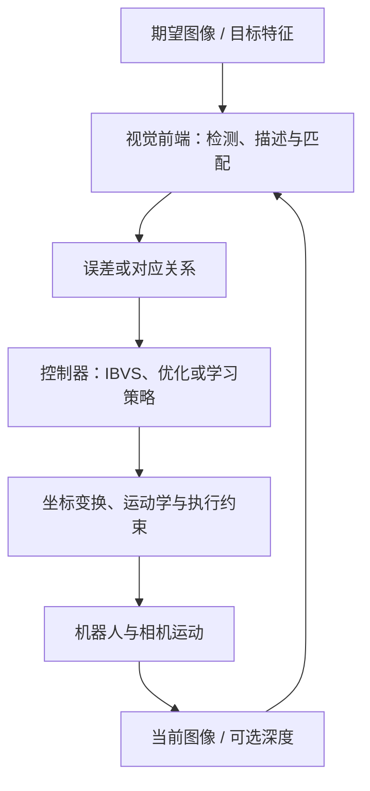
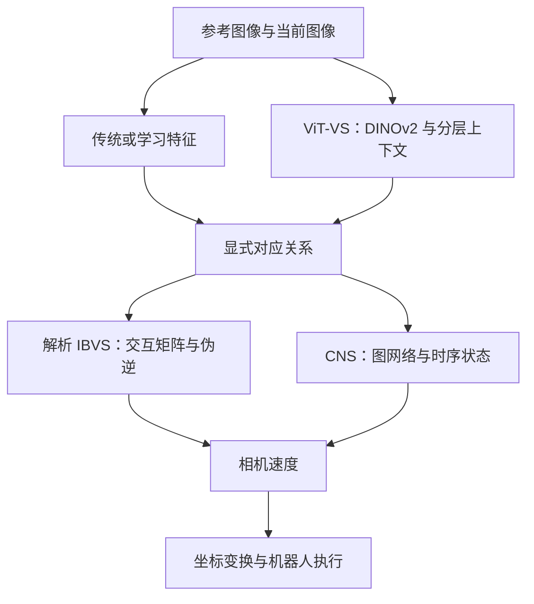

> **视觉伺服的核心是：持续比较“现在看到了什么”和“希望看到什么”，把视觉误差变成机器人运动，再用新的图像修正下一步动作。**
>
> ViT-VS 主要改进“怎样找到可靠的对应关系”；CNS 主要改进“怎样从对应关系产生控制动作”。理解两者之前，需要先弄清相机运动如何改变图像。

本文基于原《视觉伺服调研》材料整理，保留手写推导、论文图表和特征分箱交互演示，并补充原笔记中尚未展开的控制原理、CNS 与实验设计。文章收录于 [论文 → 视觉伺服]({{ '/publications/#paper-domain-visual-servoing' | relative_url }})。

阅读时区分三类内容：**基础推导**用于理解模型假设；**论文结果**对应作者的实验条件；**改进设想**是后续值得验证的方向，不代表原论文已实现。

## 阅读路线与符号约定

| 想解决的问题 | 建议阅读 |
| --- | --- |
| 为什么像素误差不能直接当机器人速度？ | 第 1—3 节 |
| 控制速度如何从相机系变到机械臂？ | 第 4 节 |
| P、PI、PID、MPC 在视觉伺服中各做什么？ | 第 5 节 |
| ViT-VS 的特征、匹配、分箱如何工作？ | 第 6—8 节 |
| 论文的成功率、精度和实时性该如何理解？ | 第 9 节 |
| CNS 为什么采用图网络，为什么需要距离先验？ | 第 10 节 |
| 如何选方法、改进系统并设计实验？ | 第 11—13 节 |
| 如何用代码和问题检查自己是否理解？ | 第 14 节 |

全文默认**眼在手上（eye-in-hand）**：相机固定在末端，先讨论静止目标。相机坐标轴采用 $$X$$ 向右、$$Y$$ 向下、$$Z$$ 向前的约定。

| 符号 | 含义 |
| --- | --- |
| $$I_t,I^\star$$ | 当前图像、期望图像 |
| $$P=(X,Y,Z)^\top$$ | 空间点在当前相机坐标系中的位置，$$Z>0$$ |
| $$(u,v)$$ | 像素坐标 |
| $$(x,y)=(X/Z,Y/Z)$$ | 归一化图像坐标 |
| $$s,s^\star,e=s-s^\star$$ | 当前特征、目标特征与误差 |
| $$V_c=[v_x,v_y,v_z,\omega_x,\omega_y,\omega_z]^\top$$ | 相机原点处、以相机坐标系表达的实际相机速度 |
| $$L_s,\hat L_s$$ | 真实交互矩阵及其估计 |
| $$\lambda,\mu$$ | 反馈增益、阻尼系数 |
| $$B,E,C$$ | 机器人基座、末端、相机坐标系 |
| $$ {}^{A}T_B$$ | 把 $$B$$ 系坐标变换到 $$A$$ 系的刚体变换 |

**本文误差统一使用“当前减期望”，速度统一指相机本身的运动。** 如果代码采用目标相对相机的速度，或使用相反误差定义，控制式中的符号也要相应改变。

## 1. 先把视觉伺服系统拆开

### 1.1 一个闭环里有三个不同的问题



三个环节分别回答：

1. **感知：**两张图里哪些位置具有可比较的意义？
2. **控制：**这些差异对应什么运动？
3. **执行：**机器人怎样在自己的坐标系、关节限制和通信周期内实现这个运动？

匹配准确不等于轨迹合理；控制器设计正确也不等于输入对应点可靠。调试时应分别记录感知、控制和执行的输出。

### 1.2 IBVS 与 PBVS：区别在误差定义

**IBVS（Image-Based Visual Servoing）**直接在图像特征空间构造误差：

$$
e=s(I_t)-s(I^\star).
$$

特征可以是角点、直线、区域矩、光度量，也可以是学习得到的对应点。控制器通过交互矩阵把图像变化和相机运动联系起来。

**PBVS（Position-Based Visual Servoing）**先估计当前与目标之间的三维位姿差，再构造平移、旋转误差。它通常更容易直接表达三维运动目标，但效果依赖位姿估计；在图像里可见的目标，也不一定在规划出的整个运动过程中都保持可见。

因此：

- “用了神经网络特征”不等于端到端学习控制。
- “没有显式估计目标完整位姿”不等于不需要任何几何量。
- P、PID、MPC 是控制设计方式，IBVS、PBVS 是误差表示方式，它们不是互斥的分类。

经典 IBVS 框架可对照 [Chaumette 与 Hutchinson 的视觉伺服教程][vs-tutorial]；下面按本文坐标约定展开推导。

## 2. 从针孔投影推导图像交互矩阵

### 2.1 投影与归一化

忽略畸变、相机内参无倾斜项时：

$$
u=f_x\frac{X}{Z}+c_x,\qquad
v=f_y\frac{Y}{Z}+c_y.
$$

因此：

$$
x=\frac{u-c_x}{f_x}=\frac{X}{Z},\qquad
y=\frac{v-c_y}{f_y}=\frac{Y}{Z}.
$$

归一化坐标去除了焦距与主点的显式影响，**没有消除深度，也没有消除标定误差**。

如果图像先缩放再裁剪，必须同步更新内参。例如横向缩放比例为 $$a_x$$、随后从左侧裁掉 $$b_x$$ 个像素：

$$
f_x'=a_xf_x,\qquad c_x'=a_xc_x-b_x.
$$

检测点、深度采样位置、内参应属于同一图像坐标约定。很多看似“控制增益不对”的问题，其实来自这里。

### 2.2 从坐标变换推导点运动的负号

先不直接记忆 $$\dot P=-v_c-\omega_c\times P$$，而是从静止点的位置关系出发。

设 $$P_B$$ 是目标点在固定基座系中的位置；$$R_{BC}(t)$$ 把相机系向量旋转到基座系，$$p_{BC}(t)$$ 是相机原点在基座系中的位置。则：

$$
P_B=R_{BC}P+p_{BC},
\qquad
P=R_{BC}^\top(P_B-p_{BC}).
$$

目标静止，所以 $$\dot P_B=0$$。相机线速度与角速度都用相机系表达：

$$
v_c=R_{BC}^\top\dot p_{BC},
\qquad
\dot R_{BC}=R_{BC}[\omega_c]_\times.
$$

其中 $$[\omega_c]_\times a=\omega_c\times a$$。对旋转矩阵转置求导：

$$
\frac{d}{dt}R_{BC}^\top
=(R_{BC}[\omega_c]_\times)^\top
=-[\omega_c]_\times R_{BC}^\top.
$$

这里使用了反对称矩阵的性质 $$[\omega_c]_\times^\top=-[\omega_c]_\times$$。再用乘积法则对点坐标求导：

$$
\begin{aligned}
\dot P
&=\dot R_{BC}^\top(P_B-p_{BC})
  +R_{BC}^\top(\dot P_B-\dot p_{BC})\\
&=-[\omega_c]_\times R_{BC}^\top(P_B-p_{BC})
  -R_{BC}^\top\dot p_{BC}\\
&=-[\omega_c]_\times P-v_c\\
&=\boxed{-v_c-\omega_c\times P}.
\end{aligned}
$$

两个负号都来自“用运动中的相机看静止世界”，不是人为给反馈控制器加上的。展开叉乘：

$$
\omega_c\times P
=
\begin{bmatrix}
\omega_yZ-\omega_zY\\
\omega_zX-\omega_xZ\\
\omega_xY-\omega_yX
\end{bmatrix},
$$

所以：

$$
\begin{aligned}
\dot X&=-v_x-\omega_yZ+\omega_zY,\\
\dot Y&=-v_y-\omega_zX+\omega_xZ,\\
\dot Z&=-v_z-\omega_xY+\omega_yX.
\end{aligned}
$$

直观检查：相机向右移动，即 $$v_x>0$$，且没有其他运动时，静止点在相机系中向左移动，即 $$\dot X=-v_x<0$$。

### 2.3 投影求导：把每一个速度项整理出来

**先推导横向坐标。** 对 $$x=X/Z$$ 使用商法则：

$$
\dot x
=\frac{\dot XZ-X\dot Z}{Z^2}
=\frac{\dot X}{Z}-\frac{X}{Z}\frac{\dot Z}{Z}
=\frac{\dot X}{Z}-x\frac{\dot Z}{Z}.
$$

逐项代入 $$\dot X,\dot Z$$，暂时不合并同类项：

$$
\begin{aligned}
\dot x
&=\frac{-v_x-\omega_yZ+\omega_zY}{Z}
  -x\frac{-v_z-\omega_xY+\omega_yX}{Z}\\
&=-\frac{v_x}{Z}-\omega_y+\frac{Y}{Z}\omega_z
  +\frac{xv_z}{Z}
  +x\frac{Y}{Z}\omega_x
  -x\frac{X}{Z}\omega_y.
\end{aligned}
$$

使用 $$X/Z=x,\ Y/Z=y$$：

$$
\dot x
=-\frac{v_x}{Z}
-\omega_y+y\omega_z
+\frac{xv_z}{Z}
+xy\omega_x-x^2\omega_y.
$$

将相同角速度的系数合并，并按六维速度的顺序排列：

$$
\boxed{
\dot x
=-\frac1Z v_x+0v_y+\frac{x}{Z}v_z
+xy\omega_x-(1+x^2)\omega_y+y\omega_z.
}
$$

其中 $$-(1+x^2)\omega_y$$ 包含两个来源：$$\dot X/Z$$ 中的 $$-\omega_y$$，以及深度变化项中的 $$-x^2\omega_y$$。忽略分母 $$Z$$ 也在变化，就会漏掉后一项。

**再推导纵向坐标。** 同样地：

$$
\begin{aligned}
\dot y
&=\frac{\dot Y}{Z}-y\frac{\dot Z}{Z}\\
&=\frac{-v_y-\omega_zX+\omega_xZ}{Z}
  -y\frac{-v_z-\omega_xY+\omega_yX}{Z}\\
&=-\frac{v_y}{Z}-x\omega_z+\omega_x
  +\frac{yv_z}{Z}+y^2\omega_x-xy\omega_y\\
&=\boxed{
0v_x-\frac1Z v_y+\frac{y}{Z}v_z
+(1+y^2)\omega_x-xy\omega_y-x\omega_z.
}
\end{aligned}
$$

取两行的六个系数，得到：

$$
\begin{bmatrix}\dot x\\\dot y\end{bmatrix}
=
\underbrace{
\begin{bmatrix}
-\frac1Z&0&\frac{x}{Z}&xy&-(1+x^2)&y\\
0&-\frac1Z&\frac{y}{Z}&1+y^2&-xy&-x
\end{bmatrix}
}_{L(x,y,Z)}
V_c.
$$

还可以用链式法则检查整个矩阵：

$$
\underbrace{\frac{\partial(x,y)}{\partial(X,Y,Z)}}_{J_\pi}
=
\begin{bmatrix}
1/Z&0&-x/Z\\
0&1/Z&-y/Z
\end{bmatrix},
$$

$$
\dot P=
\underbrace{\begin{bmatrix}-I_3&[P]_\times\end{bmatrix}}_{G(P)}
V_c,\qquad
\boxed{L=J_\pi G(P)}.
$$

这里使用 $$-\omega_c\times P=P\times\omega_c$$。矩阵尺寸为 $$(2\times3)(3\times6)=2\times6$$：先把相机速度变成三维点坐标变化，再通过投影变成二维图像变化。

按列检查物理意义：

| 单独施加的相机运动 | 图像变化 | 直观解释 |
| --- | --- | --- |
| $$v_x>0$$ | $$\dot x=-v_x/Z$$ | 相机右移，静止点左移 |
| $$v_y>0$$ | $$\dot y=-v_y/Z$$ | 相机下移，静止点上移 |
| $$v_z>0$$ | $$(\dot x,\dot y)=(x,y)v_z/Z$$ | 相机靠近目标，离主点的距离增大 |
| $$\omega_z>0$$ | $$(\dot x,\dot y)=(y,-x)\omega_z$$ | 图像绕主点反向旋转 |

前三列含 $$1/Z$$，所以同样平移对近点的影响更大；后三列不显式依赖深度。这里的结论针对针孔相机、静止点和本文轴方向，改变模型或速度定义后应重新检查。

### 2.4 像素坐标中的交互矩阵

内参固定时，对 $$u=f_xx+c_x,\ v=f_yy+c_y$$ 求导：

$$
\dot u=f_x\dot x,\qquad \dot v=f_y\dot y.
$$

因此：

$$
\begin{bmatrix}\dot u\\\dot v\end{bmatrix}
=
\underbrace{
\begin{bmatrix}f_x&0\\0&f_y\end{bmatrix}
L(x,y,Z)
}_{L_{uv}}
V_c.
$$

将上式完全展开：

$$
L_{uv}=
\begin{bmatrix}
-\frac{f_x}{Z}&0&\frac{f_xx}{Z}
&f_xxy&-f_x(1+x^2)&f_xy\\
0&-\frac{f_y}{Z}&\frac{f_yy}{Z}
&f_y(1+y^2)&-f_yxy&-f_yx
\end{bmatrix}.
$$

这里 $$f_xy$$ 表示 $$f_x\cdot y$$，$$f_yx$$ 表示 $$f_y\cdot x$$，不是新的内参。实际编程通常直接用前面的矩阵乘法，更不易产生记号混淆。

单位也可以检验：平移列单位是像素/米，乘线速度后为像素/秒；旋转列乘角速度后同样产生像素/秒。**误差与矩阵必须使用相同的像素或归一化约定。**

对于当前、目标共享相同内参的情况：

$$
e_{uv}
=
\begin{bmatrix}f_x&0\\0&f_y\end{bmatrix}e_{xy}.
$$

如果 $$f_x\ne f_y$$，像素空间的普通最小二乘等价于在归一化空间给予横纵方向不同权重；这不是简单把一个标量增益调大就能完全替代的。

### 2.5 一个手算例子：目标在右侧，相机往哪边走？

只允许相机沿 $$x,y$$ 平移，设：

$$
f_x=f_y=600\ \text{px},\quad
Z=0.6\ \text{m},\quad
(u-u^\star,v-v^\star)=(60,40)\ \text{px}.
$$

归一化误差是：

$$
e=
\begin{bmatrix}0.1\\0.0667\end{bmatrix}.
$$

此时 $$L_{xy}=\operatorname{diag}(-1/Z,-1/Z)$$。希望 $$\dot e=-\lambda e$$，取 $$\lambda=0.5\ \text{s}^{-1}$$：

$$
\begin{bmatrix}v_x\\v_y\end{bmatrix}
=-\lambda L_{xy}^{-1}e
=\lambda Z e
\approx
\begin{bmatrix}0.03\\0.02\end{bmatrix}
\ \text{m/s}.
$$

**目标在图像右下方时，相机向自身右下方移动，目标投影才会回到中心。** 在这个明确约定下，直接写 $$v_x=-K(u-u^\star)$$ 会把方向写反。

这个例子只控制两个平移自由度，不能据此声称“一个图像点足以确定六自由度运动”。

## 3. 从图像误差到六维速度

### 3.1 多点堆叠与可观测性

对 $$n$$ 对对应点：

$$
s=[x_1,y_1,\ldots,x_n,y_n]^\top,\qquad
L_s=
\begin{bmatrix}
L(x_1,y_1,Z_1)\\
\vdots\\
L(x_n,y_n,Z_n)
\end{bmatrix}
\in\mathbb R^{2n\times6}.
$$

静止目标、固定参考特征时：

$$
\dot e=L_sV_c.
$$

六自由度至少需要六个独立约束，因此 $$n\ge3$$ 是必要的数量条件，但不保证满秩。点的几何分布、深度和相机位姿也会影响秩与条件数。实际常使用更多点，同时检查它们是否集中在一个小区域。

### 3.2 从最小二乘推导伪逆控制律

令 $$A=\hat L_s\in\mathbb R^{2n\times6}$$。希望当前速度使预测误差变化接近 $$-\lambda e$$：

$$
AV_c\approx-\lambda e.
$$

定义残差 $$r(V)=AV+\lambda e$$，求：

$$
J(V)=\frac12\|AV+\lambda e\|_2^2.
$$

**第一步：展开二次型。**

$$
\begin{aligned}
J(V)
&=\frac12(AV+\lambda e)^\top(AV+\lambda e)\\
&=\frac12V^\top A^\top AV
+\lambda V^\top A^\top e
+\frac{\lambda^2}{2}e^\top e.
\end{aligned}
$$

两个交叉项相等，因为它们都是标量。最后一项与 $$V$$ 无关。

**第二步：对速度求导，并令梯度为零。**

$$
\nabla_VJ=A^\top AV+\lambda A^\top e=0.
$$

于是得到正规方程：

$$
A^\top AV=-\lambda A^\top e.
$$

若 $$A$$ 满列秩，则 $$A^\top A$$ 可逆：

$$
V_c=-\lambda(A^\top A)^{-1}A^\top e
=-\lambda A^\dagger e.
$$

**第三步：当不满秩时，用 SVD 说明为什么仍能定义伪逆。**

只保留 $$r=\operatorname{rank}(A)$$ 个非零奇异值：

$$
A=U_r\Sigma_rQ_r^\top,\qquad
\Sigma_r=\operatorname{diag}(\sigma_1,\ldots,\sigma_r),
\quad \sigma_i>0.
$$

其中 $$U_r$$ 的列是特征空间中的可实现方向，$$Q_r$$ 的列是速度空间中的相应方向。将误差分解：

$$
e=U_rU_r^\top e+(I-U_rU_r^\top)e.
$$

后半部分与 $$A$$ 的列空间正交，无论选择什么速度都不能在这个瞬间抵消它。前半部分可以令：

$$
\Sigma_rQ_r^\top V=-\lambda U_r^\top e.
$$

取没有额外零空间运动的解：

$$
\boxed{
V_c=-\lambda Q_r\Sigma_r^{-1}U_r^\top e
=-\lambda A^\dagger e.
}
$$

所有最小二乘解还可以加上 $$(I-A^\dagger A)z$$，其中 $$z\in\mathbb R^6$$；这一项位于 $$A$$ 的零空间，不改变预测图像速度。设它为零，就得到最小范数解。最小范数与使用的速度单位有关，不等于任何物理意义下都“最省力”。

### 3.3 从投影矩阵说明收敛条件

真实系统使用 $$L_s$$，控制器使用 $$\hat L_s$$，因此：

$$
\dot e=-\lambda L_s\hat L_s^\dagger e.
$$

先分析理想情况 $$\hat L_s=L_s$$。由 SVD：

$$
P_L=L_sL_s^\dagger
=U_r\Sigma_rQ_r^\top Q_r\Sigma_r^{-1}U_r^\top
=U_rU_r^\top.
$$

因此：

$$
P_L^\top=P_L,\qquad P_L^2=P_L.
$$

它是正交投影矩阵。对于 $$2n>6$$ 的多点特征，$$P_L$$ 的秩最多为 6，不可能等于 $$I_{2n}$$。

取误差能量：

$$
\Phi(e)=\frac12e^\top e.
$$

逐步求导：

$$
\begin{aligned}
\dot\Phi
&=\frac12(\dot e^\top e+e^\top\dot e)\\
&=e^\top\dot e\\
&=-\lambda e^\top P_Le\\
&=-\lambda e^\top P_L^\top P_Le\\
&=\boxed{-\lambda\|P_Le\|_2^2\le0}.
\end{aligned}
$$

这说明误差能量不增加，但还没有证明每个非零误差处都严格下降。当 $$P_Le=0$$ 时，可能存在非零误差却得到零速度的驻点。

若暂时把交互矩阵视为常量，还能写出这个线性近似的解：

$$
e(t)=e^{-\lambda t}P_Le(0)+(I-P_L)e(0).
$$

可实现分量指数衰减，正交分量保持不变。真实系统中 $$L_s$$ 随位姿变化，所以这个闭式解只用于理解局部冻结模型。

**那么，经典 IBVS 为什么仍能局部收敛？** 多点坐标不是任意的 $$2n$$ 个自由变量：在固定目标和正确对应下，它们由六维相机位姿共同决定。令 $$\xi$$ 是期望位姿附近的小位姿偏差，选择与相机速度局部一致的坐标，则：

$$
e=L_\star\xi+O(\|\xi\|^2),\qquad
\dot\xi=V_c+O(\|\xi\|\|V_c\|).
$$

若 $$L_\star$$ 满列秩且模型准确：

$$
\dot\xi
\approx-\lambda L_\star^\dagger L_\star\xi
=-\lambda\xi.
$$

因此在这个**可实现的局部位姿流形**上，线性化系统的六个模态都衰减。它依赖固定目标、正确对应、有效深度、足够秩及小偏差；跨实例语义匹配未必满足同一个静止三维点集的假设。

模型不准确时还应检查：

$$
\dot\Phi
=-\lambda e^\top M e
=-\lambda e^\top\frac{M+M^\top}{2}e,
\qquad M=L_s\hat L_s^\dagger.
$$

反对称部分对二次型没有贡献。估计误差若使对称部分在实际误差方向上失去正性，就不能继续沿用理想模型的下降结论。大运动中的视野丢失与对应切换，也不在上述局部证明之内。

### 3.4 阻尼如何抑制小奇异值？

普通伪逆中的 $$1/\sigma_i$$ 说明：若某个方向的奇异值很小，较小的图像误差也可能要求很大的速度。

加入速度正则项：

$$
J_\mu(V)
=
\frac12\|AV+\lambda e\|_2^2
+\frac{\mu^2}{2}\|V\|_2^2,\qquad \mu>0.
$$

对 $$V$$ 求导：

$$
\nabla_VJ_\mu
=A^\top(AV+\lambda e)+\mu^2V=0.
$$

整理：

$$
(A^\top A+\mu^2I_6)V=-\lambda A^\top e.
$$

对任意非零 $$z$$：

$$
z^\top(A^\top A+\mu^2I_6)z
=\|Az\|_2^2+\mu^2\|z\|_2^2>0,
$$

所以即使 $$A$$ 不满秩，加入正阻尼后的矩阵也可逆：

$$
\boxed{
V_c=-\lambda(A^\top A+\mu^2I_6)^{-1}A^\top e.
}
$$

在 SVD 的第 $$i$$ 个非零模态上，令速度系数 $$a_i=q_i^\top V$$，误差系数 $$b_i=u_i^\top e$$。每个模态单独最小化：

$$
\frac12(\sigma_i a_i+\lambda b_i)^2
+\frac{\mu^2}{2}a_i^2.
$$

对 $$a_i$$ 求导：

$$
\sigma_i(\sigma_i a_i+\lambda b_i)+\mu^2a_i=0,
$$

得到：

$$
a_i=-\lambda\frac{\sigma_i}{\sigma_i^2+\mu^2}b_i.
$$

这就解释了系数为何由 $$1/\sigma_i$$ 变成 $$\sigma_i/(\sigma_i^2+\mu^2)$$。

例如 $$\sigma_i=0.01,\mu=0.1$$ 时，普通系数为 100，阻尼系数约为 0.99；若 $$\sigma_i=1$$，系数仅由 1 变为约 0.99。阻尼主要限制病态方向，也会牺牲该方向的收敛速度。它使数值解有界，**不会恢复缺失的几何信息**。

### 3.5 加权最小二乘与速度量纲

给每个对应点一个非负权重：

$$
W=\operatorname{diag}(w_1,w_1,\ldots,w_n,w_n).
$$

在当前一次求解内固定 $$W$$，目标为：

$$
J_W(V)
=
\frac12(AV+\lambda e)^\top W(AV+\lambda e)
+\frac{\mu^2}{2}V^\top V.
$$

由于 $$W=W^\top$$：

$$
\nabla_VJ_W
=A^\top W(AV+\lambda e)+\mu^2V.
$$

令梯度为零：

$$
\boxed{
V_c=-\lambda(A^\top WA+\mu^2I_6)^{-1}A^\top We.
}
$$

这也等价于先对数据加权：

$$
\widetilde A=W^{1/2}A,\qquad
\widetilde e=W^{1/2}e,
$$

然后解普通阻尼最小二乘。代码中用每一行乘 $$\sqrt{w_i}$$，正是这个变换。若噪声协方差为 $$\Sigma_e$$，在相应高斯误差模型下可使用 $$W=\Sigma_e^{-1}$$；经验匹配分数不一定已经是校准好的逆方差。

线速度与角速度量纲不同，也应处理。取参考速度 $$v_0,\omega_0>0$$，定义：

$$
V=S_V\widetilde V,\qquad
S_V=\operatorname{diag}(v_0I_3,\omega_0I_3).
$$

此时 $$\widetilde V$$ 的分量均为无量纲。对它施加等权正则，相当于原速度上的：

$$
\|\widetilde V\|_2^2
=
V^\top S_V^{-\top}S_V^{-1}V.
$$

因此更一般的控制目标可以使用 $$\frac12V^\top R_VV$$，得到：

$$
V_c=-\lambda(A^\top WA+R_V)^{-1}A^\top We.
$$

选择 $$R_V$$ 表达平移、转动的相对代价，比把“1 m/s”和“1 rad/s”无条件看成同样大小更明确。实现时用线性方程求解或 SVD，避免显式求逆；若权重随时间变化，稳定性分析也要相应调整，不能直接照搬固定权重的结论。

### 3.6 深度误差与离散采样：一个能手算的稳定性例子

只考虑一个点的横向平移，真实深度为 $$Z$$，控制器使用 $$\hat Z$$。由：

$$
\dot e=-\frac{v_x}{Z},\qquad
v_x=\lambda\hat Z e,
$$

得到：

$$
\dot e=-\lambda\frac{\hat Z}{Z}e.
$$

若两种深度都为正常数，这个简化模型的平衡点仍是 $$e=0$$，估计深度改变的是收敛速率。例如高估深度一倍，控制器会给出两倍的横向速度。**这个单轴结论不能直接推广到具有平移旋转耦合的完整系统。**

若每隔 $$\Delta t$$ 更新一次速度，并在两帧之间保持指令，纯横向运动中深度不变：

$$
e_{k+1}
=e_k-\frac{\Delta t}{Z}v_{x,k}
=
\underbrace{
\left(1-\lambda\frac{\hat Z}{Z}\Delta t\right)
}_{a}
e_k.
$$

离散误差收敛要求 $$\lvert a\rvert<1$$，即：

$$
\boxed{0<\lambda(\hat Z/Z)\Delta t<2}.
$$

乘积在 $$(0,1]$$ 内时误差不反号；在 $$(1,2)$$ 内时误差反号但幅值衰减；大于 2 时发散。这解释了为什么在低视觉频率下盲目增大增益，可能把“响应慢”变成来回振荡。

这个界假设没有额外时延、没有饱和、没有目标运动。它是检查增益与帧率量级的入门模型，不是实际六自由度机器人的通用参数上限。

## 4. 相机速度怎样交给机械臂？

### 4.1 手眼标定决定两个坐标系的固定关系

设相机刚性安装在末端：

$$
{}^ET_C=
\begin{bmatrix}
R&t\\0&1
\end{bmatrix}.
$$

其中 $$R$$ 把相机向量旋转到末端坐标系，$$t$$ 是相机原点在末端系中的位置。

定义 $$[t]_\times a=t\times a$$。在本文采用的“线速度在前、角速度在后”顺序下：

$$
\boxed{
V_E^E
=
\operatorname{Ad}_{ {}^ET_C}V_C^C
=
\begin{bmatrix}
R&[t]_\times R\\
0&R
\end{bmatrix}
V_C^C.
}
$$

上标表示表达坐标系，下标指速度参考的刚体原点。

### 4.2 为什么不能只旋转两个三维向量？

把固定的手眼关系写成 $$R=R_{EC},t=t_{EC}$$。相机原点与末端原点在基座系中的位置满足：

$$
p_{BC}=p_{BE}+R_{BE}t.
$$

由于相机刚性安装，$$t$$ 在末端系中不随时间变化。对上式求导：

$$
\dot p_{BC}
=\dot p_{BE}+\dot R_{BE}t
=\dot p_{BE}+R_{BE}[\omega_E^E]_\times t.
$$

左乘 $$R_{BE}^\top$$，统一在末端系表达两个原点的速度：

$$
v_C^E=v_E^E+\omega_E^E\times t.
$$

同一刚体各处角速度相同，仅表达坐标系不同，所以：

$$
\omega_E^E=R\omega_C^C,\qquad
v_C^E=Rv_C^C.
$$

将这两个关系代入，并把末端线速度移到等式左侧：

$$
\begin{aligned}
v_E^E
&=Rv_C^C-(R\omega_C^C)\times t\\
&=Rv_C^C+t\times(R\omega_C^C)\\
&=Rv_C^C+[t]_\times R\omega_C^C.
\end{aligned}
$$

第二行使用了叉乘反交换律 $$a\times b=-b\times a$$。和角速度一起堆叠，正好得到第 4.1 节的伴随矩阵。

**检查一个纯旋转例子。** 取 $$R=I_3$$、$$t=(0.1,0,0)^\top$$ m，希望相机原点不平移、绕相机 $$z$$ 轴以 1 rad/s 转动：

$$
v_C^C=0,\qquad
\omega_C^C=(0,0,1)^\top.
$$

末端应给出：

$$
v_E^E=t\times\omega_C^C
=(0,-0.1,0)^\top\ \text{m/s}.
$$

检查实际相机速度：

$$
v_C^E
=v_E^E+\omega_E^E\times t
=(0,-0.1,0)^\top+(0,0.1,0)^\top=0.
$$

如果漏掉杠杆臂项、把末端线速度设为零，相机会绕末端原点转圈，无法在自身原点实现期望纯旋转。

**但也不能见到六维速度就无条件套一个完整伴随变换。** 假设机器人 API 要求“末端原点处、用基座坐标表达的线速度与角速度”，在上式已经把原点变到末端后，只需再改变表达基：

$$
\begin{bmatrix}v_E^B\\\omega_E^B\end{bmatrix}
=
\begin{bmatrix}
{}^BR_E&0\\0&{}^BR_E
\end{bmatrix}
V_E^E.
$$

这与以基座原点定义的空间 twist 不是同一个六维量。对接 API 前应核对：**在哪个点定义速度、在哪个系表达、六个分量如何排列。**

### 4.3 从笛卡尔速度到关节速度

如果机器人只提供末端原点处、用基座系表达的几何雅可比 $$J_E^B(q)$$，不能直接把它当作相机雅可比。先旋转表达坐标系，再改变速度参考原点：

$$
J_C(q)
=
\operatorname{Ad}_{ {}^CT_E}
\begin{bmatrix}
R_{BE}^\top&0\\0&R_{BE}^\top
\end{bmatrix}
J_E^B(q).
$$

其中逆向手眼变换满足：

$$
\operatorname{Ad}_{ {}^CT_E}
=
\left(\operatorname{Ad}_{ {}^ET_C}\right)^{-1}
=
\begin{bmatrix}
R^\top&-R^\top[t]_\times\\
0&R^\top
\end{bmatrix}.
$$

这里的前提是 $$J_E^B$$ 使用本文的 $$[v;\omega]$$ 顺序，并确实表示末端原点的几何速度；若机器人库给出的是空间雅可比，要先核对其定义。

获得相机雅可比后：

$$
V_C^C=J_C(q)\dot q,
$$

就可以把整个映射合并：

$$
\dot s=L_sJ_C(q)\dot q.
$$

一个直接的关节速度优化形式为：

$$
\min_{\dot q}
\|W^{1/2}(L_sJ_C\dot q+\lambda e)\|_2^2
+\rho\|\dot q\|_2^2,
$$

并加入关节速度、下一步关节位置等约束。这比事后逐分量裁剪速度更容易保留原任务方向，但仍需处理建模误差和求解时限。

## 5. P、PI、PID 与 MPC：在同一模型上理解

### 5.1 常见 IBVS 控制律本身就带有比例反馈

式子 $$V_c=-\lambda\hat L_s^\dagger e$$ 可以看成：

1. 在特征空间要求误差按比例下降；
2. 用几何模型把期望图像变化转换成相机速度。

比例系数控制反应强度，伪逆负责坐标、方向、耦合与尺度。两者作用不同，不能用一个经验增益替代六自由度投影几何。

### 5.2 PI / PID 的积分、微分应该作用在哪个误差上？

对一组**身份稳定、维度固定**的特征，可先构造期望特征速度：

$$
\dot s_{\rm cmd}
=-K_pe-K_i\eta-K_d\dot e_f,\qquad
\dot\eta=e,
$$

再求 $$\hat L_sV_c\approx\dot s_{\rm cmd}$$。其中 $$\dot e_f$$ 是滤波后的误差导数。

积分可补偿某些持续偏差，但会在速度饱和、特征丢失时累积；微分能够提供阻尼信息，也会放大像素噪声。离散实现要显式使用真实时间间隔：

$$
\eta_k=\eta_{k-1}+e_k\Delta t_k,\qquad
\dot e_k\approx\frac{e_k-e_{k-1}}{\Delta t_k}.
$$

对 ViT-VS 这类每帧重新选点的方法，问题更根本：**本帧第 3 个匹配点可能不是上一帧第 3 个物理点。** 直接逐元素积分或差分，会把不同对象的误差混在一起。

若要使用 PI / PID，需要保持特征身份，或改在稳定的位姿、区域中心等任务变量上设计；不能直接给任意变化的匹配数组加一个积分器。

### 5.3 视觉 MPC 如何写出来？

在短时间窗内离散化：

$$
s_{k+1}
\approx
s_k+\Delta t\,L_s(s_k,Z_k)V_k.
$$

给定预测长度 $$N$$，可以优化：

$$
\begin{aligned}
\min_{V_{0:N-1}}\;&
\sum_{k=0}^{N-1}
\left(
e_k^\top Qe_k+
V_k^\top RV_k+
\Delta V_k^\top S\Delta V_k
\right)
+e_N^\top Q_fe_N,\\
\text{s.t.}\;&
s_{k+1}=s_k+\Delta t\,\hat L_kV_k,\\
&u_{\min}\le u_{i,k}\le u_{\max},\\
&v_{\min}\le v_{i,k}\le v_{\max},\\
&V_k\in\mathcal V,\quad q_k\in\mathcal Q.
\end{aligned}
$$

这里小写 $$u_{i,k},v_{i,k}$$ 是像素位置，$$V_k$$ 是相机速度。视野约束必须通过一致的内参关系连接到预测特征；涉及关节约束时也要加入机器人状态与运动学模型。

每次只执行最前面的控制量，再用新图像更新模型和重规划。冻结 $$L_s$$ 可简化为局部近似问题；沿预测轨迹更新 $$L_s$$ 则更接近非线性 MPC，也需要更多计算。

**MPC 的价值是显式处理未来代价与约束，前提是预测足够可靠、求解能按时完成。** 它不会自动修复错误匹配、消除通信时延或保证深度估计正确。控制背景可结合 [PID 与 MPC 笔记]()阅读。

### 5.4 从预测方程到 MPC 的二次规划

为了看清求解器接收什么，先考虑静止目标、冻结交互矩阵、固定采样周期的近似。记 $$m=2n$$，$$B=\Delta t\,\hat L_s\in\mathbb R^{m\times6}$$，则：

$$
e_{k+1}=e_k+BV_k.
$$

逐步展开预测：

$$
\begin{aligned}
e_1&=e_0+BV_0,\\
e_2&=e_0+BV_0+BV_1,\\
e_3&=e_0+BV_0+BV_1+BV_2.
\end{aligned}
$$

把未来速度和误差分别堆叠：

$$
U=
\begin{bmatrix}V_0\\V_1\\\vdots\\V_{N-1}\end{bmatrix},
\qquad
E=
\begin{bmatrix}e_1\\e_2\\\vdots\\e_N\end{bmatrix}.
$$

得到紧凑预测式：

$$
E=\mathcal Fe_0+\mathcal BU,
$$

$$
\mathcal F=
\begin{bmatrix}I_m\\I_m\\\vdots\\I_m\end{bmatrix},
\qquad
\mathcal B=
\begin{bmatrix}
B&0&\cdots&0\\
B&B&\cdots&0\\
\vdots&\vdots&\ddots&\vdots\\
B&B&\cdots&B
\end{bmatrix}.
$$

这里 $$E\in\mathbb R^{mN}$$，$$U\in\mathbb R^{6N}$$，所以 $$\mathcal B\in\mathbb R^{mN\times6N}$$。预测长度增加后，优化变量数也随之增加。

速度变化可写成 $$DU-c$$：

$$
D=
\begin{bmatrix}
I_6&0&\cdots&0\\
-I_6&I_6&\cdots&0\\
0&-I_6&\ddots&0\\
\vdots&\vdots&\ddots&I_6
\end{bmatrix},
\qquad
c=\begin{bmatrix}V_{-1}\\0\\\vdots\\0\end{bmatrix}.
$$

$$V_{-1}$$ 是上一次已施加的速度，所以第一项确实是 $$V_0-V_{-1}$$。令：

$$
\bar Q=\operatorname{diag}(Q,\ldots,Q,Q_f),\quad
\bar R=I_N\otimes R,\quad
\bar S=I_N\otimes S.
$$

其中 $$\bar Q$$ 含 $$N-1$$ 个 $$Q$$ 和一个 $$Q_f$$。忽略与未来控制无关的 $$e_0^\top Qe_0$$，并把整体目标乘以不影响最优解的 $$1/2$$：

$$
J(U)
=
\frac12E^\top\bar QE+
\frac12U^\top\bar RU+
\frac12(DU-c)^\top\bar S(DU-c).
$$

代入预测式并展开：

$$
J(U)=\frac12U^\top HU+g^\top U+\text{常数},
$$

$$
\begin{aligned}
H&=\mathcal B^\top\bar Q\mathcal B
+\bar R+D^\top\bar SD,\\
g&=\mathcal B^\top\bar Q\mathcal Fe_0
-D^\top\bar Sc.
\end{aligned}
$$

这就是二次规划的目标。如果 $$Q,Q_f,S$$ 半正定且 $$R$$ 正定，则 $$H$$ 正定。没有约束时，令 $$HU+g=0$$ 即可；加入线性化后的速度、视野等约束后，求解：

$$
\min_U\ \frac12U^\top HU+g^\top U,
\qquad C_UU\le b_U.
$$

视野约束可用第 2.4 节的像素映射，将预测的 $$s_k=e_k+s^\star$$ 转换为像素位置。带有关节和障碍的约束则需要进一步引入机器人状态，不能只靠这一个图像模型凭空得到。

这也能说明 MPC 与阻尼反馈的联系：取 $$N=1$$、不惩罚速度变化、$$Q_f=I_m,R=\rho I_6$$：

$$
V_0=-(B^\top B+\rho I_6)^{-1}B^\top e_0
=-\frac1{\Delta t}
\left(
\hat L_s^\top\hat L_s+\frac{\rho}{\Delta t^2}I_6
\right)^{-1}\hat L_s^\top e_0.
$$

在这个特例中，它具有阻尼 IBVS 的形式，对应 $$\lambda=1/\Delta t$$、$$\mu^2=\rho/\Delta t^2$$。多步预测、约束和模型更新才使一般 MPC 超出这个单步关系；不能据此直接把该增益照搬到有时延的机器人。

## 6. ViT-VS：用语义特征替换传统匹配前端

### 6.1 论文的问题意识

[ViT-VS][vit-paper] 将预训练视觉 Transformer 的特征用于图像对应，再连接经典 IBVS。原材料关注的场景包括弱纹理物体、外观变化和类别级抓取。

传统局部特征擅长匹配同一物体的稳定纹理；但同类不同实例之间，纹理可能不同，语义部件仍有相似性。例如两个杯子的花纹不同，“杯身”“把手”仍可能对应。

这种泛化也有代价：**语义相近的部位，不一定是同一三维物理点。** 经典点特征 IBVS 的几何假设，在跨实例语义对应中只是一种近似。


_原材料收录的 ViT-VS 流程图；结合论文方法部分阅读。_

### 6.2 Patch 描述子不是整幅图的单个向量

原材料及论文采用的典型设置是 DINOv2 ViT-S/14、取第 11 层 token 特征，不做任务特定微调。输入为 $$308\times308$$，patch 大小与步长为 14 时：

$$
H_p=W_p=\frac{308}{14}=22.
$$

每个位置有一个 $$D=384$$ 维描述子，因此：

$$
F\in\mathbb R^{22\times22\times384}
\longrightarrow
\widetilde F\in\mathbb R^{484\times384}.
$$

这里有 484 个空间位置，每个位置对应一个向量。展平只是改变存储方式，不会丢掉行列索引与图像位置之间的映射。

若采用 patch 单元中心的连续坐标约定，索引 $$(r,c)$$ 可对应：

$$
u\approx14(c+1/2),\qquad
v\approx14(r+1/2).
$$

实际代码还要统一像素中心的零基定义，并撤销前处理的缩放、裁剪变换；不能直接拿特征网格索引去 RGB-D 图上读取深度。

### 6.3 余弦匹配与循环一致性

对参考描述子 $$f_i^\star$$ 和当前描述子 $$f_j$$：

$$
S_{ij}
=
\frac{(f_i^\star)^\top f_j}
{\|f_i^\star\|_2\|f_j\|_2}.
$$

先从参考图寻找当前图中的最近邻，再从该位置反向寻找参考位置：

$$
j(i)=\arg\max_jS_{ij},\qquad
i'(j)=\arg\max_iS_{ij}.
$$

若参考坐标 $$p_i^\star$$ 与返回坐标 $$p_{i'(j(i))}^\star$$ 接近，则循环误差小：

$$
r_i^{\rm cyc}
=
\|p_i^\star-p_{i'(j(i))}^\star\|_2.
$$

论文使用循环一致性筛选，并从合格候选中随机选取一定数量的对应点；典型设置为 24 对点。

循环一致性检验的是**匹配是否相互支持**，并不证明两端来自同一个物理点。重复结构和对称部件仍可能形成错误的互相匹配。随机抽样也不保证覆盖整个目标，后续可以单独研究空间分布约束。

### 6.4 参考图前景掩膜解决什么问题？

如果参考图同时包含桌面、墙面和目标，最高相似度可能集中在背景。用前景掩膜限制参考候选位置，可以让伺服任务更明确；论文系统可使用 SAM 辅助生成这样的掩膜。

但掩膜只回答“在哪个区域找”，不能替代区域内部的几何对应。目标边界处还容易混合背景深度，应对 RGB 与深度的对齐、无效值和遮挡边缘分别处理。

## 7. 分层特征分箱：保留细节，同时加入上下文

### 7.1 为什么单个 patch 不够？

同一杯子的两个无纹理区域可能有相近描述子。若把周围结构加入描述，例如“右侧是把手、下方是桌面”，匹配就多了空间上下文。

直接把巨大邻域中每个 patch 全部拼接，维度会随面积增长；把整个邻域平均成一个向量，又会抹去不同方向的结构。分层分箱在两者之间取舍：**近处保留较细的空间分布，远处用较粗的区域摘要。**

### 7.2 先纠正“拼接”与“池化”的混淆

设基础特征为 $$f(p)\in\mathbb R^D$$。按原材料交互演示的层级记号：

- $$\beta=0$$：只用中心描述子，维度 $$D$$。
- $$\beta=1$$：中心与周围八个细粒度描述子按固定顺序**拼接**，维度 $$9D$$。
- $$\beta=2$$：保留上述九项，再加入外围八个较粗区域的摘要，每个粗区域通过平均池化得到一个 $$D$$ 维向量，总维度 $$17D$$。

因此，**“每个粗区域内部做平均”与“不同区域之间做拼接”是两个不同操作。** 把 $$3\times3$$ 的九个细描述子全部平均成一个 $$D$$ 维向量，不是这里的 $$\beta=1$$ 描述子。

### 7.3 一个统一的示意公式

设第 $$\ell$$ 层周围八个区域为 $$B_{\ell,j}(p)$$，其区域摘要为：

$$
g_{\ell,j}(p)
=
\frac{1}{|B_{\ell,j}(p)|}
\sum_{q\in B_{\ell,j}(p)}f(q).
$$

中心以及各层、各方向的摘要按固定顺序拼接：

$$
\phi_\beta(p)
=
\operatorname{concat}
\left(
f(p),
\{g_{\ell,j}(p)\}_{\ell=1,\ldots,\beta;\ j=1,\ldots,8}
\right).
$$

于是：

$$
\boxed{\dim\phi_\beta=(1+8\beta)D.}
$$

这个公式用于解释描述子的组成；具体复现还需核对边界填充、池化窗口位置及归一化顺序。边缘 patch 的邻域不能直接按无限大特征图处理。

取 $$D=384$$：

| 层级 | 描述子组成 | 维度 |
| --- | --- | ---: |
| $$\beta=0$$ | 中心 | 384 |
| $$\beta=1$$ | 中心 + 8 个细粒度邻居 | 3456 |
| $$\beta=2$$ | 前述 9 项 + 8 个粗区域 | 6528 |

维度增长是随层级线性增长，覆盖区域则可以增长得更快；二者不是同一个量。

用一个低维例子区分池化与拼接。假设每个基础描述子只有 $$D=2$$ 个通道，某个粗区域包含九个向量：

$$
f(q_j)=(a_j,b_j),\qquad j=1,\ldots,9.
$$

区域池化的结果仍是二维：

$$
g=
\left(
\frac19\sum_{j=1}^9a_j,\quad
\frac19\sum_{j=1}^9b_j
\right)\in\mathbb R^2.
$$

若九个向量依次是 $$(1,10),(2,20),\ldots,(9,90)$$，池化结果为 $$(5,50)$$；逐个拼接则是 $$(1,10,2,20,\ldots,9,90)$$，有 18 个分量。前者保留区域平均，后者保留九个位置的顺序。

层级为 2 时，九个细描述子占 $$9D$$ 维，八个粗区域各贡献 $$D$$ 维，所以：

$$
D_2=\underbrace{9D}_{\text{细粒度部分}}
+\underbrace{8D}_{\text{粗粒度部分}}
=17D.
$$

每增加一层，仅追加八个区域摘要：

$$
D_0=D,\qquad
D_\beta=D_{\beta-1}+8D
=D+8\beta D.
$$

这给出了维度公式的递推过程，也解释了为何不能把外围每个粗区域内部的九个向量再全部计入最终维度。


_原笔记示意图。图中的 ViT-L/14 标签用于举例；本文讨论的典型实验配置为 ViT-S/14。分箱原理与具体 backbone 应分开理解。_

### 7.4 交互演示

先观察中心 patch，再依次查看细邻域、外围分箱与平均池化；最后调整 $$D$$ 和 $$\beta$$，对照描述子维度变化。网格是原理示意，不代表机器人运动轨迹。



### 7.5 分箱的计算代价来自哪里？

若两张图各有 $$N$$ 个描述子，采用直接全对全相似度计算，主要乘加复杂度近似为：

$$
O(N^2D_\beta),\qquad D_\beta=(1+8\beta)D.
$$

这还没有包括 backbone 与构造分箱的成本。提高输入边长会增加 patch 数，而全匹配的成本对 patch 数呈二次增长，因此分辨率与层级要联合选择。

**较粗 patch 会影响精定位，但 patch 宽度不是最终物理误差的严格下界。** 多点联合约束、连续闭环运动、插值和局部细化都可能改变实际误差；同时，语义不变性也可能使小范围位移难以被辨别。应通过实验测精度，而不能仅由“14 像素一个 patch”推出一个必然误差值。

## 8. ViT-VS 的旋转预对齐与速度平滑

### 8.1 为什么需要单独处理大旋转？

当初始相机绕光轴旋转很大时，描述子的方向敏感性与目标对称性可能干扰匹配。论文在正式伺服前，对当前图像的若干离散旋转候选进行匹配评分，例如：

$$
\Theta=\{0^\circ,90^\circ,180^\circ,-90^\circ\}.
$$

可把选择过程理解为：

$$
\theta^\star
=
\arg\max_{\theta\in\Theta}
\frac1{|\mathcal M_\theta|}
\sum_{(i,j)\in\mathcal M_\theta}S_{ij}^{(\theta)}.
$$

选出候选后先进行实际旋转预对齐，再进入 IBVS。这里的“图像旋转角”到“相机执行角”的符号关系依赖坐标约定，不能把图像处理库的角度不经检查地发给机器人。

四个离散候选主要用于缩小大的方向歧义，不能视为完整的连续三维旋转估计。对称物体也可能存在多个相近评分。

### 8.2 匹配点为何导致速度抖动？

即便目标静止，每帧匹配也可能改变：

- patch 的最近邻位置；
- 通过循环一致性筛选的候选集；
- 随机抽到的控制点；
- 控制点对应的深度值。

因此，$$e$$ 与 $$\hat L_s$$ 都可能跳变。仅在输出端提高控制频率，并不会增加新的视觉信息。

### 8.3 EMA 的作用与代价

采用当前值权重为 $$\alpha$$ 的约定：

$$
\bar V_t
=
\alpha V_t+(1-\alpha)\bar V_{t-1},
\qquad 0<\alpha\le1.
$$

$$\alpha=1$$ 不做平滑；$$\alpha$$ 越小，历史影响越大，输出更平缓但响应更滞后。论文典型配置使用 $$\alpha=0.8$$，并比较了不同权重。

为了推导滤波器的时间含义，记 $$q=1-\alpha$$。把递推式连续展开 $$K$$ 次：

$$
\bar V_t
=\alpha\sum_{j=0}^{K-1}q^jV_{t-j}+q^K\bar V_{t-K}.
$$

当 $$0<\alpha\le1$$ 时，$$0\le q<1$$，远处初值的影响逐渐消失，稳态权重为：

$$
w_j=\alpha q^j,\qquad
\sum_{j=0}^{\infty}w_j
=\frac{\alpha}{1-q}=1.
$$

所以常值输入不会仅因滤波而改变最终幅值。对零初始状态的递推式作 Z 变换：

$$
\bar V(z)=\alpha V(z)+qz^{-1}\bar V(z),
$$

把含 $$\bar V(z)$$ 的项放到同一边，即得：

$$
H(z)
=
\frac{\alpha}{1-(1-\alpha)z^{-1}}.
$$

平均历史年龄是权重分布的一阶矩。由几何级数及其导数：

$$
\sum_{j=0}^{\infty}q^j=\frac1{1-q},
\qquad
\sum_{j=0}^{\infty}j q^j=\frac{q}{(1-q)^2},
$$

得到：

$$
\bar j
=\sum_{j=0}^{\infty}j w_j
=\alpha\frac{q}{(1-q)^2}
=\boxed{\frac{1-\alpha}{\alpha}}.
$$

它以采样周期为单位。若视觉周期为 $$0.2$$ 秒：

- $$\alpha=0.8$$：平均历史年龄约 $$0.05$$ 秒；
- $$\alpha=0.5$$：约 $$0.2$$ 秒。

这是理解滤波滞后的一种近似指标，不是完整闭环的总延迟。相机曝光、推理、通信与执行还各自占用时间。


_原材料中的 EMA 对比。读图时同时看平滑程度、轨迹与最终误差，不能只挑一个指标。_

### 8.4 配置应该放在任务条件中理解

| 参数 | 原材料中的典型取值 | 主要影响 |
| --- | --- | --- |
| 输入与分箱 | $$308\times308,\ \beta=1$$ | 仿真与定位设置中的一种折中 |
| 输入与分箱 | $$224\times224,\ \beta=2$$ | 部分真实任务更强调上下文的设置 |
| 对应点数 | 24 | 约束数量、空间覆盖和抖动 |
| EMA 新值权重 | 0.8 | 跟随速度与输出平滑程度 |
| 初始旋转候选 | 四个离散方向 | 缩小大范围面内旋转歧义 |

这些值用于理解原实验，不是任意相机、机器人与任务的最优参数。模型使用预训练权重且无需任务微调，也不意味着无需相机内参、深度处理、手眼关系或机器人控制接口。[官方项目与代码][vit-project]提供了复现入口。

## 9. ViT-VS 实验：成功率、精度与实时性分别看

### 9.1 先弄清“成功”如何定义

原仿真实验使用 500 组初始位姿。其收敛判据结合速度接近零、平移与旋转误差相对初始值均降低超过 90%。

这个阈值不是“终点一定达到毫米级”。例如初始平移误差 40 cm，降低 90% 后仍可能剩下约 4 cm。因此，成功率需要和最终误差一起报告。

原扰动包括亮度、对比度、随机擦除和模糊。“随机擦除概率 0.5”表示应用该扰动的概率，**不等于每张图遮挡 50% 面积**。


_原材料的扰动示例；扰动概率、强度与面积应分别记录。_

### 9.2 关键结果摘录与单位纠正

下表摘录原材料中 [论文 Table I][vit-paper] 的部分结果。终点位置误差单位按**表头的 mm**；APE 的平移单位则为 **cm**。论文相邻正文的个别数字存在单位不一致，不能混读。

| 方法 | 图像扰动 | 收敛率 | 终点位置误差 / mm | 终点角度误差 / ° |
| --- | --- | ---: | ---: | ---: |
| SIFT | 无 | 89.6% | 1.17 ± 2.33 | 0.09 ± 0.11 |
| ORB | 无 | 98.6% | 3.32 ± 1.49 | 0.25 ± 0.12 |
| ViT-VS，不做旋转预对齐 | 无 | 83.8% | 21.68 ± 9.20 | 1.66 ± 0.69 |
| ViT-VS | 无 | 100% | 18.62 ± 10.69 | 1.50 ± 0.78 |
| ORB | 有 | 58.4% | 3.86 ± 3.36 | 0.30 ± 0.26 |
| ViT-VS，不做旋转预对齐 | 有 | 57.2% | 24.10 ± 11.80 | 1.94 ± 1.01 |
| ViT-VS | 有 | 76.6% | 21.54 ± 12.11 | 1.83 ± 0.98 |

这里最有学习价值的现象是：ViT-VS 在这些条件下收敛范围和扰动鲁棒性较好，但传统特征方法成功时的终点误差更小。**前端更有语义泛化能力，不代表精细定位同时达到最优。**

76.6% 相比 58.4% 是增加 **18.2 个百分点**；相对提升为：

$$
\frac{76.6-58.4}{58.4}\approx31.2\%.
$$

这两个说法不可互换。跨方法还应核对误差统计是否只包含成功轨迹，以及失败轨迹如何计入。


_原材料保存的完整表格，保留用于核对单位、方法与指标。DMLVS 一行沿用文献结果，复现实验应进一步核对其设置一致性。_

### 9.3 终点好，不代表过程好

至少区分四件事：

1. **收敛率：**多少次到达规定阈值？
2. **终点误差：**到达后距离期望位姿多远？
3. **轨迹偏差：**过程与参考轨迹差多少？
4. **路径长度或耗时：**为到达目标付出了多少运动与等待？

ViT-VS 表中的 APE 以论文采用的理想 PBVS 轨迹为参照；它不是终点误差，也不能把厘米与角度直接相加。路径长度比接近 1 表示接近所选参考路径，并不意味着在障碍和动力学约束下全局最优。


_原材料中的收敛对比。_


_原材料中的终点误差对比，和成功率图配合阅读。_

### 9.4 实时性不能只报告 backbone 推理时间


_原材料中的运行时间图。硬件、输入大小、backbone 与分箱层级必须一起说明。_

可把一帧总时延分解为：

$$
\tau_{\rm total}
=
\tau_{\rm capture}
+\tau_{\rm feature}
+\tau_{\rm binning}
+\tau_{\rm match}
+\tau_{\rm control}
+\tau_{\rm transport}.
$$

此外还要检查排队等待：即使每秒完成了很多帧，处理的若一直是旧图像，闭环也可能明显滞后。

因此复现时既测吞吐率，也测“图像采集时刻到对应命令执行时刻”的年龄；平均值之外记录较高分位数，才能看到偶发卡顿。

### 9.5 工业任务与类别级抓取

原材料中的工业实验采用 UR5、移动底盘与 RGB-D 相机，用自定义夹具完成对齐与抓取；20 次试验均成功。类别级抓取使用 Robotiq 2F-85，覆盖鞋、杯子和玩具车，30 次试验成功率为 90%。

这支持“在作者选定场景中，可以借助参考图完成语义对齐”的结论。它没有证明任意类别、任意实例和任意遮挡下都能成功，也不能将感知对齐成功与接触后的夹持稳定性混为一谈。


_原材料中的工业系统示意；工业夹具与类别级抓取夹爪应区分。_

## 10. CNS：保留显式对应，学习从对应到动作的映射

### 10.1 为什么不直接把两张图送入动作网络？

[CNS：Correspondence Encoded Neural Image Servo Policy][cns-paper] 的切入点是中间表示：先提取图像对应，再用图网络产生速度。

这样，控制器面对的是“哪些位置应该移动到哪里”的结构信息，较少直接依赖纹理与颜色。对应点数量可以变化，也可能暂时缺失；用图表示，比把固定数量坐标拼成固定长度向量更自然。[作者项目页][cns-project]展示了这一设计及静态、动态场景案例。


_原材料收录的 CNS 方法对照。图中的优劣概括是论文的设计动机，实际结果还依赖前端、训练和任务设置。_

### 10.2 对应图如何组织空间信息？

论文将参考关键点聚类，使用簇内聚合、簇间消息传递和图卷积 GRU；当前帧缺失的对应关系不参与相应聚合，参考簇提供结构锚点。PointTransformer 卷积负责簇内聚合，PERConv 处理簇间信息，GConvGRU 利用时间历史。[方法细节见论文第 III 节][cns-paper]。

从理解角度，可以把空间聚合抽象为：

$$
h_i'
=
\psi\left(
h_i,\quad
\sum_{j\in\mathcal N(i)}
a_{ij}\,\phi(h_i,h_j,p_i-p_j)
\right).
$$

这里的公式是**通用图消息传递的教学表达，不是 CNS 每层实现的逐字转写**。它说明三个作用：

- 相对位置 $$p_i-p_j$$ 使邻域结构进入计算。
- 对邻居求和等聚合方式，不要求输入按固定顺序排列。
- 权重 $$a_{ij}$$ 允许不同观测产生不同贡献，但学习到的权重不等于真实误匹配概率。

假设有 $$N$$ 个点、$$N_c$$ 个簇，先簇内聚合，再在簇中心之间通信，能把昂贵的全点两两交互转移到更小的簇级图上。用量级理解，可由 $$O(N^2)$$ 的密集连接变为约 $$O(N+N_c^2)$$ 的边处理；这只是图结构层面的解释，实际耗时还取决于算子与实现。

### 10.3 时序网络解决什么，又不解决什么？

把当前图编码结果记为 $$z_t$$，历史状态为 $$h_{t-1}$$，可抽象写为：

$$
h_t=\operatorname{GraphGRU}(z_t,h_{t-1}),\qquad
\hat V_t=g(h_t).
$$

当一个点短暂被遮挡时，历史可以帮助避免“上一帧存在、这一帧消失”导致的动作突变。但历史也可能陈旧：目标被移走、参考图切换、机器人被外力推动时，都不能把旧状态当成准确的当前状态。

这提示一个独立的工程问题：重置参考任务时，应同步管理网络状态；观测长期不足时，应降低对记忆外推的信任。**时序模型提供利用历史的能力，不等于具有显式状态估计器的误差界。**

### 10.4 距离解耦：为什么二维对应不能决定米制速度？

先从投影而不是网络结构出发。将场景和相机平移尺度同时放大 $$a>0$$ 倍：

$$
P'=aP,\qquad v'=av,\qquad \omega'=\omega.
$$

归一化坐标不变：

$$
x'=\frac{aX}{aZ}=x,\qquad
y'=\frac{aY}{aZ}=y.
$$

平移引起的图像速度也不变，例如：

$$
-\frac{v_x'}{Z'}+\frac{x'v_z'}{Z'}
=
-\frac{av_x}{aZ}+\frac{xav_z}{aZ}
=
-\frac{v_x}{Z}+\frac{xv_z}{Z}.
$$

旋转部分只依赖 $$x,y,\omega$$，同样不变。因此，相同的二维对应可以来自不同米制尺度，单靠这些输入无法唯一决定以 m/s 表示的平移速度。

**再把距离显式提出。** 设 $$d>0$$ 是参考距离，定义无量纲深度 $$\zeta_i=Z_i/d$$。将点交互矩阵分成平移和旋转两块：

$$
\dot s_i
=
\underbrace{
\begin{bmatrix}
-1/\zeta_i&0&x_i/\zeta_i\\
0&-1/\zeta_i&y_i/\zeta_i
\end{bmatrix}
}_{L_{v,i}^{\rm dd}}
\frac{v}{d}
+
\underbrace{
\begin{bmatrix}
x_iy_i&-(1+x_i^2)&y_i\\
1+y_i^2&-x_iy_i&-x_i
\end{bmatrix}
}_{L_{\omega,i}}
\omega.
$$

于是可以用：

$$
V_{\rm dd}=\begin{bmatrix}v/d\\\omega\end{bmatrix}
$$

表达与整体尺度解耦的速度。若 $$Z_i,d,v$$ 同时放大 $$a$$ 倍，$$\zeta_i$$ 和 $$V_{\rm dd}$$ 都不变。

注意：**解耦整体尺度，不等于消除场景几何。** 各点相对深度 $$\zeta_i$$ 依然影响控制，只是绝对距离的公共比例被分离出来。这也解释了 CNS 为什么仍要学习对应结构与历史信息。

CNS 使用的 $$d$$ 是期望位姿下相机到场景中心的距离先验，不是每个对应点的当前深度。网络预测距离解耦速度，部署时再用这个标量恢复平移尺度。[官方接口说明][cns-code]明确要求提供该先验。

**最后恢复六维实际速度。** 网络输出非零方向向量 $$r\in\mathbb R^6$$ 和幅值参数 $$l$$。先归一化方向：

$$
\hat u=\frac{r}{\|r\|_2}.
$$

用正值映射生成幅值：

$$
m=\mathcal T(l)=1+\operatorname{ELU}(l).
$$

然后依次计算：

$$
\widehat V_{\rm dd}=m\hat u,\qquad
V_c=
\begin{bmatrix}dI_3&0\\0&I_3\end{bmatrix}
m\hat u.
$$

若 $$r=[r_v^\top,r_\omega^\top]^\top$$，则：

$$
v=d\,m\frac{r_v}{\|r\|_2},
\qquad
\omega=m\frac{r_\omega}{\|r\|_2}.
$$

分母是**整个六维方向向量的范数**，不是分别归一化 $$r_v$$ 与 $$r_\omega$$。分别归一化会破坏网络学到的平移与旋转相对比例。

一个具体例子：网络输出 $$v/d=0.1\ \text{s}^{-1}$$，$$d=0.3$$ m 时恢复 $$v=0.03$$ m/s，$$d=0.6$$ m 时恢复 $$v=0.06$$ m/s。角速度不随 $$d$$ 一起乘二。

若固定同一网络输出，估计距离 $$\hat d$$ 与真实参考距离 $$d_{\rm true}$$ 的差异满足：

$$
v_{\rm cmd}-v_{\rm ideal}
=(\hat d-d_{\rm true})\widehat{(v/d)}.
$$

因此距离误差直接改变平移幅值；至于多步闭环最终会怎样，还取决于后续观测、饱和与控制耦合，不能只由这个单步比例判断。

### 10.5 方向与幅值损失怎样构造？

论文用仿真位姿计算 PBVS 教师速度，加入缺失、错配等因素训练控制器，并对距离解耦速度分别监督方向与幅值。下面展开其输出参数化和损失的计算过程；算法定义见 [原论文第 III 节][cns-paper]。

**第一步：把教师速度转换到同一尺度。** 令教师输出为 $$v^{\rm gt},\omega^{\rm gt}$$，真实参考距离为 $$d^{\rm gt}$$：

$$
b=
\begin{bmatrix}
v^{\rm gt}/d^{\rm gt}\\
\omega^{\rm gt}
\end{bmatrix},
\qquad
m^\star=\|b\|_2,\qquad
u^\star=\frac{b}{m^\star}.
$$

先假设 $$m^\star>0$$。此时 $$b=m^\star u^\star$$，目标被拆成单位方向和非负幅值。

**第二步：用方向夹角构造损失。**

$$
\mathcal L_{\rm dir}
=1-\hat u^\top u^\star
=1-\frac{r^\top b}{\|r\|_2\|b\|_2}.
$$

由于两个方向都是单位向量：

$$
\begin{aligned}
\|\hat u-u^\star\|_2^2
&=\|\hat u\|_2^2+\|u^\star\|_2^2
-2\hat u^\top u^\star\\
&=2-2\hat u^\top u^\star.
\end{aligned}
$$

所以：

$$
\mathcal L_{\rm dir}
=\frac12\|\hat u-u^\star\|_2^2.
$$

同向时损失为 0，垂直时为 1，反向时为 2；把 $$r$$ 乘以正数不会改变方向损失，因此它不能单独约束运动快慢。

**第三步：推导正值幅值映射及其逆。** ELU 参数取 1：

$$
\operatorname{ELU}(l)
=
\begin{cases}
e^l-1,&l<0,\\
l,&l\ge0.
\end{cases}
$$

因此：

$$
m=\mathcal T(l)
=
\begin{cases}
e^l,&l<0,\\
1+l,&l\ge0.
\end{cases}
$$

从两个分支分别解出 $$l$$：

$$
\boxed{
\mathcal T^{-1}(m)
=
\begin{cases}
\log m,&0<m<1,\\
m-1,&m\ge1.
\end{cases}
}
$$

这里取对数的是训练所用固定单位与尺度下的幅值数值；训练和推理必须保持同一数值约定，不能随意把米换成毫米后沿用旧模型。

将目标幅值变换回网络输出空间：

$$
l^\star=\mathcal T^{-1}(m^\star),
\qquad
\mathcal L_{\rm norm}=(l-l^\star)^2.
$$

例如 $$m^\star=0.2$$ 时，$$l^\star=\log0.2\approx-1.609$$；$$m^\star=2$$ 时，$$l^\star=1$$。小幅值使用对数坐标，较大幅值使用线性坐标。它和直接最小化 $$(m-m^\star)^2$$ 具有不同的误差权重，不能视为完全相同的目标。

论文组合两部分为：

$$
\mathcal L_{\rm servo}
=
\mathcal L_{\rm dir}+0.1\mathcal L_{\rm norm}.
$$

这一权重是原方法的设置，不是由前述几何推导必然得到的常数。

**第四步：检查零附近的退化。** 当 $$m^\star=0$$ 时，目标方向没有定义，且 $$\log m^\star$$ 不存在；当 $$r=0$$ 时也不能直接归一化。因此复现时要核对范数下界、近零样本处理和停止机制。例如给幅值设下界可避免无穷值，但这是数值处理，会改变零附近的目标，不能宣称理想公式本身已解决该问题。

训练可以通过三维点投影构造对应，而不依赖逼真 RGB 渲染；部署前端却仍受真实图像影响。如果训练错配分布与实际语义对应误差不同，距离解耦和图结构都不会自动消除这个差异。

### 10.6 复现时优先检查哪些接口？

[官方代码][cns-code]允许选择 SIFT、ORB、AKAZE、SuperGlue 等前端，输入实际相机内参和距离先验，输出相机坐标系下的六维速度，并返回阶段计时。使用时重点核对：

| 接口 | 容易出现的问题 |
| --- | --- |
| 图像输入 | BGR 与 RGB 混用、缩放后内参未更新 |
| 距离先验 | 将目标期望距离误写成单个点的当前深度 |
| 速度输出 | 相机系速度直接当作基座系末端速度 |
| 停止策略 | 特征误差低与真实位姿准确不是同一判据 |
| 性能统计 | 开启可视化后增加时延，却沿用关闭可视化时的频率 |

作者报告的约 40 fps 与 ORB 前端等具体配置有关，亚毫米和小角度误差也来自其测试场景，不能与 ViT-VS 的不同基准直接横向排名。[项目页][cns-project]中的动态案例说明方法进行了相关演示，但演示本身没有给出任意目标速度下的稳定性保证。

## 11. 两篇论文放在同一张系统图里



| 比较维度 | 传统特征 + IBVS | ViT-VS | CNS |
| --- | --- | --- | --- |
| 核心改进位置 | 几何反馈基线 | 感知前端与初始化 | 从对应到动作的控制器 |
| 主要中间表示 | 几何对应点 | 语义 patch 对应 | 对应关系构成的图 |
| 控制方式 | 解析交互矩阵 | 解析 IBVS + 输出平滑 | 学习的图时序策略 |
| 几何量 | 内参、深度估计等 | 内参、匹配点深度等 | 内参、标量距离先验等 |
| 泛化来源 | 几何规律与特征稳定性 | 预训练语义表示 | 显式结构与仿真随机化 |
| 主要局限 | 错配、大位姿差、视野和奇异性 | 粗对应、语义歧义、时延 | 前端失效、训练分布与尺度估计 |
| 稳定性理解 | 可分析局部模型与假设 | 仍受 IBVS 假设限制 | 实验结果不等于解析稳定性证明 |

从接口看，可以研究“ViT 对应 + CNS 控制”，但不能假设把两段代码接起来就得到两者优点之和：ViT patch 的量化误差、跨实例语义对应和点集切换，可能不同于 CNS 训练时模拟的几何对应分布。

合理的研究问题是：**需要怎样的数据随机化、局部细化和置信度建模，才能让新的前端与控制器匹配？** 这属于本文提出的后续实验方向。

## 12. 进一步优化：从问题模型出发

本节是基于前述分析提出的设计设想，**不是原论文已经验证的模块**。

### 12.1 动态目标：补偿目标运动，而不只追着误差走

目标移动时，即使相机不动，图像特征也会变化。把目标运动在图像中的贡献记为 $$d_t$$：

$$
\dot e=L_sV_c+d_t-\dot s^\star.
$$

这一扰动项也能从第 2.2 节的求导中得到。若目标点在基座系中的速度为 $$\dot P_B$$，则：

$$
\dot P
=-v_c-\omega_c\times P+R_{BC}^\top\dot P_B.
$$

乘以投影雅可比：

$$
\dot s
=L_sV_c+
\underbrace{J_\pi R_{BC}^\top\dot P_B}_{d_t}.
$$

多点情形把各点的目标运动贡献堆叠即可。对 $$e=s-s^\star$$ 求导便得到上式；因此 $$d_t$$ 是**图像特征速度**，不能把以 m/s 表示的目标三维速度直接代进去。

为了要求 $$\dot e\approx-\lambda e$$，移项得到：

$$
\hat L_sV_c\approx-\lambda e-\hat d_t+\dot s^\star.
$$

对这个方程求最小二乘解：

$$
V_c
=
-\hat L_s^\dagger
\left(
\lambda e+\hat d_t-\dot s^\star
\right).
$$

在理想 $$\hat L_s=L_s$$ 下，令 $$P_L=L_sL_s^\dagger$$，代回真实误差动力学：

$$
\begin{aligned}
\dot e
&=-\lambda P_Le-P_L\hat d_t+P_L\dot s^\star
+d_t-\dot s^\star\\
&=-\lambda P_Le
+P_L(d_t-\hat d_t)
+(I-P_L)(d_t-\dot s^\star).
\end{aligned}
$$

第一项是可实现方向上的反馈，第二项是运动估计误差，第三项表示相机运动不能瞬时抵消的分量。即使 $$\hat d_t=d_t$$，也不能无条件声称所有动态目标运动都会被完全补偿。

这个式子同时包含反馈纠偏与运动补偿。固定参考图时，$$\dot s^\star=0$$；时间变化的参考特征则要保留这一项。

但直接对观测点做差分得到的是**相机运动与目标运动之和**。要分离目标运动，需要减去已知相机运动的预测贡献，或使用独立跟踪与状态估计。对应身份不稳定时，差分更可能把匹配跳变当成目标加速度。

原 ViT-VS 结果不足以确定动态目标可跟踪的速度上限。要回答它，需要改变目标速度、加速度、时延与遮挡，测量跟踪误差和失锁率。

### 12.2 语义粗定位 + 几何精定位

一个值得验证的两阶段设计：

1. 距离目标较远或初始视角差大时，使用语义特征获得较大的匹配范围。
2. 接近目标后，在目标区域进行高分辨率局部匹配或亚像素优化，降低几何残差。

切换不宜只看语义误差，因为语义误差可能已经很小但物理位姿仍有偏差。可以联合检查：几何内点数、匹配覆盖率、深度有效性、估计位姿误差和持续若干帧的一致性。

若采用平滑混合：

$$
V=(1-\eta)V_{\rm coarse}+\eta V_{\rm fine},
\qquad \eta\in[0,1],
$$

两个速度必须采用相同坐标系和参考原点；混合本身也不保证稳定性，需要检查两个控制器是否产生冲突方向。阶段切换加入滞回，有助于避免在边界反复切换。

### 12.3 让控制点既可靠，又分布合理

“最高相似度的 24 个点”可能都挤在一个把手附近。改进可以从下列变量出发：

- 用图像分区或最远点采样增加空间覆盖；
- 用几何一致性剔除明显异常对应；
- 避开深度空洞和物体边界；
- 用 $$\hat L_s$$ 的奇异值评估约束质量；
- 保持一定的跨帧对应连续性，降低控制跳变。

这里存在取舍：广泛分布的点未必都在目标上，相似度最高的点也未必有最好的几何布局。应把**语义正确性、定位精度和控制可观测性**作为三个分别测量的维度。

### 12.4 时延补偿与双频系统

假设最新视觉估计对应时刻 $$t-\tau$$，当前真正执行命令的时刻是 $$t$$。一个局部预测为：

$$
\hat e(t)
\approx
e(t-\tau)
+
\int_{t-\tau}^{t}
\left(
\hat L_s(\xi)V_{\rm exec}(\xi)+\hat d(\xi)
\right)d\xi.
$$

积分应使用已经执行或可靠估计的运动，而不是只使用尚未执行的指令。

可以让较慢的语义网络负责重定位，较快的局部跟踪负责帧间更新；也可以在视觉更新之间使用运动模型传播状态。但这类“补帧”产生的是预测，**不是新增的视觉测量**，误差会随时间积累。

基础工程优化也很重要：缓存参考特征、减少不必要的数据拷贝、只处理最新帧，并明确每个阶段的时间戳。不要用堆积帧队列换取表面上的吞吐率。

### 12.5 旋转与停止条件要单独设计

离散旋转预对齐之后，可以研究连续角度细化、几何验证和对称性检测。对于旋转对称物体，单张 RGB 图像可能不足以唯一确定朝向；应明确任务是否需要区分这些等价外观。

停止条件也不能只用“速度很小”。小速度可能来自：

- 已经到达目标；
- 误差落在难以控制的方向；
- 对应点不足；
- 输出被限幅或控制器失效；
- 模型在错误对应上产生了零附近输出。

更有意义的终止依据是：任务误差达到阈值、观测质量足够、持续一段时间稳定，以及机器人状态满足执行条件。

## 13. 复现实验：把改进变成可比较的证据

### 13.1 建议从三个基线开始

| 基线 | 用途 |
| --- | --- |
| 同一前端 + 阻尼 IBVS | 隔离控制器以外的影响 |
| ViT-VS 原配置 | 测语义对应、旋转预对齐和分箱的整体效果 |
| 同一传统前端 + CNS | 比较解析控制与学习控制 |

若研究新组合，再增加“ViT 对应 + CNS”，并明确是否重新训练。各组应尽量共享相机、机器人、初始位姿、目标位姿、超时和终止标准。

### 13.2 实验变量按问题分组

| 问题 | 控制变量 | 主要观测 |
| --- | --- | --- |
| 初始收敛范围 | 平移、面内旋转、视角倾斜 | 成功率、失锁位置 |
| 感知鲁棒性 | 光照、模糊、遮挡、重复纹理 | 内点率、匹配跳变 |
| 尺度与深度误差 | 深度比例偏差、距离先验偏差 | 平移响应、终点偏差 |
| 几何精定位 | 分辨率、局部细化、点集覆盖 | 终点位置与角度误差 |
| 动态跟踪 | 目标速度、加速度、运动方向 | 跟踪滞后、失锁率 |
| 计算与通信 | 推理频率、延迟、抖动 | 观测年龄、轨迹振荡 |

遮挡实验同时记录遮挡比例和位置；“遮住边缘”与“遮住唯一可辨识部件”对控制的影响很不一样。

### 13.3 指标定义先固定，再跑实验

建议独立记录：

$$
e_p=\|t_{\rm final}-t^\star\|_2,
$$

$$
e_R=
\arccos\left(
\frac{\operatorname{tr}((R^\star)^\top R_{\rm final})-1}{2}
\right).
$$

第二式得到弧度，报告角度时乘 $$180/\pi$$；数值实现要把反余弦输入截到 $$[-1,1]$$。

角度式来自相对旋转矩阵 $$R_\Delta=(R^\star)^\top R_{\rm final}$$。对有效三维旋转，其特征值为 $$1,e^{\mathrm i\theta},e^{-\mathrm i\theta}$$，所以：

$$
\operatorname{tr}(R_\Delta)
=1+e^{\mathrm i\theta}+e^{-\mathrm i\theta}
=1+2\cos\theta.
$$

移项后取 $$\theta\in[0,\pi]$$：

$$
\theta=
\arccos\left(\frac{\operatorname{tr}(R_\Delta)-1}{2}\right).
$$

这是两个姿态之间的最小旋转角，避免了直接相减欧拉角带来的顺序与角度回绕问题。前提是矩阵属于 $$SO(3)$$；若输入明显不正交，截断反余弦参数不能替代修正无效旋转矩阵。

除此之外记录成功率、达到阈值所需时间、轨迹长度、速度变化、最大偏差、失败原因、端到端时延。终点误差尽可能来自独立位姿测量，避免用“产生控制的同一组匹配”同时充当唯一评价依据。

成功轨迹的精度和所有试验的成功率应一起展示。否则，一个只在简单场景成功的方法，可能因为失败样本被排除而表现出很漂亮的平均精度。

### 13.4 一次只改变一个主要因素

例如研究 EMA，可固定前端、分箱、控制增益与初始位姿，只比较 $$\alpha$$；研究局部精定位，则保持粗定位阶段不变，比较是否细化以及切换条件。

对随机选点重复多个随机种子；对机器人实验使用配对初始状态，并报告样本量与离散程度。只展示一次成功案例，无法区分稳定收益和偶然成功。

## 14. 离线代码与复习检查

### 14.1 一个可运行的阻尼加权 IBVS 核心

下面代码输入**归一化坐标**和以米为单位的深度，输出相机坐标系速度。它只计算控制核心，不包含图像匹配、坐标变换、限速和机器人通信。

```python
import numpy as np


def point_interaction(x, y, z):
    """One point: normalized (x, y), depth z > 0."""
    return np.array([
        [-1/z, 0, x/z, x*y, -(1+x*x), y],
        [0, -1/z, y/z, 1+y*y, -x*y, -x],
    ], dtype=float)


def ibvs_step(current_xy, target_xy, depths, confidence=None,
              gain=0.5, damping=0.05):
    current_xy = np.asarray(current_xy, dtype=float)
    target_xy = np.asarray(target_xy, dtype=float)
    depths = np.asarray(depths, dtype=float)
    if current_xy.ndim != 2 or current_xy.shape[1] != 2:
        raise ValueError("current_xy must have shape (N, 2)")
    n = len(current_xy)
    if n < 3 or target_xy.shape != current_xy.shape:
        raise ValueError("Need at least 3 paired points; rank still matters")
    if depths.shape != (n,) or np.any(depths <= 0):
        raise ValueError("depths must be positive and have shape (N,)")
    weights = (np.ones(n) if confidence is None
               else np.asarray(confidence, dtype=float))
    if weights.shape != (n,) or np.any(weights < 0):
        raise ValueError("confidence must be nonnegative with shape (N,)")
    if not all(np.all(np.isfinite(a))
               for a in (current_xy, target_xy, depths, weights)):
        raise ValueError("Inputs must be finite")
    if not np.isfinite(gain) or not np.isfinite(damping):
        raise ValueError("gain and damping must be finite")
    if gain <= 0 or damping <= 0:
        raise ValueError("gain and damping must be positive")

    L = np.vstack([
        point_interaction(x, y, z)
        for (x, y), z in zip(current_xy, depths)
    ])
    e = (current_xy - target_xy).reshape(-1)
    # Two residual components for each point.
    sqrt_w = np.sqrt(np.repeat(weights, 2))
    A = sqrt_w[:, None] * L
    b = sqrt_w * e
    # Educational form: identity damping in the chosen velocity units.
    velocity = -gain * np.linalg.solve(
        A.T @ A + damping**2 * np.eye(6), A.T @ b
    )
    singular_values = np.linalg.svd(A, compute_uv=False)
    return velocity, e, singular_values


if __name__ == "__main__":
    target = np.array([
        [-0.15, -0.10], [0.15, -0.10],
        [0.15, 0.10], [-0.15, 0.10],
    ])
    current = target + np.array([0.05, 0.03])
    velocity, error, sigma = ibvs_step(
        current, target, depths=np.full(4, 0.6)
    )
    print("camera velocity [m/s, rad/s]:", velocity)
    print("feature error norm:", np.linalg.norm(error))
    print("weighted interaction singular values:", sigma)
```

这个六自由度最小二乘解可能同时使用平移和旋转来减小误差，不必与第 2.5 节“只允许两个平移自由度”的速度完全一致。若想验证那个手算例子，应只保留交互矩阵的前两列。

最小验证方式是：取很小的时间步，用输出速度更新相机位姿，再重新投影静止三维点，检查真实投影变化是否接近 $$L_sV_c\Delta t$$。这比只检查数组形状更能发现符号和坐标错误。

### 14.2 原手写推导存档

以下保留原调研中的两页手写笔记，便于对照第 2 节逐步检查。统一的符号、假设与可复制公式以正文为准。

<details>
  <summary>展开：点运动与投影求导手写笔记</summary>
  <p></p>
  <p></p>
</details>

### 14.3 用这些问题检查是否真正理解

1. 为什么相机向右移动，会让静止点的投影向左移动？
2. 为什么交互矩阵的平移部分依赖深度，而旋转部分不显式依赖？
3. 为什么三个点不一定足以稳定控制六自由度？
4. 为什么 $$L_sL_s^\dagger$$ 通常不是整个特征空间的单位矩阵？
5. 速度换坐标时，什么时候需要杠杆臂项，什么时候只需要旋转？
6. 分层分箱中的平均池化与拼接分别发生在哪一步？
7. 为什么循环一致的语义匹配仍可能不是同一物理点？
8. EMA 为什么会同时降低抖动并增加滞后？
9. 为什么 CNS 使用二维对应，却仍需要距离先验？
10. 为什么两个控制器的成功率和精度必须在相同基准下比较？
11. 动态目标的图像运动怎样与相机自身运动区分？
12. 如果系统“速度很小但没有到位”，应该检查哪些量？

## 参考资料与继续阅读

- **经典视觉伺服：**François Chaumette、Seth Hutchinson，[*Visual Servo Control, Part I: Basic Approaches*][vs-tutorial]，IEEE Robotics & Automation Magazine，2006。用于核对 IBVS / PBVS 框架、交互矩阵与收敛条件。
- **ViT-VS：**[论文与实验表][vit-paper]、[项目页][vit-project]、[官方代码][vit-code]。本文以原调研引用的 arXiv v1 为实验数字核对版本；复现时另外记录实际代码版本。
- **CNS：**Anzhe Chen、Hongxiang Yu、Yue Wang、Rong Xiong，[*CNS: Correspondence Encoded Neural Image Servo Policy*][cns-paper]，arXiv:2309.09047，2023；另见 [项目页][cns-project] 与 [官方代码及接口说明][cns-code]。
- **站内控制基础：**[PID 与 MPC]()、[机器人运动学]()。
- **和学习策略对照：**[Diffusion Policy]()学习条件动作分布；本文视觉伺服围绕参考图与反馈误差组织控制。两者可以在分层机器人系统中承担不同职责。

原文档附带的 12 张图片与分箱交互 HTML 随本笔记保留。论文图表用于对应论文的学习讨论，来源与解释见各节；手写推导和分箱示意作为原调研材料存档，不作为独立实验结果。

[vs-tutorial]: https://web.mit.edu/amcp/OldFiles/drg/Chaumette_Part_I.pdf
[vit-paper]: https://arxiv.org/html/2503.04545v1
[vit-project]: https://alessandroscherl.github.io/ViT-VS/
[vit-code]: https://github.com/AlessandroScherl/ViT-VS
[cns-paper]: https://arxiv.org/html/2309.09047v1
[cns-project]: https://hhcaz.github.io/CNS-home/
[cns-code]: https://github.com/hhcaz/CNS
