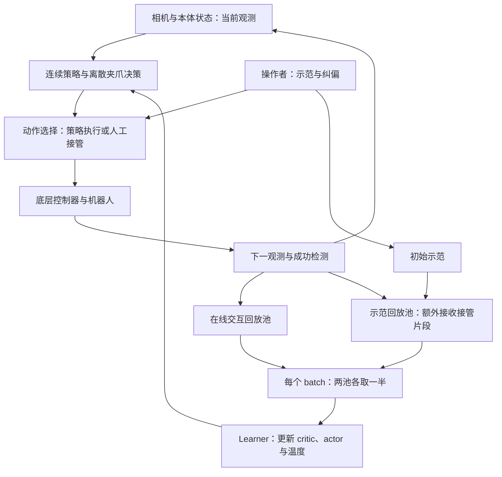
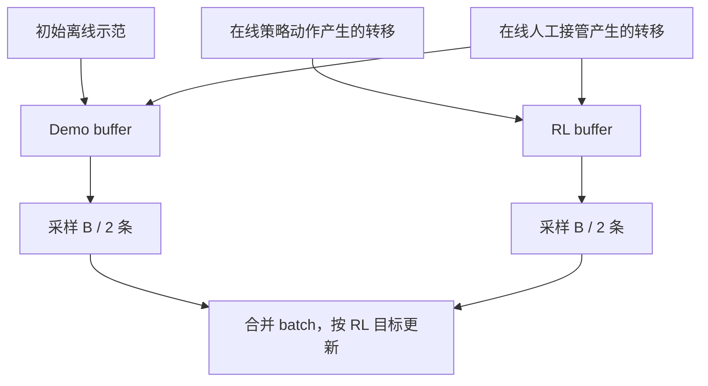

> **HIL-SERL 的核心思路是：用少量示范让机器人接近有效行为，用人类接管把探索带回可学习的区域，再用任务奖励和离策略强化学习改善成功率与执行速度。**
>
> 人提供的是实际执行的纠偏动作；算法利用的是“执行这个动作以后，任务有没有更接近成功”的长期价值。要理解这篇论文，需要把**数据如何产生、价值如何传播、动作如何更新、机器人如何执行**连起来看。

论文全名为 *Precise and Dexterous Robotic Manipulation via Human-in-the-Loop Reinforcement Learning*，作者是 UC Berkeley 的 Jianlan Luo、Charles Xu、Jeffrey Wu 和 Sergey Levine。HIL-SERL 指 Human-in-the-Loop Sample-Efficient Robotic Reinforcement Learning。本文依据 [论文 arXiv v3（2025-03-20）][paper]、[官方项目页][project]和[官方实现][repo]整理；论文最初于 2024 年提交。

本篇归入 [论文 → 强化学习]({{ '/publications/#paper-domain-reinforcement-learning' | relative_url }})。如果需要先复习 Bellman 方程、离策略学习和 Actor–Critic，可以配合 [强化学习基础笔记]()阅读。

**内容约定：**论文实验结果与作者设计会标明来源；中间推导、数值例子和复现建议是本文的解释。代码细节按 2026-09-21 查阅的官方 `main` 分支记录，它可能继续变化，不把当前默认配置当成所有论文实验的统一参数。

## 阅读路线与符号

全文以“把 RAM 内存条插入主板插槽”为贯穿例子：机器人需要接近插槽、对准、接触、调整并压入。一次轻微偏差可能让接触状态完全改变；完成动作后，图像上的差别却可能很小。

| 想回答的问题 | 对应章节 |
| --- | --- |
| 为什么需要人工纠偏，系统怎样工作？ | 第 1—2 节 |
| 奖励如何定义，critic 与 actor 到底学什么？ | 第 3—6 节 |
| 纠偏数据为什么有用，为什么要两个回放池？ | 第 7 节 |
| 图像、机械臂、夹爪和异步训练怎样结合？ | 第 8—11 节 |
| 如何读实验结论、检查代码和设计复现？ | 第 12—15 节 |

| 符号 | 含义 |
| --- | --- |
| $$s_t,o_t$$ | 真实环境状态与机器人可获得的观测 |
| $$a_t,g_t$$ | 连续动作与离散夹爪动作 |
| $$a_t^\pi,a_t^H$$ | 策略提议动作与人类纠偏动作 |
| $$z_t\in\{0,1\}$$ | 是否由人接管；不是奖励标签 |
| $$r_t,\gamma$$ | 执行动作后的奖励与折扣因子 |
| $$m_t$$ | 是否允许从下一观测自举；真正终止时为 0 |
| $$\pi_\theta,Q_{\phi_j}$$ | 连续随机策略与第 $$j$$ 个 critic |
| $$Q_{\bar\phi_j}$$ | 缓慢更新的目标 critic |
| $$\alpha,\mathcal H$$ | 熵正则权重与策略的微分熵 |
| $$\mathcal D_{\mathrm{demo}},\mathcal D_{\mathrm{RL}}$$ | 示范/纠偏回放池与在线交互回放池 |
| $$B,M$$ | 训练 batch 大小与连续 critic 数量 |

除讨论夹爪的第 9 节外，先用 $$a$$ 表示完整的连续控制动作，省略离散分支。下文的奖励 $$r_t$$ 对应转移 $$(o_t,a_t,o_{t+1})$$；不要把它误解成动作执行前已经知道的成功标签。

## 1. 论文要解决的困难：能模仿，不等于能稳定完成

### 1.1 接触任务中的误差会改变后续问题

假设示范中的内存条始终对准插槽。行为克隆可以学习：

$$
\min_\theta\;
\mathbb E_{(o,a^H)\sim\mathcal D_{\mathrm{demo}}}
[-\log\pi_\theta(a^H\mid o)].
$$

但策略运行时可能出现示范里没有的状态：一侧已经卡住，另一侧仍在槽外。如果继续输出“向下压”，误差不只是多了几毫米，还会改变接触力、摩擦、遮挡和可行动作。

这里同时存在两个问题：

1. **状态分布变化。**训练主要看到成功路径，运行时会访问偏离路径的状态。
2. **监督目标的限制。**拟合人的动作，并没有直接优化成功率、动作效率或接触后的恢复能力。

HG-DAgger 通过人在策略运行时接管，补充偏离状态上的动作标签。HIL-SERL 同样使用纠偏，但把这些动作连同后果存成转移，通过奖励学习长期价值。两者都能改善数据覆盖；**HIL-SERL 还利用任务结果决定哪些动作值得保留和改进。**这正是论文将 HG-DAgger 作为主要模仿学习对照的原因。[论文第 3—4 节][paper]

### 1.2 为什么不能直接从零探索？

对高精度插入任务，随机探索必须连续满足多个条件才会成功：

$$
\text{接近}
\rightarrow
\text{对齐}
\rightarrow
\text{建立合适接触}
\rightarrow
\text{调整}
\rightarrow
\text{完成}.
$$

为了直观理解，假设每一阶段独立成功的概率都是 $$p$$，共 $$K$$ 个阶段，那么随机获得一次完整成功的概率约为：

$$
P_{\mathrm{success}}\approx p^K.
$$

例如 $$p=0.2,K=5$$ 时，概率为 $$0.00032$$。这是解释探索困难的简化模型，实际阶段并不独立，但它说明：**稀疏奖励下，难点往往首先是得到有用的数据，然后才是如何更新网络。**

示范提供成功附近的数据；纠偏则在策略偏离时补上恢复路径。它们让真实交互更可能产生可用于学习的结果。

### 1.3 这篇工作的贡献应该怎样定位？

HIL-SERL 将以下部分组合成可以在真实机器人上运行的系统：

- RLPD 式离策略 Actor–Critic，支持先验数据与在线数据混合训练。
- 少量初始示范和运行中的人工接管。
- 由成功分类器提供的稀疏奖励。
- 预训练视觉表示、相对坐标表示、连续与离散动作分支。
- 面向接触任务的底层控制，以及异步采样和训练。

它的主要价值在于这些设计的协同效果及广泛的真实任务实验。不能仅用“SAC 加个人类按钮”概括，也不能把它解释成通过人类偏好打分训练奖励模型的 RLHF。此处的人工信息主要是**示范与实际纠偏动作**，任务奖励主要来自成功检测。[论文第 3 节][paper]

## 2. 先看完整系统：五条相互依赖的路径



图中的“actor”有两个相关含义：**策略网络**负责产生动作；**actor 进程**负责与机器人交互、记录数据和接收新参数。learner 进程在 GPU 上更新网络，两者异步通信。[论文第 3.2 节][paper]

离线准备与在线学习也应分开理解：

| 阶段 | 主要工作 | 产生的结果 |
| --- | --- | --- |
| 任务配置 | 确定相机、动作范围、控制器、复位和终止条件 | 可重复运行的机器人环境 |
| 奖励准备 | 收集成功/失败图像并训练分类器 | 可计算的任务奖励 |
| 初始示范 | 通常采集约 20—30 条示范轨迹 | 初始 demo buffer |
| 在线学习 | 策略执行，必要时人工接管，同时更新网络 | 在线数据和改进后的策略 |
| 独立评估 | 固定策略，在指定初始状态分布上自主执行 | 自主成功率、执行时间等 |

“用到示范”不代表必须先做一次行为克隆预训练。HIL-SERL 的核心训练路径直接把示范转移用于 RL 更新；不要在算法描述中自动加上论文没有要求的 BC 预训练阶段。

## 3. 从机器人任务到强化学习目标

### 3.1 观测不是完整的物理状态

典型观测可写成：

$$
o_t=
\left(
I_t^{(1)},\ldots,I_t^{(C)},
p_t^{\mathrm{tcp}},
R_t^{\mathrm{tcp}},
v_t^{\mathrm{tcp}},
w_t,
q_t^{\mathrm{grip}}
\right).
$$

其中图像来自一个或多个相机，其他项可以包含末端位姿、速度、力/力矩和夹爪状态，具体取决于任务。

图像和本体信息互补：图像提供目标相对位置与外观；本体信息提供机器人运动和接触线索。仅有图像不一定能区分“看起来对齐但已经卡住”和“正在顺利插入”。

严格地说，真实环境通常是部分可观测的：摩擦、物体内部接触、柔性物体形变等并不完全可见。论文以观测作为状态输入建立 MDP 式学习问题。下文 Bellman 推导使用这一近似；它不意味着单帧图像在物理上必然满足 Markov 性。

### 3.2 稀疏奖励与折扣回报

先考虑成功后终止的任务：

$$
r_t=
\begin{cases}
1,& \text{本次转移完成任务},\\
0,& \text{否则}.
\end{cases}
$$

策略希望最大化：

$$
J(\theta)
=
\mathbb E_{\tau\sim\pi_\theta}
\left[
\sum_{t=0}^{H-1}\gamma^t r_t
\right].
$$

如果成功只发生一次，发生在索引 $$T$$ 的转移上，那么：

$$
G_0=
\begin{cases}
\gamma^T,& \text{在时限内成功},\\
0,& \text{失败}.
\end{cases}
$$

对成功事件作条件分解：

$$
\boxed{
J(\theta)
=
P_\theta(\mathrm{success})
\,
\mathbb E_\theta
[\gamma^T\mid\mathrm{success}]
}
$$

所以，当 $$\gamma<1$$ 且成功时间可变时，目标同时偏好**更可能成功**和**更早成功**。只有在 $$\gamma=1$$，或奖励统一放在相同时间步等条件下，它才等价于最大化成功概率。

例如 $$\gamma=0.97$$：

$$
0.9\times 0.97^{10}\approx0.664,
\qquad
1.0\times 0.97^{50}\approx0.218.
$$

一个较快但成功率 90% 的策略，可能比慢很多但成功率 100% 的策略获得更高折扣回报。这个例子说明为什么需要**分别报告成功率和执行时间**，而不能只看训练 return。

如果成功后每一步都继续奖励 1，目标会变成奖励持续时间的累加；这已经改变了任务定义。奖励、终止条件与回报必须一起检查。

### 3.3 回放转移和终止掩码

每条样本至少包含：

$$
\xi_t=(o_t,a_t,r_t,o_{t+1},m_t).
$$

对于真正进入终止状态的转移：

$$
m_t=0.
$$

对于仍允许估计未来价值的转移：

$$
m_t=1.
$$

官方采样代码使用 `masks = 1.0 - done`，并在 `done or truncated` 时复位。因此复现时必须明确环境如何区分任务终止与时间截断。[采样代码][train-code]

如果时间限制只是人为切断一个本可继续的过程，通常仍允许自举；如果达到时限本身就是任务失败，则应按相应有限时域问题处理，必要时把剩余时间纳入状态。无论哪种定义，**下一观测都应属于本次转移，不能把复位后的新场景拼到旧动作后面。**

## 4. 成功分类器：把任务结果变成可计算的奖励

### 4.1 从二分类似然推导训练损失

设图像输入为 $$I$$，人工标签为 $$y\in\{0,1\}$$。分类器输出 logit：

$$
z_\psi(I)=f_\psi(I),
\qquad
p_\psi(I)=\sigma(z_\psi(I)).
$$

用 Bernoulli 分布描述标签：

$$
p_\psi(y\mid I)
=
p_\psi(I)^y
[1-p_\psi(I)]^{1-y}.
$$

最大化数据似然等价于最小化负对数似然：

$$
\mathcal L_{\mathrm{reward}}(\psi)
=
-\mathbb E_{(I,y)}
\left[
y\log p_\psi(I)
+(1-y)\log(1-p_\psi(I))
\right].
$$

为看清梯度，先对概率求导：

$$
\frac{\partial\ell}{\partial p}
=
-\frac{y}{p}
+\frac{1-y}{1-p}.
$$

再利用 sigmoid 的导数：

$$
\frac{\partial p}{\partial z}=p(1-p).
$$

链式法则得到：

$$
\boxed{
\frac{\partial\ell}{\partial z}=p-y
}
$$

因此，成功样本会把预测概率往上推，失败样本会往下推。这个学习问题只回答“当前是否完成任务”，并不预测动作价值。

### 4.2 分类概率不等于直接使用的奖励

一种常见构造是：

$$
r_t=
\mathbb 1
\left[
p_\psi(I_{t+1})>\kappa
\right].
$$

这里的 $$\kappa$$ 是阈值。实际任务还可能增加本体状态判据、稳定持续时间等条件。当前官方 RAM 配置使用高于 0.85 的分类概率，并联合一个额外本体状态条件；因此不能简单把实现写成“概率超过 0.5 就成功”。[RAM 任务配置][ram-config]

论文的分类器使用预训练 ResNet-10 特征与两层 MLP；附录 B 给出的训练设置为交叉熵、Adam、学习率 $$3\times10^{-4}$$、100 次训练迭代。这些是作者的设置，不是迁移到新任务后自动成立的收敛保证。[论文附录 B][paper]

**一个明确的例外是 Jenga whipping：它在每个 episode 结束时由人标注成功，且不使用实时纠偏。**不能因为方法总览主要介绍图像分类奖励，就把这个描述推广到所有任务。[论文附录 A.10][paper]

### 4.3 为什么奖励误判会被策略放大？

假设内存条只是遮住了插槽，看起来像已经插入，但实际上没有安装成功。如果分类器给出奖励，critic 会把这种状态当成有价值的目标，actor 会进一步寻找能重复产生该外观的动作。

这不是分类误差停留在一个数值上，而是：

$$
\text{奖励误判}
\rightarrow
\text{价值偏高}
\rightarrow
\text{策略更常访问}
\rightarrow
\text{误判状态进入更多训练数据}.
$$

做奖励验证时，应特别检查“非常接近成功但仍失败”的样本：只插入一侧、被夹爪挡住、接触后弹回、姿态正确但未锁止等。

整体 accuracy 也不足以判断是否可用。例如 200 张正样本、1000 张负样本中，全部预测失败就有：

$$
\frac{1000}{1200}\approx83.3\%
$$

的准确率。更有用的是成功判定的精确率、困难负例上的误报率，以及独立轨迹上的评估。相邻帧高度相似，随机按帧划分训练集与测试集容易高估泛化。

若暂时假设每步误报独立、概率为 $$p_f$$，长度为 $$H$$ 的轨迹中至少误报一次的概率为：

$$
1-(1-p_f)^H.
$$

当 $$p_f=0.001,H=200$$ 时约为 18.1%。实际帧间误差有相关性，这不是实际失败率预测；它提醒我们：**单帧误报很低，仍不等于整段交互可靠。**

## 5. Critic 推导：终点奖励如何影响早期动作？

### 5.1 从回报分解到 Bellman 方程

定义固定策略的动作价值：

$$
Q^\pi(o_t,a_t)
=
\mathbb E_\pi
\left[
\sum_{k=0}^{\infty}\gamma^k r_{t+k}
\;\middle|\;
o_t,a_t
\right].
$$

把第一项拿出来：

$$
\sum_{k=0}^{\infty}\gamma^k r_{t+k}
=
r_t+
\gamma
\sum_{k=0}^{\infty}\gamma^k r_{t+1+k}.
$$

下一动作由策略产生，所以：

$$
Q^\pi(o,a)
=
\mathbb E
\left[
r+\gamma m
\mathbb E_{a'\sim\pi(\cdot\mid o')}
Q^\pi(o',a')
\right].
$$

这说明：一个动作的价值不必等它自己立即产生奖励才知道。**如果它把系统带到一个后续容易成功的状态，它就可以通过自举获得正价值。**

### 5.2 目标网络与有限样本近似

实际训练用一条回放转移和一次下一动作采样近似期望：

$$
a'\sim\pi_\theta(\cdot\mid o'),
$$

$$
y=
r+\gamma m Q_{\bar\phi}(o',a').
$$

把 $$y$$ 当作当前监督目标：

$$
\mathcal L_Q(\phi)
=
\mathbb E_{\xi\sim\mathcal D}
\left[
\left(
Q_\phi(o,a)-\operatorname{sg}(y)
\right)^2
\right].
$$

其中 $$\operatorname{sg}$$ 表示停止梯度。于是：

$$
\nabla_\phi\mathcal L_Q
=
2\mathbb E
\left[
(Q_\phi(o,a)-y)
\nabla_\phi Q_\phi(o,a)
\right].
$$

这里没有对目标里的网络继续反向传播，因此是 TD 半梯度更新。若同时让预测和目标沿同一个误差自由变化，就失去了这种固定目标近似的含义。

目标网络使用 Polyak 平均：

$$
\bar\phi
\leftarrow
(1-\tau)\bar\phi+\tau\phi.
$$

较小的 $$\tau$$ 让目标变化更慢，减轻“自己追逐自己”的不稳定，但也引入滞后。它与 learner 向机器人广播策略参数是两件不同的事。

### 5.3 多 critic：目标取最小值，actor 使用平均值

论文主文使用简写的单个 $$Q$$；当前官方连续控制实现采用多个 critic，默认 launcher 配置为两个。目标值为：

$$
\boxed{
y=
r+\gamma m
\min_{j=1,\ldots,M}
Q_{\bar\phi_j}(o',a')
}
$$

对应损失为：

$$
\mathcal L_Q
=
\frac{1}{BM}
\sum_{i=1}^{B}
\sum_{j=1}^{M}
\left[
Q_{\phi_j}(o_i,a_i)-\operatorname{sg}(y_i)
\right]^2.
$$

取较小估计有助于减轻价值高估：当策略不断寻找 critic 给出高值的动作时，它可能利用估计误差，偏向实际上并不好的动作。两个估计的最小值可抑制部分乐观误差，但**不是具有校准覆盖率的价值置信下界**。

另一个容易读错的细节是：官方 actor 更新使用当前 critic 的**均值**，不是这里的最小值。[连续 SAC 实现][sac-code]

### 5.4 默认目标中没有熵自举项

标准 soft Bellman 写法常包含：

$$
y_{\mathrm{soft}}
=
r+\gamma m
\left[
Q_{\bar\phi}(o',a')
-\alpha\log\pi_\theta(a'\mid o')
\right].
$$

但本文讨论的 HIL-SERL 默认路径是：

$$
y_{\mathrm{HIL}}
=
r+\gamma m\min_jQ_{\bar\phi_j}(o',a'),
$$

同时在 actor 目标里保留熵正则。论文式 (1) 没有熵自举项，官方 launcher 也设置 `backup_entropy=False`。[论文式 (1)—(2)][paper]、[agent 配置][launcher-code]

因此，更准确的理解是：**critic 估计任务奖励的折扣价值，actor 改进时再用熵正则调节探索。**不要把标准 soft SAC 的整套公式直接替换到本文中，也不要据此声称该实现严格优化同一个包含全轨迹熵奖励的 soft-return 目标。

### 5.5 一个可以手算的目标值

取 $$\gamma=0.97$$，下一动作处两个目标 critic 的估计分别为 0.5 和 0.7：

$$
r=0,\quad m=1
\quad\Longrightarrow\quad
y=0+0.97\times0.5=0.485.
$$

若本次转移已成功终止：

$$
r=1,\quad m=0
\quad\Longrightarrow\quad
y=1.
$$

即便下一观测的网络误估值为 10 或 20，终止转移的目标仍然是 1。这个例子说明终止掩码不只是实现细节，它决定了回报的物理含义。

## 6. Actor 推导：怎样从价值估计得到更好的动作？

### 6.1 从熵正则目标到最小化损失

令当前 critic 的均值为：

$$
\bar Q_\phi(o,a)
=
\frac{1}{M}\sum_{j=1}^{M}Q_{\phi_j}(o,a).
$$

对固定观测，策略希望提高动作价值，同时保留一定随机性：

$$
\max_\theta\;
\mathbb E_{a\sim\pi_\theta}
[\bar Q_\phi(o,a)]
+
\alpha\mathcal H(\pi_\theta(\cdot\mid o)).
$$

连续分布的微分熵定义为：

$$
\mathcal H(\pi_\theta(\cdot\mid o))
=
-\mathbb E_{a\sim\pi_\theta}
[\log\pi_\theta(a\mid o)].
$$

代入并改为最小化：

$$
\boxed{
\mathcal L_\pi(\theta)
=
\mathbb E_{\substack{o\sim\mathcal D\\a\sim\pi_\theta}}
\left[
\alpha\log\pi_\theta(a\mid o)
-\bar Q_\phi(o,a)
\right]
}
$$

含义很直接：高价值动作应更常出现；熵项则避免策略过早收缩到一个尚未可靠验证的动作附近。[论文式 (2)][paper]、[策略损失实现][sac-code]

注意这里使用的是**回放中的观测和当前策略新采样的动作**，并非把回放中的人类动作直接当作 actor 的回归标签。

### 6.2 为什么这个目标会偏向高价值动作？

暂时假设 $$Q$$ 固定，并允许策略取任意连续概率密度。对单个观测考虑：

$$
\max_\pi\;
\int \pi(a)Q(a)\,da
-\alpha\int \pi(a)\log\pi(a)\,da,
$$

约束为：

$$
\int\pi(a)\,da=1.
$$

引入乘子 $$\lambda$$，对 $$\pi(a)$$ 求变分导数：

$$
Q(a)-\alpha[\log\pi(a)+1]+\lambda=0.
$$

整理：

$$
\log\pi(a)
=
\frac{Q(a)}{\alpha}
+\frac{\lambda}{\alpha}-1.
$$

利用归一化约束：

$$
\boxed{
\pi^*(a\mid o)
=
\frac{
\exp(Q(o,a)/\alpha)
}{
\int \exp(Q(o,\tilde a)/\alpha)\,d\tilde a
}
}
$$

这不是实际网络直接计算的公式，而是理解更新方向的理想解。$$\alpha$$ 越小，高值动作的相对权重越集中；$$\alpha$$ 越大，分布越平缓。

HIL-SERL 用参数化的 tanh-Gaussian 策略，通过梯度近似这一改善过程。真实函数族、critic 误差和回放分布都限制了理想解的可达性。

### 6.3 重参数化：让梯度穿过动作

策略先采样高斯噪声：

$$
\epsilon\sim\mathcal N(0,I),
$$

再生成未压缩动作：

$$
u_\theta(o,\epsilon)
=
\mu_\theta(o)+\sigma_\theta(o)\odot\epsilon,
$$

最后限制到归一化动作范围：

$$
a_\theta(o,\epsilon)=\tanh u_\theta(o,\epsilon).
$$

于是：

$$
\mathcal L_\pi(\theta)
=
\mathbb E_{o,\epsilon}
\left[
\alpha\log\pi_\theta(a_\theta\mid o)
-\bar Q_\phi(o,a_\theta)
\right].
$$

更新 actor 时，critic 参数保持固定，但仍需要 critic 对动作的导数：

$$
\nabla_\theta\mathcal L_\pi
=
\mathbb E
\left[
\alpha\frac{d}{d\theta}
\log\pi_\theta(a_\theta\mid o)
-
\left(\nabla_a\bar Q_\phi\right)^\top
\frac{\partial a_\theta}{\partial\theta}
\right].
$$

对 log probability 使用全导数，因为它既显式依赖策略参数，也通过采样动作依赖参数。

**冻结 critic 参数，不等于切断动作到 critic 输出的计算图。**后者会让 actor 收不到“往哪个动作方向可以提高价值”的信号。

### 6.4 tanh 之后为什么要修正概率密度？

一维情况下：

$$
a=\tanh u,
\qquad
\frac{da}{du}=1-\tanh^2u.
$$

变量替换公式给出：

$$
\pi(a\mid o)
=
p_U(u\mid o)
\left|\frac{du}{da}\right|.
$$

扩展到逐维 tanh：

$$
\boxed{
\log\pi(a\mid o)
=
\log\mathcal N
\left(u;\mu_\theta(o),\operatorname{diag}(\sigma_\theta^2(o))\right)
-
\sum_{k=1}^{d_a}
\log(1-\tanh^2u_k)
}
$$

直接用未压缩高斯的 log probability，会计算出错误的熵与策略梯度。实现时还需要稳定计算接近饱和区域的对数 Jacobian。

如果把归一化动作进一步映射为实际速度或力，固定的尺度变换还会改变概率密度的常数项。训练时应统一动作坐标与目标熵的约定，不能一边用归一化动作 log probability，一边套用另一套单位下的熵阈值。

### 6.5 温度自适应：为什么熵太低会增大探索权重？

希望平均策略熵至少接近某个目标 $$\mathcal H_{\mathrm{target}}$$。令采样熵估计为：

$$
\widehat{\mathcal H}
=
-\frac{1}{B}
\sum_{i=1}^{B}\log\pi_\theta(a_i\mid o_i).
$$

一种等价的温度优化写法是：

$$
\mathcal L_\alpha
=
\alpha\,
\operatorname{sg}
\left(
\widehat{\mathcal H}
-\mathcal H_{\mathrm{target}}
\right),
\qquad \alpha>0.
$$

其对 $$\alpha$$ 的导数为：

$$
\frac{\partial\mathcal L_\alpha}{\partial\alpha}
=
\widehat{\mathcal H}-\mathcal H_{\mathrm{target}}.
$$

若实际熵太低，导数为负，梯度下降会增大 $$\alpha$$；actor 随后更重视熵。如果熵太高，$$\alpha$$ 会减小。

官方实现使用正值拉格朗日乘子的参数化，并从下一观测处的策略采样估计熵。温度这一步不应反向更新 actor。[温度损失][sac-code]、[乘子实现][lagrange-code]

连续分布的微分熵可以为负，所以负的目标熵并不表示“负随机性”。它还依赖动作维度、尺度和概率密度的定义。

## 7. 人类纠偏与双回放池：HIL 真正作用在哪里？

### 7.1 接管首先改变了实际执行的动作

令 $$z_t=1$$ 表示当前由人接管，则：

$$
a_t^{\mathrm{exec}}
=
\begin{cases}
a_t^\pi,&z_t=0,\\
a_t^H,&z_t=1.
\end{cases}
$$

应保存的转移是：

$$
\left(
o_t,
a_t^{\mathrm{exec}},
r_t,
o_{t+1},
m_t
\right).
$$

假设策略提议“继续向下压”，但操作者实际执行“向上退一点并横向调整”，机器人因此恢复。如果仍把策略原动作存进 buffer，critic 就会错误地学到“继续下压导致恢复”。

官方采样逻辑明确用环境返回的 `intervene_action` 覆盖原提议，再存入转移。[actor 数据记录][train-code]

从行为分布看，可形式化写为：

$$
\beta(a\mid o)
=
[1-\rho(o)]\pi_\theta(a\mid o)
+
\rho(o)\pi_H(a\mid o),
$$

其中 $$\rho(o)$$ 是接管概率。这只是状态条件的简写；实际接管还会依赖人的观察历史、反应延迟和任务阶段。

**人工接管标志不自动等于负奖励，纠偏也不默认是人机动作加权融合。**这两种机制都可以另行设计，但不能当作本方法已经包含的步骤。

### 7.2 两个池分别存什么？



具体规则是：

- 初始示范进入 demo buffer。
- **所有在线转移**进入 RL buffer，包括人接管时产生的转移。
- 人工接管片段**额外**进入 demo buffer。
- 每个训练 batch 从两个池各取一半。[论文第 3.4—3.5 节][paper]、[回放路由与采样代码][train-code]

因此，一个在线纠偏转移可以同时存在于两个池中。两个池不是“人工数据”和“纯策略数据”的互斥划分。

论文有时把 RL buffer 中的数据称为 on-policy data，强调其来自在线采集。但算法整体仍是**离策略学习**：回放中有旧策略数据和人工动作，而更新时的下一动作来自当前策略。

### 7.3 50:50 混合为什么改变了样本权重？

设两个池当前大小为 $$N_D,N_R$$。混合分布为：

$$
p_{\mathrm{batch}}
=
\frac12p_D+\frac12p_R.
$$

若各池内部均匀采样，一条只存在于 RL buffer 的自动执行转移，被单次抽样选中的概率为：

$$
p_{\mathrm{auto}}=\frac{1}{2N_R}.
$$

一条在两个池中各存一份的纠偏转移，其总抽样概率为：

$$
p_{\mathrm{corr}}
=
\frac{1}{2N_D}
+
\frac{1}{2N_R}.
$$

因此：

$$
\frac{p_{\mathrm{corr}}}{p_{\mathrm{auto}}}
=
1+\frac{N_R}{N_D}.
$$

当 $$N_D=1000,N_R=9000$$ 时，一条纠偏转移的期望抽样权重约为普通在线转移的 10 倍。这并不创造新的经验，只是更频繁地复用稀缺的示范和纠偏。

固定混合比例能避免随着在线数据增加，关键恢复样本被大量无效探索稀释；代价是训练分布不再等于策略实际访问分布。函数逼近下，这个权重选择会影响哪些区域被拟合得更好。

### 7.4 为什么离策略学习能利用人工动作？

critic 对回放中的当前动作进行监督：

$$
Q_\phi(o,a^{\mathrm{exec}}).
$$

但目标中的下一动作重新由当前策略产生：

$$
a'\sim\pi_\theta(\cdot\mid o').
$$

所以它回答的是：

> 在这个状态先执行已记录的动作，之后按照当前策略继续，预期能获得多少任务回报？

当前动作可以来自人，也可以来自旧策略。只要记录了真实的状态转移，就可以用于估计环境对该动作的后果。离策略 TD 不要求每条样本的动作都来自当前 actor。

但这不意味着没有数据覆盖问题：如果当前策略在下一状态选择一个数据从未支持的动作，目标 critic 可能严重外推。双 critic、示范覆盖和持续在线纠偏能缓解问题，不能从理论上消除它。

### 7.5 一个恢复轨迹的价值传播例子

设某次交互形成了：

$$
o_0
\xrightarrow{a^\pi}
o_1
\xrightarrow{a^H_1}
o_2
\xrightarrow{a^H_2,\;r=1}
o_{\mathrm{terminal}}.
$$

其中 $$o_1$$ 是轻微卡住状态，人先纠正姿态，再完成插入。取 $$\gamma=0.9$$。

第一步，终点转移直接提供监督：

$$
Q(o_2,a^H_2)\leftarrow1.
$$

第二步，假设训练后当前策略在 $$o_2$$ 已能选择同样有效的完成动作，则：

$$
Q(o_1,a^H_1)
\leftarrow
0+0.9\times1=0.9.
$$

第三步，如果策略在 $$o_1$$ 也逐渐学会恢复，则：

$$
Q(o_0,a^\pi)
\leftarrow
0+0.9\times0.9=0.81.
$$

这展示了奖励如何沿可完成的路径向前传播。**关键条件是当前策略逐步学会后续动作。**算法并不因为后面存着人的成功动作，就无条件把整条链按专家行为回传；其 TD 目标使用的是当前策略下一动作。

actor 则通过 $$Q$$ 的动作梯度，把动作分布往能恢复、能完成的区域移动。这里没有必要额外引入：

$$
\|a_\theta(o)-a^H\|^2
$$

这样的行为克隆损失，官方核心 actor 目标也没有默认添加它。

### 7.6 为什么人不应一直替策略完成？

如果人每次都在困难阶段完成整个任务，训练曲线可能很好看，但策略自主通过困难状态的能力并未被独立验证。函数逼近和有限数据还可能让成功价值错误扩散到附近的坏动作。

较有价值的纠偏通常包含三部分：识别偏离、展示可恢复动作、把控制权交还策略。具体接管时机仍取决于任务风险、人的反应能力和机器人的低层限制。

评估应分开记录：

$$
\text{接管步占比}
=
\frac{\text{人工控制步数}}{\text{在线总步数}},
$$

以及接管次数、操作者实际工作时间、复位时间和**完全自主的成功率**。接管步占比降为零，也不意味着无人值守所需的人力成本已经为零。

## 8. 视觉与异步训练：为什么能在有限交互内学习？

### 8.1 先提取视觉特征，再与本体状态融合

论文使用预训练 ResNet-10 处理多视角图像，并融合本体信息。任务图像裁剪后通常调整为 $$128\times128$$，减少无关背景与视觉计算开销。[论文第 3.3 节及任务附录][paper]

可以用下式概括：

$$
h_t^{(c)}
=
f_{\mathrm{vision}}(I_t^{(c)}),
$$

$$
h_t^{\mathrm{prop}}
=
f_{\mathrm{prop}}(p_t),
$$

$$
h_t
=
\operatorname{concat}
\left(
h_t^{(1)},\ldots,h_t^{(C)},
h_t^{\mathrm{prop}}
\right).
$$

再把融合特征输入策略和价值网络。不同相机可以复用视觉骨干参数，但它们的特征在融合后仍对应不同视角。

当前 `resnet-pretrained` 路径对预训练卷积特征执行停止梯度，后续空间池化与投影部分仍可学习。因此，“使用预训练编码器”既不等于“全部视觉层都端到端微调”，也不等于“整个策略表示完全冻结”。[视觉编码器实现][vision-code]

这有助于降低早期 RL 梯度噪声对视觉特征的破坏，并减少可训练参数。但裁剪、相机布局和特征是否能分辨任务状态，仍然依赖具体工作场景。

### 8.2 Actor 和 learner 为什么要异步？

机器人需要按控制频率持续动作；GPU 则希望尽量复用已有数据。如果每个机器人动作后都阻塞等待完整训练，真实交互会被计算拖慢。

异步结构允许：

1. actor 持有近期策略参数，持续执行并提交转移。
2. learner 从回放池采样，在 GPU 上更新多次。
3. learner 定期广播参数，actor 换用新策略。

代价是策略有滞后，网络通信也可能有延迟。离策略学习能容纳一定滞后，但不是滞后越大越好；日志应能区分环境步、learner 步和策略版本。

### 8.3 三种“频率”不要混淆

| 量 | 分子与分母 | 它说明什么 |
| --- | --- | --- |
| 环境控制频率 | 每秒机器人交互步数 | 真实动作与观测更新速度 |
| Critic-to-actor ratio，CTA | critic 更新次数 / actor 更新次数 | 两类网络更新的相对频率 |
| Update-to-data ratio，UTD | critic 更新次数 / 新增环境转移数 | 一份真实数据被用于多少学习计算 |

当前公共配置中 `cta_ratio=2`：每轮先做一次 critic-only 更新，再做一次联合更新。它不意味着每个新机器人样本恰好对应两次更新，因为采样与训练异步运行。

同样，`steps_per_update=50` 表示 learner 周期性广播参数的步数间隔，不是 50 Hz 机器人控制频率。[训练循环][train-code]、[公共配置][config-code]

### 8.4 应核对的配置，而不是照抄的万能参数

| 项目 | 查阅到的默认/示例设置 | 阅读注意点 |
| --- | --- | --- |
| 混合 batch | 256，其中两池各 128 | 数据比例与池大小是不同概念 |
| 连续 critic 数量 | 2 | 不应自动套用其他 RLPD 实验的大 ensemble |
| actor / critic 隐层 | 256、256 | 视觉编码器另算 |
| critic 目标熵项 | `backup_entropy=False` | actor 仍有熵正则 |
| launcher 折扣 | 0.97 | 动态任务附录有 0.96、0.985 等设置 |
| 目标网络更新率 | 0.005 | 不等于参数广播周期 |
| 公共 CTA | 2 | 不等于固定 UTD |
| 论文环境更新 | 通常 10 Hz | 底层实时控制另有更高频率 |

这张表对应 [公共配置][config-code]、[launcher][launcher-code]、[SAC 默认参数][sac-code]和[论文附录][paper]。底层类的默认值可能被 launcher 或任务配置覆盖，复现应沿“入口 → 任务配置 → agent 构造”检查最终生效值。

## 9. 连续机械臂与离散夹爪：为什么要分开学？

### 9.1 “开、关、保持”不是普通连续速度

机械臂位姿调整适合连续动作，但夹爪常常只有三种有意义的指令：

$$
\mathcal G=
\{\mathrm{open},\mathrm{close},\mathrm{stay}\}.
$$

如果用一个连续高斯分布表达夹爪动作，再经过阈值转换，小幅数值变化可能触发完全不同的机械行为。

论文为夹爪训练单独的动作价值网络：

$$
Q_\eta^{\mathrm{grip}}(o,g).
$$

执行时：

$$
a_t\sim\pi_\theta(\cdot\mid o_t),
\qquad
g_t=\arg\max_{g\in\mathcal G}Q_\eta^{\mathrm{grip}}(o_t,g).
$$

双臂两个夹爪可以枚举 $$3^2=9$$ 种联合离散动作，从而直接表示两只夹爪的配合。[论文第 3.3 节][paper]

### 9.2 夹爪目标使用“在线选择，目标网络评价”

下一状态先由在线网络选动作：

$$
g^*
=
\arg\max_g Q_\eta^{\mathrm{grip}}(o',g).
$$

然后由目标网络评价这个动作：

$$
y_g
=
r_g+\gamma m
Q_{\bar\eta}^{\mathrm{grip}}(o',g^*).
$$

训练损失为：

$$
\mathcal L_{\mathrm{grip}}(\eta)
=
\mathbb E
\left[
\left(
Q_\eta^{\mathrm{grip}}(o,g)
-\operatorname{sg}(y_g)
\right)^2
\right].
$$

论文将它放在 DQN 框架下描述；从具体公式看，这是 Double DQN 式的选择与评价分离。[论文式 (3)][paper]、[单臂混合动作实现][hybrid-code]

手算例子：动作顺序为 open、close、stay，在线与目标估计分别为：

$$
Q_\eta(o',\cdot)=[0.4,0.9,0.5],
$$

$$
Q_{\bar\eta}(o',\cdot)=[0.8,0.6,0.7].
$$

在线网络选择 close，因此目标使用 0.6，**不是目标网络自己的最大值 0.8**。

### 9.3 夹爪惩罚与分支耦合

某些任务会对不必要的夹爪切换增加惩罚。当前混合动作实现中：

$$
r_g=r+\mathrm{grasp\_penalty}.
$$

这项额外惩罚用于夹爪 critic；连续 critic 的目标仍使用其配置下的任务奖励。不要把夹爪惩罚不加区分地写进所有分支。[夹爪损失实现][hybrid-code]

论文用两个 MDP 描述连续与离散决策，但物理系统并没有因此独立：机械臂移动是否有效依赖是否抓牢，夹爪何时松开也依赖机械臂姿态。

这种分解降低了动作建模难度；两个分支实际上在共享环境中相互影响。它不保证等价于求解完整联合价值：

$$
Q(o,a,g)
$$

的最优策略。对于连续动作与夹爪时序强耦合的任务，是否需要联合 critic、条件策略或更丰富的历史信息，是可以进一步研究的问题。

## 10. 机器人控制：RL 负责什么，底层负责什么？

### 10.1 相对位姿怎样消除对绝对基坐标的依赖？

设 $$T_{B0}$$ 表示本 episode 初始末端坐标系在基坐标系中的位姿，$$T_{Bt}$$ 表示当前末端位姿：

$$
T_{B0}
=
\begin{bmatrix}
R_0&p_0\\
0&1
\end{bmatrix},
\qquad
T_{Bt}
=
\begin{bmatrix}
R_t&p_t\\
0&1
\end{bmatrix}.
$$

初始末端系下的当前相对位姿为：

$$
T_{0t}=T_{B0}^{-1}T_{Bt}.
$$

先写出刚体变换的逆：

$$
T_{B0}^{-1}
=
\begin{bmatrix}
R_0^\top&-R_0^\top p_0\\
0&1
\end{bmatrix}.
$$

相乘得到：

$$
\boxed{
T_{0t}
=
\begin{bmatrix}
R_0^\top R_t&R_0^\top(p_t-p_0)\\
0&1
\end{bmatrix}
}
$$

因此网络可以接收“相对起点移动和旋转了多少”，而不是固定桌面上某个绝对位置。[论文附录 D.1][paper]

进一步，若只改变全局参考坐标，两个位姿左乘同一个刚体变换 $$G$$：

$$
T_{B0}'=GT_{B0},
\qquad
T_{Bt}'=GT_{Bt},
$$

则：

$$
(T_{B0}')^{-1}T_{Bt}'
=
T_{B0}^{-1}G^{-1}GT_{Bt}
=
T_{0t}.
$$

这是相对位姿对全局坐标变换不变的严格代数结论。它**不等于策略对任意目标移动都自动不变**：物体移动、相机视角变化、遮挡和接触变化仍会改变观测与任务。

### 10.2 当前末端系动作与初始末端系观测不同

论文中，本体位姿相对 episode 起始末端系表达；多数连续动作则相对**当前**末端系表达。两个参考系不要混为一个。

若动作是同一末端原点处的平移速度与角速度，变到基系表达时可以分别旋转：

$$
v_B=R_{Bt}v_t,
\qquad
\omega_B=R_{Bt}\omega_t.
$$

若接口使用的是改变参考原点的完整刚体 twist，则需要 adjoint 变换。以 $$[v;\omega]$$ 顺序写为：

$$
\begin{bmatrix}
v_B\\
\omega_B
\end{bmatrix}
=
\begin{bmatrix}
R&[p]_\times R\\
0&R
\end{bmatrix}
\begin{bmatrix}
v_t\\
\omega_t
\end{bmatrix}.
$$

这两式对应的线速度定义不同：**同一点的速度换坐标**与**空间 twist 改参考原点**不能混用。论文附录的 adjoint 矩阵采用 $$[\omega;v]$$ 顺序，因此非零块的位置与这里不同。接入控制 API 时应先核对顺序、原点和单位。

更完整的相机、末端与速度坐标关系，可以参照 [视觉伺服笔记]()。

### 10.3 阻抗控制为什么有利于接触探索？

以下用平移部分的简化模型解释，统一定义：

$$
e=x_{\mathrm{ref}}-x.
$$

期望笛卡尔力为：

$$
F_{\mathrm{cmd}}
=
K_p e+
K_d(\dot x_{\mathrm{ref}}-\dot x).
$$

如果机器人被刚性物体挡住，实际位置不再跟随目标，而参考位置还在累积，$$e$$ 就可能不断增大，弹簧项也随之增大。

对参考误差按分量限制：

$$
\tilde e_i
=
\operatorname{clip}(e_i,-\Delta_i,\Delta_i),
$$

使用：

$$
F_{\mathrm{cmd}}
=
K_p\tilde e+
K_d(\dot x_{\mathrm{ref}}-\dot x).
$$

若 $$K_p$$ 为对角矩阵，则弹性分量满足：

$$
\left|
[K_p\tilde e]_i
\right|
\le k_{p,i}\Delta_i.
$$

例如 $$k_p=300\,\mathrm{N/m}$$、$$\Delta=0.01\,\mathrm m$$，该轴弹性项上限为 3 N。它**不是总接触力上限**：阻尼、前馈力、惯性、碰撞瞬态和控制误差仍需单独考虑。

再通过机器人 Jacobian 将笛卡尔 wrench 映射为关节力矩，示意为：

$$
\tau_{\mathrm{cmd}}
=
J(q)^\top
\begin{bmatrix}
F_{\mathrm{cmd}}\\
M_{\mathrm{cmd}}
\end{bmatrix}
+
\tau_{\mathrm{null}}
+
\tau_{\mathrm{comp}}.
$$

实际还涉及转动误差、零空间控制和动力学补偿。这里是说明机制的简化推导，不能直接当作完整机械臂控制器。

### 10.4 高频控制与低频策略各司其职

论文的策略/环境交互通常为 10 Hz，而底层实时控制为 1000 Hz。[论文任务附录与 D.2][paper]

- 高层策略根据图像和状态，决定接下来如何移动、调整或施力。
- 底层控制在两次策略决策之间持续运行，使运动和接触响应保持稳定。

因此不能把“10 Hz 的视觉策略”理解成“机械臂每秒只做 10 次反馈控制”。反过来，底层高频稳定也不能弥补所有高层错误：策略若持续选择错误接触方向，任务仍然可能失败。

动态任务还有另一条路径：Jenga whipping 和物体翻转使用末端系下的低维前馈 wrench 动作，而不是统一使用位姿/速度目标。Jenga 的示例为 $$F_x,F_z,\tau_z$$，翻转为 $$F_x,F_z,\tau_y$$。它们依赖力的时序与机器人动力学，不能直接套用插入任务的控制接口。[论文附录 A.10—A.11][paper]

## 11. 把方法落到训练流程与代码

### 11.1 一份保留关键因果关系的伪代码

下面省略网络通信、图像增强和异常处理，只描述核心数据与更新关系。它是本文的教学伪代码，不是可以直接连接机器人的训练脚本。

```text
离线准备：
    配置相机、动作尺度、控制器、复位与终止规则
    用成功/失败样本训练奖励分类器（特殊任务另行定义奖励）
    收集初始示范，将真实转移放入 D_demo
    初始化连续策略、critic、目标 critic 与温度
    有夹爪时，初始化离散 grasp critic 及目标网络

Actor 进程：
    获取当前观测 o
    用当前策略产生提议动作 a_policy
    若人接管，则由环境执行 a_human；否则执行 a_policy
    获取下一观测、奖励、终止标志，以及实际执行动作 a_exec
    将 (o, a_exec, r, o_next, mask) 放入 D_RL
    若本步由人接管，再额外放入 D_demo
    终止或截断时复位，否则继续
    异步接收 learner 广播的新策略参数

Learner 进程：
    等待在线池拥有启动训练所需的数据
    循环：
        从 D_demo、D_RL 各采样半个 batch
        在下一观测上，用当前策略重新采样下一动作
        用目标 critic 的最小值形成 TD 目标
        更新连续 critic；有夹爪时也更新 grasp critic
        按设定的 critic-to-actor 比例：
            用当前 critic 的均值更新 actor
            更新熵温度
        对目标网络做 Polyak 更新
        定期向 actor 进程广播参数
```

检查这段流程时，先关注三个问题：**真实执行动作是否记录正确？成功与终止语义是否一致？下一动作是否来自当前策略？**这三个问题会直接改变训练目标。

### 11.2 一个不依赖机器人的 NumPy 数值检查

这段代码只验证目标值和损失的数值关系，不实现图像网络、自动微分或真实控制。

数组维度统一为 `[batch, critic]`，与官方代码常见的 `[critic, batch]` 排列不同，避免照搬时把归约轴写反。

```python
import numpy as np


def continuous_target(reward, mask, target_q, gamma=0.97):
    """target_q: [batch, critic]，已在当前策略采样的下一动作处求值。"""
    return reward + gamma * mask * np.min(target_q, axis=1)


def actor_loss(log_prob, current_q, alpha):
    """current_q: [batch, critic]，在当前策略新采样的动作处求值。"""
    return np.mean(alpha * log_prob - np.mean(current_q, axis=1))


def gripper_target(reward, penalty, mask, online_q, target_q, gamma=0.97):
    """夹爪使用在线网络选动作，再查询目标网络的对应动作值。"""
    best = np.argmax(online_q, axis=1)
    selected = target_q[np.arange(len(best)), best]
    return reward + penalty + gamma * mask * selected


r = np.array([0.0, 1.0, 0.0])
m = np.array([1.0, 0.0, 1.0])
next_q = np.array([[0.5, 0.7], [10.0, 20.0], [0.2, 0.4]])
y = continuous_target(r, m, next_q)
np.testing.assert_allclose(y, [0.485, 1.0, 0.194])

# 两个 critic 的均值分别为 0.7、0.3。
q = np.array([[0.6, 0.8], [0.2, 0.4]])
logp = np.array([-0.3, -0.7])
loss = actor_loss(logp, q, alpha=0.1)
np.testing.assert_allclose(loss, -0.55)

# online 的最优动作是索引 1；target 对应值为 0.6，而非最大值 0.8。
yg = gripper_target(
    reward=np.array([0.0]),
    penalty=np.array([-0.02]),
    mask=np.array([1.0]),
    online_q=np.array([[0.4, 0.9, 0.5]]),
    target_q=np.array([[0.8, 0.6, 0.7]]),
)
np.testing.assert_allclose(yg, [0.562])

print("continuous target:", y)
print("actor loss:", loss)
print("gripper target:", yg)
```

其中连续 critic 的终止样本故意给出了很大的下一价值，用来检查掩码；夹爪示例故意让在线和目标网络的最优动作不同，用来检查 Double DQN 的选择方式。

### 11.3 阅读官方实现的顺序

| 文件 | 重点查看 |
| --- | --- |
| [`examples/train_rlpd.py`][train-code] | 接管动作替换、两个数据通道、50:50 采样、异步广播 |
| [`agents/continuous/sac.py`][sac-code] | critic 目标、actor 的 critic 均值、温度更新、目标网络 |
| [`agents/continuous/sac_hybrid_single.py`][hybrid-code] | 连续动作与离散夹爪的分支更新 |
| [`utils/launcher.py`][launcher-code] | 真正传入 agent 的配置，尤其 `backup_entropy` |
| [`vision/resnet_v1.py`][vision-code] | 预训练特征的梯度边界与可训练池化 |
| [`examples/experiments/config.py`][config-code] | batch、CTA、参数广播等公共配置 |
| [`examples/experiments/ram_insertion/config.py`][ram-config] | 相机、wrapper、动作与奖励条件 |
| [`docs/franka_walkthrough.md`][walkthrough] | 从环境配置到数据收集和运行训练的工程步骤 |

建议先读数据记录，再读损失函数。数据语义若看错，公式即使抄对，也可能解释成另一个算法。

## 12. 实验结果：提升在哪里，结论应到哪里为止？

### 12.1 主要结果与训练耗时

下面按论文 Table 1(a) 整理。“模仿基线”多数为使用在线纠偏的 HG-DAgger；Jenga 与翻转任务使用离线 BC，分别训练于 50、200 条示范。大部分任务测试 100 次，IKEA 整体组装测试 10 次。[论文 Table 1(a)][paper]

| 任务 | RL 训练时间 / h | 模仿基线成功率 | HIL-SERL 成功率 | 基线执行时间 / s | HIL-SERL / s |
| --- | --- | --- | --- | --- | --- |
| RAM 插入 | 1.5 | 29% | 100% | 8.3 | 4.8 |
| SSD 安装 | 1 | 79% | 100% | 6.7 | 3.3 |
| USB 抓取与插入 | 2.5 | 26% | 100% | 13.4 | 6.7 |
| 线缆卡入 | 1.25 | 95% | 100% | 7.2 | 4.2 |
| IKEA 侧板 1 | 2 | 77% | 100% | 6.5 | 2.7 |
| IKEA 侧板 2 | 1.75 | 79% | 100% | 5.0 | 2.4 |
| IKEA 顶板 | 1 | 35% | 100% | 8.9 | 2.4 |
| IKEA 整体组装 | — | 1/10 | 10/10 | — | — |
| 汽车仪表板组装 | 2 | 41% | 100% | 20.3 | 8.8 |
| 双臂物体交接 | 2.5 | 79% | 100% | 16.1 | 13.6 |
| 同步带装配 | **6** | 2% | 100% | 9.1 | 7.2 |
| Jenga whipping | 1.25 | 8% | 100% | — | — |
| 物体翻转 | 1 | 46% | 100% | 3.9 | 3.8 |
| 论文报告的平均值 | — | 49.7% | 100% | 9.6 | 5.4 |

**“约 1—2.5 小时”描述了多数单项任务，不包括耗时约 6 小时的同步带装配。**训练时间包含作者计入的脚本运动、策略运行、计划停顿和单张 RTX 4090 上的在线计算；不应理解成从零搭好机械臂、准备数据、开发奖励、调试控制器到交付的总工时。[论文第 4.3 节][paper]

平均成功率从 49.7% 到 100%：

$$
100\%-49.7\%=50.3\text{ 个百分点},
$$

相对提升约为：

$$
\frac{100-49.7}{49.7}\approx101\%.
$$

执行时间的均值比为：

$$
\frac{9.6}{5.4}\approx1.78.
$$

这对应论文所述约 1.8 倍执行速度；以平均时间衡量，降低约 43.8%。不要把“1.8 倍速度”写成“时间减少 80%”。

这里的 49.7% 可由 12 个单项任务的成功率取算术平均得到，IKEA 整体组装的 1/10 不包含在该均值中；执行时间均值则对应有时间数据的 11 个单项任务。表中有整体任务与子任务，也有不同测试次数，不能不加区分地把所有行混合统计。

### 12.2 100 次成功说明什么？

如果一个固定策略在指定测试分布上 100 次全部成功，观测成功率确实是 100%，但不能据此断言真实成功概率严格等于 1。

作为本文补充的统计说明，若试验独立同分布，$$n$$ 次全部成功的双侧 95% Clopper–Pearson 区间下界为：

$$
p_{\mathrm{lower}}=0.025^{1/n}.
$$

所以：

$$
n=100:\quad p_{\mathrm{lower}}\approx0.9638,
$$

$$
n=10:\quad p_{\mathrm{lower}}\approx0.6915.
$$

这不是论文额外报告的置信区间，而是说明样本量对结论强度的影响。真实机器人测试还可能存在相关性、人工复位差异和环境分布变化，不能直接当作无限场景的可靠性保证。

### 12.3 消融实验比总分更能解释机制

为便于阅读，将 Table 1(b) 拆成两张表，数值均为成功率百分比。[论文 Table 1(b)][paper]

| 方法 | RAM 插入 | 仪表板组装 | 物体翻转 |
| --- | --- | --- | --- |
| Diffusion Policy | 27 | 18 | 56 |
| HG-DAgger | 29 | 41 | 46 |
| 离线 BC | 12 | 35 | 46 |
| IBRL | 75 | 0 | 95 |
| Residual RL | 0 | 0 | 97 |
| DAPG | 8 | 18 | 72 |

| HIL-SERL 设置 | RAM 插入 | 仪表板组装 | 物体翻转 |
| --- | --- | --- | --- |
| 无示范、无纠偏 | 0 | 0 | 0 |
| 有示范、无纠偏 | 48 | 0 | 100 |
| 完整设置 | 100 | 100 | 100 |

从中可以得到三个具体判断：

1. **从零探索在这些任务和预算下失败。**这支持示范/纠偏对稀疏奖励探索的重要性，不等于所有真机 RL 都不能从零学习。
2. **纠偏对接触装配尤其关键。**RAM 从 48 到 100，仪表板从 0 到 100，说明初始示范没有充分覆盖策略运行中的偏离与恢复状态。
3. **实时纠偏并非每个任务都必需。**翻转任务有示范而无纠偏已达到 100；Jenga 也刻意不使用实时接管，因为动作太快，不适合人在线修正。

DP 和离线 BC 使用 200 条示范；IBRL、Residual RL、DAPG 同样以 200 条示范初始化；HG-DAgger 尽量匹配 HIL-SERL 的交互 episode 与纠偏次数。这些方法获得的数据类型和在线交互机会不同，不能把表格解读成严格相等总成本下的普适算法排序。

### 12.4 为什么不能从这里推出“Diffusion Policy 不行”？

论文附录 C 给出的 DP 设置为：

| 任务 | 示范数 | 观测窗口 | 预测动作长度 | 每次执行动作数 |
| --- | --- | --- | --- | --- |
| RAM 插入 | 200 | 1 | 8 | 2 |
| 仪表板组装 | 200 | 1 | 8 | 4 |
| 物体翻转 | 200 | 1 | 1 | 1 |

这些结果说明：在作者的任务、观测、动作窗口与训练设置下，所测 DP 基线不如 HIL-SERL。它们没有穷尽更大数据量、不同视觉表征、不同时间窗口、在线纠偏或 RL 微调后的扩散策略。

更合理的比较是：**高精度接触任务中，学习运行时的恢复状态，并根据任务结果继续改进，可能比只扩大离线动作拟合能力更关键。**关于 DP 的条件去噪与滚动执行机制，可对照 [Diffusion Policy 笔记]()。

## 13. 作者的行为分析：哪些观察支持了“可靠策略”？

### 13.1 状态分布像漏斗，意味着什么？

论文在 RAM 任务中分析状态访问分布：初始位置分散，随着执行推进，轨迹逐渐进入更窄的成功区域，呈现类似“漏斗”的形状。结合扰动后恢复的行为，这支持策略学到了反馈修正。[论文第 5.1 节][paper]

可以用控制语言理解：

$$
\text{多种初始偏差}
\longrightarrow
\text{反馈调整}
\longrightarrow
\text{较集中的接触/完成状态}.
$$

但访问分布收缩不是 Lyapunov 稳定性证明。要证明某个平衡点稳定，还需要构造函数 $$V(s)$$ 并分析例如：

$$
V(s)>0,\qquad
\Delta V(s)<0
$$

在相应区域内是否成立。论文提供的是实验层面的可靠性与恢复证据，不是全局收敛定理。

### 13.2 “关键状态”的 Q 方差，是动作敏感度

作者对动作加入扰动，计算价值变化的方差，以识别动作选择特别重要的状态。论文使用归一化动作上的均匀扰动，范围为 $$[-0.2,0.2]$$，通过 100 个采样近似分析量。[论文第 5.1 节][paper]

其核心可写为：

$$
S(o,a)
=
\operatorname{Var}_{\epsilon}
[Q(o,a+\epsilon)].
$$

为了理解它，令：

$$
g=\nabla_a Q(o,a).
$$

在动作附近做一阶展开：

$$
Q(o,a+\epsilon)
\approx
Q(o,a)+g^\top\epsilon.
$$

常数项不影响方差：

$$
S(o,a)
\approx
\operatorname{Var}(g^\top\epsilon)
=
g^\top\Sigma_\epsilon g.
$$

若各维扰动独立且均匀分布于 $$[-c,c]$$，则：

$$
\mathbb E[\epsilon_i]=0,
\qquad
\operatorname{Var}(\epsilon_i)=\frac{c^2}{3}.
$$

所以：

$$
\Sigma_\epsilon=\frac{c^2}{3}I,
$$

$$
\boxed{
S(o,a)
\approx
\frac{c^2}{3}
\|\nabla_a Q(o,a)\|^2
}
$$

这项推导是本文对分析指标的局部解释，要求扰动足够小、局部近似合理；动作裁剪边界和高曲率会改变结果。

它告诉我们：若动作稍微变化就造成明显价值差异，这个状态可能需要更精确的控制。**这里是同一个 Q 对动作扰动的敏感度，不是不同 critic 之间的模型不确定性，也不是经过校准的失败概率。**

### 13.3 反应式与预测式行为应怎样理解？

RAM 插入需要持续根据观测调整；Jenga whipping 需要在很短时间内形成一致而精确的动态动作。论文通过行为和动作分布分析讨论了 reactive 与 predictive 的差异。[论文第 5.2 节][paper]

但某段轨迹动作方差很小，只能说明给定观测下策略较集中。它不能单独证明：

- 策略完全不使用图像。
- 网络内部学到了显式物理世界模型。
- 执行过程中运行了 MPC 或轨迹优化。

要进一步区分这些解释，可以冻结某些观测、加入受控扰动或做时序消融，检查动作和成功率如何变化。这些是后续分析方法，不是该论文已经给出的全部证据。

## 14. 与已有知识建立联系

### 14.1 与行为克隆、HG-DAgger、RLHF 的区别

| 方法 | 人提供的主要信息 | 训练直接优化什么 | 是否利用动作后果进行长期价值学习 |
| --- | --- | --- | --- |
| 行为克隆 | 离线示范动作 | 动作似然或回归误差 | 通常否 |
| HG-DAgger | 策略运行时的接管动作 | 扩展数据集上的动作拟合 | 通常否 |
| HIL-SERL | 初始示范与在线纠偏 | 任务价值与带熵正则的策略改善 | 是 |
| 典型偏好式 RLHF | 对输出的偏好或排序 | 由偏好建模得到的奖励及相关目标 | 依具体算法 |

HIL-SERL 既利用人改善数据分布，也用奖励评价动作后果。若去掉奖励与 TD 更新，只保留纠偏动作监督，就更接近 HG-DAgger；若仅增加一个成功分类器而没有在线策略改进，也不能称为完成了 HIL-SERL。

### 14.2 与视觉伺服的关系

经典视觉伺服常建立：

$$
\dot e=L(e,Z)v
$$

这样的局部关系，再求解使视觉误差下降的控制速度。HIL-SERL 直接学习：

$$
o\longmapsto\pi_\theta(a\mid o),
$$

并通过任务回报评估动作。它不要求显式给出图像交互矩阵，能把视觉、本体和接触经验共同用于决策；代价是更依赖数据覆盖与训练验证。

对于接近、对准等可建模部分，视觉伺服仍很有价值；对于接触后恢复、摩擦变化和难以写出精确目标误差的阶段，学习策略可能更有优势。混合两者可以作为系统设计方向，但这不是本文论文实验已经验证的统一方案。

### 14.3 与 MPC、世界模型的关系

HIL-SERL 的 critic 估计长期回报：

$$
Q(o,a)\approx\text{执行该动作后长期完成任务的价值}.
$$

这不同于显式预测下一状态：

$$
\hat o_{t+1}=f_\psi(o_t,a_t),
$$

也不同于在运行时对未来动作序列滚动优化。它是 model-free Actor–Critic 系统；“考虑长期后果”不要求一定存在显式模型预测器。

底层控制可以使用机器人动力学和 Jacobian，同时高层 RL 仍然是 model-free。两个描述位于不同层级，并不矛盾。

### 14.4 为什么它可能超越遥操作示范？

人类遥操作受反应延迟、输入设备、观察角度和运动精度限制。示范展示可行路径，但不一定展示该机器人上最快、最稳定的路径。

RL 在成功路径附近继续试验，通过奖励与价值学习可以：

- 减少无效停顿和重复调整。
- 改善接触阶段的动作幅度与时序。
- 利用机器人的控制重复性。
- 从成功与失败的差异中修正策略。

这解释了为什么论文同时观察到成功率提高和执行时间缩短。但改进依赖可靠奖励、有效探索与充分的数据支持；“用了 RL”本身不保证超越任何专家。

## 15. 如果作为自己的研究起点，应该怎样复现和判断？

### 15.1 先确认任务是否适合这条路线

较合适的起点通常具有以下特征：任务可重复复位，成功判据可验证，人能通过遥操作给出有效示范，初始状态范围可控，而且一次交互成本仍允许进行在线试验。

对于高速动作，人可能来不及实时纠偏；对于长时序任务，人力、复位和奖励归因可能成为主要成本；对于大范围场景变化，裁剪图像与相对坐标也未必提供足够泛化。

因此，先选一个明确、短时、可观测的子任务，比直接把所有装配阶段塞进一个稀疏终点奖励更容易判断方法是否有效。

### 15.2 一个可核查的复现顺序

1. **固定环境语义。**记录动作坐标系、尺度、控制频率、观测时间戳、终止条件和复位方式；验证遥操作与策略动作走的是一致接口。
2. **验证奖励。**按独立轨迹划分数据，加入接近成功的困难负例，报告误报与漏报，而不是只报 accuracy。
3. **检查示范数据。**逐项核对观测、实际动作、奖励、下一观测和掩码，确认没有把复位后的观测接到旧轨迹。
4. **运行小规模在线训练。**观察目标值、critic 误差、策略熵、动作饱和比例、接管次数和自主失败模式。
5. **独立评估 checkpoint。**固定评估协议，禁止人为帮助完成；若触发保护停止，应按事先定义计入失败或单独明确报告，不能悄悄剔除。
6. **做有针对性的消融。**比较仅示范、加入纠偏、不同混合比例、奖励阈值和观测组合，每次只改变能解释问题的因素。

如果评估采用随机策略采样或确定性动作，应在结果中说明。当前官方入口的 checkpoint 评估仍调用 `argmax=False`；不能默认认为“eval 模式”就自动使用确定性均值动作。[评估入口][train-code]

### 15.3 最少应该记录哪些实验成本与指标？

| 类别 | 建议记录 |
| --- | --- |
| 自主性能 | 成功次数/总次数、失败类型、执行时间分布 |
| 训练效率 | 环境转移数、真实训练墙钟时间、learner 更新数 |
| 人力 | 初始示范数、奖励标注量、接管次数与时长、复位与监督工时 |
| 稳定性 | 多个随机种子、不同 checkpoint、训练崩溃或回退 |
| 分布范围 | 初始位姿、目标变化、相机条件、负载与接触条件 |
| 运行约束 | 动作/力限幅、延迟、保护停止、动作饱和频率 |

论文展示了多个任务的强结果，但这些通常是**针对具体任务训练的策略**，不是一个策略同时掌握所有任务，也不是开箱即用的通用机器人基础模型。

### 15.4 用六个问题检查自己是否真正理解

**问题一：人类接管时，critic 的输入动作应是什么？**

实际执行的人工动作。否则记录的动作与产生下一观测的原因不一致。

**问题二：有了成功示范，为什么策略仍可能失败？**

示范没有覆盖所有运行状态；actor 可能在下一状态选择不受数据支持的动作；奖励和价值估计也可能有误。

**问题三：纠偏样本为什么可以比普通在线样本更常被训练？**

它同时进入两个池，而每个 batch 对两池等比例采样。小 demo buffer 中的样本会获得较高的重复利用率。

**问题四：critic 用最小值，actor 也一定用最小值吗？**

不是。本文核对的官方实现用目标 critic 最小值做自举，用当前 critic 均值更新 actor。

**问题五：人的手离开遥操作器，是否足以证明机器人完全自主？**

不足以。还要明确奖励标注、监督、复位、异常处理和评估中是否存在人工帮助；自主任务成功与整个训练系统无人值守是不同指标。

**问题六：论文最值得迁移到新任务的思想是什么？**

在真实机器人上，学习目标、数据分布和控制接口共同决定可学习性。示范提供起点，纠偏补足恢复路径，奖励选择有效行为，稳定的底层控制让探索与反馈能够持续发生。

## 参考资料

- [论文：Precise and Dexterous Robotic Manipulation via Human-in-the-Loop Reinforcement Learning，arXiv v3][paper]：方法第 3 节、结果 Table 1、分析第 5 节、附录 A—D。
- [论文版本记录][paper-abs]：区分初稿与修订版。
- [HIL-SERL 官方项目页][project]：工作概览与官方入口。
- [HIL-SERL 官方代码仓库][repo]：环境、训练、网络与任务配置。
- [Franka 复现说明][walkthrough]：机器人配置与数据准备步骤。

本文流程图、公式展开、手算例子和数值检查代码为学习性整理；实验数据按原论文标注来源，代码分析对应查阅时的官方实现。

[paper]: https://arxiv.org/html/2410.21845v3
[paper-abs]: https://arxiv.org/abs/2410.21845
[project]: https://hil-serl.github.io/
[repo]: https://github.com/rail-berkeley/hil-serl
[train-code]: https://github.com/rail-berkeley/hil-serl/blob/main/examples/train_rlpd.py
[sac-code]: https://github.com/rail-berkeley/hil-serl/blob/main/serl_launcher/serl_launcher/agents/continuous/sac.py
[hybrid-code]: https://github.com/rail-berkeley/hil-serl/blob/main/serl_launcher/serl_launcher/agents/continuous/sac_hybrid_single.py
[launcher-code]: https://github.com/rail-berkeley/hil-serl/blob/main/serl_launcher/serl_launcher/utils/launcher.py
[config-code]: https://github.com/rail-berkeley/hil-serl/blob/main/examples/experiments/config.py
[ram-config]: https://github.com/rail-berkeley/hil-serl/blob/main/examples/experiments/ram_insertion/config.py
[lagrange-code]: https://github.com/rail-berkeley/hil-serl/blob/main/serl_launcher/serl_launcher/networks/lagrange.py
[vision-code]: https://github.com/rail-berkeley/hil-serl/blob/main/serl_launcher/serl_launcher/vision/resnet_v1.py
[walkthrough]: https://github.com/rail-berkeley/hil-serl/blob/main/docs/franka_walkthrough.md
