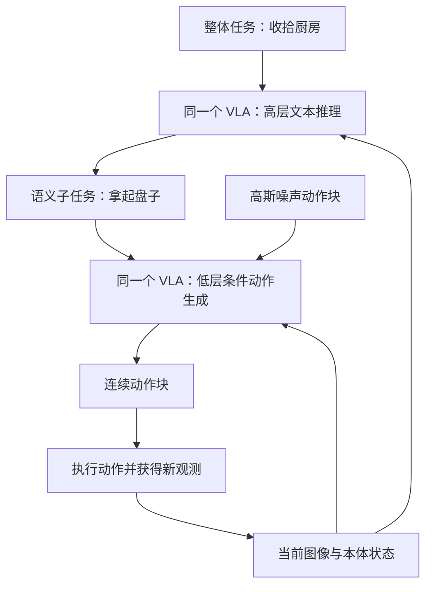
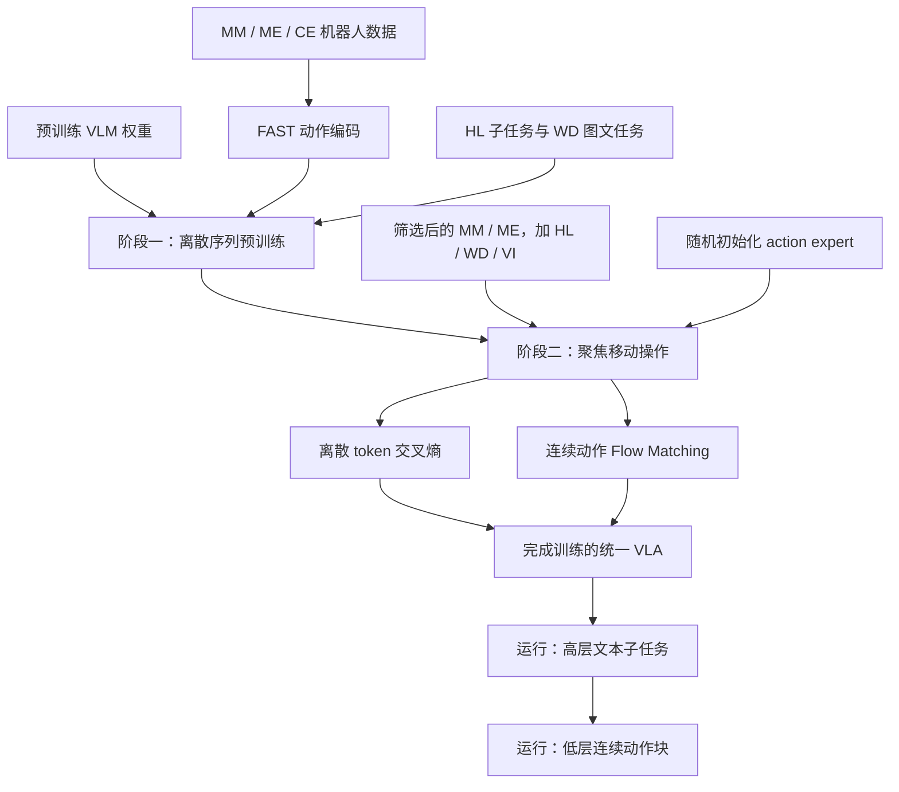
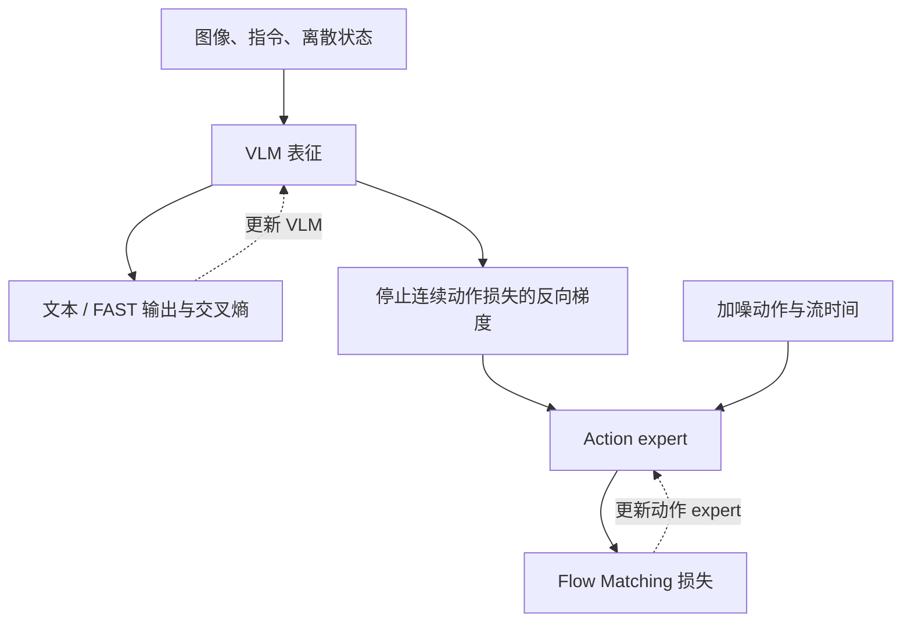

> **π0.5 要解决的是：机器人进入一个没有采集过示范的新家庭后，能否理解场景、选择合适的子任务，并把已有操作能力组合成较长的清理与整理行为？**
>
> 它的核心是把不同来源的知识接到同一个 VLA 上：**机器人数据教会模型怎样动，语义与图文数据帮助模型理解动什么、为什么现在动它；离散动作表示改善训练，连续动作生成服务实时执行。**

论文全名为 *π0.5: a Vision-Language-Action Model with Open-World Generalization*，由 Physical Intelligence 的 Kevin Black、Noah Brown 等作者共同完成，初稿发布于 2025 年 4 月，正式发表于 **CoRL 2025**。[正式出版信息][paper]

本文以 [CoRL 正式版论文][paper-pdf]为主要依据，结合[官方介绍][project]和[OpenPI 实现][repo]，整理成可逐步推导的学习笔记。本篇归入 [论文 → VLA]({{ '/publications/#paper-domain-vla' | relative_url }})，并衔接已有的 [π₀ 笔记]()、[Flow Matching 笔记]()与 [Diffusion Policy 笔记]()。

先区分三个版本层面的事实：

| 对象 | 本文如何使用 |
| --- | --- |
| π0.5 原论文 | 解释异构共训练、分层推理、两阶段训练及家庭场景泛化实验 |
| 后续 Knowledge Insulation 工作 | 解释显式梯度隔离，标明它是后续进一步发展的训练方案 |
| 当前 OpenPI | 核对公开连续动作模型的实现；不把它视为完整家庭机器人训练系统的逐行复现 |

代码说明对应 **2026-09-21 查阅的官方 `main` 分支**。论文的家庭清理系统、开源基础权重和针对 DROID/LIBERO 的微调模型，训练数据与部署环境并不完全相同。

## 阅读路线与符号约定

| 阅读目标 | 对应章节 |
| --- | --- |
| 理解开放世界泛化与分层决策 | 第 1—2 节 |
| 理解不同数据为什么能共同训练 | 第 3—5 节 |
| 推导连续动作生成与网络结构 | 第 6—7 节 |
| 理解训练阶段、知识隔离与运行方式 | 第 8—10 节 |
| 读实验、核对代码和做数值练习 | 第 11—13 节 |
| 建立方法比较与研究判断 | 第 14—15 节 |

| 符号 | 含义 |
| --- | --- |
| $$t$$ | 机器人实际运行的离散时间步 |
| $$o_t=(I_t^{1:C},q_t)$$ | 多相机图像与本体状态 |
| $$\ell$$ | 整体任务指令，例如“收拾厨房” |
| $$z_t$$ | 高层预测的语义子任务，对应论文中的 $$\hat\ell$$ |
| $$a_t\in\mathbb R^d$$ | 单步机器人动作 |
| $$A_t=(a_t,\ldots,a_{t+H-1})$$ | 长度为 $$H$$ 的动作块 |
| $$K$$ | 一次生成动作块所用的流积分步数 |
| $$h$$ | 一次动作块生成后实际执行的动作数 |
| $$s\in[0,1]$$ | 流时间；本文统一规定 $$s=1$$ 为噪声，$$s=0$$ 为干净动作 |
| $$\epsilon,X_s,v_\theta$$ | 高斯噪声、中间动作样本与预测的流向量场 |
| $$P,D,F$$ | 注意力分析中的条件前缀、离散输出、连续动作 token 组 |

**机器人时间 $$t$$、动作块内的位置、流时间 $$s$$ 是三种不同索引。**论文使用包含两端的 $$a_{t:t+49}$$ 表示 50 个动作；本文统一用“长度 $$H=50$$”的记号，避免差一位。

## 1. π0.5 想跨过什么泛化门槛？

### 1.1 同一个实验台上的成功，不等于进入新家庭也能成功

假设机器人已经在实验室学会“把盘子放进水槽”。进入新厨房后，至少会遇到四种变化：

- **感知变化：**盘子的材质、颜色、背景和光照不同。
- **几何变化：**水槽、抽屉、桌面和障碍物的位置不同。
- **语义变化：**要知道哪些物品应该放进抽屉，哪些应该放进水槽。
- **行为组合变化：**可能需要先挪开物体、打开抽屉，再抓取并收纳。

其中一些可以通过更多动作示范覆盖；另一些需要物体知识、场景理解和任务分解。π0.5 的出发点是：**如果只扩大目标机器人上的同类示范，可能仍无法经济地覆盖所有变化。**[论文第 1 节][paper-pdf]

### 1.2 “开放世界”在这篇论文中的具体含义

论文重点验证的是：在没有用于训练的新家庭、新房间布置和部分新物体类别中，执行相关的家务任务。

这不等价于：

- 未见过任何相关技能，却能执行任意新任务。
- 无需适配就能控制任意机械臂。
- 在任何家庭条件下都能可靠工作。
- 只依靠约 400 小时数据就从零获得全部视觉、语言和控制知识。

约 400 小时指最直接相关的**移动操作数据 MM**；模型还使用其他机器人数据、语义标注和互联网图文数据，并从预训练 VLM 初始化。论文指出，第一训练阶段中 97.6% 的训练样本来自 MM 之外的来源。[论文第 1 节、附录 B][paper-pdf]

把“目标领域数据相对有限”和“总知识来源很少”混为一谈，会误解这篇工作的结果。

### 1.3 它首先是一种模仿学习系统

低层策略学习示范中的条件动作分布：

$$
\max_\theta\;
\mathbb E_{(o,A,z)\sim\mathcal D}
[\log p_\theta(A\mid o,z)].
$$

高层学习示范或标注中的语义决策：

$$
\max_\theta\;
\mathbb E_{(o,\ell,z)\sim\mathcal D_{\mathrm{HL}}}
[\log p_\theta(z\mid o,\ell)].
$$

后文的 Flow Matching 用可计算的回归目标学习连续动作分布，不是在每个样本上直接计算上述精确 log likelihood。

**π0.5 原论文没有把在线奖励最大化、critic 或策略梯度作为核心训练机制。**“后训练”是训练阶段名称，不自动表示强化学习；人的语言指导也不自动变成人类偏好奖励。

## 2. 高层与低层：先决定做什么，再生成怎样做

### 2.1 从联合分布开始

想建模的对象是：

$$
p_\theta(A_t,z_t\mid o_t,\ell).
$$

概率链式法则给出：

$$
p_\theta(A_t,z_t\mid o_t,\ell)
=
p_\theta(A_t\mid o_t,z_t,\ell)
p_\theta(z_t\mid o_t,\ell).
$$

π0.5 进一步采用条件分解：

$$
\boxed{
p_\theta(A_t,z_t\mid o_t,\ell)
=
p_\theta(A_t\mid o_t,z_t)
p_\theta(z_t\mid o_t,\ell)
}
$$

这多做了一项建模选择：

$$
A_t\perp\ell\mid(o_t,z_t).
$$

即在低层已经知道当前观测与具体子任务后，不再额外直接依赖完整任务指令。这不是仅靠概率恒等式就能得到的结论，而是论文的结构化假设。[论文第 3.1 节][paper-pdf]

例如：

$$
\ell=\text{“收拾厨房”},
$$

$$
z_t=\text{“拿起台面上的盘子”}.
$$

低层此时专注于怎样拿起盘子；任务顺序和下一步目标由高层处理。

### 2.2 语义子任务是一种可迁移的中间接口

同样的“拿起杯子”可以出现在“收拾桌面”“把杯子放入水槽”“把杯子放到架子上”等整体任务中。共享这个接口，可以让低层复用动作经验，高层学习任务组织。

但中间接口也可能丢失信息。比如整体指令要求“不要把玻璃杯放进水槽”，高层却只输出“拿起杯子”，低层不会自动知道后续的禁止条件。

因此，子任务需要保留对当前执行有影响的约束。分层降低了单次决策复杂度，却也引入了**语义压缩是否充分**的问题。

### 2.3 两次推理使用同一个模型



论文中的高层与低层由**同一套模型**承担，并非默认使用外部大语言模型规划，再串联另一套独立动作策略。

同一模型不意味着所有输出必须在同一次前向计算中产生，也不意味着高低层频率相同。高层生成文本子任务，低层在该子任务条件下生成动作；高层更新频率低于低层动作推理。[论文第 2 节、第 3 节][paper-pdf]

### 2.4 为什么不能把它直接叫作完整的长程规划器？

高层根据当前观测和整体任务选择下一子任务，可以形成多阶段行为。但论文并没有在运行时显式展开所有未来状态、搜索整棵动作树或证明全局最优。

可以把它理解为**学习得到的语义反馈策略**：

$$
z_t\sim p_\theta(z\mid o_t,\ell).
$$

如果对当前进度判断错误，就可能重复开关抽屉、提前切换目标或遗漏物体。文本中间步骤让决策更易观察，却不能保证每个步骤都正确。

## 3. 六类数据：不同监督怎样各自发挥作用？

### 3.1 数据组成不是一个笼统的“大数据集”

| 缩写 | 数据来源 | 提供的主要学习信号 |
| --- | --- | --- |
| MM | 多个家庭中的移动操作机器人 | 目标平台上的家务动作与场景经验 |
| ME | 多个家庭中的固定单臂或双臂机器人 | 更容易收集的跨场景操作经验 |
| CE | 实验室内多种机器人与任务，含 OXE | 跨本体、跨任务的操作结构 |
| HL | 机器人观测对应的子任务与相关框标注 | 场景到语义决策的映射 |
| WD | 图像描述、VQA、物体定位等图文数据 | 视觉语义、物体类别与语言知识 |
| VI | 人指导已训练低层策略时给出的子任务指令 | 与低层实际能力相匹配的高层决策 |

预训练主要包含 MM、ME、CE、HL、WD；后训练聚焦 MM、ME，保留相应 HL 与 WD，并加入 VI，省略实验室 CE 数据。[论文第 3.3 节、附录 B.2—B.3][paper-pdf]

HL 经常来自对机器人数据的再标注，并不是与 MM/ME/CE 完全互斥的一组采集小时数。因此不能把这六类标签直接当作六个互不重叠的物理数据源相加。

### 3.2 ME 与 CE 为什么不能合并理解？

两者都涉及其他机器人，但补充的多样性不同：

- ME 更直接增加**家庭场景、物体和布置**的变化。
- CE 更广泛增加**机器人形态、任务与操作方式**的变化。

固定机械臂更轻便，较容易搬到不同地点采集，因此不必只依靠昂贵的移动双臂平台扩展场景覆盖。

跨本体共享的也不是原封不动的关节角：机械结构不同，同一个数字向量的物理意义可能完全不同。更可能迁移的是视觉表征、语言到目标的对应、操作阶段和部分动作结构，而具体控制仍需条件化于本体与动作表示。

### 3.3 互联网图文没有机器人动作，为什么仍然能帮助控制？

设共享视觉语言表征为：

$$
h_\theta=f_\theta(I,\text{prompt},q).
$$

不同任务使用不同输出监督：

$$
h_\theta
\longrightarrow
\begin{cases}
\text{物体名称或视觉问答答案},\\
\text{位置与边界框},\\
\text{下一子任务},\\
\text{动作表示}.
\end{cases}
$$

图文数据可以帮助区分漏斗、量杯、剪刀等物体；机器人数据再把这些表征与可执行动作建立联系。这个机制不要求图文样本凭空拥有动作标签。

但迁移只是可能性，不是必然结果。知道某个东西叫“漏斗”，并不意味着已经掌握它在当前姿态下的抓取接触点；视觉语义泛化与运动控制泛化需要分别验证。

### 3.4 VI 为什么不同于给遥操作轨迹写一句描述？

对已有遥操作轨迹进行事后标注，得到的是：

$$
(o_t,\ell)\longmapsto z_t^{\mathrm{label}}.
$$

VI 则由专家在运行中用语言指挥**当前低层策略**：

$$
(o_t,\ell,\text{低层已表现出的行为})
\longmapsto z_t^{\mathrm{human}}.
$$

人不仅考虑“任务逻辑上下一步是什么”，还会考虑“这套低层策略此刻能较好地执行什么”。例如同样是放盘子，人可能发现先移近桌边，再发出抓取指令更可靠。

论文报告，VI 只占高层移动操作样本的约 11%，但移除它会削弱高层实验表现。这个比例的分母不是整个训练数据集。[论文附录 D.1][paper-pdf]

它提供了一种与执行能力相关的监督来源；不能据此把方法描述成在线 RL 或偏好学习。

## 4. 统一为序列建模：哪些 token 需要预测？

### 4.1 同一个模型可以接收不同形式的训练样本

下面只是解释格式的示意，不是官方完整提示词模板：

```text
图文问答：
    输入：图像 + “图中哪个物体是漏斗？”
    目标：物体名称 / 位置答案

高层决策：
    输入：机器人图像 + “收拾厨房”
    目标：相关物体位置 + “拿起盘子”

离散动作学习：
    输入：机器人图像 + 状态 + “拿起盘子”
    目标：FAST 动作 token 序列

连续动作学习：
    输入：机器人图像 + 状态 + “拿起盘子” + 加噪动作块 + 流时间
    目标：动作块对应的流向量场
```

“统一序列建模”不表示每个样本都必须有所有模态，也不表示把图像 patch 转成自然语言单词。图像与连续动作使用连续嵌入，文本与离散动作使用离散 token。

### 4.2 自回归似然与交叉熵

给定条件前缀 $$P$$，输出序列为 $$y_{1:L}$$：

$$
p_\theta(y_{1:L}\mid P)
=
\prod_{i=1}^{L}
p_\theta(y_i\mid P,y_{<i}).
$$

取负对数：

$$
\mathcal L_{\mathrm{CE}}
=
-\sum_{i=1}^{L}
\log p_\theta(y_i\mid P,y_{<i}).
$$

若第 $$i$$ 个位置输出 logits $$r_{i,k}$$，则：

$$
p_{i,k}
=
\frac{\exp r_{i,k}}{\sum_j\exp r_{i,j}},
$$

$$
\frac{\partial\mathcal L_i}{\partial r_{i,k}}
=
p_{i,k}-\mathbb 1[k=y_i].
$$

因此，文本、边界框编码和 FAST 动作都能使用相同形式的监督目标。

训练时使用 teacher forcing：真实前序 token 已知，可以一次前向并行计算多个输出位置的损失；推理时真实前序未知，需要逐 token 生成。这解释了**自回归模型训练可以高效，并不意味着运行时动作解码也同样快**。

### 4.3 注意力掩码与损失掩码不是一回事

令 $$b_i$$ 表示某个位置是否作为预测目标，则：

$$
\mathcal L_{\mathrm{CE}}
=
-\frac{
\sum_i b_i\log p_\theta(y_i\mid P,y_{<i})
}{
\max(1,\sum_i b_i)
}.
$$

- 注意力掩码决定一个 token **能看到什么**。
- 损失掩码决定哪个输出位置**参与监督**。
- padding 掩码决定哪些位置**只是补齐长度**。

前缀里的图像、指令与状态通常作为条件，不要求模型重建它们。给所有位置无差别地计算语言损失，会改变训练任务。

对于没有动作标签的 WD 样本，只计算对应的文本任务损失；不能把缺失动作填成零，再让模型学习“所有图文问答都对应机器人静止”。

### 4.4 共训练如何改变共享参数？

若第 $$k$$ 类数据采样概率为 $$w_k$$：

$$
\mathcal L(\theta)
=
\sum_k w_k\,
\mathbb E_{x\sim\mathcal D_k}
[\mathcal L_k(\theta;x)],
\qquad
\sum_k w_k=1.
$$

对应梯度：

$$
\nabla_\theta\mathcal L
=
\sum_k w_k
\mathbb E[\nabla_\theta\mathcal L_k].
$$

共享并不保证任务相互促进。若两类梯度方向相近，更新可能互相帮助；若内积为负，可能发生干扰：

$$
\left\langle
\nabla_\theta\mathcal L_i,
\nabla_\theta\mathcal L_j
\right\rangle<0.
$$

这只是理解多任务优化的局部分析，不是论文已经测出的全部机制。它说明数据采样权重、每类 token 数量、损失归约方式和梯度路径都需要一起考虑；“混进更多数据”不是足够精确的训练方案。

## 5. FAST：为什么先把动作变成离散 token？

### 5.1 逐时间步分桶会产生很长的序列

长度为 $$H$$、维度为 $$d$$ 的动作块包含：

$$
H\times d
$$

个标量。若每个标量都对应一个 token，$$H=50,d=18$$ 时就是 900 个 token，还没有计算图像、指令和状态。

相邻时间步又常常高度相关：机械臂平稳移动时，关节目标只发生小幅变化。逐点分桶既保留了大量重复结构，又要求自回归解码依次产生这些符号。

FAST 的思路是先在时间维压缩动作结构，再转成 token。它使用 **DCT → 量化 → 展平 → BPE**，不等同于简单地给每个关节角分桶。[FAST 官方编码器][fast-code]

### 5.2 先统一动作数值尺度

论文按数据集、按动作维度，用 1% 和 99% 分位数归一化。设它们分别为 $$q_{.01,j}$$ 与 $$q_{.99,j}$$：

$$
\tilde a_j
=
2\frac{
a_j-q_{.01,j}
}{
q_{.99,j}-q_{.01,j}+\varepsilon
}
-1.
$$

这样，中间约 98% 的该维数据落在接近 $$[-1,1]$$ 的范围。当前 OpenPI 的分位数归一化本身不自动裁剪，所以极端样本仍可能超出该区间。[论文附录 B.2][paper-pdf]、[归一化代码][transforms-code]

不同数据集使用不同统计量，因而同一个归一化数值不一定对应同一个物理位移。动作尺度必须与数据集、本体和控制模式一并理解。

论文还在文本提示中区分 joint 与 end-effector 控制模式。把不同动作空间补成相同长度，只解决张量形状问题；模式标记和数据适配才帮助模型区分这些数值的控制含义。[论文附录 B.2][paper-pdf]

### 5.3 用 DCT 表示动作在时间上的变化

对一维长度 $$H$$ 的动作序列 $$a_0,\ldots,a_{H-1}$$，正交 DCT-II 为：

$$
c_k
=
\eta_k
\sum_{h=0}^{H-1}
a_h
\cos
\left[
\frac{\pi}{H}
\left(h+\frac12\right)k
\right],
$$

其中：

$$
\eta_0=\sqrt{\frac1H},
\qquad
\eta_k=\sqrt{\frac2H},\quad k>0.
$$

用矩阵写成：

$$
C=DA,
\qquad
D^\top D=I.
$$

$$D$$ 作用在时间维，不是把不同关节混到一起。低频系数描述整体位置和缓慢变化，高频系数描述快速变化。

若：

$$
A=
\begin{bmatrix}
0.5\\0.5\\0.5\\0.5
\end{bmatrix},
$$

则：

$$
C=
\begin{bmatrix}
1\\0\\0\\0
\end{bmatrix}.
$$

平稳序列被表示为一个直流分量与多个零系数，更容易进一步压缩。

DCT 本身是可逆变换，**不会自动减少系数个数，也不天然丢弃高频项**。FAST 的长度压缩来自后续量化后的符号规律与 BPE，不应把它写成“固定只保留前几个低频系数”。

### 5.4 量化与误差从哪里产生？

给定量化尺度 $$\kappa>0$$：

$$
n_{k,j}
=
\operatorname{round}(\kappa c_{k,j}),
$$

解码时：

$$
\hat c_{k,j}=\frac{n_{k,j}}{\kappa}.
$$

四舍五入误差满足：

$$
|c_{k,j}-\hat c_{k,j}|
\le\frac{1}{2\kappa}.
$$

由于 DCT 正交：

$$
\|A-\hat A\|_F^2
=
\|C-\hat C\|_F^2,
\qquad
\hat A=D^\top\hat C.
$$

若所有 $$Hd$$ 个系数都只发生上述量化误差：

$$
\frac{1}{Hd}\|A-\hat A\|_F^2
\le
\frac{1}{4\kappa^2}.
$$

于是平均标量 RMSE 不超过：

$$
\frac{1}{2\kappa}.
$$

这是本文对理想量化过程的误差分析，前提是没有额外裁剪、非法符号、截断或解码失败。它不是完整机器人执行误差的上界。

官方通用 FAST 编码器的默认尺度为 10，但具体 checkpoint 的 tokenizer 配置仍应实际读取。[FAST 实现][fast-code]

### 5.5 BPE 压缩的是符号序列，不是动作意义

量化系数按固定顺序展平，映射为符号，再由 BPE 合并频繁出现的符号片段：

$$
A
\rightarrow
C
\rightarrow
N
\rightarrow
\text{符号串}
\rightarrow
d_{1:L_A}.
$$

低频优先的展平顺序与重复零值会产生可压缩的统计结构。BPE 在可正确编码的符号域内是可逆的，主要有损环节是之前的量化。

因此，一个 FAST token：

- 不一定对应一个时间步。
- 不一定对应一个关节。
- 不一定对应一个可解释的动作原语。
- 不能当作“先抓取、再移动”那样的语义子任务。

FAST 的“压缩动作 token”和高层的“语言子任务 token”承担不同角色。

### 5.6 为什么训练用 FAST，运行却可以不用 FAST？

FAST 让机器人动作也能通过 next-token prediction 更新 VLM 表征。这样可以与语言、图文和语义标注使用相近的训练接口。

但是运行时若每个动作块都要让大 VLM 自回归解码全部动作 token，延迟仍可能较大。π0.5 因而在后训练增加较小的连续 action expert，运行时通过多步流积分生成整块动作。[论文第 3.2—3.3 节][paper-pdf]

**离散分支是训练表征的重要通道；连续分支是最终动作生成的重要通道。**它不是先生成 FAST 动作，再让流模型把这串离散动作“修平”。

## 6. Flow Matching：从噪声动作块到连续动作

### 6.1 先固定一套自洽的时间约定

本文跟随 OpenPI 的实际计算约定：

$$
s=0:\text{干净动作},
\qquad
s=1:\text{高斯噪声}.
$$

给定示范动作块 $$A$$ 与独立噪声：

$$
\epsilon\sim\mathcal N(0,I),
$$

构造：

$$
\boxed{
X_s=(1-s)A+s\epsilon
}
$$

沿着**增大 $$s$$** 的方向求导：

$$
\boxed{
\frac{dX_s}{ds}=\epsilon-A
}
$$

训练目标就是预测这个速度，而生成时从 $$s=1$$ 向 $$s=0$$ 反向积分。

这里的“速度”位于动作块数值空间，维度与整个 $$A$$ 相同。它不是机械臂在真实时间中的末端速度，即便动作向量中某些维度本身也是速度指令。

### 6.2 为什么论文公式与代码需要一起核对？

正式论文第 3.2 节将路径写成：

$$
X_\tau=\tau A+(1-\tau)\epsilon,
$$

并使用 $$\epsilon-A$$ 作为学习目标。按上述路径对 $$\tau$$ 直接求导，应得到 $$A-\epsilon$$，因此不能把该目标直接当成沿增大 $$\tau$$ 方向的导数，再配正向 Euler 步长。

若令：

$$
s=1-\tau,
$$

则：

$$
X_s=(1-s)A+s\epsilon,
\qquad
\frac{dX_s}{ds}=\epsilon-A.
$$

这正是 OpenPI 使用的自洽组合：**噪声时间 $$s$$、目标 $$\epsilon-A$$、负积分步长**。[论文第 3.2 节][paper-pdf]、[`compute_loss` 与 `sample_actions`][pi0-code]

阅读或复现时，路径、目标和积分方向必须成套核对。本篇后续所有公式都采用 $$s$$ 约定。

### 6.3 条件流匹配的回归目标

把图像、状态与子任务合称为条件：

$$
c=(o,z).
$$

模型预测：

$$
v_\theta(X_s,s,c).
$$

训练损失为：

$$
\boxed{
\mathcal L_{\mathrm{FM}}(\theta)
=
\mathbb E_{A,c,\epsilon,s}
\left[
\|v_\theta(X_s,s,c)-(\epsilon-A)\|_F^2
\right]
}
$$

一个动作块内所有位置可以共同参与 Transformer 计算，不必在真实时间顺序上逐个生成。

训练只需采样一个 $$s$$ 并做一次对应的向量场预测，不需要为每条训练样本完整执行 10 次推理积分。训练时的单次随机时间监督，与运行时的多步积分是不同过程。

### 6.4 网络不知道示范终点，怎么预测这条路径的速度？

设监督速度：

$$
U=\epsilon-A.
$$

对固定的 $$X_s=x,s,c$$，平方损失可分解为：

$$
\begin{aligned}
\mathbb E[\|v-U\|^2\mid x,s,c]
&=
\|v-\mathbb E[U\mid x,s,c]\|^2\\
&\quad+
\mathbb E[
\|U-\mathbb E[U\mid x,s,c]\|^2
\mid x,s,c].
\end{aligned}
$$

第二项不依赖 $$v$$，因此最优回归函数为：

$$
\boxed{
v^*(x,s,c)
=
\mathbb E[\epsilon-A\mid X_s=x,s,c]
}
$$

它不是记住每条示范的那根直线，而是在当前空间位置、噪声等级与条件下，估计所有可能路径的平均局部速度。

这也解释了为什么使用 MSE 不会自动退化成“对全部示范动作取一个全局平均”：模型额外条件化于 $$X_s$$ 与 $$s$$，不同初始噪声可以沿不同路径进入动作分布的不同区域。

### 6.5 为什么匹配局部速度能得到正确分布？

下面补上从回归到分布输运的关键一步。令 $$p_s(x\mid c)$$ 为随机路径 $$X_s$$ 的边缘分布，对任意光滑测试函数 $$f$$：

$$
\frac{d}{ds}\mathbb E[f(X_s)\mid c]
=
\mathbb E[
\nabla f(X_s)^\top U
\mid c].
$$

对 $$X_s$$ 作条件期望：

$$
\frac{d}{ds}\mathbb E[f(X_s)\mid c]
=
\mathbb E[
\nabla f(X_s)^\top
\mathbb E[U\mid X_s,s,c]
\mid c].
$$

因此：

$$
\frac{d}{ds}\mathbb E[f(X_s)\mid c]
=
\int
\nabla f(x)^\top v^*(x,s,c)
p_s(x\mid c)\,dx.
$$

在边界项消失等正则条件下，分部积分：

$$
\frac{d}{ds}\mathbb E[f(X_s)\mid c]
=
-\int
f(x)
\nabla_x\cdot
[p_s(x\mid c)v^*(x,s,c)]
\,dx.
$$

于是得到连续性方程：

$$
\boxed{
\partial_s p_s
+
\nabla_x\cdot(p_s v^*)=0
}
$$

这表明最优向量场能够描述这族边缘分布的演化。理想情况下，用同一 ODE 从 $$s=1$$ 反向积分到 $$s=0$$，就可以把高斯分布变成条件动作分布。

实际模型有有限数据、函数逼近误差和数值积分误差，因此有限步生成不保证精确等于真实动作分布。上述推导说明方法的依据，不是对实际 checkpoint 的精确性保证。

### 6.6 向量场还隐含一个干净动作估计

由：

$$
X_s=A+s(\epsilon-A)=A+sU,
$$

整理得到：

$$
A=X_s-sU.
$$

因此用模型预测：

$$
\hat A=X_s-sv_\theta(X_s,s,c).
$$

若 $$v_\theta=v^*$$，则：

$$
\hat A
=
\mathbb E[A\mid X_s,s,c].
$$

这个关系有助于检查实现的符号。它不表示运行时直接在噪声端做一次条件均值回归就能替代整个生成过程：有限容量模型的误差，以及多模态分布的逐步分离，仍与时间路径和积分有关。

### 6.7 推理：负步长 Euler 积分

初始化：

$$
X_1\sim\mathcal N(0,I).
$$

令：

$$
\Delta=\frac1K,
\qquad
s_k=1-\frac{k}{K}.
$$

Euler 更新为：

$$
\boxed{
X_{s_{k+1}}
=
X_{s_k}
-\Delta\,v_\theta(X_{s_k},s_k,c)
}
$$

最后把 $$X_0$$ 作为生成的归一化动作块。论文使用 10 次去噪/积分步骤，OpenPI 默认也是 `num_steps=10`。[论文第 3.2 节][paper-pdf]、[采样实现][pi0-code]

手算例子：

$$
A=[0.2,-0.4],
\qquad
\epsilon=[1.0,0.5].
$$

对应真实路径速度：

$$
U=\epsilon-A=[0.8,0.9].
$$

取 $$K=2$$，从噪声开始：

$$
X_1=[1.0,0.5],
$$

$$
X_{0.5}
=
X_1-0.5U
=
[0.6,0.05],
$$

$$
X_0
=
X_{0.5}-0.5U
=
[0.2,-0.4].
$$

这条已知直线路径的速度恒定，因此两步恰好到达终点；实际网络的边缘向量场通常并非恒定，不能据此推断任意任务两步积分就足够。

### 6.8 时间采样为什么偏向噪声较多的位置？

当前 OpenPI 采用：

$$
b\sim\operatorname{Beta}(1.5,1),
\qquad
s=0.999b+0.001.
$$

其平均时间约为：

$$
\mathbb E[s]
=
0.999\frac{1.5}{1.5+1}+0.001
=
0.6004.
$$

在本文的约定下，这比均匀采样更偏向噪声较多的区域。换成论文的进度坐标 $$\tau=1-s$$，就是偏向较小的 $$\tau$$。[时间采样代码][pi0-code]

时间采样分布改变的是不同噪声等级在训练中的权重；只要仍覆盖需要学习的时间区间，条件回归的理想目标仍是相应位置的条件平均速度。有限模型和有限计算下，权重会影响最终误差分配。

## 7. 架构细节：前缀、双动作表示与 AdaRMSNorm

### 7.1 哪些部分沿用 π₀，哪些部分改变？

π0.5 仍采用 PaliGemma 视觉语言骨干与较小的 action expert。视觉、语言和动作 token 使用各自的输入映射与部分专属 Transformer 权重，再通过注意力交互。[论文附录 B.1][paper-pdf]

当前 OpenPI 的关键结构是：

| 部分 | 作用 | 实现中的典型配置 |
| --- | --- | --- |
| 视觉编码器 | 图像转 patch 特征 | SigLIP `So400m/14` |
| 语言骨干 | 处理视觉、语言和离散状态条件 | `gemma_2b`，宽度 2048 |
| 动作 expert | 根据条件与流时间输出动作向量场 | `gemma_300m`，宽度 1024 |
| 动作维度 | 多本体统一后的输出宽度 | 默认 32，任务可使用其子集 |
| 动作块长度 | 联合生成的未来动作数 | 默认 50 |
| 文本长度 | 指令与状态 token 的最大长度 | `pi05=True` 时默认 200 |

这些是公开实现的配置，不等于真实机器人有 32 个可动自由度，也不是每个模型都必须使用完全相同的相机或文本长度。[模型配置][config-code]、[Gemma 结构][gemma-code]

### 7.2 状态进入文本前缀，并没有被丢弃

在 π₀ 的公开实现路径中，本体状态通过连续投影进入 action expert；在 π0.5 路径中，状态先离散化，再放入文本前缀。

对已归一化的状态，使用 256 个区间。区间内部可以理解为：

$$
b_j
\approx
\left\lfloor
128(q_j+1)
\right\rfloor,
$$

并按端点与越界约定处理。比如：

$$
q_j=-0.5\rightarrow64,
\quad
q_j=0\rightarrow128,
\quad
q_j=0.5\rightarrow192.
$$

公开 tokenizer 形成类似下面的文本：

```text
Task: pick up the plate, State: 64 128 192 ...;
Action:
```

这些整数再由语言 tokenizer 编码，**不是每个状态维度必然对应一个独立 token**。[状态 tokenizer][tokenizer-code]

因此，看到 π0.5 的 `embed_suffix` 没有调用 `state_proj`，不能直接得出“模型不用本体状态”的结论。在默认配置中，它通过前缀被动作 token 读取。指令太长导致截断时，还需检查状态信息是否完整保留。

任务配置也可能主动改变这一选择。例如当前 `pi05_libero` 设置 `discrete_state_input=False`，且 `action_horizon=10`。这说明“默认模型结构”和“某个任务最终输入”必须分别检查，不能把默认的状态路径与 50 步动作长度套到全部公开 checkpoint。[LIBERO 训练配置][train-config]

### 7.3 两套动作标签同时出现，怎样避免答案泄漏？

后训练中，同一个示范动作可能同时提供：

- FAST 离散动作目标 $$D$$。
- 加噪连续动作及其流目标 $$F$$。

如果连续 action expert 能读取 teacher-forced 的真实 FAST 动作，就可以直接从另一套标签中抄出目标。这会让训练变得容易，却在推理时失效，因为推理时并没有这些真实动作标签。

把 token 分为前缀 $$P$$、离散输出 $$D$$ 与连续动作 $$F$$，允许注意力的块结构可以写成：

$$
\boxed{
M=
\begin{bmatrix}
\mathbf 1&0&0\\
\mathbf 1&\operatorname{tril}(\mathbf 1)&0\\
\mathbf 1&0&\mathbf 1
\end{bmatrix}
}
$$

**行表示 query，列表示 key。**

| Query \ Key | 条件前缀 P | 离散动作 D | 连续动作 F |
| --- | --- | --- | --- |
| 前缀 P | 可见 | 不可见 | 不可见 |
| 离散动作 D | 可见 | 仅因果可见 | 不可见 |
| 连续动作 F | 可见 | 不可见 | 块内双向可见 |

离散输出采用移位输入预测下一个 token，因此下三角包含当前位置的输入，并不意味着读取当前位置要预测的真实答案。[论文附录 B.1、Figure 11][paper-pdf]

同理，前缀也不能先读到未来动作标签，再通过它们“绕路”泄漏给连续分支。

### 7.4 双向动作注意力为什么不违反实际控制的因果性？

连续动作块内部的 token 可以相互注意，是因为它们都是**当前时刻正在共同生成的未来动作变量**。

模型没有读取机器人真正未来的图像或真实动作反馈，只是在当前观测条件下联合构造一个短期计划。生成序列内部的双向计算，不等于从未来环境偷取信息。

另一方面，离散输出的自回归因果掩码是为了保证其概率分解与推理方式一致。两种动作表示使用不同掩码，服务于不同的生成过程。

### 7.5 为什么这个掩码还能支持 KV cache？

前缀不读取动作，因此在固定观测和指令下，其各层表示与流时间、噪声动作无关。

可以先计算：

$$
(K_P,V_P)
=
f_\theta^{\mathrm{prefix}}(o,z),
$$

并缓存。每次流积分只更新动作分支，同时读取相同的前缀键值：

$$
F^{(k+1)}
=
f_\theta^{\mathrm{action}}
(F^{(k)},s_k;K_P,V_P).
$$

这减少了每个去噪步骤重复运行大 VLM 前缀的成本。OpenPI 的 `sample_actions` 正是先填充前缀 cache，再迭代后缀。[动作采样代码][pi0-code]

缓存的有效范围是**同一次动作块生成、条件不变**。新观测、新状态或新子任务到来后，应重新构造前缀；不能把整个 episode 都共用旧图像 cache。

### 7.6 AdaRMSNorm：把噪声等级送到每个动作层

普通 RMS 归一化写为：

$$
\operatorname{RMS}(h)
=
\sqrt{
\frac1d\sum_{j=1}^{d}h_j^2+\varepsilon
},
$$

$$
\bar h=\frac{h}{\operatorname{RMS}(h)}.
$$

流时间先经过正弦编码与 MLP：

$$
c_s=
\operatorname{swish}
\left(
W_2\operatorname{swish}(W_1\phi(s))
\right).
$$

再产生缩放、偏移与残差门控：

$$
[\gamma_s,\beta_s,g_s]=W_c c_s+b_c.
$$

归一化输出变为：

$$
\tilde h
=
(1+\gamma_s)\odot\bar h+\beta_s,
$$

相应子层可以写成：

$$
h_{\mathrm{out}}
=
h_{\mathrm{in}}
+
g_s\odot F(\tilde h).
$$

当前 OpenPI 对条件调制投影使用零初始化，具体 attention 与 MLP 残差在各层分别处理。[RMSNorm 与 gated residual][gemma-code]

在高噪声与低噪声区域，网络应采取不同的动作修正方式。AdaRMSNorm 把这种时间条件送到每个动作层，而不是只在输入处把时间与动作拼接一次。它改变的是条件注入方式，本身并不是开放世界泛化的全部原因。

## 8. 两阶段训练：广泛学习，再聚焦目标平台

### 8.1 阶段一：先在离散监督下学习通用表征

预训练从已有 VLM 权重开始，混合机器人动作、语义子任务、图文问答与定位等任务。动作通过 FAST 表示为离散 token。

可概括为：

$$
\mathcal L_{\mathrm{pre}}
=
\sum_k w_k
\mathbb E_{\mathcal D_k}
[\mathcal L_{\mathrm{CE}}].
$$

此时连续 action expert 尚未作为这套动作生成路径加入，联合损失中的连续项权重为零。

论文正式版报告：

$$
N_{\mathrm{pre}}=280\,000\text{ 次更新},
\qquad
B_{\mathrm{pre}}=2048.
$$

这两个量分别是梯度步数与 batch 大小，不是机器人交互步数、数据小时数或独立示范条数。[论文附录 B.2][paper-pdf]

### 8.2 阶段二：增加连续动作 expert，同时保留离散监督

后训练增加随机初始化的 action expert，同时继续训练 next-token prediction：

$$
\boxed{
\mathcal L_{\mathrm{post}}
=
\mathcal L_{\mathrm{CE}}
+
\lambda_{\mathrm{FM}}\mathcal L_{\mathrm{FM}}
}
$$

对没有连续动作标签的样本，应使用任务掩码：

$$
\mathcal L(x)
=
\mathcal L_{\mathrm{CE}}(x)
+
\mathbf 1_{\mathrm{has\ action}}(x)
\lambda_{\mathrm{FM}}
\mathcal L_{\mathrm{FM}}(x).
$$

这只是把缺失监督的处理显式写出来，不意味着每个样本都有一份完整的混合目标。

正式版给出的主要设置为：

| 阶段 | 数据重点 | 连续动作分支 | 更新数 | Batch |
| --- | --- | --- | --- | --- |
| 预训练 | MM、ME、CE、HL、WD | 不使用 | 280k | 2048 |
| 后训练 | MM、ME、对应 HL、WD、VI | 加入并训练 | 80k | 384 |

后训练中 $$\lambda_{\mathrm{FM}}=10$$，对应论文式 (1) 的 $$\alpha$$。[论文第 3.3 节、附录 B.3][paper-pdf]

但这个数值不能离开 loss 的尺度照搬。如果把 MSE 从“求和”改成“每个标量取平均”，或改变 token loss 的归约方式，相同权重会产生不同的相对梯度强度。

### 8.3 为什么后训练强调成功且相对高效的轨迹？

论文后训练使用的 MM、ME 动作数据筛选成功 episode，并移除长于任务长度阈值的轨迹；正式版附录注明阈值设为任务长度的第 90 百分位。[论文附录 B.3][paper-pdf]

这样可以让最终执行策略更多拟合成功、高质量、较少冗余的行为。

代价是低质量轨迹中也可能包含恢复经验。如果筛选过于激进，模型在运行偏离后反而更缺少应对数据。这个权衡应结合实际失败模式验证，不能把“只保留短轨迹”当成所有机器人训练的通则。

### 8.4 训练流程整体图



FAST 动作标签在训练中有用，但最终连续动作推理不必先生成 FAST 动作序列。高层仍然需要生成语义文本，这与省去离散**动作**解码并不矛盾。

## 9. Knowledge Insulation：与原论文相关，但不能混为一谈

### 9.1 单向 attention 并不阻止动作梯度更新 VLM

把计算简化成：

$$
h=f_\theta(o,z),
$$

$$
v=g_\phi(X_s,s,h),
$$

$$
\mathcal L_{\mathrm{FM}}
=
\|v-U\|^2.
$$

虽然前向信息只从 $$h$$ 流向动作预测，链式法则仍给出：

$$
\nabla_\theta\mathcal L_{\mathrm{FM}}
=
\left(
\frac{\partial h}{\partial\theta}
\right)^\top
\left(
\frac{\partial v}{\partial h}
\right)^\top
\nabla_v\mathcal L_{\mathrm{FM}}.
$$

这通常不为零。**注意力中“不让 VLM 读取动作 token”，与反向传播中“不让动作损失更新 VLM”是两个独立设计。**

### 9.2 显式停止梯度改变了什么？

后续 Knowledge Insulation 工作进一步研究这一问题：连续 action expert 随机初始化时，其梯度可能扰乱已有视觉语言表征。其核心做法是：

$$
h=f_\theta(o,z),
$$

$$
v=g_\phi(X_s,s,\operatorname{sg}(h)).
$$

于是：

$$
\nabla_\theta\mathcal L_{\mathrm{FM}}=0,
$$

而 VLM 仍通过离散动作与图文任务更新：

$$
\nabla_\theta\mathcal L
=
\nabla_\theta\mathcal L_{\mathrm{CE}}.
$$

动作 expert 则继续学习：

$$
\nabla_\phi\mathcal L
=
\lambda_{\mathrm{FM}}
\nabla_\phi\mathcal L_{\mathrm{FM}}.
$$

这不是冻结整个 VLM：骨干仍通过有动作信息的 FAST 监督适应机器人任务，只隔离连续分支回传的梯度。后续工作还提出更精细的单阶段共训练方案。[Knowledge Insulation 论文][ki-paper]



此图解释**显式知识隔离**，不要把停止梯度节点自动加到原论文的所有实现描述中。

### 9.3 怎样阅读当前开源模型的“trained with KI”？

OpenPI README 将公开 π0.5 描述为使用 knowledge insulation 训练的模型，同时明确说明公开 π0.5 训练与推理只支持 Flow Matching head。[OpenPI README][repo]

这里应区分：

1. 基础权重此前经过怎样的训练。
2. 当前公开代码支持哪些损失与输出。
3. 自己微调时，哪些参数实际被更新。

在当前公开 `Pi0.compute_loss` 中，π0.5 路径计算的是连续流损失；它并未同时实现论文完整的 FAST、图文、高层子任务联合训练。若要判断某个微调配置是否隔离梯度，还需检查模型计算图、freeze filter 和优化器参数，不能仅从 README 的权重来源推断。

## 10. 真正运行时：三种时间尺度与两个反馈层级

### 10.1 一次动作块生成发生了什么？

在当前时刻 $$t$$：

1. 获取图像和机器人状态。
2. 必要时更新高层子任务 $$z_t$$。
3. 构造低层条件前缀，计算并缓存其表示。
4. 采样噪声动作块。
5. 用 action expert 进行 $$K$$ 次流积分。
6. 反归一化、还原动作表示，取出实际执行的一段。
7. 执行后获得新观测，再生成下一块。

这里至少有三种尺度：

| 尺度 | 对应过程 | 是否等同于 50 Hz |
| --- | --- | --- |
| 高层语义决策 | 更新“接下来做什么” | 否 |
| 动作块生成 | 一次模型调用生成一段动作 | 否 |
| 动作执行 | 向机器人发送连续目标 | 论文系统为 50 Hz |

论文使用 50 个动作组成一块，10 步流积分生成一块。这既不是“模型必须每秒完整运行 50 次”，也不是“机器人只执行 10 个动作”。

### 10.2 预测长度不等于每次执行长度

若机器人执行频率为 $$f$$，预测长度为 $$H$$，预测覆盖约：

$$
T_{\mathrm{pred}}=\frac{H}{f}.
$$

在 $$H=50,f=50\,\mathrm{Hz}$$ 时，动作块覆盖约 1 秒。

若实际只执行前 $$h$$ 个动作，再重新观察：

$$
T_{\mathrm{feedback}}\approx\frac{h}{f}
$$

是忽略推理与通信延迟后的反馈间隔。例如 $$h=10$$ 时约为 0.2 秒。

**$$h=10$$ 在这里是教学例子，不是对论文所有任务执行窗口的断言。**实际执行多少步、是否异步生成、怎样衔接动作块，应以部署端调度逻辑为准，不能从 `action_horizon=50` 单独推出来。

### 10.3 推理延迟会怎样影响闭环？

设同步模式下，每次完整推理耗时为 $$L$$，再执行 $$h$$ 个动作，则一次循环近似为：

$$
T_{\mathrm{cycle}}
\approx
L+\frac{h}{f}.
$$

若采用异步推理，计算可以与执行重叠，但新动作可能依据较旧观测生成。性能取决于延迟、动作窗口、环境变化速度和控制器，而不只是神经网络吞吐率。

因此，“能生成高频动作块”与“拥有高频视觉反馈”不是同一件事。对快速接触、滑动或外力扰动，必须实际测量观测到执行的延迟。

### 10.4 论文里的移动机器人究竟输出什么？

实验平台具有双 6 自由度机械臂、夹爪、全向移动底盘和升降机构，状态/动作维度为 18 或 19：

$$
12\text{（双臂）}
+
2\text{（夹爪）}
+
3\text{（底盘）}
+
1\text{ 或 }2\text{（升降）}.
$$

高层使用前、后、双腕四路相机；低层使用前相机与双腕相机。

模型输出机械臂、夹爪和升降机构目标，以及底盘速度，由底层 PD 控制器跟踪。作者系统没有额外叠加传统轨迹规划或碰撞检测模块；这是论文系统边界的描述，不能直接当作任意机器人部署的默认配置。[论文附录 B.4][paper-pdf]

### 10.5 闭环策略不等于拥有长期记忆

重新观察可以修正当前动作偏差，但单次观测未必包含完整任务历史。比如某个抽屉里原来是否有目标物体、另一房间是否已经整理完，可能无法从当前图像判断。

论文也指出有限上下文与部分可观测性带来的问题。高层子任务会随新观测更新，但这不自动赋予模型持久地图、跨房间记忆或显式世界模型。

## 11. 实验怎么读：完成度、泛化来源与消融证据

### 11.1 定量评估的主要指标是任务进度

正式论文对四类任务设计了分步评分。[论文附录 C][paper-pdf]

| 任务 | 评分内容概述 | 满分 |
| --- | --- | --- |
| Dishes in Sink | 4 件物品，每件拿起与放入水槽分别计分 | 8 |
| Items in Drawer | 拿起、打开抽屉、放入、关好抽屉 | 4 |
| Laundry in Basket | 拿起、放到篮中/篮上、完全进入篮内 | 3 |
| Make the Bed | 整理被子、放好两只枕头、额外整齐程度 | 5 |

对一次评估，任务进度为：

$$
S=\frac{\text{获得分数}}{\text{该任务满分}}.
$$

平均进度为：

$$
\bar S=\frac1N\sum_{n=1}^{N}S_n.
$$

而“整段任务满分完成”的比例为：

$$
\widehat p_{\mathrm{full}}
=
\frac1N
\sum_{n=1}^{N}\mathbb 1[S_n=1].
$$

例如四次试验进度都是 75%，则平均进度为 75%，但满分完成率为 0%。另一组若三次满分、一次零分，也有 75% 平均进度，满分完成率却是 75%。

**因此，图中的 average task progress 不能改写成同数值的整体成功率。**

### 11.2 测试新家庭，证明了什么？

论文在训练未见过的真实家庭和 mock home 场景中评估。真实家庭评估涉及三户家庭中的厨房与卧室；用于定量比较的任务常持续约 2—5 分钟。

文章同时报告更长的多阶段行为，但不能据此说所有定量 trial 都持续 10 多分钟。正式论文 Figure 1 的长时序能力描述，与具体评分实验的持续时间应分开读取。[论文第 4.1 节、Figure 1、Figure 5][paper-pdf]

附录的标准定量比较通常每个任务/策略约 10 次，四项任务合计约 40 次；部分取消的 episode 会因机器人故障、时间限制等原因移除，并报告统计检验。因此复现时应记录取消原因和计数，不能只呈现保留下来的平均分。[论文附录 C][paper-pdf]

### 11.3 场景多样性实验控制了哪些因素？

作者比较移动操作数据来自：

$$
3,\;12,\;22,\;53,\;82,\;104
$$

个不同地点时的泛化表现。

为了避免为每个规模重跑完整训练，相关实验先使用不含 MM 的机器人动作混合数据预训练，再在不同地点数量的 MM 数据上后训练 40k 步，并控制各模型看到的独特样本数量。[论文第 4.2 节、Figure 6—7][paper-pdf]

结果支持：

- 更多训练地点总体上改善未见场景中的任务表现。
- 新物体类别的语言理解与执行也受益。
- 完整共训练模型可接近包含测试场景数据的对照模型。
- 只用目标平台数据训练，即便覆盖较多地点，也明显弱于完整方案。

这不是“场景数越多每个点都严格单调提高”的定律，也没有单独证明地点数量是唯一因果因素；更多地点通常也带来新的物体与布置组合。

### 11.4 移除哪些数据会削弱哪些能力？

| 消融 | 主要观察 | 更谨慎的解释 |
| --- | --- | --- |
| no ME | 未见场景的操作表现下降 | 其他固定机器人上的家庭场景经验可以迁移 |
| no CE | 多项操作表现下降 | 实验室多机器人、多任务经验仍有价值 |
| no ME or CE | 下降进一步加大 | 目标移动平台的数据不能完全替代跨本体经验 |
| no WD | 常规任务均分差异未必显著，但 OOD 物体和高层决策受影响 | 图文知识的收益与评估任务相关 |
| no VI | 高层替换实验中表现下降 | 与当前低层能力匹配的语言监督有帮助 |

这些结论对应论文 Figure 8—9、Figure 16 及逐任务分析，不代表 WD 会让每一个操作任务都显著提高。[论文第 4.3 节、附录 D.1 与 E][paper-pdf]

有的任务主要需要稳定抓取和放置，有的任务更需要识别少见物体并判断其用途。只看四项任务平均值，可能看不出语义数据对第二类问题的作用。

### 11.5 显式高层到底有多重要？

论文比较了：

- 完整高层与低层推理。
- implicit HL：训练时包含高层监督，运行时不显式生成高层子任务。
- no HL：训练和运行都不使用高层机制。
- 移除 WD 或 VI 的高层模型。
- 外部 GPT-4 高层与人类高层。

完整模型的点估计最高，implicit HL 次之，no HL 明显更低。Figure 16 中，完整模型与 implicit HL 的比较标注 $$p=0.144$$，不能据此声称二者在常用 0.05 阈值下有显著差异。[论文附录 D.1、Figure 16][paper-pdf]

更有依据的结论是：**高层监督对表征和决策学习有重要作用，显式生成子任务在作者实验中进一步提高了点估计，但其额外收益不能与训练数据收益混为一谈。**

人类高层对照也不是数学上的性能上界。即使人理解任务，给出的子任务仍可能不符合低层策略最擅长的执行方式；比较的是“某种高层 + 固定低层”的组合能力。

### 11.6 与 π₀、π₀-FAST+Flow 的比较排除了什么？

作者让这些模型使用相同的跨本体机器人训练集和可比训练预算，再比较：

| 模型 | 连续动作 | FAST 训练 | HL / WD 共训练与高层能力 |
| --- | --- | --- | --- |
| π₀ 基线 | 有 | 不采用该混合方案 | 无完整 π0.5 方案 |
| π₀-FAST+Flow | 有 | 有 | 不包含 HL / WD |
| π0.5 | 有 | 有 | 有 |

π0.5 表现更好，说明仅加入离散与连续双动作表示，还不足以复现完整方法的泛化收益。[论文第 4.4 节、Figure 10][paper-pdf]

另一方面，模型之间仍同时存在训练目标、数据和推理方式差异。结论应归属于作者比较的完整配置，不能简化成“某一层 AdaRMSNorm 单独带来了全部提升”。

## 12. 读 OpenPI：从输入变换到输出动作

### 12.1 建议沿数据流阅读，而不是只看模型名称

| 文件 | 应核对的问题 |
| --- | --- |
| [`src/openpi/transforms.py`][transforms-code] | 原始状态和动作怎样归一化、做相对变换与补齐？ |
| [`src/openpi/models/tokenizer.py`][tokenizer-code] | 状态怎样进入文本前缀，超长文本怎样截断？ |
| [`src/openpi/models/pi0_config.py`][config-code] | `pi05` 开关、动作宽度、动作长度、文本长度是多少？ |
| [`src/openpi/models/pi0.py`][pi0-code] | 前缀/后缀、流损失、时间采样、cache 与 Euler 更新怎样连接？ |
| [`src/openpi/models/gemma.py`][gemma-code] | 两套 expert 权重怎样进行注意力交互，AdaRMSNorm 怎样调制？ |
| [`src/openpi/training/config.py`][train-config] | 当前任务的数据变换、权重来源与可训练参数是什么？ |
| [`src/openpi/policies/policy.py`][policy-code] | 一次 `infer` 怎样应用输入/输出变换？ |

π0.5 继续使用名为 `Pi0` 的类，通过配置开关选择路径，因此搜索 `class Pi05` 可能找不到真正实现。

### 12.2 一次公开连续动作推理的张量形状

使用默认动作配置、batch 为 $$B$$：

$$
\text{state}:[B,32],
$$

$$
\text{tokenized prompt}:[B,200],
$$

$$
\text{noise/actions}:[B,50,32].
$$

经过动作输入投影：

$$
[B,50,32]
\longrightarrow
[B,50,1024].
$$

经过 action expert 与输出投影：

$$
[B,50,1024]
\longrightarrow
[B,50,32].
$$

输出是当前流时间下的向量场；经过多次积分后才得到动作块。任务输出适配器再选取真实维度、恢复尺度和控制语义。

32 是模型统一宽度；把补齐维度直接发送到 7 自由度机械臂，或把归一化值当成真实关节角，都会改变动作含义。

### 12.3 相对动作通常相对当前状态，不一定是逐步增量

当前 `DeltaActions` 对指定维度使用：

$$
\Delta a_{t+k}=a_{t+k}-q_t.
$$

也就是把整块未来目标都相对**本次观测的当前状态**表达，而不是：

$$
a_{t+k}-a_{t+k-1}.
$$

例如当前关节角为 0.3，未来目标为：

$$
[0.4,0.5,0.6],
$$

对应相对当前状态的动作是：

$$
[0.1,0.2,0.3].
$$

还原时对每项加上同一个 0.3。如果错误地逐步累加这些数，会得到：

$$
[0.4,0.6,0.9],
$$

从而产生完全不同的轨迹。[相对/绝对动作变换][transforms-code]

并非所有维度都应该做这种转换：夹爪、速度控制维度和不同任务接口可能使用不同约定，需要读取 mask 与任务配置。

### 12.4 为什么公开的 `compute_loss` 没有论文里的联合交叉熵？

当前连续模型的核心路径为：

```text
normalized actions
    → 采样 noise 和 flow time
    → noisy actions = s * noise + (1 - s) * actions
    → 目标向量 = noise - actions
    → 前缀与动作后缀联合前向
    → action_out_proj
    → 连续流 MSE
```

这与论文的连续分支相符，但没有同时执行完整的语义子任务文本训练和 FAST 动作交叉熵。仓库中存在 FAST tokenizer 或 π₀-FAST 模型，也不意味着 π0.5 默认微调时会自动启用该分支。[OpenPI README][repo]、[模型损失][pi0-code]

同样，提供一个 `prompt` 并调用 `policy.infer`，不意味着库会自动替你搭好论文中的“收拾整间厨房 → 自主更新子任务 → 移动双臂执行”的完整系统。需要区分已适配的低层策略接口与完整分层系统。

### 12.5 哪些实验不能只靠这份开源模型定义重现？

至少还需要：

- 完整训练数据与各来源的采样权重。
- 高层子任务和框标注的格式、质量与组织方式。
- VI 收集流程及对应低层策略版本。
- 训练阶段的数据筛选和全套任务配置。
- 高低层调度、实际动作窗口与机器人接口。
- 对应的家庭评估场景、任务评分与排除规则。

因此，运行公开 checkpoint、在自己的机器人上微调、严格复现论文的家庭泛化实验，是三种不同工作量的任务。文章中的数值练习只帮助检查原理，不替代这些资源。

## 13. NumPy 练习：核对编码、积分方向和掩码

下面是一段不需要机器人、GPU 或下载模型的练习。它实现：

1. 正交 DCT 与量化重建，**不实现 BPE，也不是完整 FAST tokenizer**。
2. 与本文符号一致的噪声路径和 Euler 采样。
3. 论文双动作表示的块注意力掩码。
4. 相对动作与任务进度的两个手算例子。

```python
import numpy as np


def dct_matrix(length):
    """正交 DCT-II 矩阵，作用于动作块的时间维。"""
    if length < 1:
        raise ValueError("length must be positive")
    k = np.arange(length)[:, None]
    h = np.arange(length)[None, :]
    matrix = np.sqrt(2.0 / length) * np.cos(
        np.pi * (h + 0.5) * k / length
    )
    matrix[0] /= np.sqrt(2.0)
    return matrix


def quantized_dct_reconstruction(actions, scale=10.0):
    """actions: [horizon, action_dim]，已归一化。"""
    if scale <= 0:
        raise ValueError("scale must be positive")
    matrix = dct_matrix(actions.shape[0])
    coeff = matrix @ actions
    quantized = np.rint(scale * coeff).astype(np.int64)
    reconstructed = matrix.T @ (quantized / scale)
    return reconstructed, coeff, quantized


def make_flow_pair(actions, noise, time):
    """time=1 是噪声，time=0 是动作。"""
    noisy = (1.0 - time) * actions + time * noise
    target = noise - actions
    return noisy, target


def euler_sample(vector_field, initial_noise, steps=10):
    """vector_field(x, s) 输出 dx/ds；积分从 1 走向 0。"""
    if steps < 1:
        raise ValueError("steps must be positive")
    x = np.array(initial_noise, dtype=np.float64, copy=True)
    dt = -1.0 / steps
    for step in range(steps):
        time = 1.0 - step / steps
        x = x + dt * vector_field(x, time)
    return x


def hybrid_attention_mask(prefix_len, discrete_len, flow_len):
    """行=query，列=key；True 表示可见。"""
    total = prefix_len + discrete_len + flow_len
    mask = np.zeros((total, total), dtype=bool)
    p_end = prefix_len
    d_end = prefix_len + discrete_len

    mask[:p_end, :p_end] = True
    mask[p_end:d_end, :p_end] = True
    mask[p_end:d_end, p_end:d_end] = np.tril(
        np.ones((discrete_len, discrete_len), dtype=bool)
    )
    mask[d_end:, :p_end] = True
    mask[d_end:, d_end:] = True
    return mask


# 1. 常量动作只有直流分量。
constant = np.full((4, 1), 0.5)
recon, coeff, _ = quantized_dct_reconstruction(constant)
np.testing.assert_allclose(coeff[:, 0], [1, 0, 0, 0], atol=1e-12)
np.testing.assert_allclose(recon, constant, atol=1e-12)

# 2. 检查路径导数与干净动作重建恒等式。
actions = np.array([0.2, -0.4])
noise = np.array([1.0, 0.5])
x, velocity = make_flow_pair(actions, noise, time=0.5)
np.testing.assert_allclose(x, [0.6, 0.05])
np.testing.assert_allclose(x - 0.5 * velocity, actions)

# 使用已知直线路径的速度，只验证积分方向，不冒充训练好的策略。
sample = euler_sample(lambda x, s: velocity, noise, steps=2)
np.testing.assert_allclose(sample, actions)

# 3. 两个条件 token、三个离散 token、两个连续动作 token。
mask = hybrid_attention_mask(2, 3, 2)
assert mask[5, 6]               # 连续动作内部可双向注意。
assert not mask[5, 2:5].any()   # 连续分支不能读取真实离散动作。
assert not mask[:2, 2:].any()   # 前缀不能读取任何动作答案。
assert not mask[2, 3]          # 离散 token 不能读取未来 token。

# 4. 当前状态相对量，不是逐步相对量。
state = 0.3
future_targets = np.array([0.4, 0.5, 0.6])
delta = future_targets - state
np.testing.assert_allclose(delta + state, future_targets)
assert not np.allclose(state + np.cumsum(delta), future_targets)

# 同样平均进度，可以对应不同的满分完成率。
progress_a = np.array([0.75, 0.75, 0.75, 0.75])
progress_b = np.array([1.0, 1.0, 1.0, 0.0])
assert progress_a.mean() == progress_b.mean() == 0.75
assert np.mean(progress_a == 1.0) == 0.0
assert np.mean(progress_b == 1.0) == 0.75

print("DCT coefficients:", np.round(coeff[:, 0], 6))
print("Euler output:", sample)
print("Attention mask:\n", mask.astype(int))
print("All numerical checks passed.")
```

真正训练时，`vector_field` 应替换为带图像、状态、子任务和时间条件的神经网络。上面的已知速度只检查正负号与时间方向，不检验学习能力，也不构成完整策略实现。

可以继续做三个练习：

- 在随机动作块上验证 Parseval 等式和量化误差界。
- 用一个单参数模型验证“单向前向依赖仍然有反向梯度”。
- 改变积分步数，比较一个随位置变化的简单向量场的数值误差。

## 14. 与 π₀、Diffusion Policy、HIL-SERL 的关系

### 14.1 π0.5 对 π₀ 的扩展发生在多个层面

| 维度 | π₀ 基础路线 | π0.5 原论文 |
| --- | --- | --- |
| 动作生成 | 条件 Flow Matching | 保留连续动作生成 |
| 训练表示 | 连续动作 expert 是核心路径 | 先 FAST 离散预训练，再联合连续分支 |
| 任务接口 | 语言条件下的动作策略 | 同一模型兼做子任务预测与低层执行 |
| 数据组织 | 多机器人动作学习 | 增加更系统的 HL、WD、VI 共训练 |
| 状态输入 | 连续状态投影进入动作路径 | 离散状态进入前缀 |
| 时间注入 | 与动作输入融合 | 动作层中的 AdaRMSNorm |
| 核心实验问题 | 通用机器人控制与灵巧操作 | 新家庭中的场景与语义泛化 |

模型结构改动、数据来源和训练阶段共同发挥作用。只替换时间嵌入层，或只把状态改成文本，并不足以把一个 π₀ 模型变成论文意义上的完整 π0.5 系统。

### 14.2 与 Diffusion Policy：共同点在生成动作分布

两者都可以根据当前观测生成动作块，并通过重复观察形成闭环。主要区别在于：

- Diffusion Policy 的原始重点是以条件扩散表达示范动作分布。
- π0.5 使用预训练 VLM 作为跨模态知识载体，加入离散动作、语义任务与异构共训练。
- π0.5 的连续分支用 Flow Matching 向量场积分，而非直接照搬 DDPM 噪声调度与反向转移公式。

不能因为都从噪声生成动作，就把两者损失、时间方向与采样公式混写；也不能因为有 VLM，就默认具备可靠的长期规划。

### 14.3 与 HIL-SERL：人的作用和优化目标不同

| 问题 | π0.5 | HIL-SERL |
| --- | --- | --- |
| 核心优化 | 多任务监督学习与动作生成 | 任务奖励下的离策略 Actor–Critic |
| 人的主要信息 | 示范、语义标注、语言子任务指导 | 初始示范与实际动作接管 |
| 是否使用 critic | 原论文核心训练不使用 | 使用 |
| 是否根据在线回报改进 | 原论文主要训练流程不是此机制 | 是 |
| 强调的实验目标 | 跨场景、跨物体、长任务语义泛化 | 高精度真实操作的成功率与效率 |

两者可以形成互补研究方向，例如先获得有广泛先验的动作策略，再在具体任务上通过交互改进。但如何训练 VLA critic、处理大模型梯度、约束动作和维持原有知识，都需要额外设计，不是把两个名字拼起来就完成的方法。

相关的价值与人工纠偏推导见 [HIL-SERL 笔记]()。

### 14.4 它与 MPC、世界模型有什么区别？

π0.5 的动作块看起来像一个短期计划，但它不显式使用：

$$
\hat s_{t+1}=f_\psi(s_t,a_t)
$$

预测未来状态，再优化整段轨迹代价。它直接学习条件动作分布。

高层语言子任务也不等于显式环境状态机，Flow Matching 的中间动作样本更不是机器人未来状态。因此“有动作块”“有语言推理”“有流轨迹”都不能单独作为模型具备 MPC 或世界模型的证据。

## 15. 研究启发、局限与复习问题

### 15.1 真正值得迁移的，是知识来源与监督接口的设计

π0.5 给出的一个重要研究思路是：目标平台数据昂贵时，可以先寻找哪些知识不必全部来自该平台。

- 物体名称、用途和视觉属性可以部分来自图文数据。
- 操作阶段与接触经验可以部分来自其他机器人。
- 场景多样性可以借助更容易搬运的数据采集平台。
- 高层决策可以通过人在策略运行中的语言指导补充。
- 连续精度与运行延迟可以由专门动作 expert 处理。

但每一类知识都需要合适的监督形式与迁移路径。数据来源有用，不代表在任意权重、任意损失组合下都能转化为目标任务能力。

### 15.2 几个仍未解决的问题

**长时序错误会积累。**若只为直觉暂时假设 $$n$$ 个子任务独立、每个成功概率为 $$p$$，则完整成功概率是：

$$
p^n.
$$

例如：

$$
0.95^{20}\approx0.358.
$$

真实任务并不独立，也可能恢复重试；这个简化例子说明，单步较强并不自动意味着整段任务可靠。

**语义正确与物理可行并不等价。**知道要打开抽屉，不意味着当前夹爪可抓住陌生把手，也不意味着低层控制能处理大阻力。

**部分可观测性仍然存在。**手臂遮挡、物体藏在容器里、跨房间目标等场景，可能需要更长历史、主动观察和记忆。

**高层可能反复切换或停滞。**论文讨论了重复开关抽屉等行为，说明高层进度判断与阶段终止仍有改进空间。[论文讨论][paper-pdf]

**数据覆盖仍限制任务范围。**新家庭泛化是重要结果，但不能直接推导出对任意物体、任意动作接口和任意复杂指令的泛化。

### 15.3 如果自己做实验，怎样把结论说清楚？

建议分别改变和测量以下变量，而不是只汇报一个总分：

| 想研究的因素 | 尽量固定的条件 | 需要同时报告 |
| --- | --- | --- |
| 场景多样性 | 数据样本预算、优化步数、任务集合 | 新地点与旧地点表现 |
| 语义数据 WD | 机器人数据与网络结构 | ID/OOD 选物正确率和实际放置成功率 |
| 高层监督 HL | 低层策略与任务评分 | implicit HL、显式 HL、无 HL |
| VI 的作用 | 低层 checkpoint | 子任务选择、重复切换与整段完成度 |
| 连续/离散训练 | 数据和计算预算 | 训练效率、动作精度、端到端延迟 |
| 知识隔离 | 相同骨干与动作 expert | 梯度路径、语言能力与机器人效果 |

还应明确是模型大小、训练样本数还是训练计算量相同。不同表示的 token 数与前向成本不同，“相同更新步数”并不总等于“相同训练成本”。

### 15.4 七个复习问题

**为什么同一模型要学习子任务文本和连续动作？**

它们分别组织任务语义和实现物理执行，又能共享视觉语言表征。子任务提供了跨任务可复用的接口。

**低层为什么可以不直接接收整体指令？**

论文假设当前观测与子任务已包含当前执行所需的信息。这是一项条件独立假设；子任务若丢失关键约束，就会成为信息瓶颈。

**FAST 的 DCT 是不是直接把高频删掉？**

不是。DCT 是可逆的时间域变换，量化引入误差，BPE 利用符号规律压缩。不能把三个步骤混为一个。

**为什么噪声端预测的是 $$\epsilon-A$$，生成却走向动作？**

因为模型学习对噪声时间 $$s$$ 的导数，而生成从 $$s=1$$ 向 $$s=0$$ 积分，步长为负。

**连续动作 token 为什么不能看 FAST 标签？**

训练中的真实离散动作会泄漏答案，而运行时不存在这些标签，导致训练与推理条件不一致。

**前向只从 VLM 流向动作 expert，能否保证 VLM 不被动作损失更新？**

不能。需要显式停止梯度或相应参数冻结设计；注意力掩码本身没有这个作用。

**π0.5 最核心的经验结论是什么？**

在作者的任务与评估范围内，来自不同机器人、不同场景以及非动作语义任务的知识，能够共同提高目标移动机器人在未见家庭中的表现；训练方式和数据组合，是这种迁移的重要条件。

## 参考资料

- [Black 等：π0.5，CoRL 2025 / PMLR 305][paper]；[正式版全文][paper-pdf]。本文的训练数值、章节和图号以该版本为准。
- [arXiv 初版与版本记录][arxiv]：2025-04-22 发布。
- [Physical Intelligence：π0.5 官方介绍][project]。
- [OpenPI 官方仓库][repo]：模型、权重、任务适配与训练入口。
- [FAST 官方介绍][fast]；[官方动作 tokenizer 实现][fast-code]。
- [Knowledge Insulating Vision-Language-Action Models][ki-paper]；[官方说明][ki]。

本文的中间公式展开、误差分析、流程图与 NumPy 练习为学习性整理；论文的实验观察与本文的解释、假设和复现建议分别表述。

[paper]: https://proceedings.mlr.press/v305/black25a.html
[paper-pdf]: https://raw.githubusercontent.com/mlresearch/v305/main/assets/black25a/black25a.pdf
[arxiv]: https://arxiv.org/abs/2504.16054
[project]: https://www.pi.website/blog/pi05
[repo]: https://github.com/Physical-Intelligence/openpi
[fast]: https://www.pi.website/research/fast
[fast-code]: https://huggingface.co/physical-intelligence/fast/blob/main/processing_action_tokenizer.py
[ki]: https://www.pi.website/research/knowledge_insulation
[ki-paper]: https://www.pi.website/download/pi05_KI.pdf
[pi0-code]: https://github.com/Physical-Intelligence/openpi/blob/main/src/openpi/models/pi0.py
[config-code]: https://github.com/Physical-Intelligence/openpi/blob/main/src/openpi/models/pi0_config.py
[tokenizer-code]: https://github.com/Physical-Intelligence/openpi/blob/main/src/openpi/models/tokenizer.py
[gemma-code]: https://github.com/Physical-Intelligence/openpi/blob/main/src/openpi/models/gemma.py
[transforms-code]: https://github.com/Physical-Intelligence/openpi/blob/main/src/openpi/transforms.py
[train-config]: https://github.com/Physical-Intelligence/openpi/blob/main/src/openpi/training/config.py
[policy-code]: https://github.com/Physical-Intelligence/openpi/blob/main/src/openpi/policies/policy.py
